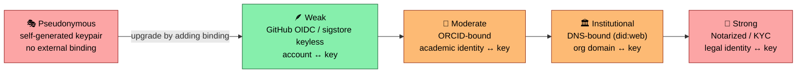
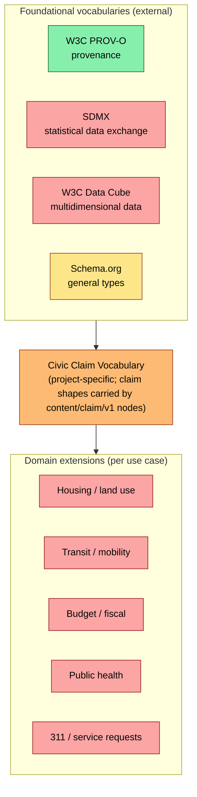
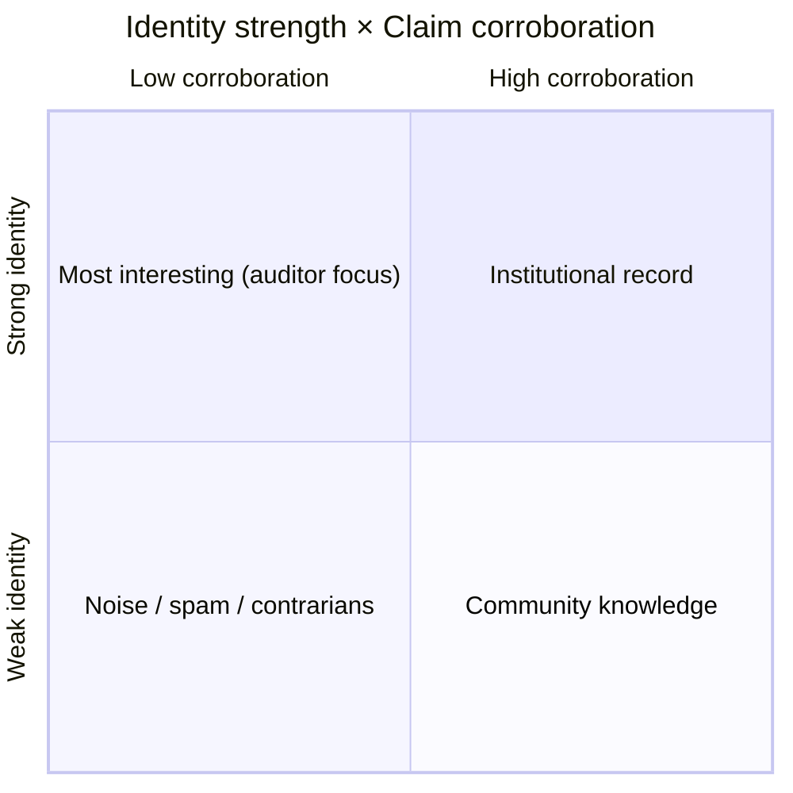

> **Status:** Vision document, not current state. This describes the desired end-state architecture once the open-standards layering is fully realized. For what is actually built and decided today, see the ADRs in `civic-ai-tools/docs/adr/` and `civic-ai-tools-website/docs/adr/`. This document should be updated as ADRs land that resolve the open questions described below.
>
> **Reconciliation pass 2026-05-25 (post-MVP-cohort).** Updated section-by-section against the Pittsburgh-arc ADR cohort that landed in PR #76 / `v0.1-mvp-cohort`: [ADR-0004](../adr/0004-dathere-captureMethod-variant.md) (datHere content profile), [ADR-0005](../adr/0005-executed-notebook-architecture.md) (executed-notebook architecture), [ADR-0006](../adr/0006-producer-profile-architecture.md) (Producer Profile axis), [ADR-0007](../adr/0007-content-canonicalization.md) (`contentCanonicalization` URI), [ADR-0008](../adr/0008-multihash-content-hash.md) (multihash `contentHash` + RFC 8785 JCS envelope canonicalization), [ADR-0009](../adr/0009-unified-typed-attestation-primitive.md) (unified typed-attestation primitive — two top-level type families `content/*` and `attestation/*` over one structural primitive), [ADR-0010](../adr/0010-visibility-lifecycle-location-attestations.md) (lifecycle/location attestations + retention asymmetry), [ADR-0011](../adr/0011-capturemethod-generalization.md) (captureMethod open at core; per-profile vocabulary). The L4 envelope diagram, the §5 claims vocabulary family, the §6 network signals, the glossary, and the §Open questions section are all reframed against the new spec state.

---

# Civic AI Tools — End-State Architecture Vision

## How to read this document

This document layers the architecture in two ways:

1. **By concern.** Static structural views (the standards stack, the identity ladder, the claims vocabulary family, the network signal model) are separated from dynamic flow views (publishing, verification, evaluation, network propagation).
2. **By build state.** Every node and edge in every diagram is colored by how complete its implementation is today:

| Color | State | Meaning |
|---|---|---|
| 🟩 Green | **Built** | Implemented and exercised in production; matches what an Accepted ADR would describe |
| 🟨 Yellow | **Partial** | Implementation exists but is incomplete, hand-rolled where a real SDK would be expected, or contains a known regression vs. spec |
| 🟧 Orange | **Designed, not built** | A draft spec, ADR, or detailed plan exists, but no code |
| 🟥 Red | **Speculative** | Direction discussed in strategy notes, not yet committed to as a decision |

Mermaid diagrams use these colors via `classDef` declarations at the bottom of each diagram. Hover or zoom in for legibility.

The diagrams are designed to render natively on GitHub. A combined high-level SVG view (`end-state-vision.svg`) sits alongside this file for sharing and presentations.

---

## 1. The standards stack (static)

The end-state architecture is a layered composition of open standards. Each layer solves a distinct problem and was developed independently by communities that mostly don't talk to each other; the project's contribution is the assembly, not the substrate.

```mermaid
flowchart TB
    subgraph L7["Layer 7 — Network signals & coordination"]
        atproto["atproto firehose / labelers"]:::speculative
        koi["KOI net (RIDs, sensor nodes)"]:::speculative
        nanopubnet["nanopublication network"]:::speculative
    end

    subgraph L6["Layer 6 — Federated publishing & identity"]
        did["DIDs (did:web, did:plc)"]:::speculative
        orcid["ORCID"]:::designed
        sigstoreoidc["sigstore OIDC keyless"]:::designed
        github["GitHub OAuth + device flow"]:::built
    end

    subgraph L5["Layer 5 — Long-term archival"]
        zenodo["Zenodo DOI"]:::designed
        rekor["Sigstore Rekor transparency log"]:::built
    end

    subgraph L4["Layer 4 — Cryptographic envelope (structural primitive per ADR-0009)"]
        typeURI["type URI (content/* | attestation/*)"]:::partial
        nodeId["nodeId ≡ envelope hash"]:::partial
        contentHash["contentHash (multihash; sha256 default + sha3-256 / blake3 alts)"]:::partial
        canon["contentCanonicalization URI (content-level)"]:::partial
        jcs["RFC 8785 JCS canonicalization (envelope-level)"]:::partial
        ed25519["Ed25519ph signature (publicKey + algorithm + kid)"]:::built
        signer["signer (bindingTier + identifier + displayName + verifiedAt)"]:::partial
        rfc3161["RFC 3161 timestamp"]:::built
        trustreg["Trust registry (.well-known + signerIdentity)"]:::built
        captureMethod["captureMethod (open enum at core; per-profile vocabulary per ADR-0011)"]:::built
    end

    subgraph L3["Layer 3 — Semantic packaging"]
        rocrate["RO-Crate / WRROC profile"]:::speculative
        provo["W3C PROV-O (provenance graph)"]:::built
        croissant["Croissant 1.1 (dataset metadata)"]:::partial
        dcat["DCAT-US 3.0"]:::partial
        nanopub["nanopub assertion graph"]:::speculative
        contentAnalysis["content/analysis/v1 (default; legacy + datHere)"]:::built
        typedContent["content/claim/v1 + content/question/v1 + content/evidence/v1<br/>(CCV claim shapes; reserved name-only)"]:::designed
        attestNs["attestation/* sub-types (Q36 ratified table per ADR-0009 §7)"]:::partial
    end

    subgraph L2["Layer 2 — Trace capture"]
        otel["OpenTelemetry (GenAI + MCP semconv)"]:::partial
        agentreceipts["Agent Receipts (W3C VC over MCP)"]:::speculative
    end

    subgraph L1["Layer 1 — Tool execution"]
        mcp["MCP servers (opengov-mcp, datHere, Boston, ...)"]:::built
        socrata["Socrata / CKAN / ArcGIS / Census"]:::built
    end

    L1 --> L2
    L2 --> L3
    L3 --> L4
    L4 --> L5
    L4 --> L6
    L5 --> L7
    L6 --> L7

    classDef built fill:#86efac,stroke:#166534,color:#000
    classDef partial fill:#fde68a,stroke:#92400e,color:#000
    classDef designed fill:#fdba74,stroke:#9a3412,color:#000
    classDef speculative fill:#fca5a5,stroke:#991b1b,color:#000
```



**How to read this stack.** Each layer assumes the layers beneath. The cryptographic envelope is meaningless without a stable artifact to wrap; the semantic packaging is meaningless without trace capture; the trace capture is meaningless without tool execution to observe. The network coordination layer is a property that emerges only once enough signed artifacts exist to make federation worth the operational cost — which is why it is appropriately the most speculative.

**L3 ↔ L4 coupling and the package-format question.** The L3 package-format decision ([Q1](open-questions.md#q1--package-format)) — single-blob canonical JSON today vs multi-file (RO-Crate / WRROC, Data Package Standard, or another shape) at the target — remains the single most consequential unresolved L3 decision. The G1 cohort ([ADR-0007](../adr/0007-content-canonicalization.md) + [ADR-0008](../adr/0008-multihash-content-hash.md)) partially decouples L3 from any specific container choice: the off-log content's canonicalization rule is now named by a `contentCanonicalization` URI rather than baked into the spec, so future RO-Crate, Data Package Standard, or other multi-file rules coexist at the same envelope contract. The narrower form of Q1 is still load-bearing because offline verification ([Q15](open-questions.md#q15--external-verification-testing)) depends on the proofs being embedded in the package, which a multi-file rule resolves.

**L4 structural primitive vs cryptographic mechanics.** The L4 envelope mixes two concerns that ADR-0009 holds together as one *structural primitive*: the **structural fields** that identify and bind a signed node (`type` URI, `nodeId` ≡ envelope hash, multihash `contentHash`, `contentCanonicalization` URI, `signer` identity object, RFC 8785 JCS as the envelope canonicalization rule, `captureMethod` label per [ADR-0011](../adr/0011-capturemethod-generalization.md)) and the **cryptographic mechanics** that make the binding tamper-evident (Ed25519ph signature, RFC 3161 timestamp, Sigstore Rekor inclusion proof, trust registry with `signerIdentity` per [ADR-0009](../adr/0009-unified-typed-attestation-primitive.md) §4). Every conformant signed node — `content/*` or `attestation/*` — carries the same structural primitive. The two-family taxonomy at L3 (`content/*` standalone assertions vs `attestation/*` targeted assertions) sits *over* this primitive: each typed node is a signed envelope.

**Note on Croissant's dual role in L3.** Croissant appears in this layer for two distinct purposes that should be tracked separately. *Inbound:* when an evidence package's analysis pulls from an external dataset (NYC 311, Boston parcel data), the package's `data-sources.json` references or embeds Croissant metadata for that dataset, characterizing what was queried. This use is partially built today. *Outbound:* a published evidence package itself can carry a Croissant metadata file at a well-known location, making the package discoverable through dataset crawlers (Hugging Face, Kaggle, CKAN, Schema.org-aware search). This use is undecided and tracked as an open question. The two uses are independent — adopting one does not force the other. These two uses are also referred to as "consumer-side" (using Croissant to characterize datasets the package consumed) and "emitter-side" (publishing Croissant metadata about the package itself), per `civic-ai-tools/docs/research/landscape-analysis.md` §7. Inbound/outbound is package-relative; emitter-side/consumer-side is project-relative. Both vocabularies refer to the same two distinct uses.

---

## 2. Package construction (dynamic flow)

This is the publish flow as it should look end-to-end. Today, the content node exists as a single-JSON-blob shortcut; the end-state version produces a multi-node publication — a `content/*` node plus its referencing `attestation/*` nodes (location, publication, and optionally typed-content extraction), each a separately-signed envelope on its own transparency-log entry per [ADR-0009](../adr/0009-unified-typed-attestation-primitive.md) §1 + [ADR-0010](../adr/0010-visibility-lifecycle-location-attestations.md) §6.

```mermaid
sequenceDiagram
    autonumber
    participant U as User<br/>(Claude.ai, Claude Code, Cursor, browser chat)
    participant Skill as Skill / system prompt
    participant MCP as MCP server<br/>(opengov-mcp, datHere, Boston, ...)
    participant Trace as Trace layer<br/>(OTel + optionally Agent Receipts)
    participant Pkg as Packager<br/>(/api/evidence)
    participant Sign as Signer<br/>(Ed25519ph + sigstore)
    participant TS as Timestamp + Rekor
    participant Store as Stable URL store<br/>(Vercel Blob today, multi-file dir end-state)
    participant Z as Zenodo (DOI)

    U->>Skill: prompt
    Skill->>MCP: tool calls (search, query, fetch)
    MCP-->>Trace: spans + (optional) receipts per tool call
    MCP-->>Skill: data summaries
    Skill-->>U: analytical output + summary
    U->>Pkg: "Publish as Evidence"
    Pkg->>Trace: collect trace, queries, data hashes
    Pkg->>Pkg: build content/analysis/v1 payload<br/>(prompt, queries, dataSources, metadata,<br/>provenance, cost, summary, captureMethod,<br/>contentProfile, producerProfile)
    Pkg->>Pkg: canonicalize off-log content per<br/>contentCanonicalization URI →<br/>multihash contentHash
    Pkg->>Pkg: JCS-canonicalize unsigned envelope →<br/>envelope hash ≡ nodeId; attach signer object
    Pkg->>Sign: envelope-hash hex string
    Sign-->>Pkg: Ed25519ph signature (publicKey + kid)
    Pkg->>TS: envelope hash
    TS-->>Pkg: RFC 3161 token + Rekor entry id<br/>(inclusion proof — content node)
    Pkg->>Pkg: build attestation/locatedAt/v1<br/>(targetNodeId, uri, contentHash, contentLength)
    Pkg->>Sign: locatedAt envelope hash
    Sign-->>Pkg: signature (publisher's first locatedAt)
    Pkg->>TS: locatedAt envelope hash
    TS-->>Pkg: RFC 3161 token + Rekor entry id<br/>(inclusion proof — locatedAt; the two-Rekor-entry publication per ADR-0010 §6)
    Pkg->>Pkg: (optional) build attestation/publishes/v1<br/>for committed → published transition
    Pkg->>Store: upload signed nodes
    Store-->>U: stable URL (content node) + locatedAt envelope
    Pkg->>Z: deposit (optional, async)
    Z-->>Pkg: DOI (asynchronous)

    Note over Trace: 🟨 OTel hand-rolled JSON today — 🟥 Agent Receipts integration speculative
    Note over Pkg: 🟨 Single JSON blob today — 🟧 Multi-file directory target (Q1)
    Note over Sign,TS: 🟩 Ed25519ph + RFC 3161 + Rekor live for content node;<br/>🟧 separate-envelope attestation/* emission lands in Phase 3 IMPL per ADR-0010
    Note over Z: 🟧 Zenodo Phase 6, not built
```

**Build state at a glance.** The Ed25519ph signature, the RFC 3161 timestamp, and the Sigstore Rekor inclusion proof are real today against the content node. The G1 envelope-shape cohort ([ADR-0007](../adr/0007-content-canonicalization.md) + [ADR-0008](../adr/0008-multihash-content-hash.md)) gives the envelope its `contentCanonicalization` URI and its multihash `contentHash` — both signature-covered fields. The G2 unified-primitive cohort ([ADR-0009](../adr/0009-unified-typed-attestation-primitive.md)) adds the `type` URI and the `signer` identity object — the `signer` object is the package's own claim of who signed it, distinct from the `sig.kid` → trust-registry `signerIdentity` cross-check. Trace capture works but is hand-rolled and would not survive an adopter (e.g., datHere, Boston) bringing their own real OTel SDK. Package assembly today produces a single canonical-JSON object; the multi-file end-state ([Q1](open-questions.md#q1--package-format)) is the target. Zenodo deposit is fully designed but not built.

**The two-atomic-Rekor-entry publication property** per [ADR-0010](../adr/0010-visibility-lifecycle-location-attestations.md) §6 is the structural shape of a publication: the content node and at least one `attestation/locatedAt/v1` are each signed and each transparency-log-included, separately. A verifier holding the content node alone gets "valid content, location unspecified"; holding the `locatedAt` alone gets "this URI serves content matching `nodeId` X"; holding both gets "publisher signed both, transparency log includes both, content lives at the asserted URI." Backup hosts emit their own `locatedAt` attestations as third, fourth, and Nth entries against the same target — multi-host federation is "N signed `locatedAt` attestations from different `(signer.identifier, uri-authority)` pairs" per ADR-0010 §2 + the [Q38](open-questions.md#q38--dedicated-copyof-relation-vs-multiple-locatedat-attestations) resolution.

**Typed-content extraction is a follow-on, attested step.** When typed content (`content/claim/v1`, `content/question/v1`, `content/evidence/v1` sub-types per the Civic Claim Vocabulary shapes) is extracted from a `content/analysis/v1` node, the extraction is itself a separately-signed `attestation/wasDerivedFrom/v1` carrying an `AnalyticalDerivation` payload — the classification-laundering guard per [ADR-0009](../adr/0009-unified-typed-attestation-primitive.md) §7 refinement (a) + [ADR-0006](../adr/0006-producer-profile-architecture.md) §4. The typed-content sub-types are reserved name-only at v0.1; promotion to built is gated per [Q5](open-questions.md#q5--claimsjsonld-and-upstream-evidencejson-implementation-timing) on a first typed-content producer. The earlier draft framing positioned this work as a `claims.jsonld` companion file in the package; the framing is retired per [ADR-0009](../adr/0009-unified-typed-attestation-primitive.md) §8 — typed claims are first-class signed nodes referencing their source analysis by `nodeId`, not file artifacts inside a multi-file directory.

---

## 3. Verification flow (dynamic)

What a third party — a journalist, a city auditor, a community board, a data publisher, an academic — does when handed an evidence URL. The full check set is enumerated in [OES §13.1](open-evidence-standard.md#131-what-a-verifier-can-check-today-and-what-they-need-to-do-it) (15 checks as of the post-G4 spec state); the sequence diagram below shows the load-bearing checks in flow order.

```mermaid
sequenceDiagram
    autonumber
    participant V as Verifier
    participant Store as Stable URL store<br/>(content node + attestation/locatedAt/v1)
    participant Reg as Trust registry<br/>(.well-known + signerIdentity)
    participant CRR as Local rule registry<br/>(contentCanonicalization URIs + type URIs +<br/>producerProfile captureMethod vocabularies)
    participant TSA as Public TSA<br/>(FreeTSA CA chain)
    participant Rkr as Sigstore Rekor
    participant ID as Identity resolver<br/>(GitHub / ORCID / DID / DNS)
    participant Attest as Referencing attestations<br/>(lifecycle / corroboration / contradiction)

    V->>Store: GET content node + attestation/locatedAt/v1
    Store-->>V: signed envelopes
    V->>V: JCS-canonicalize unsigned envelope →<br/>SHA-256 → envelope hash ≡ nodeId
    V->>V: cross-check nodeId vs URL slug<br/>(check 13)
    V->>CRR: resolve contentCanonicalization URI<br/>(check 3)
    CRR-->>V: rule implementation
    V->>V: multihash off-log content per algorithms<br/>in contentHash; at-least-one-match (check 4)
    V->>Reg: fetch public key by kid + signerIdentity
    Reg-->>V: pubkey + signerIdentity entry
    V->>V: verify Ed25519ph signature over<br/>envelope-hash hex string (check 2)
    V->>V: cross-check signer.identifier ↔<br/>kid → signerIdentity (check 14)
    V->>V: resolve type URI; render family + sub-type<br/>(check 12)
    V->>CRR: resolve producerProfile → captureMethod vocabulary
    CRR-->>V: vocabulary entries
    V->>V: confirm metadata.captureMethod is in vocabulary<br/>(check 15; graceful degradation on unresolved bundle)
    V->>TSA: verify RFC 3161 token (check 7)
    TSA-->>V: timestamp valid
    V->>Rkr: verify inclusion proof for content node<br/>+ locatedAt envelope (check 8)
    Rkr-->>V: proofs valid
    V->>ID: resolve signer.identifier
    ID-->>V: identity binding strength + claims
    V->>Attest: enumerate referencing attestation/* nodes<br/>(withdraws / reinstates / corroborates / contradicts / ...)
    Attest-->>V: chain of lifecycle attestations + claim-to-claim attestations
    V-->>V: render trust signals<br/>(envelope ✓, contentHash ✓, signature ✓, nodeId ✓,<br/>signer ✓, captureMethod ✓, timestamp ✓, Rekor ✓,<br/>identity tier, lifecycle status, corroboration / contradiction counts)

    Note over V,Reg: 🟩 Signature + registry verification live;<br/>🟧 signerIdentity cross-check (check 14) lands in Phase 3 IMPL
    Note over V,Rkr: 🟩 Rekor lookup live;<br/>🟧 two-Rekor-entry property per ADR-0010 §6 lands when locatedAt is emitted
    Note over V,ID: 🟨 GitHub identity only — 🟧 ORCID/DID/DNS designed (Q3)
    Note over V,Attest: 🟧 attestation/* enumeration + retention-asymmetry rendering per ADR-0010 §10.3
```

**The verifier never trusts the website.** Every verification step is independently checkable: the envelope hash is reproducible from the JCS canonicalization of the bytes (per [ADR-0008](../adr/0008-multihash-content-hash.md) §6), the multihash content hash is reproducible from the off-log content via the named `contentCanonicalization` rule (per [ADR-0007](../adr/0007-content-canonicalization.md)), the signature checks against a public key fetched from the trust registry (per [OES §6.1](open-evidence-standard.md#61-signature)), the Rekor entry is on a public transparency log, the `signer.identifier` ↔ trust-registry `signerIdentity` cross-check rejects mismatch (per [ADR-0009](../adr/0009-unified-typed-attestation-primitive.md) §4), and the identity binding (in the end state) resolves to externally-verifiable identifiers (GitHub, ORCID, DID, DNS-bound domains). This is the property that makes the system usable as evidence in adversarial contexts — community board hearings, regulatory filings, journalism, audits.

**Retention asymmetry — the deliberate civic-accountability property** per [ADR-0010](../adr/0010-visibility-lifecycle-location-attestations.md) §3. A publisher's `attestation/withdraws/v1` removes the publisher's own visibility commitment but does NOT invalidate `attestation/locatedAt/v1` attestations from backup hosts pointing at the same content node. A verifier surfacing a withdrawn content node MUST render the withdrawal alongside any verified backup-host `locatedAt`s — "withdrawn by publisher; copy still available at B's host" — rather than treating the withdrawal as global content erasure. Silent erasure of civic-data claims is a worse failure mode than asymmetric retention; the standard surfaces the asymmetry honestly and lets consumers apply judgment per [OES §2](open-evidence-standard.md#2-normative-preamble)'s normative preamble.

**Offline verifiability** is the target end-state per [OES §13.3](open-evidence-standard.md#133-target-end-state-verifiability): a verifier holding the package alone plus the publisher's trust registry plus FreeTSA + Sigstore Rekor — with **no** `civicaitools.org` server dependency — completes every check in [§13.1](open-evidence-standard.md#131-what-a-verifier-can-check-today-and-what-they-need-to-do-it). Today the signature envelope, RFC 3161 token, and Rekor proof are exposed via the verify endpoint rather than embedded in the package; resolution is gated on [Q1](open-questions.md#q1--package-format) (package format) and [Q15](open-questions.md#q15--external-verification-testing) (external verification testing). The post-G2 checks (content canonicalization rule resolution, multihash, nodeId cross-check, signer cross-check, captureMethod per-profile vocabulary check) ARE already offline-reachable because the relevant fields live in the package itself.

---

## 4. Identity binding (static — the graded ladder)

Identity in the evidence system is intentionally **graded**, not binary. Pseudonymity is first-class; institutional binding is achievable but optional. Consumers filter on binding strength rather than the platform ranking by it.



**Critical property:** **identity strength ≠ topic authority.** A pseudonymous community member with deep neighborhood knowledge may produce more accurate evidence than an institutionally-bound consultant. The system surfaces the binding strength as a signal; the consumer applies judgment.

**Storage shape (post-ADR-0009).** Each signed node carries a `signer` object on its canonical-JSON top level — `bindingTier` (one of `pseudonymous`, `oauth`, `orcid`, `did-web`, `notarized`), `identifier` (provider-prefixed string, e.g., `github:npstorey:32192847` or `did:web:datahere.io:publishers:alice`), `displayName` (human-readable identity label), and optional `verifiedAt` (ISO-8601). The `signer` object is part of the canonical JSON and is therefore covered by the envelope hash and the platform signature; it is the package's own claim of who signed it. The trust registry's per-key entry carries a parallel `signerIdentity` documenting which identity each `kid` is bound to per [OES §6.3](open-evidence-standard.md#63-trust-registry). A verifier MUST cross-check that `sig.kid` resolves via the trust registry's `signerIdentity` to the same identity that `signer.identifier` claims; mismatch reports `signer_identity_mismatch` and rejects the node (the [Q35](open-questions.md#q35--public-key-location-in-the-envelope-sig-vs-signer-and-verifier-cross-check-rule) resolution per [ADR-0009](../adr/0009-unified-typed-attestation-primitive.md) §4). The split is deliberate: the `sig` envelope answers *what was signed and by what key*; the `signer` object answers *who claims to have signed it*; the trust registry binds the two, and the verifier audits the binding rather than trusting the package's self-description.

**Today's reality.** GitHub OAuth + device flow only. The signer-binding tier is the "weak" tier of the graded ladder. The schema today is GitHub-specific (`github_id`, `display_name`, `github_profile_url`); the post-ADR-0009 `signer` object framing is specified but the packager + route + verify-route + trust-registry plumbing lands in Phase 3 IMPL per [ADR-0009](../adr/0009-unified-typed-attestation-primitive.md) Consequences. Per-tier identity-binding schemas (what `signer.identifier` looks like for `orcid`, `did-web`, `notarized`) stay tied to [Q3](open-questions.md#q3--first-non-github-identity-provider) (first non-GitHub identity provider) and are blocked on a real adopter needing a specific tier. Adding ORCID is the obvious first step toward generalization and would force the schema to genericize.

---

## 5. The claims vocabulary family (static)

Typed claims — realized as `content/claim/v1` signed nodes per [ADR-0009](../adr/0009-unified-typed-attestation-primitive.md) §7, carrying the claim shapes specified in the Civic Claim Vocabulary draft — are the project's contribution to the open-science / civic-data trust stack. They sit on top of existing W3C and community ontologies rather than replacing them. (The earlier draft framing positioned this layer as a `claims.jsonld` companion file inside an evidence package; [ADR-0009](../adr/0009-unified-typed-attestation-primitive.md) §8 retires that carrier shape and replaces it with first-class signed nodes referencing their source `content/analysis/v1` via `attestation/wasDerivedFrom/v1` carrying an `AnalyticalDerivation` payload. The CCV draft spec at `civic-ai-tools/docs/architecture/civic-claim-vocabulary-draft-spec.md` remains authoritative for the claim shapes themselves.)



**Design principle:** the core (the Civic Claim Vocabulary) is small and stable; domain extensions are governed separately and can evolve at their own pace. A claim conforms to the Civic Claim Vocabulary + zero or more domain extensions. This mirrors RO-Crate's profile mechanism and avoids the trap of a single monolithic vocabulary that no one wants to maintain.

**Carrier shape post-ADR-0009.** A typed claim is a separately-signed `content/claim/v1` envelope — same structural primitive as a `content/analysis/v1` (envelope hash ≡ `nodeId`; multihash `contentHash`; `contentCanonicalization` URI; `signer` object; RFC 3161 timestamp; Sigstore Rekor inclusion proof). The claim's payload carries the CCV shape (TrendClaim / ComparisonClaim / ObservationClaim / etc.); the per-claim provenance, confidence-method discipline, scope, falsifiability, and AnalyticalDerivation requirements all stay as the CCV draft specifies — only the carrier moves from companion file inside an evidence package to first-class signed node. Cross-package corroboration is then expressed via `attestation/corroborates/v1` and `attestation/contradicts/v1` referencing typed-claim nodes by `nodeId` per [ADR-0009](../adr/0009-unified-typed-attestation-primitive.md) §7's Q36 ratified table.

**Relationship to nanopublications.** A nanopublication is an atomic scientific claim with provenance, expressed as RDF named graphs. The post-ADR-0009 typed-claim layer is structurally similar (a typed claim node IS an atomic signed claim with provenance, referencing its source analysis via PROV-O-style `attestation/wasDerivedFrom/v1`); the open question is whether to literally bridge to nanopub's serialization or to keep the typed-node format and interoperate at the RDF/JSON-LD layer. A v0.1 draft spec for the Civic Claim Vocabulary exists; no `content/claim/v1` emission yet — promotion to built per [Q5](open-questions.md#q5--claimsjsonld-and-upstream-evidencejson-implementation-timing) is gated on a first typed-content producer per the Xanadu doctrine.

---

## 6. Network signals — the second-order layer (static + dynamic)

Once enough signed nodes exist, they form a network. The network produces useful signals to four distinct audiences without anyone explicitly aggregating them. This is the **emergent property** the architecture is ultimately aiming at.

```mermaid
flowchart LR
    subgraph Nodes["Signed-node corpus (content/* + attestation/*)"]
        C1["content/analysis/v1 A"]:::speculative
        C2["content/analysis/v1 B"]:::speculative
        A1["attestation/locatedAt/v1 (mirror)"]:::speculative
        A2["attestation/corroborates/v1"]:::speculative
        A3["attestation/contradicts/v1"]:::speculative
    end

    subgraph Transport["Transport (one of)"]
        AT["atproto firehose"]:::speculative
        K["KOI net"]:::speculative
        NP["nanopub network"]:::speculative
    end

    subgraph Processors["Processors / labelers"]
        Lab1["BetaNYC labeler"]:::speculative
        Lab2["MetaGov audit labeler"]:::speculative
        Lab3["GovEx labeler"]:::speculative
    end

    subgraph Consumers["Consumers + signals"]
        Pub["📣 Data publishers<br/>(drift, usage)"]:::speculative
        Jrn["📰 Journalists<br/>(contradictions)"]:::speculative
        Acad["🎓 Academics<br/>(citation graphs, meta-analysis)"]:::speculative
        Aud["⚖️ Auditors<br/>(strong identity + contested claims)"]:::speculative
    end

    Nodes --> Transport
    Transport --> Processors
    Processors --> Consumers

    classDef built fill:#86efac,stroke:#166534,color:#000
    classDef partial fill:#fde68a,stroke:#92400e,color:#000
    classDef designed fill:#fdba74,stroke:#9a3412,color:#000
    classDef speculative fill:#fca5a5,stroke:#991b1b,color:#000
```



**Location-as-attestation is the federation primitive** per [ADR-0010](../adr/0010-visibility-lifecycle-location-attestations.md) §2. A publisher's URL where a content node lives is itself a signed `attestation/locatedAt/v1` (the first-asserter pointer, emitted alongside the content node in the two-Rekor-entry publication property per ADR-0010 §6). Backup hosts (mirrors, archives, alternative-host deployments) emit their own `attestation/locatedAt/v1` referencing the same content node by `nodeId`, signed by their own keys. Federation in the end-state is "N separately-signed `locatedAt` attestations from different `(signer.identifier, uri-authority)` pairs" — the corpus is durable because multiple parties have independently committed cryptographically to hosting the same content, not because a single transport substrate carries it. The transport choice ([Q2](open-questions.md#q2--federation-substrate)) determines *how* the corpus is discovered, not whether the corpus has multi-host durability.

### The spam / quality 2×2



**Critical preamble (must appear in any spec or product surface):**

- Corroboration ≠ truth. Consensus can be wrong.
- Contradiction ≠ falsity. The heretic is sometimes right.
- Identity strength ≠ topic authority. A credentialed outsider can be wrong; a pseudonymous insider can be right.
- The system surfaces signals; the consumer applies judgment.

This framing is what protects the architecture from drifting into automated truth-scoring — a regime that has historically gone badly (content moderation, credit scoring, citation metrics). The corroboration / contradiction axes shown above are populated by `attestation/corroborates/v1` and `attestation/contradicts/v1` nodes referencing target content by `nodeId` per [ADR-0009](../adr/0009-unified-typed-attestation-primitive.md) §7; identity-strength is the `signer.bindingTier` of each attestation's signer. Both axes are signal axes consumers filter on — the platform never collapses them into a single trust verdict.

---

## 7. BYOK evaluation flow (dynamic)

Consistency testing and adversarial evaluation are **power-user features** where the user (or a third-party reviewer) supplies their own LLM API keys. This keeps the platform's costs bounded and makes third-party evaluations more credible than self-evaluation.

```mermaid
sequenceDiagram
    autonumber
    participant E as Evaluator<br/>(original author OR third party)
    participant P as Original content/analysis/v1 node
    participant LLM as Evaluator's LLM<br/>(BYOK)
    participant Sig as Signer
    participant Store as attestation/evaluates/v1 store

    E->>P: fetch content node
    P-->>E: content node + provenance + signer
    E->>LLM: replay analysis with own key<br/>(consistency: N runs,<br/>adversarial: independent rubric eval)
    LLM-->>E: results
    E->>E: compute stability metrics<br/>or rubric scores
    E->>Sig: sign attestation/evaluates/v1<br/>(targetNodeId references original;<br/>methodology + scoringRubric + results in payload)
    Sig-->>E: signed attestation envelope
    E->>Store: publish at stable URL +<br/>emit attestation/locatedAt/v1 pointer

    Note over E,LLM: 🟥 Not built — 🟧 designed in spec
    Note over E,Sig: 🟩 Signing infrastructure reusable
```

**Key property:** an evaluation is an `attestation/evaluates/v1` signed node per [ADR-0009](../adr/0009-unified-typed-attestation-primitive.md) §7's Q36 ratified table — `targetNodeId` references the original content node by `nodeId`; the payload carries `methodology`, `scoringRubric`, and `results`. Authorization rule per [ADR-0009](../adr/0009-unified-typed-attestation-primitive.md) §5: `specific-role-required` (evaluator with declared methodology + binding tier per [Q26](open-questions.md#q26--valid-evaluator-definition-identity-binding--methodology-declaration)). The evaluator's `signer.bindingTier` and `signer.identifier` accompany the attestation; a content node with three independent third-party `attestation/evaluates/v1` references is more credible than the same node with self-evaluation, and consumers see the evaluator identities and weight accordingly. The earlier draft framing positioned this as `upstream-evidence.json` with `relationship: "evaluates"`; [ADR-0009](../adr/0009-unified-typed-attestation-primitive.md) §8 retires that companion-file framing — evaluations are separately-signed `attestation/*` nodes referencing their target by `nodeId`. Operationalization of `attestation/evaluates/v1` as a publication gate lands per [Q25](open-questions.md#q25--adversarial-evaluation-requirement-strength-on-publication-records) + [Q26](open-questions.md#q26--valid-evaluator-definition-identity-binding--methodology-declaration) (tracked under [civic-ai-tools#72](https://github.com/npstorey/civic-ai-tools/issues/72)).

---

## 8. Diagrams suitable for BPMN conversion

The BPMN format excels at process flows with explicit actors, sequences, decision points, and parallel paths. The following diagrams from this document map cleanly to BPMN and would benefit from conversion when audiences want process-modeling rigor (MetaGov interop work, deliberative tool integration, formal architecture review):

| Mermaid diagram | BPMN equivalent | Pools / lanes |
|---|---|---|
| §2 Package construction | Collaboration diagram | User, Skill, MCP server, Trace, Packager, Signer, Timestamp/Rekor, Store, Zenodo (content node + locatedAt + optional publishes legs as parallel paths) |
| §3 Verification flow | Collaboration diagram | Verifier, Store, Trust registry (with `signerIdentity`), local rule registry, FreeTSA, Sigstore Rekor, Identity resolver, Referencing attestations |
| §7 BYOK evaluation flow | Collaboration diagram | Evaluator, Original content node, Evaluator's LLM, Signer, `attestation/evaluates/v1` store |

The following diagrams **do not** convert cleanly to BPMN and should remain in Mermaid:

- §1 Standards stack (static layered architecture, not a process)
- §4 Identity ladder (static taxonomy, not a process)
- §5 Claims vocabulary family (static type hierarchy, not a process)
- §6 Network signals (mostly static; the propagation could be expressed as BPMN message flows but the value is marginal)

Forcing static structure into BPMN would obscure rather than clarify. Use the right tool for each.

---

## Glossary

### External standards and protocols

**atproto (AT Protocol).** Decentralized social networking protocol powering Bluesky. Provides DIDs, Personal Data Servers (PDSes), federated repos with signed records, and a public firehose. Lexicons are its schema system — anyone can define new typed record formats under their own namespace.

**Croissant.** Machine-learning dataset metadata standard. Croissant 1.1 (Feb 2026) added W3C PROV-O provenance, controlled-vocabulary references, and ODRL/DUO usage policies, making it the closest external standard to the project's data-source metadata layer. ~700K+ datasets carry Croissant metadata across Hugging Face, Kaggle, OpenML, and CKAN portals.

**DCAT-US 3.0.** US federal data catalog vocabulary. Aligns with W3C DCAT for cross-portal data discovery. Used by data.gov and increasingly by city portals.

**DID (Decentralized Identifier).** W3C standard for cryptographically-verifiable identifiers not tied to a central registry. `did:web` resolves via DNS (one DID per domain); `did:plc` resolves via a centralized but portable directory.

**DOI (Digital Object Identifier).** Persistent identifier for a digital resource, in the format `10.{registrant}/{suffix}` (e.g., `10.5281/zenodo.1234567`). Resolved via `https://doi.org/{doi}`, which redirects to the registrant's current hosting location. Operated by the International DOI Foundation, a non-profit federation of registration agencies. The point is permanence: even if the registrant moves servers, the DOI keeps resolving. Zenodo issues DOIs via DataCite, one of the registration agencies.

**Ed25519ph.** Pre-hashed variant of the Ed25519 signature scheme. Used for the project's package signatures. Faster verification than Ed25519 for large payloads since the hash is computed once.

**KOI (Knowledge Organization Infrastructure).** Federated knowledge protocol publicly developed by the Dynamical Systems Group (formerly BlockScience) with MetaGov and RMIT. Uses RIDs (reference identifiers) that point to knowledge objects without handing them over — consent-aware federation. Currently at v3, research-grade, small-scale.

**MCP (Model Context Protocol).** Anthropic-originated open protocol for connecting LLMs to tools and data sources. The substrate that opengov-mcp-server, datHere's qsv MCP, and Boston's MCP work are all built on.

**Multihash.** in-toto-convention digest-set format for content fingerprints: a JSON object keyed by lowercase algorithm name with hex digest values, e.g., `{"sha256": "...", "blake3": "..."}`. Algorithm-self-describing — additional algorithms join the vocabulary additively without breaking existing verifiers. The project adopts multihash for the envelope's `contentHash` field per [ADR-0008](../adr/0008-multihash-content-hash.md). v0.1 vocabulary: `sha256` (required default), `sha3-256` (registered alternate), `blake3` (registered alternate per [Q18](open-questions.md#q18--standards-adoption-review-blake3-data-package-standard-dcat-us3-codata-semantic-markdown)'s BLAKE3 resolution). At-least-one-match verifier rule — a package emitting `sha256` + `blake3` verifies against any verifier that supports either. Future algorithms (post-quantum hashes, BLAKE2 family) land via subsequent ADRs naming the motivating adopter per the Xanadu doctrine.

**Nanopublication.** Atomic scientific claim expressed as RDF in three named graphs (assertion, provenance, publication info). 15+ years of development, 10M+ published. The closest semantic match to the project's typed-claims work — under the post-ADR-0009 framing, a `content/claim/v1` signed node carrying CCV claim shapes is structurally similar to a nanopub atomic claim.

**OpenTelemetry (OTel).** Vendor-neutral standard for distributed tracing, metrics, and logs. The GenAI and MCP semantic conventions (`gen_ai.*`, `mcp.*`) define how to instrument LLM and tool-call workflows.

**ORCID.** Global researcher identifier (open, non-profit). The natural identity binding for academic users of the evidence system.

**OWL (Web Ontology Language).** W3C standard for defining ontologies in RDF — vocabularies of classes, properties, and constraints. OWL lets a vocabulary author state things like "Person and Organization are both subclasses of Agent" or "every Activity has at least one wasAssociatedWith link to an Agent." Reasoners can use these axioms to infer new RDF triples from existing ones. PROV-O is an OWL ontology. The Civic Claim Vocabulary is intentionally lighter-weight — it is a controlled vocabulary of typed claim shapes expressed in JSON-LD, not a full OWL ontology with rich axioms. Authors don't write OWL by hand for this project; they rely on existing ontologies that were authored in OWL.

**PROV-O (W3C Provenance Ontology).** RDF/OWL ontology for representing provenance — entities, activities, agents, and the relationships between them (`wasGeneratedBy`, `wasDerivedFrom`, `wasAttributedTo`, etc.). The semantic backbone of the project's `provenance.jsonld`.

**RDF (Resource Description Framework).** W3C standard data model for expressing data as triples (subject, predicate, object), where each part is an IRI or a literal. RDF is a data model, not a syntax — the same triple can be serialized as Turtle, N-Triples, RDF/XML, or JSON-LD. The point of RDF is composability: anyone can extend a graph by publishing new triples about existing IRIs without coordinating with the original publisher. PROV-O, Croissant, nanopubs, RO-Crate metadata, and the Civic Claim Vocabulary all use RDF as their data model. JSON-LD is the JSON-flavored serialization the project uses throughout.

**RFC 3161.** IETF standard for trusted timestamps. A Timestamp Authority (TSA) signs a hash with a timestamp, producing a token that proves "this hash existed by this time." freeTSA.org provides a free TSA.

**RFC 8785 (JSON Canonicalization Scheme / JCS).** IETF standard for canonical JSON serialization — deterministic key sorting, escape-character handling, and number representation. Implementations available in Node.js (`canonicalize`), Python (`jcs`), Java (`webpki/openkeystore`), Go (`gowebpki/jcs`), and Rust (`cyberphone/jcs`). The project commits to JCS as the envelope-level canonicalization rule per [ADR-0008](../adr/0008-multihash-content-hash.md) §6: every conformant envelope is JCS-canonicalized to produce envelope bytes; the envelope hash is the SHA-256 hex digest of those bytes; the Ed25519ph signature covers the UTF-8 bytes of the envelope-hash hex string. Pre-ADR-0008 packages used Node.js `JSON.stringify` insertion-order serialization; verifiers handle them under the legacy rule. JCS is the envelope-level rule (fixed); content-level canonicalization varies per content shape and is named by the `contentCanonicalization` URI per [ADR-0007](../adr/0007-content-canonicalization.md).

**Rekor.** Append-only public transparency log, part of the sigstore project. Storing a hash in Rekor proves the artifact existed by a given time and that the log entry hasn't been altered since. Per [ADR-0010](../adr/0010-visibility-lifecycle-location-attestations.md) §6, a **publication** in this project's framing is structurally two Rekor entries: one for the content node and one for the first `attestation/locatedAt/v1`. Each is independently verifiable; backup hosts add their own entries via further `locatedAt` attestations.

**RO-Crate.** Community standard for packaging research artifacts with metadata, based on Schema.org JSON-LD. Has a mature **profile** mechanism for domain-specific extensions (the **WRROC** profile — Workflow Run RO-Crate — is the canonical way to express AI/computational workflow provenance with PROV-O alignment).

**SDMX.** Statistical Data and Metadata eXchange — international standard for statistical data, used by central banks and statistical agencies. Relevant for typed claims that involve official statistics.

**Schema.org.** General-purpose type vocabulary maintained by major search engines. Widely embedded in web pages; the lingua franca for structured-data interop on the open web.

**sigstore.** Open-source signing infrastructure including Cosign (signing), Fulcio (CA), and Rekor (transparency log). Supports keyless signing via OIDC — an OIDC token is exchanged for a short-lived signing certificate, and the OIDC identity is permanently associated with the signature via Rekor.

**W3C Verifiable Credential (VC).** Standard for cryptographically-signed claims about a subject. The format Agent Receipts uses for per-MCP-tool-call receipts.

**Zenodo.** CERN-operated open-access repository. Issues DOIs and provides long-term preservation. The natural archival home for evidence packages worth citing.

### Project-specific terms

**Agent Receipts.** Open-source transparent MCP proxy that creates W3C VC receipts for individual tool calls. Captures parameters but not yet responses (tracked in the project's open issues). Complementary to the project's OTel layer.

**`attestation/*` namespace.** The top-level type family for **assertions about another node** per [ADR-0009](../adr/0009-unified-typed-attestation-primitive.md) §2. Every conformant `attestation/*` node carries `targetNodeId` referencing the target node it asserts about; it does not stand alone. v0.1 sub-types per the Q36 ratified table — lifecycle (`withdraws`, `reinstates`, `supersedes`, `publishes`), reference (`locatedAt`, `wasDerivedFrom`, `answersQuestion`, `supportedBy`, `opposedBy`), claim-to-claim (`corroborates`, `contradicts`, `endorses`), and authority-bearing (`certifies`, `evaluates`, `conforms`). Each sub-type declares an authorization rule (`publisher-only`, `any-with-binding`, or `specific-role-required`) per [ADR-0009](../adr/0009-unified-typed-attestation-primitive.md) §5. Sub-type URIs follow the form `attestation/<verb>/v<N>` per [ADR-0009](../adr/0009-unified-typed-attestation-primitive.md) §6. The lifecycle/location subset is operationalized per [ADR-0010](../adr/0010-visibility-lifecycle-location-attestations.md).

**BYOK (Bring Your Own Key).** The pattern where consistency testing and adversarial evaluation are performed by the user or a third-party reviewer using their own LLM API keys, rather than the platform paying for evaluation inference. Makes evaluation costs zero for the platform and makes third-party evaluations more credible than self-evaluation.

**captureMethod.** Field describing how a package's content was captured. Enforced at the publish route since 2026-04-29; covered by the canonical-JSON envelope hash and the platform Ed25519ph signature, so the label itself is tamper-evident. The **field shape** (required, signed, verbatim-by-construction labeling principle) is specified by [ADR-0003](../adr/0003-evidence-capture-method.md). The **value space** is open at the core level per [ADR-0011](../adr/0011-capturemethod-generalization.md); the vocabulary of valid values is declared per Producer Profile in that profile's guidance bundle. For the `ai-assisted-analysis` Producer Profile (the only built profile today), the v0.1 vocabulary is `chat-flow-stream` (website chat flow, wire-layer verbatim), `claude-code-jsonl-readback` (Claude Code publish skill, JSONL-layer verbatim), and `claude-code-self-report` (legacy, deprecated 2026-04-28) — the three values originally enumerated in OES §9 by [ADR-0003](../adr/0003-evidence-capture-method.md) and relocated to this profile's guidance bundle by [ADR-0011](../adr/0011-capturemethod-generalization.md) §2. The earlier-enumerated `datHere` value is now a content-shape choice (the `datHere` content profile per [ADR-0004](../adr/0004-dathere-captureMethod-variant.md)) and a Producer Profile subtype (`ai-assisted-analysis/datHere` per [ADR-0006](../adr/0006-producer-profile-architecture.md)), not a captureMethod value — see Producer Profile.

**Civic AI Tools.** The project itself: opengov-mcp-server (MCP server for Socrata portals), the civicaitools.org website with chatbot and evidence publishing, the civic-ai-tools-website Next.js codebase, the Open Evidence Standard spec, and the cross-city directory of open data MCP servers.

**Civic Claim Vocabulary.** Project-specific controlled vocabulary of typed claim shapes for evidence packages, designed to be small and stable. Domain extensions (housing, transit, budget, etc.) are governed separately. Currently exists as a v0.1 draft spec only. Expressed in JSON-LD with references to W3C ontologies and Schema.org rather than as a heavyweight OWL ontology in its own right.

**claims.jsonld.** Historical / superseded. Originally drafted as an optional file in evidence packages containing typed claims that conform to the Civic Claim Vocabulary + zero or more domain extensions. Retired by [ADR-0009](../adr/0009-unified-typed-attestation-primitive.md) §8 (Q11 closure): typed claims are realized as `content/claim/v1` signed nodes — separately-signed envelopes carrying the CCV claim shapes — not as a companion file inside an evidence package. The CCV draft spec at `civic-ai-tools/docs/architecture/civic-claim-vocabulary-draft-spec.md` remains authoritative for the claim shapes themselves. See also: `content/*` namespace; signed node; Civic Claim Vocabulary.

**`content/*` namespace.** The top-level type family for **standalone assertions** per [ADR-0009](../adr/0009-unified-typed-attestation-primitive.md) §2. Every conformant `content/*` node has no `targetNodeId` on its payload; it MAY cite or reference other nodes via PROV-O-style provenance, but those references are upstream provenance, not the assertion's subject. v0.1 sub-types: `content/analysis/v1` (built; default for AI-Assisted Analysis Producer Profile output), `content/claim/v1` / `content/question/v1` / `content/evidence/v1` (reserved name-only; typed-content sub-types carrying the CCV claim shapes), `content/host/v1` / `content/hostPolicy/v1` / `content/hostTermsOfUse/v1` (reserved name-only; host self-declarations per [Q22](open-questions.md#q22--host-as-typeable-subject--host-self-attestation-shape)), `content/tool/v1` (reserved name-only; tool/method declarations by tool authors). Sub-type URIs follow the form `content/<noun>/v<N>` per [ADR-0009](../adr/0009-unified-typed-attestation-primitive.md) §6.

**`contentCanonicalization`.** The URI naming the rule by which off-log content reduces to bytes that `contentHash` fingerprints, per [ADR-0007](../adr/0007-content-canonicalization.md). Top-level field on the canonical-JSON evidence package; covered by the envelope hash and the platform signature. v0.1 reserved URIs: `https://typedstandards.org/canonicalization/dathere-ag-jupyter/v1` (datHere A-G/Jupyter content profile) and `https://typedstandards.org/canonicalization/legacy-json/v1` (legacy default content profile). Verifiers resolve URIs via a local rule registry per [ADR-0007](../adr/0007-content-canonicalization.md) §3 (HTTP fetch not required for verification); unknown URIs report `unknown_canonicalization_rule` rather than failing verification outright, per the [OES §2](open-evidence-standard.md#2-normative-preamble) normative-preamble posture. Content-level canonicalization varies per content shape; the envelope-level rule (RFC 8785 JCS) is fixed.

**`contentHash`.** The multihash digest set fingerprinting the package's off-log content, canonicalized per the rule named in `contentCanonicalization`. Top-level field on the canonical-JSON evidence package post-[ADR-0008](../adr/0008-multihash-content-hash.md); object keyed by lowercase algorithm name with hex digest values; at least one entry required, `sha256` required by default. See also: Multihash (under External standards). Distinct from `nodeId` — `contentHash` fingerprints the off-log payload; `nodeId` is the envelope hash.

**Evidence package.** The signed, timestamped, citable artifact produced by publishing an analysis. Per [ADR-0009](../adr/0009-unified-typed-attestation-primitive.md) §3, an "evidence package" is now a **signed node** in the system — specifically, a `content/analysis/v1` node by default (the implicit-type rule for pre-ADR-0009 packages plus the explicit type for post-ADR-0009 packages from the chat flow and Claude Code skill). Broader concept: any conformant signed node in the two-family taxonomy. Today's form: a single canonical-JSON object plus a separate envelope row in the database. End-state form: a multi-file directory (per [Q1](open-questions.md#q1--package-format) resolution) containing the signed node + referencing `attestation/*` nodes (locatedAt, publishes, and optionally typed-content extraction via `attestation/wasDerivedFrom/v1`) — each with its own envelope, signature, RFC 3161 timestamp, and Rekor inclusion proof.

**Graded identity binding.** The project's term for the multi-tier identity model: pseudonymous → weak (GitHub OIDC / sigstore keyless) → moderate (ORCID) → institutional (DNS / `did:web`) → strong (notarized). Surfaced as a queryable attribute, never used by the platform to rank.

**KOI integration.** Speculative direction: implementing evidence packages as KOI digital objects with RIDs, optionally as a koi-net sensor node. The architectural framing under consideration positions KOI *over* the artifact spec rather than inside it — KOI as the network/coordination layer, the evidence package as the artifact layer.

**`nodeId`.** A signed node's stable identity in the system — the envelope hash per [ADR-0008](../adr/0008-multihash-content-hash.md) §6, by construction. Derived (not a separately-stored field). `attestation/*` payloads carry `targetNodeId` referencing the target's `nodeId`. Verifier semantics: cross-check the recomputed envelope hash matches the URL slug, any stored envelope hash, and (for any referencing attestation) the `targetNodeId` field. Specified by [ADR-0009](../adr/0009-unified-typed-attestation-primitive.md) §3.

**Open Evidence Standard.** The project's spec for traced, provenance-linked, consistency-tested, adversarially-evaluated, user-owned AI analysis. Designed as a general-purpose trust infrastructure with civic data as the first use case. The umbrella name for the cohort of specs sitting over the OES (envelope) + Civic Claim Vocabulary (typed claims) is **Typed Standards** per `civic-ai-tools/docs/architecture/typed-standards-specification.md`; the OES + CCV consolidation under the Typed Standards umbrella was resolved 2026-05-25 by [ADR-0012](../adr/0012-typed-standards-consolidation.md).

**Producer Profile.** A profile axis identifying *who produced* a package's content, distinct from the content shape it produces. v0.1 profile types per [ADR-0006](../adr/0006-producer-profile-architecture.md): `ai-assisted-analysis` (the first specified profile type), and reserved name-only `human`, `hybrid`, `sandbox-only` (each lands in its own ADR with the motivating adopter named). Profiles compose subtypes — `ai-assisted-analysis/datHere` is the first realized subtype, reframing the existing `contentProfile: "datHere"` value per [ADR-0006](../adr/0006-producer-profile-architecture.md) §2 legacy alias. Each subtype names a **guidance bundle** of documents specifying conventions outside the envelope's normative scope (visualization stack, citation format, entity normalization, synthesis-cell phrasing, confidence-scoring methodology, captureMethod vocabulary per [ADR-0011](../adr/0011-capturemethod-generalization.md)). The compound-string field `producerProfile` on the canonical JSON carries the value. Bundle routing convention is open per [Q32](open-questions.md#q32--producer-profile-guidance-doc-routing-convention).

**Retention asymmetry.** Normative property per [ADR-0010](../adr/0010-visibility-lifecycle-location-attestations.md) §3: a publisher's `attestation/withdraws/v1` removes their own visibility commitment and status label but does NOT invalidate `attestation/locatedAt/v1` attestations from backup hosts pointing at the same content node. The publisher's signature on the withdrawal is mathematically intact regardless of where the content lives; the backup host's signature on its location attestation is independently verifiable after the withdrawal. A verifier surfacing a content node with both a publisher withdrawal AND a backup-host `locatedAt` MUST display both — "withdrawn by publisher; copy still available at B's host" — rather than treating the withdrawal as global content erasure. The deliberate civic-accountability feature; silent erasure of civic-data claims is a worse failure mode than asymmetric retention.

**Signed node.** Any conformant signed object in the system — a `content/*` node (standalone assertion; no `targetNodeId`) or an `attestation/*` node (assertion about another node; `targetNodeId` required). Specified by [ADR-0009](../adr/0009-unified-typed-attestation-primitive.md) §2. Every signed node shares the structural primitive (envelope hash ≡ `nodeId`; multihash `contentHash`; `contentCanonicalization` URI; `sig` envelope; `signer` object; RFC 3161 timestamp; Sigstore Rekor inclusion proof; `metadata`); sub-type-specific payload fields live alongside the primitive at the canonical-JSON top level.

**`signer` (object).** Identity binding for the party that signed a node, carried on the canonical JSON top level: `bindingTier` (one of `pseudonymous`, `oauth`, `orcid`, `did-web`, `notarized`; extensible per [Q3](open-questions.md#q3--first-non-github-identity-provider)), `identifier` (provider-prefixed string), `displayName` (human-readable label), optional `verifiedAt` (ISO-8601). Specified by [ADR-0009](../adr/0009-unified-typed-attestation-primitive.md) §4. Distinct from the `sig` signature envelope (publicKey + algorithm + kid + signature bytes per [OES §6.1](open-evidence-standard.md#61-signature)) — `sig` answers *what was signed and by what key*; `signer` answers *who claims to have signed it*. A verifier MUST cross-check `sig.kid → trust-registry signerIdentity` against `signer.identifier` per [ADR-0009](../adr/0009-unified-typed-attestation-primitive.md) §4; mismatch reports `signer_identity_mismatch` and rejects the node (the [Q35](open-questions.md#q35--public-key-location-in-the-envelope-sig-vs-signer-and-verifier-cross-check-rule) resolution).

**Structural primitive.** The set of canonical-JSON top-level fields every conformant signed node carries per [ADR-0009](../adr/0009-unified-typed-attestation-primitive.md) §1: `type` URI, `nodeId` (derived; the envelope hash), multihash `contentHash`, `contentCanonicalization` URI, `sig` envelope, `signer` object, RFC 3161 timestamp (SHOULD), Sigstore Rekor inclusion proof (SHOULD), `metadata` object. The structural primitive is content-agnostic and type-agnostic: every `content/*` and `attestation/*` node uses the same primitive. Sub-type-specific payload fields live alongside the primitive at the canonical-JSON top level — `content/analysis/v1` carries `prompt`, `queries`, `dataSources`, etc.; `attestation/*` sub-types carry `targetNodeId` plus sub-type-specific fields per [ADR-0009](../adr/0009-unified-typed-attestation-primitive.md) §7.

**Trust registry.** The `.well-known/evidence-public-keys.json` endpoint that lets verifiers fetch public keys by `kid` (key identifier) without trusting the website. Each entry carries the `kid`, the `publicKey` (base64 DER SPKI), lifecycle status (`active` / `deprecated` / `revoked`), activation / deprecation / revocation dates, and (post-[ADR-0009](../adr/0009-unified-typed-attestation-primitive.md) §4) a `signerIdentity` object documenting which identity the `kid` is bound to. Verifiers MUST cross-check that `sig.kid` resolves via the registry's `signerIdentity` to the same identity that the package's `signer.identifier` claims; mismatch reports `signer_identity_mismatch` and rejects the node. Currently has one active key on civicaitools.org. The reserved future renaming `evidence-public-keys.json` → `typed-publisher.json` is part of the [Q39](open-questions.md#q39--consolidate-oes--ccv-into-typed-standards-proposalmd-as-a-single-rfc-ready-spec) consolidation cohort.

**Two-family taxonomy.** The top-level type-family split per [ADR-0009](../adr/0009-unified-typed-attestation-primitive.md) §2 — `content/*` (standalone assertions; no `targetNodeId`) vs `attestation/*` (assertions about another node; `targetNodeId` required). The distinguishing rule is the presence (or absence) of `targetNodeId` on the payload. Replaces the prior four-families-as-peers framing (content / hosts / tools-methods / attestations); hosts, tools, and certifying bodies fold in as sub-types of one of the two families per the Q36 ratified table. The split is structurally important for verifiers and consumers — an attestation without a target is malformed; a content node with a `targetNodeId` is malformed; rendering UX differs (a corroboration renders against its target's detail page; a content node renders standalone).

**`type` URI.** The URI declaring a signed node's family + sub-type per [ADR-0009](../adr/0009-unified-typed-attestation-primitive.md) §6. Required post-ADR-0009; pre-ADR-0009 packages are interpreted as `content/analysis/v1` by construction per ADR-0009 §9. Form: `content/<noun>/v<N>` or `attestation/<verb>/v<N>`. Sub-types are an open enum; new sub-types arrive via subsequent ADRs that name the motivating adopter per the Xanadu doctrine. The registry mechanism (how sub-type URIs are documented, versioned, mirrored, deprecated, governed across implementations) stays Xanadu-gated per [Q37](open-questions.md#q37--type-registry-mechanism-and-governance-for-the-content-and-attestation-namespaces).

**upstream-evidence.json.** Historical / superseded. Originally drafted as an optional file in evidence packages declaring relationships to other evidence packages (`derived_from`, `compares_to`, `extends`, `replicates`, `contradicts`, `evaluates`). Retired by [ADR-0009](../adr/0009-unified-typed-attestation-primitive.md) §8 (Q12 closure): cross-package corroboration, citation graphs, and meta-analysis are expressed as separately-signed `attestation/*` nodes referencing targets by `nodeId` — `derived_from` → `attestation/wasDerivedFrom/v1`; `corroborates` / `contradicts` → `attestation/corroborates/v1` / `attestation/contradicts/v1`; `evaluates` → `attestation/evaluates/v1`. See also: `attestation/*` namespace; signed node.

**Xanadu test (doctrine).** Project discipline: do not promote anything in the spec to a higher build state without a real package that needs it. Named after Project Xanadu, a hypertext system originally proposed in 1960 that accumulated decades of unimplemented features and design ambitions before shipping a small subset many years later. Apply the test as a binary gate at three transitions: (1) speculative → designed, (2) designed → built, (3) built → required for adopters. The criterion at each transition is the same: an existing or imminent real-world package or adopter must concretely need the change. The following do *not* satisfy the criterion: hypothetical future use cases, "wouldn't it be cool if...", a chat conversation about possible directions, a single funder asking whether you support X, or a self-imposed sense that the spec is incomplete. The following *do* satisfy the criterion: an existing adopter blocked from publishing without the change, a real package whose verification fails without the change, or a concrete pending integration with a named upstream/downstream project that requires the change. Items that fail the test stay in research-doc form only — no implementation, no ADR, no spec text — until they pass. Failed items can be re-tested at any time when conditions change. See `civic-ai-tools/docs/architecture/xanadu-doctrine.md` for the standalone doctrine document with worked examples.

---

## Open questions

Open questions affecting the architecture and standards are tracked in [`civic-ai-tools/docs/architecture/open-questions.md`](open-questions.md). The registry is the canonical home per the [working method](working-method.md); this section is preserved here only as a pointer.

**Status snapshot 2026-05-25** (post-MVP-cohort, ADRs 0004-0011 landed):

**Resolved by the Pittsburgh-arc cohort.** [Q6](open-questions.md#q6--capturemethod-enforcement) (captureMethod enforcement, [ADR-0003](../adr/0003-evidence-capture-method.md)); [Q21](open-questions.md#q21--canonical-notebook-format-for-dathere-capturemethod) (canonical notebook format for datHere, [ADR-0004](../adr/0004-dathere-captureMethod-variant.md)); [Q24](open-questions.md#q24--embed-vs-reference-policy-for-attestations-in-published-artifacts) (embed-vs-reference policy, [ADR-0004](../adr/0004-dathere-captureMethod-variant.md)); [Q34](open-questions.md#q34--adopt-rfc-8785-jcs-for-unsigned-envelope-canonical-serialization) (RFC 8785 JCS envelope canonicalization, [ADR-0008](../adr/0008-multihash-content-hash.md)); [Q18 BLAKE3 candidate](open-questions.md#q18--standards-adoption-review-blake3-data-package-standard-dcat-us3-codata-semantic-markdown) (BLAKE3 as a multihash-codec-table addition, [ADR-0008](../adr/0008-multihash-content-hash.md)); [Q11](open-questions.md#q11--typed-claims-as-a-kind-of-attestation) (typed claims as a kind of attestation, [ADR-0009](../adr/0009-unified-typed-attestation-primitive.md)); [Q12](open-questions.md#q12--attestations-as-the-implementation-path-for-upstream-evidence-references) (attestations as upstream-evidence path, [ADR-0009](../adr/0009-unified-typed-attestation-primitive.md)); [Q35](open-questions.md#q35--public-key-location-in-the-envelope-sig-vs-signer-and-verifier-cross-check-rule) (`sig` vs `signer` split + verifier identity cross-check, [ADR-0009](../adr/0009-unified-typed-attestation-primitive.md)); [Q36](open-questions.md#q36--attestation-sub-type-collapse-regular-family-or-structured-hierarchy) (attestation sub-type collapse to flat namespace, [ADR-0009](../adr/0009-unified-typed-attestation-primitive.md)); [Q38](open-questions.md#q38--dedicated-copyof-relation-vs-multiple-locatedat-attestations) (`locatedAt` suffices, no `copyOf` sub-type, [ADR-0009](../adr/0009-unified-typed-attestation-primitive.md)).

**Spec resolved; implementation tracked separately.** [Q20](open-questions.md#q20--visibility-lifecycle-and-attestpublish-semantics) (visibility lifecycle and attest/publish semantics) — spec landed via [ADR-0010](../adr/0010-visibility-lifecycle-location-attestations.md); implementation tracking continues on [civic-ai-tools#71](https://github.com/npstorey/civic-ai-tools/issues/71).

**Still open — load-bearing currently:**

- [Q1 — Package format](open-questions.md#q1--package-format). Single-blob canonical JSON today vs multi-file (RO-Crate / Data Package Standard / other shape) at the target. Partly decoupled by G1's `contentCanonicalization` URI per [ADR-0007](../adr/0007-content-canonicalization.md); the narrower form is still load-bearing because offline verification requires the proofs to be embedded.
- [Q2 — Federation substrate](open-questions.md#q2--federation-substrate). No commitment among candidate substrates (atproto firehose, KOI net, nanopub network). Location-as-attestation per [ADR-0010](../adr/0010-visibility-lifecycle-location-attestations.md) §2 makes multi-host durability work independently of the transport choice.
- [Q3 — First non-GitHub identity provider](open-questions.md#q3--first-non-github-identity-provider). ORCID / sigstore OIDC keyless / `did:web` candidates; per-tier `signer.identifier` schemas (per [ADR-0009](../adr/0009-unified-typed-attestation-primitive.md) §4) blocked on adopter need.
- [Q4 — Trace capture](open-questions.md#q4--trace-capture). Hand-rolled OTel-shaped JSON today; real OTel SDK or Agent Receipts (W3C VC over MCP) are candidates.
- [Q5 — Typed-claim and upstream-evidence implementation timing](open-questions.md#q5--claimsjsonld-and-upstream-evidencejson-implementation-timing). Reframed post-ADR-0009 — carrier-shape question settled (typed claims are `content/claim/v1` nodes; upstream-evidence relations are `attestation/*` sub-types); build-out timing remains adopter-gated per the Xanadu doctrine.
- [Q7 — Producer-type scope](open-questions.md#q7--producer-type-scope). Direction crystallized as producer-type-agnostic core + AI-specific profile via [ADR-0006](../adr/0006-producer-profile-architecture.md) + [ADR-0011](../adr/0011-capturemethod-generalization.md) pairing; trigger condition (non-AI publisher actually shipping) unmet.
- [Q8 — Croissant outbound metadata](open-questions.md#q8--croissant-outbound-metadata). Outbound use undecided; inbound use partially built.
- [Q9 — AI-specific commitments inventory](open-questions.md#q9--ai-specific-commitments-and-producer-type-generalization). Partial-resolved for captureMethod ([ADR-0011](../adr/0011-capturemethod-generalization.md) per-field pattern); cost / skillMetadata / AnalyticalDerivation / BlobRef follow the same pattern.
- [Q10 — Civic Claim Vocabulary as a full ontology](open-questions.md#q10--civic-claim-vocabulary-as-a-full-ontology). Promoted to issue 005; scoping in flight.
- [Q13 — Civic vs. evidence-packager naming and scope](open-questions.md#q13--civic-vs-evidence-packager-naming-and-scope). Strategic / identity question; no direction.
- [Q14 — Geographic and temporal scope nullability](open-questions.md#q14--geographic-and-temporal-scope-nullability). Tied to Q7's resolution.
- [Q15 — External verification testing](open-questions.md#q15--external-verification-testing). The offline-verifiability claim is a target, not a property, until exercised against a conformant package by a party with no civicaitools.org access. Top priority gate per the strategic memo.
- [Q16 — Formal conformance criteria](open-questions.md#q16--formal-conformance-criteria). Deferred until external implementations surface what's needed.
- [Q17 — BPMN conversion](open-questions.md#q17--bpmn-conversion-of-process-flow-diagrams). Defer until an audience asks for BPMN versions.
- [Q18 — Standards adoption review](open-questions.md#q18--standards-adoption-review-blake3-data-package-standard-dcat-us3-codata-semantic-markdown). BLAKE3 resolved as multihash addition; Data Package Standard, DCAT-US3, CODATA semantic markdown open under [civic-ai-tools#67](https://github.com/npstorey/civic-ai-tools/issues/67) per-candidate evaluation.
- [Q19 — OpenContext as unified upstream MCP framework](open-questions.md#q19--opencontext-as-unified-upstream-mcp-framework-for-portal-access). Promoted to [civic-ai-tools#68](https://github.com/npstorey/civic-ai-tools/issues/68).
- [Q22 — Host as typeable subject](open-questions.md#q22--host-as-typeable-subject--host-self-attestation-shape). Host self-declarations as `content/host/v1` / `content/hostPolicy/v1` per [ADR-0009](../adr/0009-unified-typed-attestation-primitive.md) §7; operationalization pending real adopter (proposed-issue 008).
- [Q23 — Provenance graph rendering with meta-attestation layer](open-questions.md#q23--provenance-graph-rendering-with-meta-attestation-layer). Promoted to [civic-ai-tools#70](https://github.com/npstorey/civic-ai-tools/issues/70).
- [Q25](open-questions.md#q25--adversarial-evaluation-requirement-strength-on-publication-records) + [Q26](open-questions.md#q26--valid-evaluator-definition-identity-binding--methodology-declaration) (adversarial-eval requirement model). Operationalize `attestation/evaluates/v1` as a publication gate ([civic-ai-tools#72](https://github.com/npstorey/civic-ai-tools/issues/72)).
- [Q27 — Schema version bump trigger](open-questions.md#q27--schema-version-bump-trigger-for-the-oes-spec). Stay at 0.1.0 through Pittsburgh arc; revisit at arc completion.
- [Q28](open-questions.md#q28--sandbox-provider-lock-in-vs-portability-for-the-executed-notebook-path) + [Q29](open-questions.md#q29--execution-failure-semantics-for-the-executed-notebook-path) + [Q30](open-questions.md#q30--determinism-over-time-freshness-window-for-civic-data) + [Q31](open-questions.md#q31--skeleton-vs-executed-notebook-distinction-in-evidence-metadata). Executed-notebook architecture cohort questions (sandbox provider lock-in; execution-failure semantics; freshness window; skeleton-vs-executed distinction).
- [Q32 — Producer Profile guidance-doc routing convention](open-questions.md#q32--producer-profile-guidance-doc-routing-convention). Bundle-routing mechanism for per-profile guidance; deferred to future ADR.
- [Q33 — Visualizations as their own evidence nodes](open-questions.md#q33--visualizations-and-other-analytical-artifacts-as-their-own-evidence-nodes-multi-node-per-query). Worth exploring; not ready for ADR.
- [Q37 — Type-registry mechanism](open-questions.md#q37--type-registry-mechanism-and-governance-for-the-content-and-attestation-namespaces). Xanadu-gated: don't specify until a second sector needs to register a new sub-type.

Resolved 2026-05-25 by [ADR-0012](../adr/0012-typed-standards-consolidation.md) (the OES + CCV consolidation cohort): [Q39](open-questions.md#q39--consolidate-oes--ccv-into-typed-standards-proposalmd-as-a-single-rfc-ready-spec) (OES + CCV consolidation into the single Typed Standards specification document) and [Q40](open-questions.md#q40--pre-adoption-research-for-typedstandardsorg-rename--namespace-prefix-selection-ts-vs-tss-vs-alternatives) (pre-adoption research for typedstandards.org domain + `ts:` namespace prefix selection + `/.well-known/typed-publisher.json` well-known path).

For the full Q1-Q40 registry with stakes, current direction, and resolution criteria per question, see [`open-questions.md`](open-questions.md).

---

## Document maintenance

Update this document when:

- An ADR resolves an open question → update the relevant diagram nodes from speculative/designed to built/partial, and update the registry entry in [`open-questions.md`](open-questions.md) to point at the resolving ADR.
- A new external standard becomes relevant → add to §1 stack and §Glossary.
- A new diagram is added → cross-reference from §How to read this document and tag each node with its build state.

Do not let this document drift. A vision document that describes what was speculative two years ago is worse than no vision document at all.
