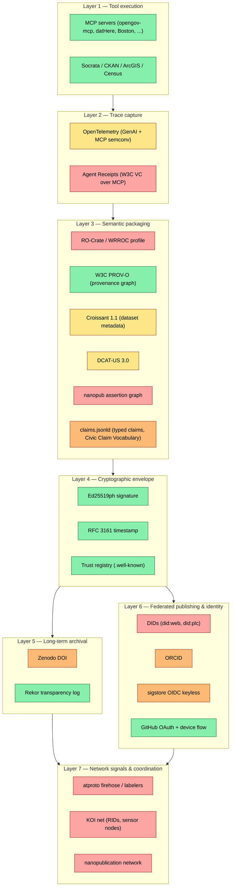
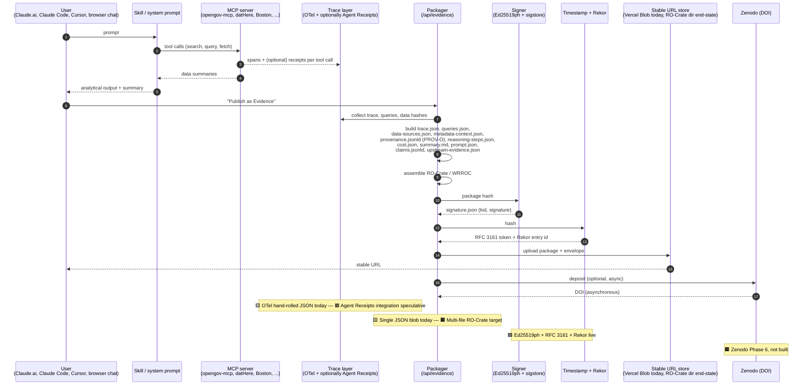
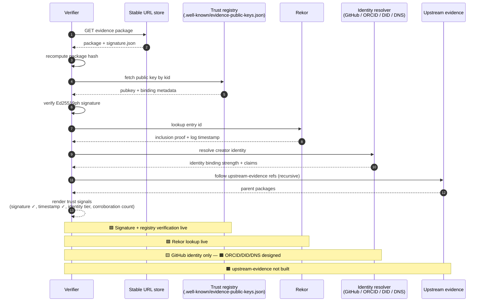
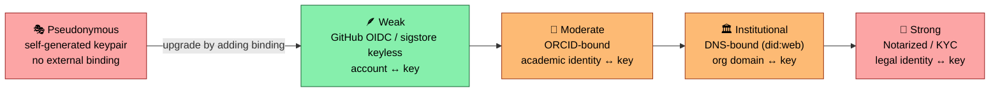
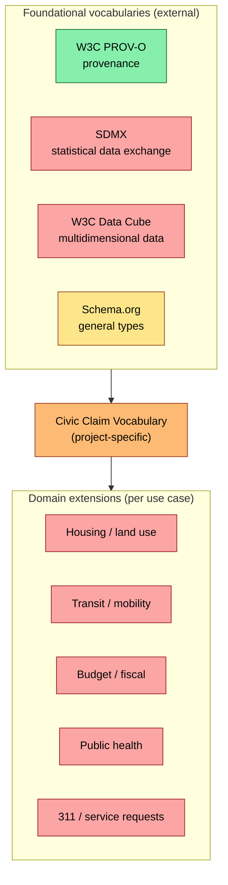
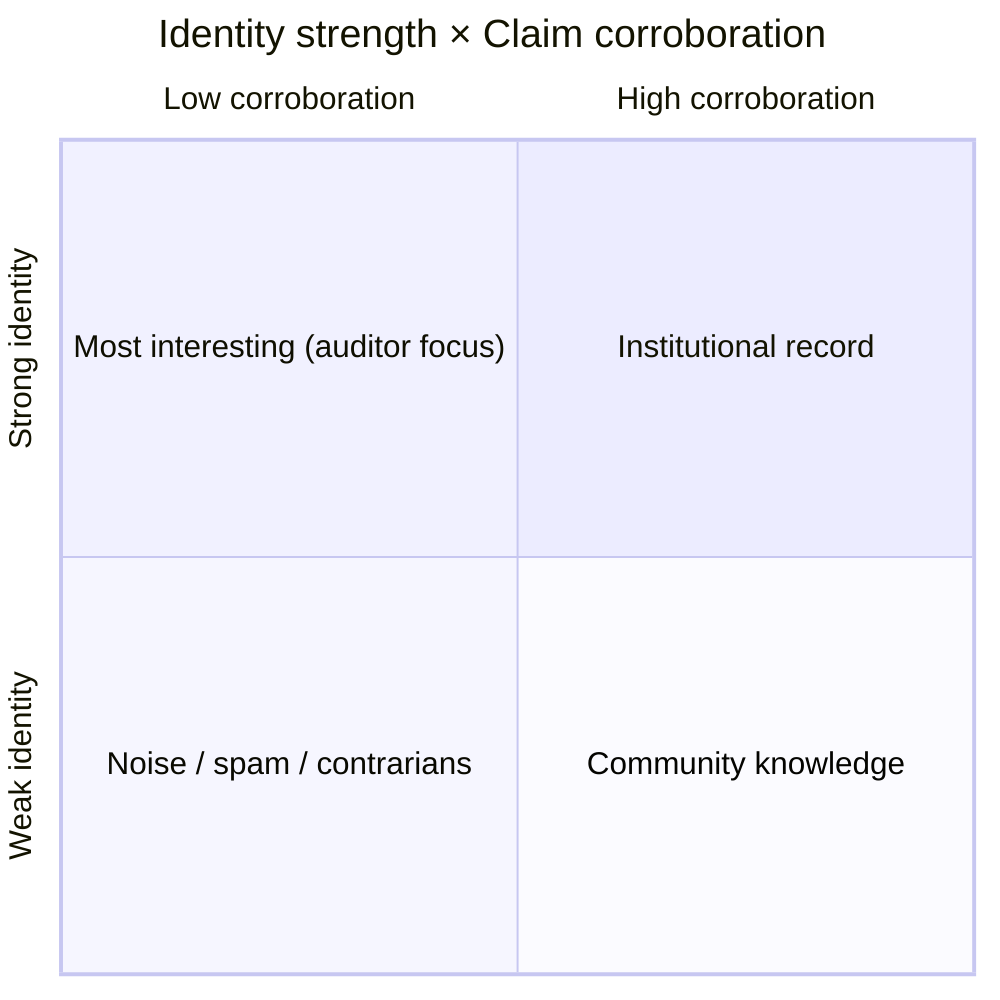
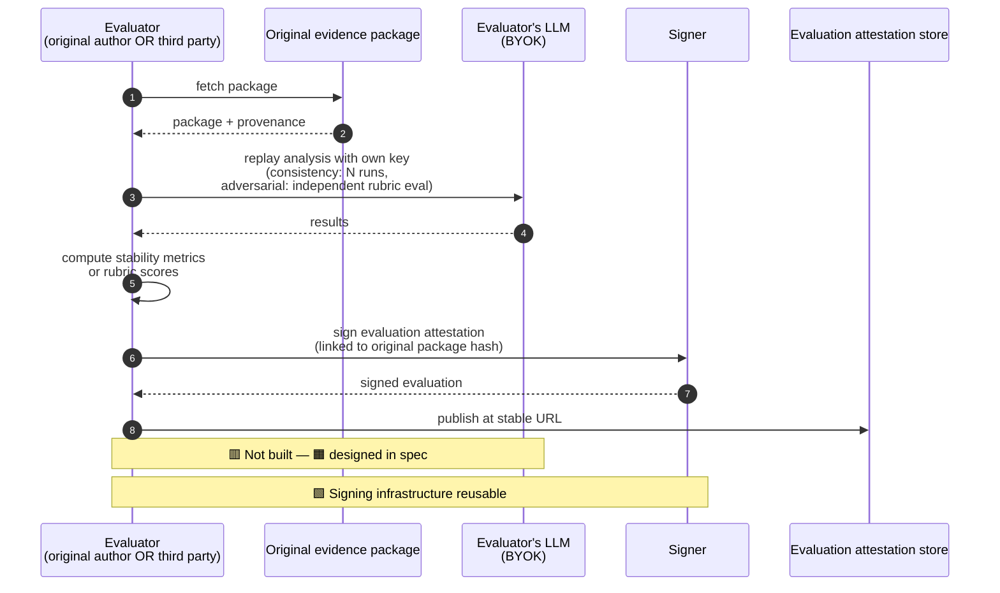

> **Status:** Vision document, not current state. This describes the desired end-state architecture once the open-standards layering is fully realized. For what is actually built and decided today, see the ADRs in `civic-ai-tools/docs/adr/` and `civic-ai-tools-website/docs/adr/`. This document should be updated as ADRs land that resolve the open questions described below.

---

# Civic AI Tools — End-State Architecture Vision

## How to read this document

This document layers the architecture in two ways:

1. **By concern.** Static structural views (the standards stack, the identity ladder, the claims vocabulary family, the network signal model) are separated from dynamic flow views (publishing, verification, evaluation, network propagation).
2. **By build state.** Every node and edge in every diagram is colored by how complete its implementation is today:

| Color | State | Meaning |
|---|---|---|
| 🟩 Green | **Built** | Implemented and exercised in production; matches what an Accepted ADR would describe |
| 🟨 Yellow | **Partial** | Implementation exists but is incomplete, hand-rolled where a real SDK would be expected, or contains a known regression vs. spec |
| 🟧 Orange | **Designed, not built** | A draft spec, ADR, or detailed plan exists, but no code |
| 🟥 Red | **Speculative** | Direction discussed in strategy notes, not yet committed to as a decision |

Mermaid diagrams use these colors via `classDef` declarations at the bottom of each diagram. Hover or zoom in for legibility.

The diagrams are designed to render natively on GitHub. A combined high-level SVG view (`end-state-vision.svg`) sits alongside this file for sharing and presentations.

---

## 1. The standards stack (static)

The end-state architecture is a layered composition of open standards. Each layer solves a distinct problem and was developed independently by communities that mostly don't talk to each other; the project's contribution is the assembly, not the substrate.

**How to read this stack.** Each layer assumes the layers beneath. The cryptographic envelope is meaningless without a stable artifact to wrap; the semantic packaging is meaningless without trace capture; the trace capture is meaningless without tool execution to observe. The network coordination layer is a property that emerges only once enough signed artifacts exist to make federation worth the operational cost — which is why it is appropriately the most speculative.

The single most consequential **unresolved decision** is whether L3 (semantic packaging) adopts RO-Crate as the canonical container. If it does, L4-L7 inherit RO-Crate's well-tested patterns for archival, citation, and federation. If it doesn't, the project re-invents those patterns at substantial cost.

**Note on Croissant's dual role in L3.** Croissant appears in this layer for two distinct purposes that should be tracked separately. *Inbound:* when an evidence package's analysis pulls from an external dataset (NYC 311, Boston parcel data), the package's `data-sources.json` references or embeds Croissant metadata for that dataset, characterizing what was queried. This use is partially built today. *Outbound:* a published evidence package itself can carry a Croissant metadata file at a well-known location, making the package discoverable through dataset crawlers (Hugging Face, Kaggle, CKAN, Schema.org-aware search). This use is undecided and tracked as an open question. The two uses are independent — adopting one does not force the other. These two uses are also referred to as "consumer-side" (using Croissant to characterize datasets the package consumed) and "emitter-side" (publishing Croissant metadata about the package itself), per `civic-ai-tools/docs/research/landscape-analysis.md` §7. Inbound/outbound is package-relative; emitter-side/consumer-side is project-relative. Both vocabularies refer to the same two distinct uses.

---

## 2. Package construction (dynamic flow)

This is the publish flow as it should look end-to-end. Today, this flow exists as a single-JSON-blob shortcut; the end-state version produces a multi-component package with each artifact independently verifiable.

**Build state at a glance:** the signing and timestamp legs are real today. Trace capture works but is hand-rolled and would not survive an adopter (e.g., datHere, Boston) bringing their own real OTel SDK. Package assembly works but produces a single JSON blob rather than the multi-file directory that the spec drafts and adopter explainers describe — this is the gap that ADR-NEXT should resolve. Zenodo deposit is fully designed but not built.

The two semantic artifacts that don't yet exist (`claims.jsonld` and `upstream-evidence.json`) are designed in the spec drafts but not implemented anywhere. Both should remain deferred until a real package needs them — see the Xanadu test (doctrine) in the glossary.

---

## 3. Verification flow (dynamic)

What a third party — a journalist, a city auditor, a community board, a data publisher, an academic — does when handed an evidence URL.

**The verifier never trusts the website.** Every verification step is independently checkable: the package hash is reproducible from the bytes, the signature checks against a public key fetched from a well-known location, the Rekor entry is on a public transparency log, and the identity binding (in the end state) resolves to externally-verifiable identifiers (GitHub, ORCID, DID, DNS-bound domains). This is the property that makes the system usable as evidence in adversarial contexts — community board hearings, regulatory filings, journalism, audits.

A key end-state property not yet implemented: **the evidence package should be fully verifiable offline.** Today, verifying requires fetching the JSON blob *and* a DB row from the verify endpoint, with the website composing the answer. In the end state, the package itself contains everything needed to verify locally (with the trust registry as the only external dependency).

---

## 4. Identity binding (static — the graded ladder)

Identity in the evidence system is intentionally **graded**, not binary. Pseudonymity is first-class; institutional binding is achievable but optional. Consumers filter on binding strength rather than the platform ranking by it.

**Critical property:** **identity strength ≠ topic authority.** A pseudonymous community member with deep neighborhood knowledge may produce more accurate evidence than an institutionally-bound consultant. The system surfaces the binding strength as a signal; the consumer applies judgment.

**Storage shape (end-state).** Each evidence package's `signature.json` records the `kid` (key identifier), the binding strength tier, and links to the binding artifacts (sigstore OIDC token reference, ORCID profile URL, DNS TXT record, etc.) so a verifier can independently re-check the binding rather than trusting the package's self-description.

**Today's reality.** GitHub OAuth + device flow only. The schema is currently GitHub-specific (`github_id`, `display_name`, `github_profile_url`); the `creator_auth_provider` / `creator_auth_provider_id` columns described in earlier planning prompts do not exist yet. Adding ORCID is the obvious first step toward generalization and would force the schema to genericize.

---

## 5. The claims vocabulary family (static)

Typed claims (`claims.jsonld`) are the project's contribution to the open-science / civic-data trust stack. They sit on top of existing W3C and community ontologies rather than replacing them.

**Design principle:** the core (the Civic Claim Vocabulary) is small and stable; domain extensions are governed separately and can evolve at their own pace. A claim conforms to the Civic Claim Vocabulary + zero or more domain extensions. This mirrors RO-Crate's profile mechanism and avoids the trap of a single monolithic vocabulary that no one wants to maintain.

**Relationship to nanopublications.** A nanopublication is an atomic claim with provenance, expressed as RDF named graphs. The end-state typed-claims layer is structurally similar; the open question (see §1) is whether to literally adopt nanopub's serialization or to define a parallel format that interoperates. The current direction under consideration is to adopt nanopub-shaped claims for the assertion graph and use RO-Crate for the package container. A v0.1 spec draft for the Civic Claim Vocabulary exists; no implementation yet.

---

## 6. Network signals — the second-order layer (static + dynamic)

Once enough evidence packages exist, they form a network. The network produces useful signals to four distinct audiences without anyone explicitly aggregating them. This is the **emergent property** the architecture is ultimately aiming at.

```mermaid
flowchart LR
    subgraph Packages["Evidence package corpus"]
        P1["Package A"]:::speculative
        P2["Package B"]:::speculative
        P3["Package C"]:::speculative
        P4["..."]:::speculative
    end

    subgraph Transport["Transport (one of)"]
        AT["atproto firehose"]:::speculative
        K["KOI net"]:::speculative
        NP["nanopub network"]:::speculative
    end

    subgraph Processors["Processors / labelers"]
        Lab1["BetaNYC labeler"]:::speculative
        Lab2["MetaGov audit labeler"]:::speculative
        Lab3["GovEx labeler"]:::speculative
    end

    subgraph Consumers["Consumers + signals"]
        Pub["📣 Data publishers<br/>(drift, usage)"]:::speculative
        Jrn["📰 Journalists<br/>(contradictions)"]:::speculative
        Acad["🎓 Academics<br/>(citation graphs, meta-analysis)"]:::speculative
        Aud["⚖️ Auditors<br/>(strong identity + contested claims)"]:::speculative
    end

    Packages --> Transport
    Transport --> Processors
    Processors --> Consumers

    classDef built fill:#86efac,stroke:#166534,color:#000
    classDef partial fill:#fde68a,stroke:#92400e,color:#000
    classDef designed fill:#fdba74,stroke:#9a3412,color:#000
    classDef speculative fill:#fca5a5,stroke:#991b1b,color:#000
```

### The spam / quality 2×2

**Critical preamble (must appear in any spec or product surface):**

- Corroboration ≠ truth. Consensus can be wrong.
- Contradiction ≠ falsity. The heretic is sometimes right.
- Identity strength ≠ topic authority. A credentialed outsider can be wrong; a pseudonymous insider can be right.
- The system surfaces signals; the consumer applies judgment.

This framing is what protects the architecture from drifting into automated truth-scoring — a regime that has historically gone badly (content moderation, credit scoring, citation metrics).

---

## 7. BYOK evaluation flow (dynamic)

Consistency testing and adversarial evaluation are **power-user features** where the user (or a third-party reviewer) supplies their own LLM API keys. This keeps the platform's costs bounded and makes third-party evaluations more credible than self-evaluation.

**Key property:** an evaluation attestation is itself an evidence package, signed independently, linked to the original via `upstream-evidence.json` with `relationship: "evaluates"`. The evaluator's identity and binding strength accompany the attestation. A package with three independent third-party evaluations is more credible than the same package with self-evaluation, and consumers can see the evaluator identities and weight accordingly.

---

## 8. Diagrams suitable for BPMN conversion

The BPMN format excels at process flows with explicit actors, sequences, decision points, and parallel paths. The following diagrams from this document map cleanly to BPMN and would benefit from conversion when audiences want process-modeling rigor (MetaGov interop work, deliberative tool integration, formal architecture review):

| Mermaid diagram | BPMN equivalent | Pools / lanes |
|---|---|---|
| §2 Package construction | Collaboration diagram | User, Skill, MCP server, Trace, Packager, Signer, Timestamp/Rekor, Store, Zenodo |
| §3 Verification flow | Collaboration diagram | Verifier, Store, Trust registry, Rekor, Identity resolver, Upstream evidence |
| §7 BYOK evaluation flow | Collaboration diagram | Evaluator, Original package, Evaluator's LLM, Signer, Attestation store |

The following diagrams **do not** convert cleanly to BPMN and should remain in Mermaid:

- §1 Standards stack (static layered architecture, not a process)
- §4 Identity ladder (static taxonomy, not a process)
- §5 Claims vocabulary family (static type hierarchy, not a process)
- §6 Network signals (mostly static; the propagation could be expressed as BPMN message flows but the value is marginal)

Forcing static structure into BPMN would obscure rather than clarify. Use the right tool for each.

---

## Glossary

### External standards and protocols

**atproto (AT Protocol).** Decentralized social networking protocol powering Bluesky. Provides DIDs, Personal Data Servers (PDSes), federated repos with signed records, and a public firehose. Lexicons are its schema system — anyone can define new typed record formats under their own namespace.

**Croissant.** Machine-learning dataset metadata standard. Croissant 1.1 (Feb 2026) added W3C PROV-O provenance, controlled-vocabulary references, and ODRL/DUO usage policies, making it the closest external standard to the project's data-source metadata layer. ~700K+ datasets carry Croissant metadata across Hugging Face, Kaggle, OpenML, and CKAN portals.

**DCAT-US 3.0.** US federal data catalog vocabulary. Aligns with W3C DCAT for cross-portal data discovery. Used by data.gov and increasingly by city portals.

**DID (Decentralized Identifier).** W3C standard for cryptographically-verifiable identifiers not tied to a central registry. `did:web` resolves via DNS (one DID per domain); `did:plc` resolves via a centralized but portable directory.

**DOI (Digital Object Identifier).** Persistent identifier for a digital resource, in the format `10.{registrant}/{suffix}` (e.g., `10.5281/zenodo.1234567`). Resolved via `https://doi.org/{doi}`, which redirects to the registrant's current hosting location. Operated by the International DOI Foundation, a non-profit federation of registration agencies. The point is permanence: even if the registrant moves servers, the DOI keeps resolving. Zenodo issues DOIs via DataCite, one of the registration agencies.

**Ed25519ph.** Pre-hashed variant of the Ed25519 signature scheme. Used for the project's package signatures. Faster verification than Ed25519 for large payloads since the hash is computed once.

**KOI (Knowledge Organization Infrastructure).** Federated knowledge protocol publicly developed by BlockScience with MetaGov and RMIT. Uses RIDs (reference identifiers) that point to knowledge objects without handing them over — consent-aware federation. Currently at v3, research-grade, small-scale.

**MCP (Model Context Protocol).** Anthropic-originated open protocol for connecting LLMs to tools and data sources. The substrate that opengov-mcp-server, datHere's qsv MCP, and Boston's MCP work are all built on.

**Nanopublication.** Atomic scientific claim expressed as RDF in three named graphs (assertion, provenance, publication info). 15+ years of development, 10M+ published. The closest semantic match to the project's typed-claims work.

**OpenTelemetry (OTel).** Vendor-neutral standard for distributed tracing, metrics, and logs. The GenAI and MCP semantic conventions (`gen_ai.*`, `mcp.*`) define how to instrument LLM and tool-call workflows.

**ORCID.** Global researcher identifier (open, non-profit). The natural identity binding for academic users of the evidence system.

**OWL (Web Ontology Language).** W3C standard for defining ontologies in RDF — vocabularies of classes, properties, and constraints. OWL lets a vocabulary author state things like "Person and Organization are both subclasses of Agent" or "every Activity has at least one wasAssociatedWith link to an Agent." Reasoners can use these axioms to infer new RDF triples from existing ones. PROV-O is an OWL ontology. The Civic Claim Vocabulary is intentionally lighter-weight — it is a controlled vocabulary of typed claim shapes expressed in JSON-LD, not a full OWL ontology with rich axioms. Authors don't write OWL by hand for this project; they rely on existing ontologies that were authored in OWL.

**PROV-O (W3C Provenance Ontology).** RDF/OWL ontology for representing provenance — entities, activities, agents, and the relationships between them (`wasGeneratedBy`, `wasDerivedFrom`, `wasAttributedTo`, etc.). The semantic backbone of the project's `provenance.jsonld`.

**RDF (Resource Description Framework).** W3C standard data model for expressing data as triples (subject, predicate, object), where each part is an IRI or a literal. RDF is a data model, not a syntax — the same triple can be serialized as Turtle, N-Triples, RDF/XML, or JSON-LD. The point of RDF is composability: anyone can extend a graph by publishing new triples about existing IRIs without coordinating with the original publisher. PROV-O, Croissant, nanopubs, RO-Crate metadata, and the Civic Claim Vocabulary all use RDF as their data model. JSON-LD is the JSON-flavored serialization the project uses throughout.

**RFC 3161.** IETF standard for trusted timestamps. A Timestamp Authority (TSA) signs a hash with a timestamp, producing a token that proves "this hash existed by this time." freeTSA.org provides a free TSA.

**Rekor.** Append-only public transparency log, part of the sigstore project. Storing a hash in Rekor proves the artifact existed by a given time and that the log entry hasn't been altered since.

**RO-Crate.** Community standard for packaging research artifacts with metadata, based on Schema.org JSON-LD. Has a mature **profile** mechanism for domain-specific extensions (the **WRROC** profile — Workflow Run RO-Crate — is the canonical way to express AI/computational workflow provenance with PROV-O alignment).

**SDMX.** Statistical Data and Metadata eXchange — international standard for statistical data, used by central banks and statistical agencies. Relevant for typed claims that involve official statistics.

**Schema.org.** General-purpose type vocabulary maintained by major search engines. Widely embedded in web pages; the lingua franca for structured-data interop on the open web.

**sigstore.** Open-source signing infrastructure including Cosign (signing), Fulcio (CA), and Rekor (transparency log). Supports keyless signing via OIDC — an OIDC token is exchanged for a short-lived signing certificate, and the OIDC identity is permanently associated with the signature via Rekor.

**W3C Verifiable Credential (VC).** Standard for cryptographically-signed claims about a subject. The format Agent Receipts uses for per-MCP-tool-call receipts.

**Zenodo.** CERN-operated open-access repository. Issues DOIs and provides long-term preservation. The natural archival home for evidence packages worth citing.

### Project-specific terms

**Agent Receipts.** Open-source transparent MCP proxy that creates W3C VC receipts for individual tool calls. Captures parameters but not yet responses (tracked in the project's open issues). Complementary to the project's OTel layer.

**BYOK (Bring Your Own Key).** The pattern where consistency testing and adversarial evaluation are performed by the user or a third-party reviewer using their own LLM API keys, rather than the platform paying for evaluation inference. Makes evaluation costs zero for the platform and makes third-party evaluations more credible than self-evaluation.

**captureMethod.** Field describing how a package's content was captured. Enforced at the publish route since 2026-04-29; covered by the canonical-JSON package hash and the platform Ed25519ph signature, so the label itself is tamper-evident. Four enum values: `chat-flow-stream` (website chat flow, wire-layer verbatim), `claude-code-jsonl-readback` (Claude Code publish skill, JSONL-layer verbatim), `claude-code-self-report` (legacy, deprecated 2026-04-28), and `datHere` (Civic AI Tools answer pipeline producing cross-host A-G envelopes, reproducible-by-construction against documented runtime). Original three values specified in ADR-0003; `datHere` variant specified in ADR-0004.

**Civic AI Tools.** The project itself: opengov-mcp-server (MCP server for Socrata portals), the civicaitools.org website with chatbot and evidence publishing, the civic-ai-tools-website Next.js codebase, the Open Evidence Standard spec, and the cross-city directory of open data MCP servers.

**Civic Claim Vocabulary.** Project-specific controlled vocabulary of typed claim shapes for evidence packages, designed to be small and stable. Domain extensions (housing, transit, budget, etc.) are governed separately. Currently exists as a v0.1 draft spec only. Expressed in JSON-LD with references to W3C ontologies and Schema.org rather than as a heavyweight OWL ontology in its own right.

**claims.jsonld.** Designed but not built. Optional file in evidence packages containing typed claims that conform to the Civic Claim Vocabulary + zero or more domain extensions. The contribution that turns evidence packages from a "this AI ran this query" record into a corpus-queryable knowledge layer.

**Evidence package.** The signed, timestamped, citable artifact produced by publishing an analysis. End-state form: an RO-Crate directory containing trace, queries, data sources, metadata context, provenance graph, reasoning steps, cost report, summary, prompt, claims, upstream references, signature, and timestamp. Today's form: a single JSON blob plus a separate envelope row in the database — see open question below.

**Graded identity binding.** The project's term for the multi-tier identity model: pseudonymous → weak (GitHub OIDC / sigstore keyless) → moderate (ORCID) → institutional (DNS / `did:web`) → strong (notarized). Surfaced as a queryable attribute, never used by the platform to rank.

**KOI integration.** Speculative direction: implementing evidence packages as KOI digital objects with RIDs, optionally as a koi-net sensor node. The architectural framing under consideration positions KOI *over* the artifact spec rather than inside it — KOI as the network/coordination layer, the evidence package as the artifact layer.

**Open Evidence Standard.** The project's spec for traced, provenance-linked, consistency-tested, adversarially-evaluated, user-owned AI analysis. Designed as a general-purpose trust infrastructure with civic data as the first use case.

**Trust registry.** The `.well-known/evidence-public-keys.json` endpoint that lets verifiers fetch public keys by `kid` (key identifier) without trusting the website. Currently has one active key.

**upstream-evidence.json.** Designed but not built. Optional file in evidence packages declaring relationships to other evidence packages (`derived_from`, `compares_to`, `extends`, `replicates`, `contradicts`, `evaluates`). Enables citation graphs and cross-package meta-analysis.

**Xanadu test (doctrine).** Project discipline: do not promote anything in the spec to a higher build state without a real package that needs it. Named after Project Xanadu, a hypertext system originally proposed in 1960 that accumulated decades of unimplemented features and design ambitions before shipping a small subset many years later. Apply the test as a binary gate at three transitions: (1) speculative → designed, (2) designed → built, (3) built → required for adopters. The criterion at each transition is the same: an existing or imminent real-world package or adopter must concretely need the change. The following do *not* satisfy the criterion: hypothetical future use cases, "wouldn't it be cool if...", a chat conversation about possible directions, a single funder asking whether you support X, or a self-imposed sense that the spec is incomplete. The following *do* satisfy the criterion: an existing adopter blocked from publishing without the change, a real package whose verification fails without the change, or a concrete pending integration with a named upstream/downstream project that requires the change. Items that fail the test stay in research-doc form only — no implementation, no ADR, no spec text — until they pass. Failed items can be re-tested at any time when conditions change. See `civic-ai-tools/docs/architecture/xanadu-doctrine.md` for the standalone doctrine document with worked examples.

---

## Open questions

Open questions affecting the architecture and standards are tracked in [`civic-ai-tools/docs/architecture/open-questions.md`](open-questions.md). The registry is the canonical home; this section is preserved here only as a pointer.

The most consequential currently-open questions for context (see the registry for full detail and stake-bearing spec sections):

- **[Q1 — Package format](open-questions.md#q1--package-format).** Most consequential current decision. Today: single JSON blob plus DB-resident envelope. End-state direction: multi-file RO-Crate / WRROC profile that embeds the signature + RFC 3161 token + Rekor proof in the package. Drives whether third-party offline verification is possible.
- **[Q7 — Producer-type scope](open-questions.md#q7--producer-type-scope).** Is the standard for AI-produced civic analysis specifically, or for civic analysis where AI is one producer type? Drives Q9 (AI-specific commitments inventory), Q13 (naming), Q14 (geographic-scope nullability).
- **[Q11 — Typed claims as a kind of attestation](open-questions.md#q11--typed-claims-as-a-kind-of-attestation).** Restructuring the typed-claims layer (§5 claims vocabulary family) as a kind of attestation. Promoted to issue 006.

Question #6 (captureMethod enforcement) resolved 2026-04-29 by [ADR-0003](../adr/0003-evidence-capture-method.md); see registry for the resolution log entry.

---

## Document maintenance

Update this document when:

- An ADR resolves an open question → update the relevant diagram nodes from speculative/designed to built/partial, and update the registry entry in [`open-questions.md`](open-questions.md) to point at the resolving ADR.
- A new external standard becomes relevant → add to §1 stack and §Glossary.
- A new diagram is added → cross-reference from §How to read this document and tag each node with its build state.

Do not let this document drift. A vision document that describes what was speculative two years ago is worse than no vision document at all.
