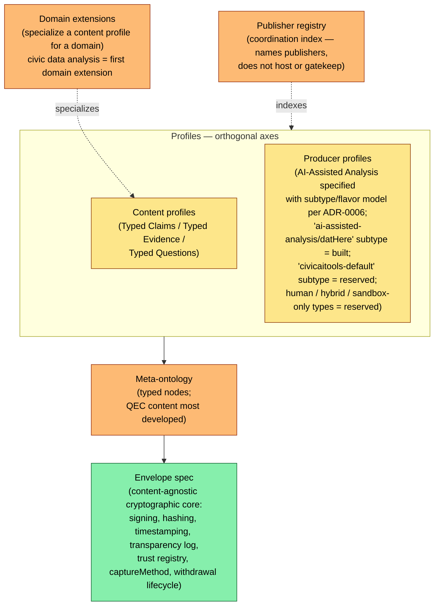
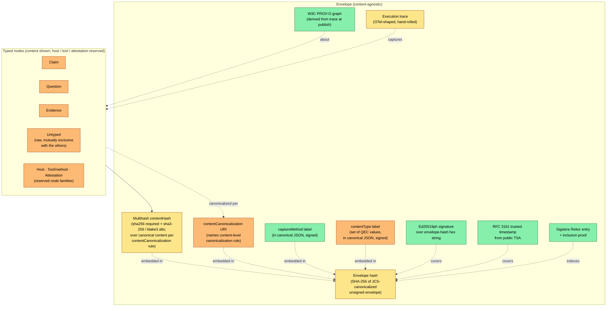
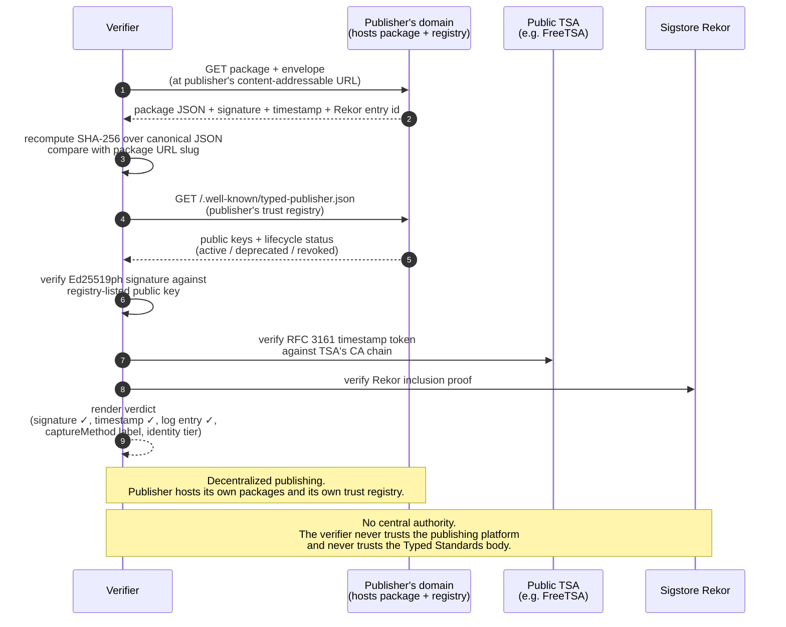
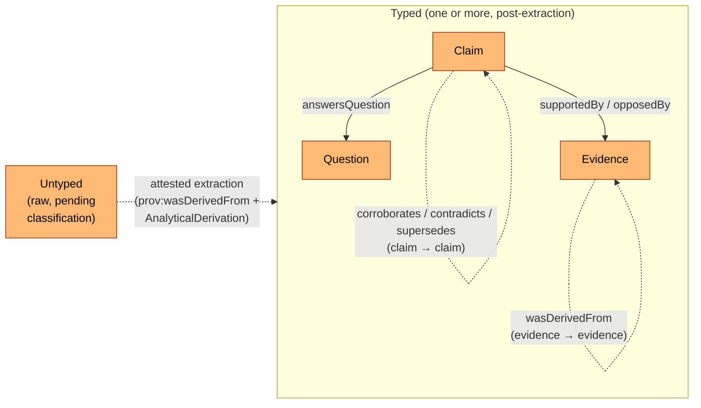

# Typed Standards — proposal

**One-line definition.** A layered, content-agnostic open standard for **production-process attestation** of analytical artifacts: a cryptographically signed, content-addressed, capture-method-labeled record of *how* an artifact was produced, verifiable by a third party who does not trust the publisher.

> **Status: Internal working draft, pre-v0.1.** This proposal renames and restructures the project's standards work (formerly the Open Evidence Standard / OES at the envelope layer, and the Civic Claim Vocabulary / CCV at the typed-claims layer) under a single umbrella name. Several layers described here — the typed-node ontology, the producer-profile / content-profile / domain-extension split, the publisher registry as a coordination index — are **reserved**: drafted in this document and adjacent draft specs, not yet implemented and not yet normative in the existing standard drafts. Sections that depend on reserved layers are marked inline. The existing `civic-ai-tools/docs/architecture/open-evidence-standard.md` and `civic-claim-vocabulary-draft-spec.md` remain ground truth for what is normative today; this document sketches the umbrella those drafts will sit under.

---

## 1. The problem

Trust in analytical claims today is mediated by brand. A reader who encounters a chart, a number, or a synthesis decides whether to believe it based on the institution behind it — investigative journalism, academic publishing, civic-data analysis from a government agency, consumer-rights research, regulatory submissions, audit work product. The artifact itself usually carries no machine-verifiable record of how it was produced.

This was workable while production was an implicit labor attestation. A serious data analysis took weeks of skilled work; the institution staking its name on it had presumably done that work. AI-assisted analysis breaks the implicit-labor-attestation assumption. The same chart that took an analyst a week can now be produced in minutes by a journalist with no statistical training, a community member with no institutional affiliation, or an adversary fabricating a plausible-looking story. Brand-mediated trust becomes increasingly orthogonal to whether the analysis is sound — and brands themselves are now consumers of AI-assisted production they cannot internally verify.

The standard's response is to make the **production process itself** the unit of attestation. Not "is this true," but "here is, in cryptographic detail, how this was produced — judge for yourself."

---

## 2. What Typed Standards is

Typed Standards is **opinionated about three things** and **deliberately silent about three others**.

**Opinionated about:**

1. **The envelope.** Every conformant package carries an Ed25519ph signature over a SHA-256 content-addressed canonical JSON, an RFC 3161 trusted timestamp from a public TSA, and an inclusion proof on a public transparency log (Sigstore Rekor). The signing key is bound to a published trust registry under the publisher's own well-known path.
2. **Capture-method discipline.** Every package declares, in a field covered by the canonical-JSON hash and therefore by the signature, *how* its content was captured. The label is structural and tamper-evident: a verifier can tell a verbatim wire-layer capture from a JSONL-layer readback from a paraphrased self-report. Future capture methods extend the vocabulary; the discipline holds.
3. **The typed-node ontology** *(reserved)*. Every package is built from typed nodes drawn from four families: **content** (the QEC sub-ontology — `metadata.contentType` set-valued across `claim` / `question` / `evidence` / `untyped`), **hosts** (typed self-description and policy of a publishing platform), **tools / methods** (typed descriptions of tools, MCP servers, skills, or methods used in production), and **attestations** (typed references to other packages with a small relations vocabulary). Each family gets the envelope and its own sub-typing rules. Nodes can carry signatures from different parties — individuals, hosts, certifying bodies, other attesting nodes — and these signatures layer rather than collapse into a single trust authority. A small relations vocabulary ties nodes together (`supportedBy`, `opposedBy`, `answersQuestion`, `corroborates`, `contradicts`, `supersedes`, `wasDerivedFrom`). QEC content is the most developed sub-ontology today; host, tool, and attestation typing are reserved.

The **normative preamble** applies across all three commitments and across every implementation: corroboration ≠ truth, contradiction ≠ falsity, identity strength ≠ topic authority, the system surfaces signals and the consumer applies judgment. The preamble is the architectural guardrail against drift toward automated truth-scoring; every product surface, downstream consumer, and third-party implementation MUST carry it.

**Deliberately silent about:**

1. **Truth.** The signature attests that the package was published and has not been altered. It does not attest that the content is correct. Editorial review, fact-checking, replication, and adversarial evaluation are *separately-signed attestations* carried in the network around the envelope, never enforced by it.
2. **Editorial policy.** Publishers set their own filters, audiences, and review processes. The standard does not gate publication on topic, viewpoint, or sign-off.
3. **Topology.** Publishers publish at their own domains. The standard does not require — and is structurally indifferent to — any central host, federation substrate, or coordination protocol beyond an optional indexing registry that does not host or gatekeep.

---

## 3. Architecture

The layered shape the umbrella sits over. Color encoding follows the convention in `end-state-vision.md`: **green = built**, **yellow = partial**, **orange = reserved (designed but not implemented; or proposed in this document and not yet in the existing drafts)**.

**How to read.** The envelope is the only layer with full implementation today; it is the bulk of what the existing OES specifies. The meta-ontology layer is reserved — adjacent prior art exists (W3C PROV-O for `wasDerivedFrom`; the existing CCV draft's `contradicts` / `corroborates` / `supersedes`; the existing attestation kinds `consistency` / `evaluation` / `expert_attestation`; the upstream-evidence relations reserved in OES §12) but the unified typed-node model — content (set-valued `metadata.contentType` over `claim` / `question` / `evidence` / `untyped` with attested `untyped` → typed extraction) plus reserved node families for hosts, tools/methods, and attestations — is new to this document. Content profiles are partially built: the Typed Claims Profile (formerly the Civic Claim Vocabulary) is drafted but not implemented; Typed Evidence Profile and Typed Questions Profile are reserved name-only. Producer profiles moved from reserved to **specified** with [ADR-0006](../adr/0006-producer-profile-architecture.md): the AI-Assisted Analysis Producer Profile is the first one drafted, with a subtype/flavor model so different adopters' conventions are filterable (visualization stack, citation format, entity normalization, synthesis style, confidence-scoring methodology live in subtype-specific guidance bundles rather than in the envelope). The `ai-assisted-analysis/datHere` subtype is the first built realization (refactor of the existing ADR-0004 content profile). Future profile types (`human`, `hybrid`, `sandbox-only`) and subtypes are reserved name-only; each lands in its own ADR with the motivating adopter named. Domain extensions specialize a content profile for a domain; civic data analysis (Neighborhood Tabulation Areas, community districts, the rest of the civic-scope taxonomy in the existing CCV draft) is the first domain extension.

---

## 4. What's in the envelope

The envelope mechanics are content-agnostic; the content slot is swappable per content profile. Canonicalization comes in two kinds (per the 2026-05-25 strategic memo §3 finding #1, formalized by [ADR-0007](../adr/0007-content-canonicalization.md) + [ADR-0008](../adr/0008-multihash-content-hash.md)): **envelope-level** canonicalization is a single fixed rule (RFC 8785 JCS) committed to by the spec; **content-level** canonicalization legitimately varies per content shape and is named by the envelope's `contentCanonicalization` URI field. The envelope-hash (SHA-256 over JCS-canonicalized unsigned envelope) is what the signature covers; the multihash `contentHash` field fingerprints the off-log content per the named rule and is itself embedded in (and therefore covered by) the envelope.

Today the content slot carries an AI-assisted civic-data analysis (prompt, queries, outputs, costs, skill metadata, optional notebook under the `datHere` content profile). The proposed restructure treats that content as **a set of typed content blocks**, with a new `metadata.contentType` field carrying the set of QEC values present — drawn from `claim`, `question`, `evidence`, or `untyped`. The most common shape is `["claim"]`; a claim that explicitly carries the question it answers is `["claim", "question"]`; raw assistant output not yet processed against any content profile is `["untyped"]`. `untyped` is mutually exclusive with the typed values. Per-block requirements (provenance, confidence, scope, AnalyticalDerivation for claims) do not relax when the set has more than one member — a multi-type package is several conformant typed blocks side-by-side, not a looser format. The envelope's hash, signature, timestamp, transparency-log entry, capture-method label, contentType label, contentCanonicalization URI, multihash content hash, provenance graph, and trace bind whatever typed node is inside; the envelope mechanics do not change when the node type or content shape changes (host, tool/method, and attestation node families are reserved alongside the content family — see §6). Different content shapes vary the `contentCanonicalization` URI; the envelope-level JCS commitment is invariant.

---

## 5. Verification flow

A verifier can complete every check using only public infrastructure plus the publisher's own trust registry. No central authority is required, and no `typedstandards.org` lookup appears in the verification path.

**The decentralized-publishing / central-indexing split.** Each publisher hosts its own packages and serves its own trust registry at a well-known path on its own domain. The reserved publisher registry at `typedstandards.org` indexes declared publishers (a directory function) but is not in the verification path: a verifier never queries `typedstandards.org` to verify a package, and the index has no authority to vouch for or reject any publisher's content. This is the deliberate inversion of the brand-mediated-trust model: trust is in the cryptography and the publisher's identity binding, not in the standards body or any host.

> **What's reserved vs. what's built in this flow.** The trust-registry well-known path shown above — `/.well-known/typed-publisher.json` — is **reserved**; today's reference implementation serves the same content at `/.well-known/evidence-public-keys.json`. Renaming touches at least the verification module, the signing module, the bundle export route, the served file, the rotation runbook, and the external-clients API documentation; it is flagged as future work, not part of this proposal. Today's verification flow also depends on a server-composed verify endpoint to assemble the signature envelope, RFC 3161 token, and Rekor proof from a database row, because the current single-blob package shape does not embed those proofs (OES Open Question Q1). Offline verification — package alone plus the publisher's trust registry plus the TSA and Rekor — is the **target end-state**, not yet a property; honestly aspirational.

---

## 6. The typed-node ontology

> ⚠ **Reserved layer.** The unified typed-node model — content nodes alongside host, tool/method, and attestation node families — is proposed in this document; it is not yet in `open-evidence-standard.md` or `civic-claim-vocabulary-draft-spec.md`. Adjacent prior art exists across those drafts but the unified typed-node framing is new. QEC content is the most-developed sub-ontology today; host, tool, and attestation typing are reserved.

The standard's unit is a **typed node** — a content-addressable, signed envelope around content of a known type. Four node families are reserved: **content** (the QEC sub-ontology described in the rest of this section, the most developed today), **hosts** (typed self-description and policy of a publishing platform; see Q22 in the open-questions registry), **tools / methods** (typed descriptions of tools, MCP servers, skills, or methods involved in production, including certifications received from third-party bodies), and **attestations** (typed references to other packages with a small relations vocabulary). Each family gets the envelope mechanics (signing, hashing, timestamping, transparency log) and its own sub-typing rules. The rest of this section details the content sub-ontology (QEC), closing with a note on how signatures across nodes layer.

A package's `metadata.contentType` is a **set** drawn from four values:

- `claim` — one or more conformant claims (assertions the producer is making)
- `question` — one or more conformant questions (asked but not-yet-answered queries)
- `evidence` — one or more conformant evidence records (captured observations or analytical artifacts)
- `untyped` — the envelope is valid, but the content has not been processed against any content profile yet (raw output pending extraction)

Examples: a pure-claims package is `["claim"]`; a claim that explicitly carries the question it answers is `["claim", "question"]`; raw assistant output is `["untyped"]`. `untyped` is **mutually exclusive** with the typed values — a package is either unclassified or it has been processed into one or more known types. There is no `mixed` value; multiplicity is expressed by the set having more than one member, not by a dedicated tag. When `contentType` has more than one member, the `content` field carries an array of individually-typed blocks, each conformant to its profile and each retaining its own provenance, confidence, scope, and AnalyticalDerivation (for claims). Intra-package relations between blocks — `answersQuestion` from a claim to a question in the same package, for example — are valid and expected.

Relations among content nodes draw from a fixed small vocabulary.

**Attribution.** The QEC pattern — claim, question, evidence as the three first-class content types of a discourse representation — is from **Joel Chan's Discourse Graphs work**. The Discourse Graphs community has developed and used QEC for several years as a structural representation of scholarly discourse. Typed Standards' adoption is structurally similar: QEC nodes are content types living inside the envelope; relations among them are signed attestations between content-addressed packages. The relations vocabulary is intentionally minimal — `wasDerivedFrom` is inherited from W3C PROV-O; `supportedBy` / `opposedBy` are the QEC primitives; `answersQuestion` ties a claim back to a question; `corroborates` / `contradicts` carry the existing CCV claim-to-claim relations forward; `supersedes` carries claim versioning. Domain extensions and producer profiles add domain-specific relations on top; the small core holds.

**Untyped → typed is an attested extraction step.** Processing an `untyped` package into typed content — deriving claims, questions, or evidence records from raw output — is itself a first-class analytical step and MUST be attested. Derived typed content MUST carry `prov:wasDerivedFrom` pointing at the source untyped package by content hash, plus an `AnalyticalDerivation` describing the extraction (which model or process performed the classification, against what prompt, over which source span). The rationale is the **classification-laundering guard**: unstructured output silently typed loses the audit trail, and the precision of the resulting types is then mistaken for the precision of the underlying analysis. `untyped` is the *input type to an attested extraction operation*, not a passive dumping ground. The extraction step is structurally identical to the existing CCV `AnalyticalDerivation` guard for LLM-prose-to-structured-claim translation; the addition is that `untyped` makes the pre-extraction input visible as an explicit content-type value rather than leaving it implicit.

**Extraction step belongs to the Producer Profile.** Per [ADR-0006](../adr/0006-producer-profile-architecture.md) §4, the AI-Assisted Analysis Producer Profile (the first specified producer profile) outputs `untyped` content as its primary artifact (the rendered answer is raw analytical output, not yet decomposed into typed claims/questions/evidence). The attested-extraction step from `untyped` to typed nodes is itself a feature of the AI-Assisted Analysis Producer Profile — it is part of *how AI-Assisted Analysis producers produce typed content downstream*, not a separate capability that exists outside profile boundaries. Other producer profiles (Human, Hybrid, Sandbox-only — all reserved name-only) may define their own extraction-step semantics or omit the extraction step entirely if their primary output is already typed. The shape of the extraction step is per-profile; the `prov:wasDerivedFrom` + `AnalyticalDerivation` requirement holds across all profiles as a content-layer invariant.

**Layered signatures across typed nodes.** A package's nodes may carry signatures from different parties at different scopes — the producer who created the package, a host that endorses it under host policy, a certifying body that attests to a tool's conformance, third parties that corroborate or contradict. These signatures **layer** rather than collapse: a verifier sees who signed what and at what scope, never a single composite verdict. An upstream tool/method certification (for example, a civic-data MCP certification issued by an open-data standards body) flows into a package via the capture-method declaration; the certifying body signed the tool node, not the package itself. A producer signs a package; an institutional host MAY additionally sign packages meeting its policy, and that host signature is independently verifiable. A third-party corroboration or contradiction attestation references the original package by hash; the corroborator's signature attaches to the attestation node, not to the original. The standard specifies how multiple signers and node types compose verifiably without forcing a single trust authority.

---

## 7. What this is NOT — relationship to adjacent standards

| Standard / framework | Relationship to Typed Standards |
|---|---|
| **Discourse Graphs** | Source of the QEC pattern. Typed Standards adopts the claim-question-evidence content types and the `supportedBy` / `opposedBy` / `answersQuestion` relations with attribution. Discourse Graphs operates at the content-representation layer; Typed Standards operates at the envelope layer that wraps the content. |
| **Nanopublications** | Closest semantic match for atomic signed claims with provenance. Nanopubs use an RDF-named-graph format for the assertion + provenance + publication info triplet. Typed Standards is envelope-first and content-addressable with capture-method discipline; consuming Typed Standards content as nanopublications is a plausible bridge but a separate effort. |
| **W3C PROV-O** | Used directly. Every package's provenance graph is PROV-O JSON-LD; the envelope does not redefine derivation, attribution, or generation. |
| **W3C Verifiable Credentials** | Adjacent. VCs are a general signed-claim format; Typed Standards is opinionated about envelope properties (content-addressing, transparency log, capture method) in ways VCs are not. VC-over-MCP-tool-call receipts are a candidate trace-capture layer for the envelope's trace slot. |
| **Schema.org Claim / ClaimReview** | Different problem. Schema.org's fact-check vocabulary tags claims with human fact-check reviews. Typed Standards attests to *how the artifact was produced*, not whether a fact-checker endorsed it. The two can coexist; ClaimReview-style attestations could land alongside Typed Standards packages. |
| **C2PA** | Closest analogue in a different domain. C2PA attests to how an image or video was produced (capture device, edit history) via cryptographic signatures. Typed Standards is the same idea applied to analytical artifacts — production-process attestation, not truth verification. |
| **RO-Crate / WRROC** | Candidate package container. The end-state direction for the envelope's package format is a multi-file directory with an RO-Crate / WRROC compatibility profile (OES Open Question Q1). The envelope's cryptographic mechanics are independent of the container choice. |
| **DCAT / open-data catalogs** | Different layer. DCAT describes datasets and their distributions for catalog discovery. Typed Standards describes *analyses produced from those datasets*; data-source references inside a package may cite DCAT-described datasets, but Typed Standards does not catalog datasets itself. |

---

## 8. Status — honest snapshot

**Implemented in the reference deployment.**
- The cryptographic envelope: Ed25519ph signature, SHA-256 canonical-JSON content-addressing, RFC 3161 timestamp from a public TSA, Sigstore Rekor inclusion proof.
- Trust registry served at `/.well-known/evidence-public-keys.json` (the path the proposal renames to `typed-publisher.json`), with `active` / `deprecated` / `revoked` lifecycle status.
- `captureMethod` discipline with three values (`chat-flow-stream`, `claude-code-jsonl-readback`, `claude-code-self-report`), enforced at the publish route and covered by the signature per ADR-0003.
- `contentProfile` field (existing usage: `default` and `datHere`) carrying the A-G envelope (initial prompt, system prompts, model card + environment, deliberative trace, answer notebook, rendered answer, summary) with deterministic reproducibility against documented runtime and cross-host commitment-view schema per ADR-0004. Per [ADR-0006](../adr/0006-producer-profile-architecture.md), the existing `contentProfile: "datHere"` value is reframed as the first realized subtype of the AI-Assisted Analysis Producer Profile (`ai-assisted-analysis/datHere`); the field itself is retained as a legacy alias for backwards-compat.
- The executed-notebook architecture within the `datHere` subtype, per ADR-0005: backend pipeline (`/api/query-notebook`) generates and executes notebooks via Vercel Sandbox (python3.13 + pinned scientific stack + helper-function inlining); `notebookProvenance` discriminator (`skeleton` | `executed`) on the notebook extension; `org.civicaitools.execution` extension records executedAt + environment + sandboxId.
- Withdrawal and reinstatement lifecycle as signed, public, append-only events.
- W3C PROV-O provenance graphs derived from trace at publish time.
- Identity binding via one OAuth provider (the "weak" tier of the graded ladder).

**Specified but not implemented.**
- The Typed Claims Profile (the artifact formerly drafted as the Civic Claim Vocabulary v0.1): typed claim shapes (TrendClaim, ComparisonClaim, ObservationClaim, CompositionClaim, RelationshipClaim, QualitativeClaim); confidence-method discipline; AnalyticalDerivation as a translation-laundering guard; falsifiability requirement.
- The first domain extension — civic data analysis — drafted within the CCV draft, with geographic-scope subtypes (census tracts, ZIP code tabulation areas, school districts, neighborhood tabulation areas, community board districts, etc.). Not yet a separate document.
- The attestations layer (`consistency`, `evaluation`, `expert_attestation`) — supported in code as a parallel artifact type, not yet normatively specified at the envelope layer.
- The graded identity ladder beyond the weak tier (academic ID, DNS-bound institutional, notarized) — informative direction in OES §8.
- **Producer Profile architecture per [ADR-0006](../adr/0006-producer-profile-architecture.md)**: the `producerProfile` field (compound-string `<profile-type>/<profile-subtype>`), the subtype/flavor model, the legacy-alias relationship with `contentProfile`, and the principle of subtype-specific guidance bundles. The spec lives in ADR-0006; the packager + route + bundle-endpoint plumbing that emits `producerProfile` lands in Phase 3 of the executed-notebook architecture plan.
- The AI-Assisted Analysis Producer Profile (the first specified producer profile per ADR-0006; promoted from reserved → specified): the `datHere` subtype is the first realized subtype (built via the existing ADR-0004 + ADR-0005 implementation); `civicaitools-default` is reserved name-only; future adopter subtypes extend the enum.

**Reserved (named, not specified).**
- The unified typed-node ontology — content (the QEC sub-ontology with set-valued `metadata.contentType` across `claim` / `question` / `evidence` / `untyped`, the seven-relation vocabulary, and the untyped→typed extraction-attestation rule that prevents classification laundering) plus reserved node families for **hosts**, **tools / methods**, and **attestations**, each with its own envelope and sub-typing rules. None of the typed-node fields exist in the publish path today; introducing them is part of the proposed restructure. ADR-0006 §4 establishes that the AI-Assisted Analysis Producer Profile output is `untyped`, with the attested-extraction step (per §6 above) as a per-profile feature — this anchors the typed-node ontology's content layer to a real adopter pattern.
- The layered-signatures model — signatures from different parties (producers, hosts, certifying bodies, third-party attestation authors) attaching to different nodes and composing without collapsing into a single trust authority. The composition pattern is reserved; today's reference implementation supports producer signatures and (in attestation form) third-party signatures, but host signatures and certifying-body signatures over tool/method nodes are not yet implemented.
- Typed Evidence Profile and Typed Questions Profile (the Claim profile is the only one drafted).
- Producer Profile types beyond AI-Assisted Analysis: **Human** (human-produced analysis without an AI agent in the synthesis loop), **Hybrid** (mixed human + AI production), **Sandbox-only** (content produced entirely by a sandbox-executed pipeline without an interactive synthesis step). Reserved name-only per ADR-0006 §1; each future profile type lands in its own ADR with the motivating adopter named.
- Producer Profile guidance-doc routing convention (Q32). ADR-0006 §5 establishes the principle that each subtype names a guidance bundle; the routing convention (URLs, repos, hashes, hybrid) is deferred to a future ADR.
- Visualizations and other analytical artifacts as their own evidence nodes (Q33; multi-node-per-query) — idea worth exploring, not ready for ADR.
- A future Sandbox capture method as the highest-attestation capture tier, with a two-trust-domain model — the analyst signs the package, the sandbox operator signs an independent execution attestation. Not yet drafted.
- The publisher registry as an indexing-only coordination surface at `typedstandards.org`.
- The renamed trust-registry well-known path (`evidence-public-keys.json` → `typed-publisher.json`) and the namespace prefix change (`ccv:` → `ts:`; in current canonical-JSON provenance graphs, also the `civic:` prefix that does appear in code today).

---

## 9. Open questions

**Inherited from the existing standards work** (cited by Q-number from `open-questions.md`):

- **Q1 — Package format.** Single-blob canonical JSON today; multi-file RO-Crate / WRROC-compatible directory is the target. Drives whether third-party offline verification is achievable.
- **Q2 — Federation substrate.** No commitment among candidate substrates. Independent of package format.
- **Q3 — First non-OAuth identity provider.** ORCID, sigstore OIDC keyless, DNS-bound `did:web` are candidates; the graded ladder beyond the weak tier remains informative until one lands.
- **Q4 — Trace capture.** Hand-rolled OTel-shaped JSON today; alternatives include a real OpenTelemetry SDK with GenAI + MCP semantic conventions, or W3C-VC-based receipts over MCP tool calls.
- **Q15, Q16 — Conformance test suite and external verification testing.** No formal conformance criteria exist; the offline-verifiability claim has not yet been exercised against a conformant package by a party with no access to the publisher's server endpoints. Until exercised, the claim is a target, not a property.

**Newly raised by the proposed restructure** (not yet in the registry):

- **The typed-node ontology's normative status.** Is the four-family typed-node model — content (QEC), hosts, tools/methods, attestations — a MUST for all packages, or a SHOULD that profiles MAY override? Within content: is set-valued `metadata.contentType` (`claim` / `question` / `evidence` / `untyped`) mandatory? Today's drafts treat typed claims as optional; this proposal generalizes the content slot to a set of typed blocks, adds `untyped` as an explicit pre-extraction value, and proposes the broader four-family typed-node model. The shift needs ratification before it becomes normative.
- **Extraction-attestation strength.** When typed content is derived from an `untyped` source, MUST it carry `prov:wasDerivedFrom` plus an `AnalyticalDerivation` pointing at the source untyped package (the classification-laundering guard in §6), or is it sufficient to surface the extraction in the trace without a normative envelope-level requirement? The proposal mandates the attested-extraction form; the alternative needs explicit articulation if it is preferred.
- ~~**The `contentProfile` field's semantics under the new layering.**~~ — *Resolved 2026-05-23 by [ADR-0006](../adr/0006-producer-profile-architecture.md).* The new framing introduces a `producerProfile` field (compound-string `<profile-type>/<profile-subtype>`) and reframes the existing `datHere` content profile as the first subtype of the AI-Assisted Analysis Producer Profile (`ai-assisted-analysis/datHere`). The `contentProfile` field is retained as a legacy alias for backwards-compatibility per ADR-0006 §2 (consistency invariant: `contentProfile === "datHere"` iff `producerProfile.startsWith("ai-assisted-analysis/datHere")`). The Content Profiles axis (typed-content carriers — Typed Claims / Typed Evidence / Typed Questions) is a distinct concept; the `contentProfile` field's overloading is accepted at the v0.1 level rather than refactored in a breaking move. Eventual deprecation tracked under Q27 (schema version bump trigger).
- **Publisher-registry conformance properties.** Indexing without gatekeeping is the design intent; the conformance properties an indexed publisher must meet are not yet specified.
- **Producer-profile boundary.** Q7 (producer-type scope) and Q9 (AI-specific commitments inventory) become the question of which fields belong in the core envelope vs. which factor into the AI-Assisted Analysis Producer Profile. The factoring is the proposal's claim; ADR-0006 partly draws the line for AI-Assisted Analysis (specifying the subtype model and the A-G-as-production-process-shape reframe), but the boundary between AI-Assisted Analysis and other reserved profile types (Human, Hybrid, Sandbox-only) is not yet drawn. Each future profile type lands in its own ADR with the motivating adopter named.

---

## 10. Project posture

- **Permissionless publishing.** Publishers publish at their own domains. An institutional publisher's domain is its sovereignty boundary; an independent publisher's domain is theirs. The standard specifies the envelope; it does not host content.
- **Indexing, not gatekeeping.** The reserved publisher registry indexes declared publishers — it does not approve them, host them, rank them, or vouch for their content. Inclusion is informational.
- **Graded identity surfaced, not computed.** Identity binding tiers (pseudonymous → OAuth-bound → academic-bound → institution-DNS-bound → notarized) are surfaced as signals consumers can filter on. The standard never computes a platform-issued trust verdict from them.
- **Don't build until an adopter needs it.** Project discipline per `xanadu-doctrine.md`: items move from reserved → specified → built only when a real adopter or package concretely needs the change. This proposal sketches reserved layers; it does not promote any of them. Promotions happen separately, with the motivating adopter named in the work that promotes the item.

---

## 11. Related documents

- `civic-ai-tools/docs/architecture/open-evidence-standard.md` — the envelope spec under its previous name (Open Evidence Standard / OES); authoritative for envelope mechanics, capture-method discipline, the `datHere` content profile, withdrawal lifecycle, and verification properties until renamed.
- `civic-ai-tools/docs/architecture/civic-claim-vocabulary-draft-spec.md` — Typed Claims Profile draft under its previous name (Civic Claim Vocabulary / CCV); authoritative for claim shapes, confidence methods, AnalyticalDerivation, and the civic-data geographic-scope taxonomy.
- `civic-ai-tools/docs/architecture/end-state-vision.md` — architectural rationale, layered standards stack, build-state coloring convention used in this proposal, full glossary, and network-signal model.
- `civic-ai-tools/docs/architecture/xanadu-doctrine.md` — project discipline governing how reserved layers are promoted.
- `civic-ai-tools/docs/architecture/open-questions.md` — the open-questions registry (Q-numbers referenced in §9).
- `civic-ai-tools/docs/adr/0003-evidence-capture-method.md` — capture-method vocabulary and tamper-evident labeling.
- `civic-ai-tools/docs/adr/0004-dathere-captureMethod-variant.md` — the `datHere` content profile, the A-G envelope, the canonical-notebook requirement, and the cross-host commitment-view schema.
