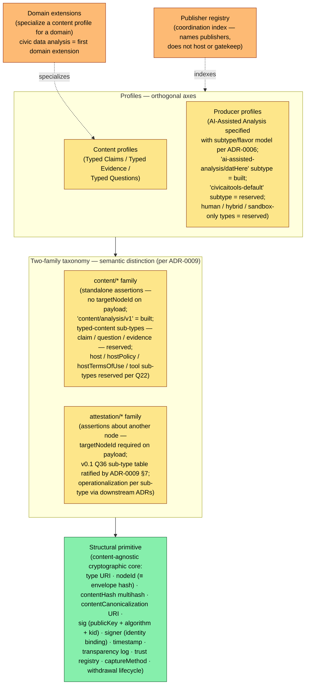
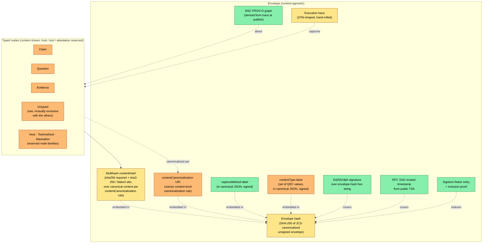
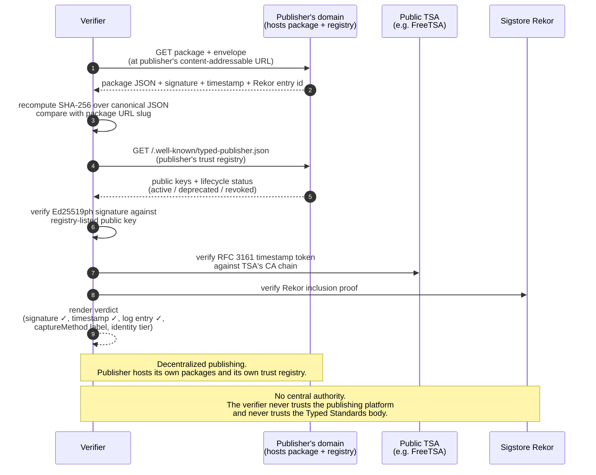
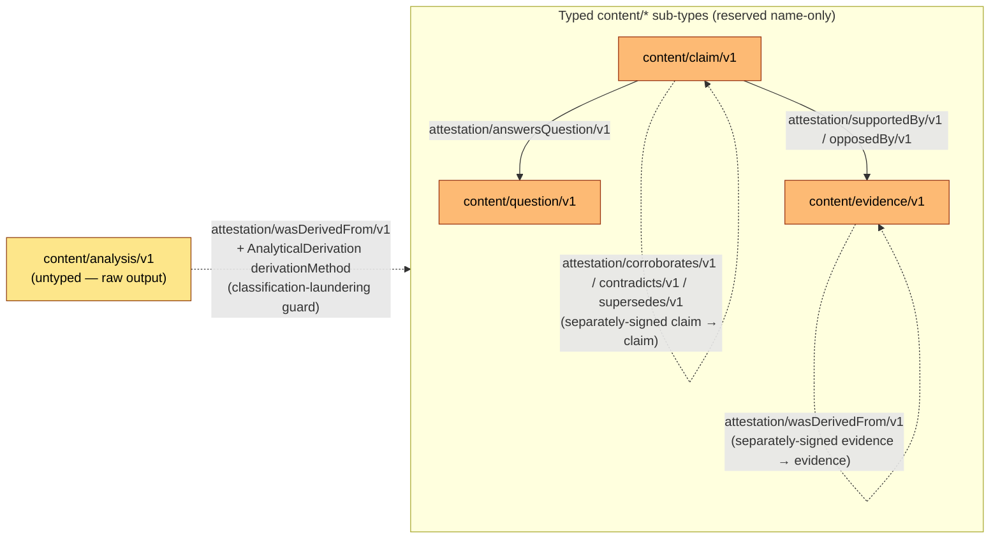

# Typed Standards Specification

**Abstract.** Typed Standards is a content-agnostic open standard for **production-process attestation** of analytical artifacts: a cryptographically signed, content-addressed, capture-method-labeled record of *how* an artifact was produced, verifiable by a third party who does not trust the publisher. The standard specifies a cryptographic envelope (Ed25519ph signature over RFC 8785 JCS-canonicalized JSON; RFC 3161 trusted timestamp from a public TSA; Sigstore Rekor inclusion proof; trust registry under the publisher's own well-known path), a typed-node taxonomy of standalone assertions (`content/*`) and assertions about other nodes (`attestation/*`), a signature-covered capture-method discipline, and an extensible content-profile mechanism. The standard is deliberately silent about truth, editorial policy, and topology: corroboration is not truth; the system surfaces signals, the consumer applies judgment.

This document consolidates the project's standards work — formerly the Open Evidence Standard (OES) at the envelope layer and the Civic Claim Vocabulary (CCV) at the typed-claims layer — under a single umbrella name and the `ts:` JSON-LD prefix, resolved to `https://typedstandards.org/ns/ts#`. The consolidation is recorded; the historical OES and CCV drafts remain in this directory as frozen snapshots for cross-reference accuracy.

---

## 2. Status of This Document

**Status:** v0.1 Working Draft — open for external review (review window to be scheduled)
**Spec name:** Typed Standards Specification
**Version:** v0.1
**License:** CC BY 4.0 (see §3; canonical citation form in Appendix A)
**Maintainer:** Nathan Storey (current; see reviewer-orientation document for stewardship and contact details)
**Canonical URL:** [TK: typedstandards.org/specs/v0.1/ once typedstandards.org is registered and the spec is published there]

This document is an open-for-external-review working draft of the Typed Standards Specification. The substantive specification has stabilized through the G1-G4 MVP cohort ; the OES + CCV consolidation into this single document is recorded. The v0.1 designation reflects that the specification is open for substantive external feedback; review-window dates and a comment-deadline are populated once initial conversations with reviewer organizations have set expectations. Until then, the specification lives at HEAD of `main`; reviewers cite against the consolidation-commit tag (`v0.2-typed-standards-rfc`) for stable reference.

Conformance language follows [RFC 2119](https://www.rfc-editor.org/rfc/rfc2119) keywords (MUST, MUST NOT, SHOULD, MAY) when applied to normative requirements. Every normative requirement in this document corresponds either to a check enforced in the reference implementation at `civic-ai-tools-website` code today or to a settled Architectural Decision Record in `civic-ai-tools/docs/adr/`. Where neither holds, the section is labeled with a callout pointing at the relevant open question in [`open-questions.md`](open-questions.md).

A snapshot of which sections are built / specified / reserved in the reference implementation appears in Appendix E. Open questions affecting the specification are tracked in [`open-questions.md`](open-questions.md) per the working method's "registry is the front door" discipline; the most load-bearing open question for v0.1 is [Q1](open-questions.md#q1--package-format) (package format), whose resolution determines whether offline verification — currently aspirational per §9 — becomes a property of conformant packages.

---

## 3. License

This specification is licensed under the **Creative Commons Attribution 4.0 International License (CC BY 4.0)**.

You are free to share and adapt this material for any purpose, including commercially, provided you give appropriate credit, provide a link to the license, and indicate if changes were made. Full license text: <https://creativecommons.org/licenses/by/4.0/>.

Citation conventions for this specification appear in Appendix A.

---

## 4. Table of Contents

1. Title block and abstract
2. Status of This Document
3. License
4. Table of Contents
5. Introduction
 - 5.1 Normative preamble
 - 5.2 The problem
 - 5.3 What Typed Standards is
 - 5.4 Project posture
 - 5.5 Relationship to adjacent standards
6. Conventions and Terminology
 - 6.1 Conformance keywords
 - 6.2 Glossary
 - 6.3 Disambiguated terms
7. Architecture
 - 7.1 Layered shape
 - 7.2 Envelope
 - 7.3 Verification flow
 - 7.4 Two-family taxonomy — one structural primitive, content/* and attestation/*
 - 7.5 The QEC sub-ontology within content/*
8. Normative specification
 - 8.1 Evidence package structure
 - 8.2 Canonical JSON, envelope hash, content hash
 - 8.3 Cryptographic envelope
 - 8.4 Trace capture
 - 8.5 Identity binding
 - 8.6 captureMethod
 - 8.7 Content profile: datHere
 - 8.8 Cross-host publication: commitment-view schema
 - 8.9 Embed-vs-reference policy
 - 8.10 Lifecycle and location attestations
 - 8.11 Typed Claims
 - 8.12 The attestation/* namespace
 - 8.13 Federation and discoverability
9. Conformance
10. Security Considerations
11. Privacy Considerations
12. IANA Considerations
13. Internationalization Considerations
14. References
 - 14.1 Normative References
 - 14.2 Informative References
15. Appendices
 - A. Citation conventions
 - B. Worked example: typed claim
 - C. Adjacent-standards comparison table
 - D. C2PA-to-Typed-Standards term-translation table
 - E. Implementation status snapshot (as of 2026-05-26)
 - F. Open questions pointer
 - G. Revision history
 - H. Related documents
 - I. Acknowledgments

---

## 5. Introduction

### 5.1 Normative preamble

Every product surface that renders signed nodes under this specification, every downstream consumer that processes them, every derived publication that cites them, and every third-party implementation of this specification MUST carry the following preamble or a clearly-equivalent statement, surfaced where readers will encounter it before forming conclusions about a node's content:

> **Corroboration ≠ truth.** Consensus can be wrong.
>
> **Contradiction ≠ falsity.** The heretic is sometimes right.
>
> **Identity strength ≠ topic authority.** A credentialed outsider can be wrong; a pseudonymous insider can be right.
>
> **The system surfaces signals; the consumer applies judgment.**

The intent is to prevent the architecture from drifting into automated truth-scoring — a regime that has historically gone badly (content moderation, credit scoring, citation metrics). Implementers MUST NOT use signed-node signals to compute platform-issued correctness verdicts, rank-by-trust scores, or any equivalent consensus collapse. Consumer-side aggregation (citation graphs, contradiction surfacing, meta-analysis) is permitted and encouraged, provided the preamble's framing accompanies the surfaced result.

This is the only normative requirement in this specification that is not enforced by code. **Enforcement of this requirement is currently editorial and reputational only.** No standards body, no certification regime, no audit, and no automated check exists today to verify that downstream implementations honor it. This is a v0.1 limitation. Future versions of the specification may define a stewardship process — a public consultation forum, a conformance self-attestation, or a reference test corpus — through which implementers demonstrate the preamble is surfaced. Until such a process exists, the requirement holds normatively, and breaches are addressed in conversation with the implementer rather than through enforcement infrastructure.

### 5.2 The problem

Trust in analytical claims today is mediated by brand. A reader who encounters a chart, a number, or a synthesis decides whether to believe it based on the institution behind it — investigative journalism, academic publishing, civic-data analysis from a government agency, consumer-rights research, regulatory submissions, audit work product. The artifact itself usually carries no machine-verifiable record of how it was produced.

This was workable while production was an implicit labor attestation. A serious data analysis took weeks of skilled work; the institution staking its name on it had presumably done that work. AI-assisted analysis breaks the implicit-labor-attestation assumption. The same chart that took an analyst a week can now be produced in minutes by a journalist with no statistical training, a community member with no institutional affiliation, or an adversary fabricating a plausible-looking story. Brand-mediated trust becomes increasingly orthogonal to whether the analysis is sound — and brands themselves are now consumers of AI-assisted production they cannot internally verify.

The specification's response is to make the **production process itself** the unit of attestation. Not "is this true," but "here is, in cryptographic detail, how this was produced — judge for yourself."

### 5.3 What Typed Standards is

Typed Standards is **opinionated about three things** and **deliberately silent about three others**.

**Opinionated about:**

1. **The envelope.** Every conformant package carries an Ed25519ph signature over a SHA-256 content-addressed canonical JSON, an RFC 3161 trusted timestamp from a public TSA, and an inclusion proof on a public transparency log (Sigstore Rekor). The signing key is bound to a published trust registry under the publisher's own well-known path.
2. **Capture-method discipline.** Every package declares, in a field covered by the canonical-JSON hash and therefore by the signature, *how* its content was captured. The label is structural and tamper-evident: a verifier can tell a verbatim wire-layer capture from a JSONL-layer readback from a paraphrased self-report. Future capture methods extend the vocabulary; the discipline holds.
3. **The typed-node ontology** *(specified; operationalization per sub-type via downstream ADRs).* Every conformant signed node is a signed envelope over a typed payload, drawn from **two top-level type families** that share a single structural primitive: **`content/*`** (standalone assertions; no `targetNodeId` on the payload — analyses, typed claims, questions, evidence records, host self-declarations, tool author declarations) and **`attestation/*`** (assertions about another node; `targetNodeId` required — lifecycle, reference, claim-to-claim, and authority-bearing relations). Hosts, tools, and certifying bodies fold in as sub-types of one of the two families per the [Q36](open-questions.md#q36--attestation-sub-type-collapse-regular-family-or-structured-hierarchy) ratified table — not as peer families (the prior four-families framing is demoted). Within `content/*`, the QEC sub-ontology — `metadata.contentType` set-valued across `claim` / `question` / `evidence` / `untyped` — is the most-developed sub-area today. Nodes can carry signatures from different parties — individuals, hosts, certifying bodies, third-party attesters — and these signatures layer rather than collapse into a single trust authority. A small relations vocabulary (`supportedBy`, `opposedBy`, `answersQuestion`, `corroborates`, `contradicts`, `supersedes`, `wasDerivedFrom`, etc.) is carried by `attestation/*` sub-types

The **normative preamble** (§5.1) applies across all three commitments and across every implementation: corroboration ≠ truth, contradiction ≠ falsity, identity strength ≠ topic authority, the system surfaces signals and the consumer applies judgment. The preamble is the architectural guardrail against drift toward automated truth-scoring; every product surface, downstream consumer, and third-party implementation MUST carry it.

**Deliberately silent about:**

1. **Truth.** The signature attests that the package was published and has not been altered. It does not attest that the content is correct. Editorial review, fact-checking, replication, and adversarial evaluation are *separately-signed attestations* carried in the network around the envelope, never enforced by it.
2. **Editorial policy.** Publishers set their own filters, audiences, and review processes. The standard does not gate publication on topic, viewpoint, or sign-off.
3. **Topology.** Publishers publish at their own domains. The standard does not require — and is structurally indifferent to — any central host, federation substrate, or coordination protocol beyond an optional indexing registry that does not host or gatekeep.

### 5.4 Project posture

- **Permissionless publishing.** Publishers publish at their own domains. An institutional publisher's domain is its sovereignty boundary; an independent publisher's domain is theirs. The standard specifies the envelope; it does not host content.
- **Indexing, not gatekeeping.** The reserved publisher registry indexes declared publishers — it does not approve them, host them, rank them, or vouch for their content. Inclusion is informational.
- **Graded identity surfaced, not computed.** Identity binding tiers (pseudonymous → OAuth-bound → academic-bound → institution-DNS-bound → notarized) are surfaced as signals consumers can filter on. The standard never computes a platform-issued trust verdict from them.
- **Don't build until an adopter needs it.** Project discipline per [`xanadu-doctrine.md`](xanadu-doctrine.md): items move from reserved → specified → built only when a real adopter or package concretely needs the change. This specification sketches reserved layers; it does not promote any of them. Promotions happen separately, with the motivating adopter named in the work that promotes the item.

### 5.5 Relationship to adjacent standards

Typed Standards occupies cryptographic-provenance terrain alongside several adjacent standards. Two of those — C2PA and W3C Verifiable Credentials — carry "claim" terminology that overlaps with Typed Standards' usage in ways that matter to first-impression reading. Those disambiguations appear inline in this section; smaller cosmetic disambiguations (project name vs. TypeScript / ISO/IEC TS document class; prefix choice vs. RFC 3161 TSS) appear in §6.3.

**Relationship to C2PA.** The Coalition for Content Provenance and Authenticity (C2PA) defines a cryptographic provenance standard for images, videos, and other media — capture-device authenticity, edit history, and signed assertions about media assets, serialized as COSE-signed JUMBF boxes. Typed Standards is structurally the same idea applied to a different artifact class: cryptographically signed records of how an *analytical* artifact was produced, serialized as JCS-canonicalized JSON. C2PA reads "claim" as a signed bundle of assertions over a media asset; "assertion" as a single typed statement inside that bundle; "manifest" as the signed package as a whole. Typed Standards reads "claim" in the W3C-PROV / Verifiable-Credentials sense — a single first-class signed assertion about a subject (`content/claim/v1`); "envelope" as the structural primitive that carries any signed node; and "attestation" as a separately-signed assertion about another node. The two specs are equivalent at the role level (both produce signed, content-addressed, transparency-logged records); they differ at the term level. Where this specification refers to C2PA constructs, it spells them as "C2PA claim" and "C2PA assertion" to keep the cross-spec vocabulary unambiguous. A C2PA-to-Typed-Standards term-translation table appears in Appendix D.

**Relationship to W3C Verifiable Credentials.** The W3C Verifiable Credentials Data Model is a general signed-claim format for credentials issued in a three-party (issuer / holder / verifier) ecosystem. A VC's "claim" is a property about a subject inside a credential (e.g., `dateOfBirth: 2010-01-01`); a "credential" is a set of such claims with the issuer's signature; a "presentation" is a holder's selective disclosure to a verifier. Typed Standards' "claim" (`content/claim/v1`) is closer in granularity to a complete VC than to a single VC claim: it is a standalone, separately-signed analytical assertion with its own envelope, provenance graph, confidence statement, and identity binding. The structures are JSON-LD compatible; a Typed Standards claim can in principle be expressed as a VC whose subject is the analytical artifact. The three-party VC model (issuer asserts about subject; holder presents to verifier) does not cleanly map to Typed Standards' publisher-and-verifier-only model. Where this specification refers to a property inside a VC credential, it uses "VC claim" explicitly; the unqualified term "claim" in this specification always means a Typed Standards `content/claim/v1` node.

**Comparison table.** A summary of Typed Standards' relationship to the broader cryptographic-provenance and signed-claim ecosystem appears below; an extended version with structural mapping notes appears in Appendix C.

| Standard / framework | Relationship to Typed Standards |
|---|---|
| **Discourse Graphs** | Source of the QEC pattern. Typed Standards adopts the claim-question-evidence content types and the `supportedBy` / `opposedBy` / `answersQuestion` relations with attribution to **Joel Chan** and the Discourse Graphs community. |
| **Nanopublications** | Closest semantic match for atomic signed claims with provenance. Nanopubs use an RDF-named-graph format for the assertion + provenance + publication info triplet. Typed Standards is envelope-first and content-addressable with capture-method discipline; consuming Typed Standards content as nanopublications is a plausible bridge but a separate effort. |
| **W3C PROV-O** | Used directly. Every package's provenance graph is PROV-O JSON-LD; the envelope does not redefine derivation, attribution, or generation. |
| **W3C Verifiable Credentials** | Adjacent. See disambiguation paragraph above. VC-over-MCP-tool-call receipts are a candidate trace-capture layer for the envelope's trace slot. |
| **Schema.org Claim / ClaimReview** | Different problem. Schema.org's fact-check vocabulary tags claims with human fact-check reviews. Typed Standards attests to *how the artifact was produced*, not whether a fact-checker endorsed it. The two can coexist. |
| **C2PA** | Closest structural analogue in a different domain. See disambiguation paragraph above. |
| **in-toto / DSSE** | Direct alignment at the structural level. Typed Standards adopts in-toto's multihash DigestSet convention and a predicate-type-URI pattern modeled on in-toto's `predicateType`. Divergence: in-toto attestations are consumed by automated policy engines; Typed Standards envelopes are consumed by readers exercising judgment. |
| **SLSA** | Adjacent but disjoint. SLSA Provenance is a specific in-toto predicate type for software builds. Typed Standards covers production-process attestation for analytical artifacts (charts, syntheses, claims). Conceptual alignment, different artifact class. |
| **Sigstore (Cosign, Fulcio, Rekor)** | Foundational infrastructure, not a competitor. Typed Standards uses Sigstore Rekor for transparency log inclusion per §8.3.2; Sigstore Fulcio keyless OIDC is a candidate identity tier per [Q3](open-questions.md#q3--first-non-github-identity-provider). |
| **RO-Crate / WRROC** | Candidate package container. The end-state direction for the package format is a multi-file directory with an RO-Crate / WRROC compatibility profile per [Q1](open-questions.md#q1--package-format). The cryptographic mechanics are independent of the container choice. |
| **DCAT / open-data catalogs** | Different layer. DCAT describes datasets for catalog discovery. Typed Standards describes *analyses produced from those datasets*; data-source references inside a package may cite DCAT-described datasets. |

---

## 6. Conventions and Terminology

### 6.1 Conformance keywords

Conformance language follows [RFC 2119](https://www.rfc-editor.org/rfc/rfc2119) keywords (MUST, MUST NOT, SHOULD, MAY) when applied to normative requirements. Every normative requirement in this document corresponds either to a check enforced in the reference implementation at `civic-ai-tools-website` code today or to a settled Architectural Decision Record in `civic-ai-tools/docs/adr/`. Where neither holds, the section is labeled with a callout pointing at the relevant open question in [`open-questions.md`](open-questions.md).

### 6.2 Glossary

Terms below are used with the meanings given. **Normative** terms have specific meaning when used in conformance language; **informative** terms are used descriptively.

- **Evidence package** *(normative)*: A signed node in the system, carrying the structural-primitive fields plus sub-type-specific payload fields. Today's reference implementation produces `content/analysis/v1` nodes (the default content sub-type — legacy and `datHere` shapes both map to it); the broader concept is "signed node." Identified by its envelope hash (see `nodeId`) and stored at a content-addressable URL. See §8.1 for structure.
- **Signed node** *(normative)*: Any conformant signed object in the system — a `content/*` node (standalone assertion; no `targetNodeId`) or an `attestation/*` node (assertion about another node; `targetNodeId` required).
- **`type`** *(normative)*: The URI declaring a signed node's family + sub-type. Required v0.1; pre-v0.1 packages are interpreted as `content/analysis/v1` by construction Form: `content/<noun>/v<N>` or `attestation/<verb>/v<N>`
- **`content/*` namespace** *(normative)*: The top-level type family for **standalone assertions** — nodes whose payloads do NOT carry `targetNodeId`. Sub-types include `content/analysis/v1` (built; default for AI-Assisted Analysis Producer Profile output), `content/claim/v1`, `content/question/v1`, `content/evidence/v1`, `content/host/v1`, `content/hostPolicy/v1`, `content/hostTermsOfUse/v1`, `content/tool/v1` (reserved name-only).
- **`attestation/*` namespace** *(normative)*: The top-level type family for **assertions about another node** — nodes whose payloads carry at least one `targetNodeId`. The v0.1 sub-type table — `attestation/withdraws/v1`, `attestation/reinstates/v1`, `attestation/supersedes/v1`, `attestation/publishes/v1`, `attestation/locatedAt/v1`, `attestation/corroborates/v1`, `attestation/contradicts/v1`, `attestation/endorses/v1`, `attestation/wasDerivedFrom/v1`, `attestation/answersQuestion/v1`, `attestation/supportedBy/v1`, `attestation/opposedBy/v1`, `attestation/certifies/v1`, `attestation/evaluates/v1`, `attestation/conforms/v1` — is ratified Operationalization per sub-type lands via downstream ADRs.
- **`nodeId`** *(normative)*: A signed node's stable identity in the system — the envelope hash, by construction. Derived (not a separately-stored field). `attestation/*` payloads carry `targetNodeId` referencing the target's `nodeId`. Verifier semantics: cross-check the recomputed envelope hash matches the URL slug, any stored envelope hash, and (for any referencing attestation) the `targetNodeId` field.
- **`signer`** *(normative)*: An object on the canonical JSON top level carrying identity binding for the party that signed the node — `bindingTier` (one of `pseudonymous`, `oauth`, `orcid`, `did-web`, `notarized` per the §8.5 graded identity ladder; extensible), `identifier` (provider-prefixed string), `displayName`, optional `verifiedAt`. Recommended v0.1; pre-v0.1 packages derive `signer` from the trust registry's `signerIdentity` entry for the envelope's `kid`. Distinct from the `sig` (signature envelope); the verifier MUST cross-check `sig.kid → trust-registry signerIdentity` against `signer.identifier`.
- **Content hash** *(normative)*: The multihash digest set fingerprinting the package's off-log content, canonicalized per the rule named in `contentCanonicalization`. Serialized as a JSON object keyed by lowercase algorithm name (e.g., `{"sha256": "...", "blake3": "..."}`); v0.1 vocabulary is `sha256` (required default), `sha3-256` (registered alternate), `blake3` (registered alternate). Embedded in the canonical JSON as the top-level `contentHash` field. pre-v0.1 packages emit a single SHA-256 hex string externally (URL slug + DB row) instead of an embedded field; verifiers interpret the legacy form as `{"sha256": <value>}`.
- **Envelope hash** *(normative)*: The SHA-256 hex digest of the [RFC 8785](https://www.rfc-editor.org/rfc/rfc8785) JSON Canonicalization Scheme (JCS) canonicalization of the unsigned envelope. The unsigned envelope is the canonical-JSON package object with the signature envelope removed. pre-v0.1 packages used Node.js `JSON.stringify` insertion-order serialization; verifiers handle them under that legacy rule.
- **Content canonicalization** *(normative)*: The URI naming the rule by which off-log content reduces to bytes that `contentHash` fingerprints. Carried as the top-level `contentCanonicalization` field on the canonical JSON; covered by the envelope hash and the platform signature. v0.1 reserved URIs: `https://typedstandards.org/canonicalization/dathere-ag-jupyter/v1` (datHere A-G/Jupyter content profile) and `https://typedstandards.org/canonicalization/legacy-json/v1` (legacy default content profile).
- **Signed envelope** *(normative)*: The envelope-hash hex string, signed with Ed25519ph by a key in the trust registry. The envelope JSON object stored alongside the package also carries `publicKey`, `algorithm`, and `kid` fields for verifier convenience; signature math binds only the hash bytes. The envelope hash is computed over the JCS canonicalization of the unsigned envelope; pre-v0.1 packages used `JSON.stringify` insertion-order canonicalization, and verifiers handle them under that legacy rule.
- **Trust registry** *(normative)*: The JSON document at `${baseUrl}/.well-known/typed-publisher.json` that lists authorized signing keys with lifecycle metadata. Reference implementations SHOULD also serve the same JSON at the legacy path `${baseUrl}/.well-known/evidence-public-keys.json` for backwards-compatibility with pre-v0.1 fetchers. See §8.3.3.
- **`kid` (key identifier)** *(normative)*: A stable string identifying a signing key (e.g. `platform:evidence-2026-04`), present in both the signed envelope and the trust registry. The `kid` is part of the canonical package JSON via `metadata.signingKeyId`, so it is covered by the envelope hash and therefore by the platform signature.
- **BlobRef** *(normative)*: A four-field JSON object `{ ref, url, contentType, size }` that names a content-addressable Vercel Blob (or equivalent content-addressable storage) in place of inline content for selected fields. See §8.1.5.
- **`captureMethod`** *(normative)*: The label identifying *how* the package's content was captured — the integrity-of-pipeline property. The field is required, signed, and tamper-evident. Its **value space is open at the core level**; the vocabulary of valid values is declared by the package's `producerProfile`'s guidance bundle. For the `ai-assisted-analysis` Producer Profile, the v0.1 vocabulary is `chat-flow-stream`, `claude-code-jsonl-readback`, `claude-code-self-report` — the three values originally enumerated in core by ADR-0003 and relocated to this profile's guidance bundle. See §8.6.
- **`contentProfile`** *(normative)*: The label identifying *what shape* the package's content is in — the content-shape property. Orthogonal to `captureMethod`. Values: `"default"` (legacy shape; absence treated as default) or `"datHere"` (A-G envelope content profile per §8.7). See §8.1 and §8.7.
- **`producerProfile`** *(normative)*: The Producer Profile the package conforms to. Compound-string value of the form `<profile-type>/<profile-subtype>`. v0.1 vocabulary includes `"ai-assisted-analysis/datHere"` (first realized subtype; refactor of the `datHere` content profile). Other profile types (`human`, `hybrid`, `sandbox-only`) and subtypes are reserved name-only. Consistency invariant: `contentProfile === "datHere"` iff `producerProfile.startsWith("ai-assisted-analysis/datHere")`.
- **Trace** *(informative)*: An OpenTelemetry-shaped JSON object (or BlobRef) describing the spans of the analysis. See §8.4.
- **PROV-O graph** *(informative)*: A W3C PROV-O JSON-LD graph derived from the trace at publish time. See §8.1.4.
- **Withdrawal / reinstatement** *(normative)*: Signed, public, append-only lifecycle events on a published node, expressed as separately-signed `attestation/withdraws/v1` / `attestation/reinstates/v1` nodes referencing the target by `nodeId`. See §8.10.
- **Verifier** *(informative)*: Any party performing the checks described in §9 against a fetched node.

A broader vocabulary covering the surrounding architectural standards (PROV-O, Croissant, RO-Crate, atproto, KOI, nanopublications, etc.) is defined in [`end-state-vision.md`](end-state-vision.md) Glossary and not duplicated here.

### 6.3 Disambiguated terms

**Project name.** "Typed Standards" is unrelated to TypeScript (the Microsoft-stewarded typed superset of JavaScript) or to the `.ts` / `.tsx` file extensions. The `ts:` JSON-LD prefix resolves to `https://typedstandards.org/ns/ts#`; it does not refer to TypeScript types, type-definition files, or the ECMA-262 / TC39 ecosystem. Separately, ISO/IEC and W3C use "TS" as a document-class abbreviation in publication identifiers (e.g., `ISO/IEC TS 22237`, `W3C TS-…`); a "Typed Standards specification" is a project name in this specification's sense, not an ISO/IEC or W3C document-class marker.

**Prefix choice — relationship to RFC 3161 timestamping.** This specification uses RFC 3161 trusted timestamps as a cryptographic-envelope component (§8.3.2). The shorthand "TSS" is sometimes used in the timestamping literature for "Time-Stamping Server" or "Time-Stamping Service" — a different concept (an external service that issues `TimeStampToken`s) from "Typed Standards." This specification reserves "Typed Standards" and the `ts:` prefix for the project itself, and uses the spelled-out terms "Time-Stamping Authority (TSA)" and "TimeStampToken (TST)" per RFC 3161 §1 for the timestamping subsystem to keep the two concepts unambiguous. The `tss:` prefix was considered and rejected on these grounds.

---

## 7. Architecture

### 7.1 Layered shape

The layered shape the umbrella sits over. Color encoding follows the convention in [`end-state-vision.md`](end-state-vision.md): **green = built**, **yellow = partial**, **orange = reserved (designed but not implemented; or proposed in this document and not yet in the existing drafts)**.



**How to read.** The structural primitive is the layer with most implementation today — it is the bulk of what the existing OES specifies plus the small additions the structural primitive introduces (`type` URI field, `signer` identity-binding object, formal articulation that `nodeId` ≡ envelope hash, verifier cross-check rules for `sig.kid` ↔ `signer.identifier`). The two-family taxonomy — `content/*` (standalone assertions) and `attestation/*` (assertions about another node identified by `nodeId`) — is specified over the same structural primitive, demoting the prior four-families-as-peers framing (content / hosts / tools / attestations) to two families plus the [Q36](open-questions.md#q36--attestation-sub-type-collapse-regular-family-or-structured-hierarchy) sub-type table; hosts, tools, and certifying bodies fold in as sub-types of one of the two families rather than peer families. `content/analysis/v1` is the first built `content/*` sub-type (the legacy and `datHere` shapes both map to it); the other `content/*` sub-types (`content/claim/v1`, `content/question/v1`, `content/evidence/v1`, and the host / tool sub-types) are reserved. The `attestation/*` sub-type taxonomy is specified (the Q36 ratified table); operationalization per sub-type (the withdrawal-lifecycle implementation, the location-as-attestation implementation, the publication-record flow, the adversarial-eval requirement model) lands via downstream ADRs from the Pittsburgh-arc cohort. Content profiles (typed-content carriers — Typed Claims / Typed Evidence / Typed Questions) are partially built: the Typed Claims Profile is drafted (§8.11), the other two reserved name-only; under the two-family framing they are `content/*` sub-types. Producer profiles moved from reserved to **specified**: the AI-Assisted Analysis Producer Profile is the first one drafted, with a subtype/flavor model so different adopters' conventions are filterable (visualization stack, citation format, entity normalization, synthesis style, confidence-scoring methodology live in subtype-specific guidance bundles rather than in the envelope). The `ai-assisted-analysis/datHere` subtype is the first built realization. Future profile types (`human`, `hybrid`, `sandbox-only`) and subtypes are reserved name-only; each lands in its own ADR with the motivating adopter named. Domain extensions specialize a content profile for a domain; civic data analysis (Neighborhood Tabulation Areas, community districts, the rest of the civic-scope taxonomy) is the first domain extension.

### 7.2 Envelope

The envelope mechanics are content-agnostic; the content slot is swappable per content profile. Canonicalization comes in two kinds: **envelope-level** canonicalization is a single fixed rule (RFC 8785 JCS) committed to by the spec; **content-level** canonicalization legitimately varies per content shape and is named by the envelope's `contentCanonicalization` URI field. The envelope-hash (SHA-256 over JCS-canonicalized unsigned envelope) is what the signature covers; the multihash `contentHash` field fingerprints the off-log content per the named rule and is itself embedded in (and therefore covered by) the envelope.



Today the content slot carries an AI-assisted civic-data analysis (prompt, queries, outputs, costs, skill metadata, optional notebook under the `datHere` content profile). The proposed restructure treats that content as **a set of typed content blocks**, with a new `metadata.contentType` field carrying the set of QEC values present — drawn from `claim`, `question`, `evidence`, or `untyped`. The most common shape is `["claim"]`; a claim that explicitly carries the question it answers is `["claim", "question"]`; raw assistant output not yet processed against any content profile is `["untyped"]`. `untyped` is mutually exclusive with the typed values. Per-block requirements (provenance, confidence, scope, AnalyticalDerivation for claims) do not relax when the set has more than one member — a multi-type package is several conformant typed blocks side-by-side, not a looser format. The envelope's hash, signature, timestamp, transparency-log entry, capture-method label, contentType label, contentCanonicalization URI, multihash content hash, provenance graph, and trace bind whatever typed node is inside; the envelope mechanics do not change when the node type or content shape changes (host, tool/method, and attestation node families are reserved alongside the content family). Different content shapes vary the `contentCanonicalization` URI; the envelope-level JCS commitment is invariant.

### 7.3 Verification flow

A verifier can complete every check using only public infrastructure plus the publisher's own trust registry. No central authority is required, and no `typedstandards.org` lookup appears in the verification path.



**The decentralized-publishing / central-indexing split.** Each publisher hosts its own packages and serves its own trust registry at a well-known path on its own domain. The reserved publisher registry at `typedstandards.org` indexes declared publishers (a directory function) but is not in the verification path: a verifier never queries `typedstandards.org` to verify a package, and the index has no authority to vouch for or reject any publisher's content. This is the deliberate inversion of the brand-mediated-trust model: trust is in the cryptography and the publisher's identity binding, not in the standards body or any host.

> **What's reserved vs. what's built in this flow.** The trust-registry well-known path shown above — `/.well-known/typed-publisher.json` — is the canonical v0.1 path; reference implementations SHOULD also serve the same JSON at the legacy path `/.well-known/evidence-public-keys.json` for backwards-compatibility with pre-v0.1 fetchers (parallel-serve indefinitely; no forced cutover). Today's verification flow also depends on a server-composed verify endpoint to assemble the signature envelope, RFC 3161 token, and Rekor proof from a database row, because the current single-blob package shape does not embed those proofs ([Q1](open-questions.md#q1--package-format)). Offline verification — package alone plus the publisher's trust registry plus the TSA and Rekor — is the **target end-state**, not yet a property; honestly aspirational.

### 7.4 Two-family taxonomy — one structural primitive, content/* and attestation/*

> **.** This section reflects the unified typed-attestation primitive ratified 2026-05-25: one structural envelope underlies every signed node in the system; two top-level type families (`content/*` and `attestation/*`) sit over the primitive; sub-types are flat-namespace registered URIs per the [Q36](open-questions.md#q36--attestation-sub-type-collapse-regular-family-or-structured-hierarchy) ratified table. The earlier framing (four families — content / hosts / tools-methods / attestations — as peers) is demoted: hosts, tools, and certifying bodies fold into sub-types of one of the two families, not as peer families. The QEC content sub-ontology (claim / question / evidence / untyped) is preserved as the most-developed `content/*` sub-area today; host, tool, and attestation sub-type operationalization is per-sub-type via downstream ADRs.

**The structural primitive.** Every conformant signed node is a signed envelope over a typed payload, carrying the structural-primitive fields specified: a `type` URI (identifying the node's family + sub-type), a derived `nodeId` (the envelope hash by construction), a multihash `contentHash` (fingerprinting the off-log payload), a `contentCanonicalization` URI (naming the off-log content's canonicalization rule), a signature envelope (`sig` per §8.3.1 — public key + algorithm + kid), a `signer` object (identity binding), an RFC 3161 timestamp, a Sigstore Rekor inclusion proof, and the `metadata` object. Sub-type-specific payload fields live alongside the primitive at the canonical-JSON top level (for `content/analysis/v1`, that means `prompt` / `queries` / `output` / `trace` / etc.; for `attestation/*` sub-types, that means `targetNodeId` plus sub-type-specific fields).

**Two top-level type families.** Every conformant signed node belongs to exactly one of two families, distinguished by the `type` URI's first path segment:

- **`content/*`** — *standalone assertion.* The node asserts something the signer takes responsibility for (an analysis, a typed claim, a question, an evidence record, a host's own identity, a tool author's tool declaration). It does NOT carry `targetNodeId` on its payload; it MAY cite or reference other nodes via PROV-O-style `wasDerivedFrom` provenance, but those references are upstream provenance, not the assertion's subject.

- **`attestation/*`** — *assertion about another node.* The node carries at least one `targetNodeId` referencing the node it asserts about. It does not stand alone — without its target the assertion has no subject. Sub-types cover lifecycle (withdraws / reinstates / supersedes / publishes), reference (locatedAt / wasDerivedFrom / answersQuestion / supportedBy / opposedBy), claim-to-claim (corroborates / contradicts / endorses), and authority-bearing (certifies / evaluates / conforms) relations.

The presence (or absence) of `targetNodeId` on the payload is the structural rule that decides which family a node belongs to. Hosts are not a separate family — host self-declarations are `content/host/v1` or `content/hostPolicy/v1` (the host is asserting something about itself, no other node referenced); host endorsements of others' content are `attestation/endorses/v1`. Tools / certifying bodies are not a separate family — a tool author's declaration is `content/tool/v1`; a certifying body's attestation about that tool is `attestation/certifies/v1`.

**Sub-type URI format.** Sub-type URIs use the form `content/<noun>/v<N>` for `content/*` sub-types and `attestation/<verb>/v<N>` for `attestation/*` sub-types. Sub-types are an open enum; new sub-types arrive via subsequent ADRs that name the motivating adopter per the Xanadu doctrine. The registry mechanism (how sub-type URIs are documented, versioned, mirrored, deprecated, governed across implementations) stays Xanadu-gated per [Q37](open-questions.md#q37--type-registry-mechanism-and-governance-for-the-content-and-attestation-namespaces) — specifying the registry mechanism prematurely is the foundational-layer version of the over-design the Xanadu doctrine exists to prevent.

**Q36 ratified sub-type table.** The v0.1 attestation sub-type table — `attestation/withdraws/v1`, `attestation/reinstates/v1`, `attestation/supersedes/v1`, `attestation/publishes/v1`, `attestation/locatedAt/v1`, `attestation/corroborates/v1`, `attestation/contradicts/v1`, `attestation/endorses/v1`, `attestation/wasDerivedFrom/v1`, `attestation/answersQuestion/v1`, `attestation/supportedBy/v1`, `attestation/opposedBy/v1`, `attestation/certifies/v1`, `attestation/evaluates/v1`, `attestation/conforms/v1` — is ratified with three explicit refinements: `extractsTo` merges into `wasDerivedFrom` (with `AnalyticalDerivation` as the content-shape variant when source is untyped and target is typed); `endorses` and `corroborates` stay distinct sub-types (peer attestation vs. institutional endorsement carries meaningfully different signal); and Q38 resolves with `locatedAt` suffices, no `copyOf` sub-type. Each sub-type declares its authorization rule (`publisher-only`, `any-with-binding`, or `specific-role-required`) and its payload shape; the full table lives and §8.12 of this specification. Corresponding ratified `content/*` sub-types are `content/analysis/v1` (built — the legacy and datHere content shapes both map to it), `content/claim/v1` / `content/question/v1` / `content/evidence/v1` (reserved name-only — promotion gated on first typed-content producer), `content/host/v1` / `content/hostPolicy/v1` / `content/hostTermsOfUse/v1` (reserved name-only per [Q22](open-questions.md#q22--host-as-typeable-subject--host-self-attestation-shape)), and `content/tool/v1` (reserved name-only).

**Layered signatures across typed nodes.** A package's nodes may carry signatures from different parties at different scopes — the producer who created the `content/*` node, a host that endorses it via `attestation/endorses/v1`, a certifying body that attests to a tool's conformance via `attestation/certifies/v1`, third parties that corroborate or contradict via `attestation/corroborates/v1` / `attestation/contradicts/v1`. These signatures **layer** rather than collapse: a verifier sees who signed what and at what scope, never a single composite verdict. The specification specifies how multiple signers and node types compose verifiably without forcing a single trust authority — and the `signer.identifier` ↔ `sig.kid → trust-registry signerIdentity` cross-check makes the layering tamper-evident at the verifier level.

### 7.5 The QEC sub-ontology within content/*

Within the `content/*` family, the QEC sub-ontology specifies the typed-content sub-types — `content/claim/v1`, `content/question/v1`, `content/evidence/v1` — alongside `content/analysis/v1` (the default for AI-Assisted Analysis Producer Profile output,). A `content/analysis/v1` node's `metadata.contentType` is a set drawn from four values:

- `claim` — one or more conformant claims (assertions the producer is making)
- `question` — one or more conformant questions (asked but not-yet-answered queries)
- `evidence` — one or more conformant evidence records (captured observations or analytical artifacts)
- `untyped` — the envelope is valid, but the content has not been processed against any content profile yet (raw output pending extraction)

`untyped` is **mutually exclusive** with the typed values. There is no `mixed` value; multiplicity is expressed by the set having more than one member. When `contentType` has more than one member, the `content` field carries an array of individually-typed blocks, each conformant to its profile and each retaining its own provenance, confidence, scope, and AnalyticalDerivation (for claims). The AI-Assisted Analysis Producer Profile output is `content/analysis/v1` with `metadata.contentType: ["untyped"]`; subsequent typed-content extraction produces separately-signed `content/claim/v1` / `content/question/v1` / `content/evidence/v1` nodes referencing the source `content/analysis/v1` via `attestation/wasDerivedFrom/v1` (see below).

Relations among typed-content sub-types and the untyped source draw from the small set the `attestation/*` family already provides, plus the structural-primitive references inside `content/*` nodes.



**Attribution.** The QEC pattern — claim, question, evidence as the three first-class content types of a discourse representation — is from **Joel Chan's Discourse Graphs work**. The Discourse Graphs community has developed and used QEC for several years as a structural representation of scholarly discourse. Typed Standards' adoption is structurally similar: QEC nodes are `content/*` sub-types; relations among them are separately-signed `attestation/*` nodes between content-addressed packages. The relations vocabulary is intentionally minimal — `wasDerivedFrom` is inherited from W3C PROV-O; `supportedBy` / `opposedBy` are the QEC primitives; `answersQuestion` ties a claim back to a question; `corroborates` / `contradicts` carry the existing claim-to-claim relations forward; `supersedes` carries claim versioning; all of them are `attestation/*` sub-types Domain extensions and producer profiles add domain-specific relations on top; the small core holds.

**Untyped → typed is an attested extraction step.** Processing an `untyped` `content/analysis/v1` node into typed content (`content/claim/v1` / `content/question/v1` / `content/evidence/v1`) is itself a first-class analytical step that MUST be attested via a separately-signed `attestation/wasDerivedFrom/v1` node. The attestation's `targetNodeId` points at the source untyped node, and its `derivationMethod` MUST carry an `AnalyticalDerivation` describing the extraction (which model or process performed the classification, against what prompt, over which source span) per the refinement (a) MUST-carry rule. The rationale is the **classification-laundering guard**: unstructured output silently typed loses the audit trail, and the precision of the resulting types is then mistaken for the precision of the underlying analysis. `untyped` is the *input type to an attested extraction operation*, not a passive dumping ground.

---

## 8. Normative specification

### 8.1 Evidence package structure

A conformant evidence package is a single JSON object whose canonical-JSON serialization is the input to the SHA-256 envelope hash.

> ⚠ **Subject to [Q1](open-questions.md#q1--package-format) — package format.** The current implementation is a single canonical JSON object plus a database-resident envelope. The current direction is a multi-file directory with an RO-Crate / WRROC compatibility profile, in which the canonical JSON object would become one artifact in a larger package. This v0.1 normalizes the single-blob form because that is what the publish path produces today; this section will be revised when the format decision lands.

#### 8.1.1 Top-level fields

A conformant evidence package MUST carry every field in the following list. Fields marked optional MAY be omitted; when present, they MUST conform to the type given.

| Field | Type | Required | Description |
|---|---|---|---|
| `metadata` | object | yes | See §8.1.2. |
| `prompt` | object | yes | See §8.1.3. |
| `queries` | array of objects | yes | One entry per tool call observed during the analysis. May be empty when the analysis made no tool calls. |
| `dataSources` | array of objects | yes | One entry per data source touched by the analysis, derived from `queries[]` and the trace. May be empty when `queries[]` is empty. |
| `cost` | object | yes | Token-usage and timing summary. See §8.1.7. |
| `skillMetadata` | object | yes | Skill-guidance hash, MCP server URL, and skill text or BlobRef. |
| `output` | string \| BlobRef | yes | The assistant's final response text, or a BlobRef. See §8.1.5. |
| `trace` | object \| BlobRef | yes | OpenTelemetry-shaped trace, or a BlobRef to the same. |
| `summary` | string | optional | Short, indexable, citation-ready summary of the analysis. Required when `metadata.contentProfile == "datHere"` (see §8.7). When present, part of canonical JSON and therefore covered by the envelope hash and signature. |
| `contentProfile` | string | optional | The content profile the package conforms to. Values: `"default"` (legacy shape; absence treated as default) or `"datHere"` (A-G envelope content profile per §8.7). Orthogonal to `captureMethod`. Extensible — future profiles add ADRs. **Retained as legacy alias v0.1**: v0.1 packages emit both `contentProfile` and `producerProfile`; verifiers SHOULD prefer `producerProfile` when present; the two MUST be consistent (see `producerProfile` row below). |
| `producerProfile` | string | optional | The Producer Profile the package conforms to. Compound-string value of the form `<profile-type>/<profile-subtype>`. v0.1 vocabulary includes `"ai-assisted-analysis/datHere"`. Other profile types (`human`, `hybrid`, `sandbox-only`) and subtypes are reserved name-only. Consistency invariant: `contentProfile === "datHere"` iff `producerProfile.startsWith("ai-assisted-analysis/datHere")`. |
| `contentHash` | object | yes (v0.1) | Multihash digest set fingerprinting the package's off-log content, canonicalized per the rule named in `contentCanonicalization`. Object keyed by lowercase algorithm name (`sha256`, `sha3-256`, `blake3`) with hex digest values; at least one entry required, `sha256` required by default. Verifier semantics: at-least-one-match pre-v0.1 packages omit the field; the legacy single-SHA-256 hash lives externally (URL slug + DB row) and is interpreted as `contentHash: {"sha256": <legacy hex>}` at verify time. |
| `contentCanonicalization` | string (URI) | recommended (v0.1) | URI naming the canonicalization rule by which off-log content reduces to bytes that `contentHash` fingerprints. v0.1 reserved values: `https://typedstandards.org/canonicalization/dathere-ag-jupyter/v1` and `https://typedstandards.org/canonicalization/legacy-json/v1`. Resolution semantics out of scope (URI is an identifier, not a fetch target); verifiers resolve via a local rule registry pre-v0.1 packages omit the field; verifiers infer the rule from `contentProfile` / `producerProfile` |
| `type` | string (URI) | yes (v0.1) | The node's family + sub-type identifier per the two-family taxonomy. Form: `content/<noun>/v<N>` or `attestation/<verb>/v<N>` pre-v0.1 packages omit the field and are interpreted as `content/analysis/v1` |
| `signer` | object | recommended (v0.1) | Identity binding for the party that signed the node. Fields: `bindingTier` (required), `identifier` (required; provider-prefixed string), `displayName` (required), `verifiedAt` (optional; ISO-8601). Distinct from the `sig` envelope (publicKey + algorithm + kid per §8.3.1); verifier MUST cross-check that `sig.kid` resolves via the trust registry's `signerIdentity` to the same identity `signer.identifier` claims, |
| `targetNodeId` | string | conditional | Required for `attestation/*` nodes (the node referenced by the attestation); MUST NOT appear on `content/*` nodes. Some `attestation/*` sub-types carry multiple target references — see for per-sub-type payload shape. |
| `provenance` | object | optional | W3C PROV-O JSON-LD graph derived from `trace` at publish time. Present when the trace was inspectable inline; omitted when `trace` is a BlobRef and no override is supplied. |
| `extensions` | object | optional | Reverse-DNS-keyed implementation-specific artifacts (e.g. `org.civicaitools.notebook`, `org.civicaitools.environment`). Included in the canonical JSON and therefore covered by the envelope hash. |

#### 8.1.2 `metadata` object

| Field | Type | Required | Description |
|---|---|---|---|
| `schemaVersion` | string | yes | Currently `0.1.0`. |
| `packageId` | string (UUID) | yes | A UUID generated at publish time. Distinct from the envelope hash. |
| `createdAt` | string (ISO 8601) | yes | UTC timestamp set at packager time. |
| `signingKeyId` | string | yes | The `kid` of the signing key. Present in the canonical JSON; therefore covered by the envelope hash. |
| `captureMethod` | string | yes (v0.1) | A value in the captureMethod vocabulary of the package's `producerProfile`'s guidance bundle. For the `ai-assisted-analysis` Producer Profile (the v0.1 default), the vocabulary is `chat-flow-stream`, `claude-code-jsonl-readback`, `claude-code-self-report`. Required at the publish route since 2026-04-29. pre-v0.1 packages persist with a `null` capture method on the database row and render with an "Unknown (pre-v0.1)" label. |

#### 8.1.3 `prompt` object

| Field | Type | Required | Description |
|---|---|---|---|
| `hash` | string (hex) | yes | SHA-256 hex digest of the prompt text. |
| `visibility` | string | yes | One of `full_text` or `hash_only`. Enforced at the publish route. |
| `text` | string | conditional | The prompt text in clear, present iff `visibility == "full_text"`. MUST be omitted when `visibility == "hash_only"`. |

#### 8.1.4 `provenance` object (informative on shape)

When present, `provenance` is a W3C PROV-O JSON-LD graph with `@context` mapping the `prov`, `xsd`, `civic`, and `dcterms` prefixes, and an `@graph` array of typed entities, activities, and agents derived from the trace. The graph reflects per-source attribution: each MCP server appears as a `prov:Agent` with a `civic:sourceId`, and each data response is a `prov:Entity` tagged with the same `civic:sourceId`. Skill guidance, the LLM model, and the platform are also represented as agents. The platform is `urn:civic-evidence:platform:civic-ai-tools`.

The `civic:` prefix in existing PROV-O graphs predates the consolidation; new packages MAY emit `ts:` in place of `civic:`, but the `civic:` prefix in already-published packages remains valid (vocabulary URIs are identifiers, not fetch targets, and a future migration is gated on adopter need per [Q10](open-questions.md#q10--civic-claim-vocabulary-as-a-full-ontology) / the OWL ontology promotion).

The provenance graph is deterministically derivable from `trace` at the time of packaging. A verifier MAY recompute and compare; the field exists primarily for downstream consumption rather than as a separate verification primitive.

#### 8.1.5 BlobRef substitution

The fields `output`, `trace`, and `skillMetadata.skillText` MAY be supplied as a BlobRef in place of inline content. A BlobRef is the JSON object:

```json
{
 "ref": "blob:sha256:<64-hex-char SHA-256 of the content bytes>",
 "url": "https://<store>.public.blob.vercel-storage.com/evidence-refs/<hash>.<ext>",
 "contentType": "text/markdown",
 "size": 4194304
}
```

A verifier encountering a BlobRef MUST:

1. Fetch the URL over HTTPS without authentication.
2. Recompute SHA-256 over the fetched bytes; the result MUST equal the hex part of `ref`.
3. Confirm the fetched byte length equals `size`.

A BlobRef whose fetch fails, whose hash mismatches, or whose size mismatches MUST cause the verifier to report `ok: false` for that reference. A package MAY remain otherwise verifiable when one of its BlobRefs fails, but downstream consumers SHOULD treat a package with a failed BlobRef as missing the corresponding content.

**Relationship to `attestation/locatedAt/v1` (v0.1).** BlobRef is the **single-signer implicit case** of location-as-attestation framing. The verification mechanics are structurally identical: a verifier fetches a URI, recomputes a content hash over the fetched bytes, compares against the signed fingerprint, and confirms size. The differences are placement and signing surface:

- **BlobRef** is an in-envelope four-field shape on a `content/*` node's sub-content fields. The parent node's signature covers the BlobRef object as part of its canonical JSON, so the publisher *implicitly* asserts "this sub-content lives at this URL with this fingerprint and this size" as part of their own signed package. The assertion piggybacks on the parent node's signature.
- **`attestation/locatedAt/v1`** is a separately-signed envelope with its own `nodeId`, signer, timestamp, and (optionally) Rekor inclusion proof. It can be emitted later than the target content node, by parties other than the target's publisher, and references the target by `nodeId` rather than living inside it. Multiple `locatedAt` attestations from different `(signer.identifier, uri-authority)` pairs express durable independent copies

BlobRef-shaped sub-content references remain conformant under v0.1 for in-envelope use. New cross-host location declarations made by parties other than the parent node's signer SHOULD use `attestation/locatedAt/v1` instead of BlobRef.

> ⚠ **Subject to [Q2](open-questions.md#q2--federation-substrate) — federation substrate.** BlobRef URLs in the reference implementation point at the deployment's Vercel Blob storage. Generalizing to multi-host or multi-registry blob storage — including content-addressable storage that does not require an HTTPS-fetchable URL at all (e.g. IPFS-style addressing) — depends on which federation substrate Q2 selects. The `attestation/locatedAt/v1` framing is the natural carrier for cross-host or federation-substrate-native location declarations once Q2 resolves.

#### 8.1.6 `extensions` (optional)

Implementations MAY add fields under `extensions` keyed by reverse-DNS identifiers (`org.civicaitools.notebook`, `org.civicaitools.environment`, `org.<your-domain>.<your-extension>`). All extension content is part of the canonical JSON and is therefore covered by the envelope hash and the platform signature. Extensions are advisory — they MUST NOT change the meaning of fields defined in this specification, and a verifier MAY ignore unknown extensions without breaking conformance.

The `org.civicaitools.notebook` extension is a content-format marker (a Jupyter-style cell list) emitted by the canonical reference implementation. Under `contentProfile: datHere`, this extension is promoted from informative to normatively required and carries the deterministic notebook of section E (see §8.7).

The `org.civicaitools.environment` extension carries environment metadata (model version, temperature, sampling parameters, tool definitions, publishing-host identifier) required by the `datHere` content profile. See §8.7 for its required shape.

#### 8.1.7 `cost` object framing

The `cost` object's current schema (`promptTokens`, `completionTokens`, `totalTokens`, `model`, `durationMs`) is AI-LLM-specific. It presupposes that the analysis was produced by a token-billed language model.

> ⚠ **Subject to [Q7](open-questions.md#q7--producer-type-scope) — producer-type scope** and [Q9](open-questions.md#q9--ai-specific-commitments-and-producer-type-generalization) (AI-specific commitments inventory). The `cost` object's schema is currently AI-specific. If Q7 resolves toward generalization to human-authored or hybrid-authored packages, this object will need a producer-type-aware shape (human time, compute time, third-party API costs, etc.) per the pattern. The current shape stays normative for AI-produced packages in v0.1; downstream generalization will land as its own ADR when an adopter blocks.

### 8.2 Canonical JSON, the envelope hash, and the content hash

Canonicalization comes in two kinds,:

- **Envelope-level canonicalization** is a single fixed rule committed to by the spec. Every package's unsigned envelope (the canonical-JSON evidence package object with the signature envelope removed) is canonicalized via [RFC 8785 JSON Canonicalization Scheme (JCS)](https://www.rfc-editor.org/rfc/rfc8785) to produce envelope bytes. The **envelope hash** is the SHA-256 hex digest of those JCS bytes. This rule applies to every envelope shape; there is no envelope-level URI.
- **Content-level canonicalization** varies per content shape. Off-log content (whatever the package's `contentHash` fingerprints) is canonicalized per the rule named by the package's `contentCanonicalization` field (§8.1.1). The **content hash** is the multihash digest set fingerprinting those canonicalized bytes — an object keyed by lowercase algorithm name (`sha256` required default, `sha3-256` + `blake3` registered alternates). v0.1 reserved canonicalization-rule URIs are `https://typedstandards.org/canonicalization/dathere-ag-jupyter/v1` (datHere A-G/Jupyter) and `https://typedstandards.org/canonicalization/legacy-json/v1` (legacy default).

The two rules are nested:

1. Off-log content → `contentCanonicalization` rule → bytes → multihash → `contentHash` field embedded in the envelope.
2. Unsigned envelope (containing `contentHash`, `contentCanonicalization`, and the other top-level fields) → RFC 8785 JCS → bytes → SHA-256 → envelope hash.
3. The envelope hash hex string is what the platform Ed25519ph signature covers (§8.3.1).

Because the signature covers the envelope JCS bytes, and the envelope contains `contentHash` and `contentCanonicalization`, both the off-log content's fingerprint AND the rule by which it was canonicalized are signature-covered. A bad actor cannot rewrite the canonicalization rule, the content hash, or any other in-envelope field after publication without invalidating the signature.

All field values defined in this specification — including `metadata.captureMethod`, `metadata.signingKeyId`, `contentProfile`, `producerProfile`, `contentCanonicalization`, `contentHash`, every `extensions` entry, and BlobRef objects — are part of the canonical JSON, part of the JCS-canonicalized envelope bytes, and therefore part of the envelope hash and signature.

Fields that live on the database row but not in the canonical package object (such as `title`, `verificationStatus`, `creatorId`) are NOT part of the canonical JSON and are NOT covered by the envelope hash. The `summary` field is optionally part of the canonical JSON per §8.1.1 (required for packages with `contentProfile === "datHere"`, optional for others); when present in the package, it IS covered by the envelope hash.

A change to any in-package field — including a single character in `output`, a different `kid`, a different `captureMethod`, a different `contentCanonicalization` URI, or a different `contentHash` digest — produces a different envelope hash, which produces a different content-addressable URL and a different signature.

> **Backwards-compatibility (normative).** pre-v0.1 packages were canonicalized via Node.js `JSON.stringify` with insertion-order key preservation, with no JCS commitment. The JCS commitment is a forward-looking spec requirement; pre-v0.1 packages remain verifiable under the legacy `JSON.stringify` rule. Verifiers MUST detect which rule applies: v0.1 packages emit `contentHash` as a multihash object in the canonical JSON and use JCS; pre-v0.1 packages have an external single-SHA-256 hex string (URL slug + DB row) and use `JSON.stringify`. The reference-implementation packager + verify-route's switch from `JSON.stringify` to JCS is a Phase 3 implementation item scheduled separately.

### 8.3 Cryptographic envelope

This section describes the signing, timestamping, and transparency-log mechanisms applied to the envelope hash.

#### 8.3.1 Signature

A conformant evidence package MUST be signed with **Ed25519ph** (the pre-hashed Ed25519 variant, RFC 8032 §5.1.2). The signature is computed over the UTF-8 bytes of the **envelope-hash** hex string, NOT over the raw 32-byte hash bytes. The envelope hash is the SHA-256 hex digest of the RFC 8785 JCS canonicalization of the unsigned envelope (§8.2; [ADR-0008](../adr/0008-multihash-content-hash.md) §6-§7). Implementations using `@noble/curves/ed25519` apply Ed25519ph's internal SHA-512 prehash automatically; implementations using primitives that expose only Ed25519 MUST NOT pre-hash on the application side.

The full signing chain v0.1:

1. Unsigned envelope (the canonical JSON with the signature envelope removed) → RFC 8785 JCS → envelope bytes.
2. Envelope bytes → SHA-256 → 32-byte envelope hash.
3. Envelope hash → hex encode → envelope-hash hex string.
4. Envelope-hash hex string → UTF-8 bytes → Ed25519ph → signature.

The envelope JSON contains `contentHash` (multihash form) and `contentCanonicalization` (URI naming the off-log content's canonicalization rule) as fields; both are therefore covered by the envelope hash and the signature. The off-log content's bytes are independently fingerprinted by `contentHash` per §8.2's two-kinds split.

The signed envelope persisted alongside the package is the JSON object:

```json
{
 "signature": "<base64>",
 "publicKey": "<base64 DER SPKI>",
 "algorithm": "Ed25519ph",
 "kid": "<key identifier>"
}
```

The `kid` and `publicKey` in the envelope MUST match the `kid` and `publicKey` of an entry in the trust registry. The `metadata.signingKeyId` field inside the package's canonical JSON MUST equal the envelope's `kid`. A `kid` swap on the envelope after publication therefore changes neither the envelope hash nor the package itself — the canonical JSON is unchanged — but is detectable as an envelope-vs-canonical mismatch by any verifier.

The signature envelope (`sig` — publicKey + algorithm + kid + signature bytes) is structurally distinct from the envelope-side identity claim (`signer` — bindingTier + identifier + displayName per §6.2 and §8.5). The signature envelope answers *what was signed and by what key*; the `signer` object answers *who claims to have signed it*. A verifier MUST cross-check that the envelope's `kid` resolves via the trust registry's `signerIdentity` (per §8.3.3) to the same identity the package's `signer.identifier` claims. A mismatch MUST cause the verifier to report `signer_identity_mismatch` and reject the node. pre-v0.1 packages do not carry an envelope-side `signer` claim; verifiers derive an implicit `signer` from the trust-registry `signerIdentity` entry and apply no mismatch check (there is no envelope-side claim to cross-check against). This split prevents an attacker from attaching a valid-by-key signature with a mismatched identity claim.

Signing is best-effort at publish time. If the signing leg fails, the database row persists with a `null` signature column; the package and its envelope hash remain valid but it does not satisfy this specification's signed-package conformance.

#### 8.3.2 Timestamp and transparency log

A conformant evidence package SHOULD also carry an RFC 3161 trusted timestamp from a public TSA and a Sigstore Rekor inclusion proof. The reference implementation uses `freetsa.org` for the timestamp and Rekor's `hashedrekord` v0.0.1 entry type for the transparency log. Both are best-effort: failures persist as `null` columns and the package remains queryable.

A verifier checks RFC 3161 against FreeTSA's published CA chain and Rekor inclusion against `rekor.sigstore.dev` once it has obtained the timestamp token and the Rekor entry id. The cryptographic *check* of these proofs requires only public infrastructure; the *retrieval* of the proofs themselves currently depends on the reference implementation's verify endpoint because the package JSON does not embed them. See §9 for the full verification surface and the [Q1](open-questions.md#q1--package-format) callout in §8.1 for the target end-state where these are embedded in the package itself.

**Privacy-disclosure note.** Publishing a node's commitment to a transparency log is itself a public act: the envelope hash (`nodeId`), the envelope timestamp, and (via the trust registry's `signerIdentity`) the signer's identity all become public records the moment the inclusion proof is obtained. This is the intended property for published analyses where transparency is a feature, and it is part of the trust contract this specification offers. It is not a neutral act for sensitive or pre-publication content. The architecture therefore PERMITS private transparency logs — an organizational-internal Rekor-equivalent log, a recipient-distributed inclusion-proof protocol, or a deferred-publication pattern where the public log entry is created only when the publication transition lands — for maximally-sensitive cases. No private-log substrate is built in v0.1; the design-permission is named and Xanadu-gated for implementation. Adopters reasoning about whether to publish should treat the public log entry as part of the disclosure surface, not as opaque cryptographic plumbing. See §11 for a fuller treatment of privacy implications.

#### 8.3.3 Trust registry

The trust registry is published at `${baseUrl}/.well-known/typed-publisher.json` Reference implementations SHOULD also serve the same JSON content at the legacy path `${baseUrl}/.well-known/evidence-public-keys.json` for backwards-compatibility with pre-v0.1 fetchers; both URLs return byte-identical content, and verifiers MAY fetch either. The new path is the **canonical** path going forward; new external clients SHOULD fetch the new path. The parallel-serve pattern is permanent (no forced cutover); a future ADR may deprecate the legacy path if no live consumer depends on it.

The trust registry is a JSON object with a `keys` array of entries:

```json
{
 "kid": "platform:evidence-2026-04",
 "publicKey": "<base64 DER SPKI>",
 "signerIdentity": {
 "bindingTier": "platform",
 "identifier": "platform:civic-ai-tools",
 "displayName": "Civic AI Tools Platform"
 },
 "status": "active",
 "activatedAt": "2026-04-15T00:00:00.000Z",
 "deprecatedAt": null,
 "revokedAt": null
}
```

Each entry MAY carry a `signerIdentity` object documenting which identity the `kid` is bound to. The verifier uses this to cross-check the envelope's `signer.identifier` claim against the registry-recorded identity for the envelope's `kid`. pre-v0.1 registry entries omit `signerIdentity`; verifiers treat absence as `signerIdentity: { bindingTier: "legacy_embedded", identifier: "<kid>", displayName: "<kid>" }` and apply no mismatch check. Post-ADR-0009 registries SHOULD populate `signerIdentity` for every active key.

Status values:

- `active` — current authorized signing key.
- `deprecated` — no longer used to sign new packages; packages signed before `deprecatedAt` remain trusted; packages signed after `deprecatedAt` are not trusted.
- `revoked` — never trusted, regardless of integration time.

A verifier MUST:

1. Match the envelope's `(kid, publicKey)` pair against an entry in the registry.
2. Apply the status semantics. The reference implementation's verify endpoint reports the verdict via a `keyTrust` field with values `active`, `deprecated_valid`, `deprecated_invalid`, `revoked`, `unknown_key`, `registry_unavailable`, or `legacy_embedded`.

The `legacy_embedded` value covers packages predating the trust registry: their signature still verifies mathematically against the embedded public key, but the registry cannot vouch for the key. Surfaces SHOULD render this as a neutral status, not as a failure.

The rotation runbook for the reference implementation is at `civic-ai-tools-website/docs/key-rotation.md`.

### 8.4 Trace capture

> ⚠ **Subject to [Q4](open-questions.md#q4--trace-capture) — trace capture.** The reference implementation uses hand-rolled OTel-shaped JSON. Adopting a real OpenTelemetry SDK or layering Agent Receipts (W3C Verifiable Credentials over MCP tool calls) over or under the OTel layer is the resolution surface.

The reference implementation captures a hand-rolled OpenTelemetry-shaped JSON document covering five span kinds: `analysis` (root), `skill_fetch`, `llm_inference`, `mcp_tool_call`, and `synthesis`. The trace is embedded in the package as the `trace` field (or a BlobRef to the same). The PROV-O graph in `provenance` is derived from this trace at publish time.

The hand-rolled builder is OTel-schema-compliant for the spans it emits but is **not** a real OpenTelemetry SDK. Adopters that bring their own OTel infrastructure cannot drop into the publish path without adapter work. The current direction is to either (a) adopt a real OTel SDK with the GenAI and MCP semantic conventions, or (b) layer Agent Receipts (W3C Verifiable Credentials over MCP tool calls) over or under the OTel layer. Both directions are tracked under [Q4](open-questions.md#q4--trace-capture).

This v0.1 draft normalizes the current span-kind set as conformant; the resolution of Q4 will revise this section.

### 8.5 Identity binding

> ⚠ **Subject to [Q3](open-questions.md#q3--first-non-github-identity-provider) — first non-GitHub identity provider.** GitHub OAuth is the only currently-implemented binding. The graded ladder (pseudonymous → GitHub → ORCID → DNS-bound `did:web` → notarized) is informative direction.

The reference implementation binds package authorship to a GitHub OAuth account. The DB columns recording authorship (`github_id`, `display_name`, `github_profile_url`) are GitHub-specific. The signing key is platform-held; the user does not currently sign their own packages.

The current direction is a graded identity ladder: pseudonymous → weak (GitHub OIDC / sigstore keyless) → moderate (ORCID) → institutional (DNS-bound `did:web`) → strong (notarized). The ladder is informative for now; only the GitHub tier is implemented. [Q3](open-questions.md#q3--first-non-github-identity-provider) will resolve which non-GitHub provider lands first.

The `signer` object (§8.1.1, §6.2) carries the identity claim on the envelope side; the trust registry's `signerIdentity` entry (§8.3.3) carries the identity binding on the registry side; the verifier cross-checks the two The fully-fleshed-out per-tier identity-binding schemas (what `signer.identifier` looks like for `orcid`, `did-web`, `notarized`) are out of scope for v0.1 and stay tied to Q3.

This v0.1 draft documents the GitHub binding as the only currently-conformant identity binding; the standard will gain richer identity-binding shapes once Q3 lands.

### 8.6 captureMethod

`captureMethod` is the label identifying how the package's content was captured. The **field itself** — its presence, its required-and-signed discipline, its tamper-evident framing, and its verbatim-by-construction labeling principle — is specified. The **value space** — open at the core level, with the vocabulary of valid values declared per Producer Profile — is specified.

A conformant evidence package published after 2026-04-29 MUST carry exactly one of the values declared by the captureMethod vocabulary of the package's `producerProfile`'s guidance bundle. The vocabulary lookup follows the rule:

1. Read the package's `producerProfile`. When absent and `contentProfile === "datHere"`, treat producerProfile as `ai-assisted-analysis/datHere` legacy alias. When both fields are absent (pre-v0.1 packages), treat producerProfile as `ai-assisted-analysis` — the implicit profile-type for pre-existing packages, all of which were AI-mediated by construction.
2. Resolve the producerProfile's guidance bundle via the local rule registry mechanism [Q32](open-questions.md#q32--producer-profile-guidance-doc-routing-convention) anticipates. v0.1 verifiers resolve to a hardcoded fallback table; the bundle distribution mechanism is a follow-on per Q32.
3. Confirm `metadata.captureMethod` is in the captureMethod vocabulary declared by that bundle.

For the `ai-assisted-analysis` Producer Profile, the v0.1 vocabulary — relocated from core — is:

- **`chat-flow-stream`** — the publishing platform captured the bytes as the model streamed to the calling client. Verbatim by construction at the wire layer.
- **`claude-code-jsonl-readback`** — the publishing client (typically a Claude Code skill) read each turn's content and per-invocation usage from the session JSONL on disk, filtering to text-typed content blocks only. Verbatim by construction at the JSONL layer.
- **`claude-code-self-report`** — legacy. The publishing model paraphrased the original session from in-context memory. Deprecated as of 2026-04-28; retained as a vocabulary value so packages predating the capture-method discipline can be re-rendered with their actual capture method labeled rather than silently re-described as something they were not.

The vocabulary applies to all subtypes of `ai-assisted-analysis` (the existing `datHere` subtype, the reserved `civicaitools-default` subtype, and any future subtypes) unless a subtype's guidance bundle explicitly constrains or extends the parent vocabulary; v0.1 has no subtype-level overrides

The reference publish route enforces the field at request validation; a missing or invalid value returns `400`. The field is part of `metadata.captureMethod` in the canonical JSON and is therefore covered by the envelope hash and the platform signature: the capture method itself is tamper-evident.

A package's signature attests that the package was published and has not been altered since. It does NOT attest that the package's content matches what was actually generated in the original session — that property is structural and follows from the capture method. Surfaces SHOULD render the `captureMethod` label near the signature-verification verdict so readers do not conflate "signed" with "verbatim."

pre-v0.1 packages persist with a `null` capture-method column on the database row. Surfaces SHOULD render these as `Unknown (pre-v0.1)` rather than defaulting to one of the listed values.

Future AI-publishing surfaces (a hook-based path that records bytes at message-emission time, a third-party signed self-attestation, an MCP-host-agnostic capture protocol) extend the `ai-assisted-analysis` Producer Profile's vocabulary by amending **that profile's guidance bundle**, not by amending the specification's core. The bundle's amendment surface — versioning, distribution, content-addressing — is governed by [Q32](open-questions.md#q32--producer-profile-guidance-doc-routing-convention). Non-AI Producer Profiles (Human, Hybrid, Sandbox-only, future adopter profiles) declare their own captureMethod vocabularies in their respective guidance bundles when promoted from reserved to built

### 8.7 Content profile: datHere

Content profiles specify the normative requirements for packages produced under a particular Producer Profile subtype. They sit below the captureMethod layer (§8.6) — captureMethod names *how* content was captured; a content profile names *what additional fields the package must carry and how its content is structured*. The cross-host publication mechanism (§8.8) is the bridge that lets a content profile's packages travel to hosts other than the producing host. v0.1 specifies one content profile — `datHere` — as the first realized subtype of the AI-Assisted Analysis Producer Profile. Other Producer Profile types (Human, Hybrid, Sandbox-only) are reserved; their content profiles will be specified when promoted from reserved to built. The remainder of this section specifies the `datHere` content profile.

> ⚠ **Resolves [Q21](open-questions.md#q21--canonical-notebook-format-for-dathere-capturemethod) (canonical notebook format for the datHere content profile).**

> 📌 **Producer Profile reframe (2026-05-23).** This section's normative requirements stay verbatim; only the framing language is reframed. Under ADR-0006, the existing `datHere` content profile is the first realized subtype of the AI-Assisted Analysis Producer Profile — i.e., `producerProfile: "ai-assisted-analysis/datHere"`. The A-G envelope described below is a **production-process attestation shape**, not a content-shape variant; it lives inside the Producer Profile axis, not the Content Profiles axis (which is reserved for typed-content carriers — Typed Claims / Typed Evidence / Typed Questions). The `contentProfile` field is retained as a legacy alias for backwards-compatibility (consistency invariant per ADR-0006 §2).

A `datHere`-content-profile package organizes its content as the **A-G envelope**, a profile over the existing top-level fields specified in §8.1. The envelope is a content profile, not a new container: the package remains the single canonical JSON object whose SHA-256-over-JCS-canonicalization is the envelope hash. A-G is the way a `datHere`-content-profile package's content is *organized for readers and cross-host publishing*; the top-level fields are still what gets hashed and signed.

The A-G section-to-field mapping:

| Section | Content | Top-level field |
|---|---|---|
| A | Initial prompt — the user's question, verbatim | `prompt.text` (with `prompt.visibility == "full_text"`) |
| B | System prompt(s) active for the model | `skillMetadata.skillText` |
| C | Model card + environment metadata: model ID/version, temperature, sampling parameters, MCP server URLs, tool definitions, publishing-host identifier | `cost.model` + `skillMetadata.mcpServerUrl` + `extensions["org.civicaitools.environment"]` (§8.7.1) |
| D | Deliberative trace: thinking, tool calls, and tool results in order | `trace` (OTel-shaped, or BlobRef) + `queries[]` |
| E | Answer notebook — a notebook that, when executed against the documented runtime, produces F | `extensions["org.civicaitools.notebook"]` (§8.7.2) |
| F | The rendered answer | `output` (string or BlobRef) |
| G | Short, indexable, citation-ready summary | `summary` (§8.1.1) |

#### 8.7.1 Normative requirements

A conformant `datHere`-content-profile package MUST satisfy *every* requirement below, in addition to the standard's existing requirements for conformant packages (§8.1, §8.2, §8.3, §8.6).

1. **Prompt visibility.** `prompt.visibility` MUST be `"full_text"`. The hash-only mode is incompatible with the A-G envelope, which requires section A to be readable.
2. **System prompt(s) present.** `skillMetadata.skillText` MUST be non-empty (inline string or BlobRef) and MUST reflect the composed system prompt set the model was operating under at the time of the analysis.
3. **Environment metadata present.** The `extensions["org.civicaitools.environment"]` object MUST be present and MUST contain at least: `modelVersion` (string), `temperature` (number), `mcpServers` (array of objects with `url` and optional `name`), `toolDefinitions` (array of tool-schema objects, OR a BlobRef when large), `host` (string identifying the publishing host, e.g. `"civicaitools.org"` or an external publisher's host identifier). Additional fields are permitted under reverse-DNS sub-namespacing.
4. **Notebook present.** The `extensions["org.civicaitools.notebook"]` object MUST be present, MUST conform to a notebook format admitted by §8.7.2, and MUST satisfy the determinism property in §8.7.3. Where the notebook is too large to inline, it MAY be supplied as a BlobRef. The notebook MAY be either skeleton or executed at protocol level; §8.7.4 specifies the discriminator and the corresponding reproducibility-property strength for each. Both forms are conformant `datHere` notebooks.
5. **Rendered answer present.** `output` MUST be present (inline or BlobRef) and MUST be the rendered output of executing the notebook against the documented runtime at publish time.
6. **Summary present.** `summary` (§8.1.1) MUST be present, MUST be non-empty, and SHOULD be short enough to surface in citation contexts (recommended ≤ 280 characters; not enforced numerically).
7. **Content-profile label.** `metadata.contentProfile` MUST be `"datHere"`. The label is itself covered by the canonical-JSON hash and the platform signature per §8.2. `captureMethod` (per §8.6) continues to carry one of the values declared by the package's `producerProfile`'s guidance bundle; for a `datHere`-content-profile package — which v0.1 also carries `producerProfile: "ai-assisted-analysis/datHere"` — that resolves to the `ai-assisted-analysis` Producer Profile's v0.1 vocabulary (`chat-flow-stream`, `claude-code-jsonl-readback`, `claude-code-self-report`). `contentProfile` is an independent axis describing what shape the content takes.

A verifier encountering a `datHere`-content-profile-labeled package that fails any of the requirements above MUST report the package as malformed-for-`datHere` while still being able to perform the standard envelope-integrity checks (§9). Non-datHere content profiles continue to use their existing requirements; the requirements above apply only when `metadata.contentProfile == "datHere"`.

#### 8.7.2 Notebook format

A conformant `datHere`-content-profile package's section E (the notebook) MUST conform to **Jupyter Notebook Format v4.5 or later** (nbformat 4), expressed as the JSON cell structure with a top-level `cells` array, per the public nbformat specification. Jupyter is the v1 default because it matches the pattern in use at the pilot integration partner and has the broadest ecosystem support (rendering, diffing, archival, citation tooling).

This specification admits alternative notebook formats — most notably Marimo, which has stronger determinism properties via reactive evaluation and no hidden state — as conforming notebook formats for `datHere`-content-profile packages, provided they:

1. Produce a self-contained executable representation whose execution against the documented runtime is reproducible (no hidden inputs, no cell-order-dependent state that is not re-evaluable);
2. Carry an explicit content-type marker on the `extensions["org.civicaitools.notebook"]` entry indicating which format is in use (e.g., a `"format"` sub-field with values like `"jupyter-v4.5"` or `"marimo-v0.x"`);
3. Are accompanied by a renderer that produces section F (the rendered answer) from section E.

The protocol-level property the specification locks is **deterministic reproducibility**, not the choice of notebook engine. A future ADR may promote Marimo (or another format) to a second normative default without superseding this one if a real adopter requires it. Until then, `datHere`-content-profile packages SHOULD default to Jupyter v4.5+.

#### 8.7.3 Determinism property

A `datHere`-content-profile package's section E (the notebook) is **deterministic against a documented runtime environment plus stable upstream data**. The specification articulates this property explicitly because conflating "verifiable" with "the same answer forever" is the predictable failure mode.

1. The notebook MUST record its runtime requirements (language version, library versions, MCP server URLs) either in its first cell or in a sidecar `requirements` field on the `extensions["org.civicaitools.environment"]` object.
2. Re-execution of the notebook against the documented runtime, with the same MCP server endpoints reachable and the same upstream data unchanged since publication, SHOULD reproduce section F (the rendered answer) byte-for-byte modulo non-deterministic formatting (timestamps in tool-call results, floating-point representations that depend on platform libc, etc.).
3. The determinism property is **best-effort**, not absolute. Civic data is live; an upstream dataset updated since publication will produce different tool-call results on re-execution, which will produce a different rendered answer. This is expected behavior, not a verification failure.
4. Verifiers and surfaces SHOULD render the determinism property as *"reproducible against the documented runtime AND the upstream-data state at publish time,"* not as *"the same answer forever."*

The signature attests that the notebook in section E has not been altered since publication. It does NOT attest that re-executing it tomorrow produces the same answer as today; the upstream data may have changed. This is the `datHere` analog of the chat-flow-stream / JSONL-readback "verbatim-by-construction at *some* layer, with the layer named" property: the layer named is *the documented runtime against the upstream-data state at publish time*, and the property promised is *reproducibility against that layer*, not invariance.

Skeleton and executed notebooks (§8.7.4) deliver the reproducibility property with different strengths: skeleton notebooks re-execute the data-fetch cells reproducibly but the answer-synthesis cell carries a hardcoded markdown answer that is not re-derived from cell outputs; executed notebooks deliver the property materially because every cell's output (including the synthesis cell) is computed at publish time, and the comparison-cell convention (§8.7.4) makes original-vs-current values legible to verifiers. Surfaces SHOULD render the property strength honestly per §8.7.4's labeling convention.

#### 8.7.4 Notebook execution provenance and metadata

> ⚠ **.**

This section adds two protocol-level fields that discriminate how the notebook in section E was produced and, when the notebook was executed by the publisher's pipeline, what runtime environment produced its outputs. The two fields are independent of `captureMethod` (§8.6) and `contentProfile` (§8.1.1, §8.7) — they describe the *notebook authoring path*, a third orthogonal axis. The fields apply only when `metadata.contentProfile == "datHere"`; non-datHere content profiles ignore them.

**`extensions["org.civicaitools.notebook"].provenance`**

A new sub-field on the existing notebook extension distinguishing how the notebook in section E was authored:

| Value | Meaning |
|---|---|
| `"skeleton"` | The notebook structure wraps an answer authored elsewhere (typically the chat-flow LLM output). Data-fetch cells are re-executable and reproducible; the answer-synthesis cell carries a hardcoded markdown answer that is NOT re-derived from cell outputs above. The reproducibility property in §8.7.3 is satisfied partially: data-fetch reproducibility holds; answer-synthesis reproducibility does not. |
| `"executed"` | The notebook was executed end-to-end by the publisher's pipeline before signing; every cell's output (including the synthesis cell) is computed from real cell execution against the documented runtime and live upstream data at publish time. The reproducibility property in §8.7.3 is satisfied materially; the comparison-cell convention below makes original-vs-current values legible to re-executors. |

When absent, verifiers SHOULD treat the field as `"skeleton"` (the pre-v0.1 default). The field is auto-emitted by conformant packagers from ADR-0005 forward; pre-v0.1 `datHere`-profile packages omit it and remain conformant.

**`extensions["org.civicaitools.execution"]`**

A new reverse-DNS-keyed extension recording the execution telemetry needed for verifiers to reason about the determinism property. The extension MUST be present when `provenance == "executed"` and MUST be absent when `provenance == "skeleton"` (or absent). Field set:

| Field | Type | Required | Description |
|---|---|---|---|
| `executedAt` | string (ISO-8601 UTC) | yes | Timestamp at which the notebook execution completed. |
| `environment` | object | yes | Runtime the notebook actually executed against. MUST contain at least: `python` (string version) and `libraries` (object mapping library name to pinned version string). Additional sub-fields permitted under reverse-DNS sub-namespacing. |
| `executionDuration_ms` | integer | yes | Wall-clock duration of the sandbox execution, milliseconds. Informational; not part of the trust property. |
| `sandboxId` | string | optional | Opaque identifier for the execution substrate run. Informational; not part of the trust property. The specification does NOT specify the sandbox provider; this field carries provider-specific telemetry without naming a provider in mandatory shape (see [Q28](open-questions.md#q28--sandbox-provider-lock-in-vs-portability-for-the-executed-notebook-path) on the portability question). |
| `comparisonCellPresent` | boolean | optional | Defaults to `true` for new executions. When `true`, the executed notebook includes the appended "Comparison: original vs. current" cell described below. |

The `extensions["org.civicaitools.environment"]` extension from §8.7.1 describes the runtime the package was *authored under*; `extensions["org.civicaitools.execution"]` describes the runtime an execution *actually ran in*. They coexist; an executed-path package carries both. A re-executor matches both blocks against their own environment to reason about whether re-execution outputs should match.

**Comparison-cell convention (executed notebooks, SHOULD)**

When `provenance == "executed"` and `comparisonCellPresent != false`, the executed notebook SHOULD include a final cell appended by the publisher's pipeline after sandbox execution and before signing. The cell embeds the prominent numeric/dataframe values from the original execution as Python literals and re-computes the same values on re-execution against live data. The intent is that a re-executor of the notebook tomorrow sees both the original values (as constants in source code) and the current values (computed at re-execution time) and a printed delta, without any introspection of the notebook's own .ipynb file structure. The canonical shape is:

```python
# ORIGINAL VALUES (captured at executedAt = <ISO-8601 timestamp>)
original = {
 "<metric-name>": <literal value>,
 ...
}

# CURRENT VALUES (re-computed against live data using the same helpers + queries above)
current = recompute_key_metrics()

# DELTAS
for k in original:
 delta = (current[k] - original[k]) if isinstance(original[k], (int, float)) else (original[k], current[k])
 print(f"{k}: original={original[k]}, current={current[k]}, delta={delta}")
```

The "prominent metrics to capture" selection is at the publisher's discretion. Conformant publishers SHOULD use a deterministic heuristic or an LLM-selected metric set, documented in their reference implementation. The cell is part of the signed notebook artifact and is covered by the envelope hash and signature.

**Reproducibility-property labeling convention (rendering surfaces, SHOULD)**

Rendering surfaces (the publisher's detail page, third-party renderers of the cross-host publication artifact, archive views) SHOULD frame the reproducibility property a package actually delivers using labels that name the property, not the internal versioning. Recommended labels:

- `provenance == "executed"` → *"Executed notebook — answer derived from computed data; full re-execution reproducible against the documented runtime + upstream-data state at publish time."*
- `provenance == "skeleton"` (or absent) → *"Skeleton notebook — answer authored in chat; data fetch reproducible but answer synthesis is not."*

**Backwards compatibility**

pre-v0.1 `datHere`-content-profile packages remain conformant. They omit both new fields; verifiers treat the omission as `provenance == "skeleton"` and recognize the absence of `extensions["org.civicaitools.execution"]` as consistent with that. The schema version stays at `0.1.0`. Surfaces rendering pre-v0.1 packages SHOULD use the skeleton label.

### 8.8 Cross-host publication: commitment-view schema

> ⚠ **.**

A `datHere`-content-profile package MAY be published cross-host as a Jupyter notebook on a git host, as a multi-file commit with a sibling metadata file, or as future analogous content-addressable surfaces. In every case the published artifact carries the package's **commitment view** — enough fields for any reader to independently verify the package against the publisher's trust registry without fetching the canonical-JSON package object.

This section defines the commitment view as a **logical schema** (§8.8.1 — field definitions) and specifies two **concrete serializations** of that schema: notebook-embedded (§8.8.2, for `.ipynb` outputs) and sibling YAML file (§8.8.3, for non-notebook outputs and as a sidecar option). §8.8.4 describes a reader-affordance rendering convention for notebook outputs. Both serializations carry the same field set with the same semantics; they are byte-different but semantically identical for verification. A conformant publisher MAY emit either serialization; a conformant verifier MUST accept either.

A reader holding only the published artifact + the publisher's trust registry + FreeTSA + Sigstore Rekor can verify the package's cryptographic envelope. The verify-endpoint dependency described in §9 is unchanged by this section (offline verifiability is still gated on [Q1](open-questions.md#q1--package-format) resolution), but the cross-host publication pattern *makes the package's content* independent of the originating host as long as the trust registry remains independently reachable.

Bundle-export endpoints on conformant publishers produce the published artifact (the notebook with its embedded metadata, or the multi-file set including any sibling YAML) as a single response; the reference implementation's contract is in `civic-ai-tools-website/docs/api/evidence-publish.md`. Bundle endpoints are advisory — a publisher MAY support cross-host publication by manual artifact construction without offering a bundle endpoint.

#### 8.8.1 Field definitions

A conformant commitment view carries the following fields. The field set is the same regardless of serialization; §8.8.2 and §8.8.3 specify how the fields are arranged in their respective serializations.

| Field | Type | Required | Description |
|---|---|---|---|
| `evidenceProtocolVersion` | string | yes | The Typed Standards schema version this commitment view was published against (currently `0.1.0`). |
| `packageHash` | string (hex SHA-256) | yes | The SHA-256 hex digest of the canonical-JSON package object. The package's content-addressable identifier. |
| `packageUrl` | string (URL) | yes | The content-addressable URL where the canonical-JSON package is fetchable. Reference implementation: Vercel Blob URL. Other hosts MAY serve from their own content-addressable storage. |
| `captureMethod` | string | yes | One of the values describing how the content was captured (the `ai-assisted-analysis` Producer Profile v0.1 vocabulary at minimum: `chat-flow-stream`, `claude-code-jsonl-readback`, `claude-code-self-report`). Mirrors `metadata.captureMethod` from the canonical-JSON package. |
| `contentProfile` | string | yes | `"datHere"` for artifacts produced under this section. Future content profiles MAY define their own cross-host publication patterns or reuse this one. |
| `signature` | object | yes | Signed-envelope object. Shape: `{ signature, publicKey, algorithm, kid }` matching §8.3.1. |
| `signerIdentity` | object | yes | Identity binding for the package's author. Shape matches the identity-binding model (§8.5). |
| `rfc3161Timestamp` | string (base64) | optional | RFC 3161 trusted timestamp token. Present when the publisher's pipeline obtains one. |
| `rekorEntryId` | string | optional | Sigstore Rekor entry identifier. Present when the publisher's pipeline obtains one. |
| `rekorInclusionProof` | string (base64) | optional | Sigstore Rekor inclusion proof bytes. Present when the publisher's pipeline obtains one. |
| `trustRegistryUrl` | string (URL) | yes | The `.well-known/typed-publisher.json` URL where the publisher's trust registry is served. (Reference implementations also serve at `.well-known/evidence-public-keys.json` per §8.3.3; either URL is valid for this field on pre-v0.1 commitment views.) Lets a reader resolve `signature.kid` independently of the publishing host. |
| `attestations` | array | optional | Array of attestation entries. Each entry is either a reference (§8.9) or an embed (§8.9). |
| `subjectTitle` | string | yes | Human-readable title of the analysis. Matches the publisher's database `title` field. |
| `subjectSummary` | string | yes | The G-section summary. Matches the canonical-JSON `summary` field (§8.7.1 requirement 6). |

#### 8.8.2 Notebook-embedded serialization (`.ipynb` outputs)

A `datHere`-content-profile package published as a Jupyter notebook (§8.7.2) MUST carry the commitment view in the notebook's root `metadata` object under the reverse-DNS namespace `org.civicaitools.evidence`:

```json
{
 "cells": [ ... ],
 "metadata": {
 "org.civicaitools.evidence": {
 "evidenceProtocolVersion": "0.1.0",
 "packageHash": "<hex SHA-256>",
 "packageUrl": "<URL>",
 "captureMethod": "chat-flow-stream",
 "contentProfile": "datHere",
 "signature": { "signature": "...", "publicKey": "...", "algorithm": "Ed25519ph", "kid": "..." },
 "signerIdentity": { ... },
 "trustRegistryUrl": "<URL>",
 "subjectTitle": "...",
 "subjectSummary": "...",
 "attestations": [ ... ]
 },
 "kernelspec": { ... },
 "language_info": { ... }
 },
 "nbformat": 4,
 "nbformat_minor": 5
}
```

The `org.civicaitools.evidence` namespace lives at the notebook's root `metadata` level — the location the Jupyter notebook format reserves for opaque metadata that conformant tooling MUST preserve on round-trip. Sibling namespaces (publisher-specific identifiers, `kernelspec`, `language_info`, future namespaces) coexist with the evidence namespace and are unaffected by it; a conformant verifier MUST ignore unknown sibling namespaces.

All field names and semantics from §8.8.1 map directly. Nested objects (`signature`, `signerIdentity`) flatten naturally into the JSON shape Jupyter expects. Optional fields (`rfc3161Timestamp`, `rekorEntryId`, `rekorInclusionProof`, `attestations`) MAY be omitted; when present they carry the §8.8.1-defined shape.

A conformant publisher MUST ensure the `org.civicaitools.evidence` metadata block survives notebook tooling round-trip (executing the notebook in Jupyter, Colab, VS Code, or analogous environments MUST NOT clobber the namespace). The Jupyter notebook format spec is explicit that root-level metadata under unrecognized keys is preserved by conformant tooling, which makes this serialization durable in practice.

Notebook-embedded is the recommended default serialization for `.ipynb` outputs.

#### 8.8.3 Sibling YAML file serialization (non-notebook outputs and sidecar)

A `datHere`-content-profile package published as a non-notebook artifact, or as a notebook alongside an explicit sidecar, MAY carry the commitment view as a sibling YAML file with the conventional filename `<artifact-basename>.evidence.yaml`. The file's content is the §8.8.1 field set serialized as YAML at the top level:

```yaml
evidenceProtocolVersion: "0.1.0"
packageHash: "<hex SHA-256>"
packageUrl: "<URL>"
captureMethod: "chat-flow-stream"
contentProfile: "datHere"
signature:
 signature: "<base64>"
 publicKey: "<base64 DER SPKI>"
 algorithm: "Ed25519ph"
 kid: "<key identifier>"
signerIdentity:
 # ... identity-binding-specific fields per §8.5
trustRegistryUrl: "<URL>"
subjectTitle: "..."
subjectSummary: "..."
attestations:
 # ... per §8.9
```

A conformant verifier MUST accept either YAML or JSON shapes at this filename (YAML is a superset of JSON; either form is valid). Where the published artifact is itself a markdown document, publishers MAY ALTERNATIVELY embed the commitment view as YAML frontmatter at the top of the markdown file between `---` delimiters (the Jekyll / GitHub Pages frontmatter convention); the field set is identical.

For non-notebook artifacts that are markdown documents, the document body (everything after the YAML frontmatter or alongside the sibling YAML file) SHOULD render A-G content as markdown sections. The exact layout is at the publisher's discretion as long as A through G are unambiguously identifiable.

When a sibling YAML file accompanies a notebook, the notebook-embedded serialization (§8.8.2) and the sibling YAML serialization MUST carry the same field values for any field they both express. A verifier encountering a mismatch SHOULD prefer the serialization whose signature recomputes correctly against the envelope hash and SHOULD report the mismatch.

This serialization is the primary path for non-notebook outputs and a valid choice for notebook outputs that prefer separation of concerns over embedded metadata.

#### 8.8.4 Cell 0 rendering convention (notebook outputs, SHOULD)

A `datHere`-content-profile package published as a Jupyter notebook SHOULD render a human-readable metadata table in the notebook's first markdown cell. The cell is a reader affordance — verification does NOT depend on its presence — but it materially improves the experience of opening the notebook in any renderer (Jupyter, Colab, VS Code, GitHub's `.ipynb` viewer, nbviewer).

Recommended fields to surface in the table:

- **Signer identity + binding tier.** Who signed the package, at what identity-binding strength (per §8.5).
- **Package hash (truncated).** First 8-12 hex characters of the canonical SHA-256, sufficient for at-a-glance identification.
- **Trust seal / captureMethod + contentProfile.** The captureMethod label and the contentProfile label and a short verification status indicator suitable for static rendering. The table itself does not perform verification.
- **Attestation summary count.** Number of attestations carried in §8.8.1's `attestations` field, optionally broken out by kind.
- **Publishing host + timestamp.** `host` and publish-time information from the environment metadata (§8.7).

The rendered cell is purely a reader affordance. A reader who needs to verify the package MUST work from the `org.civicaitools.evidence` namespace metadata (§8.8.2) or the sibling YAML (§8.8.3); the rendered table is not authoritative and SHOULD NOT be trusted on its own.

### 8.9 Embed-vs-reference policy for cross-host publication

> ⚠ **Resolves [Q24](open-questions.md#q24--embed-vs-reference-policy-for-attestations-in-published-artifacts).**

The `attestations` array in the commitment view (§8.8) MAY contain entries in either of two forms. The same rules apply to both serializations defined in §8.8.

**Reference form** is the default. A reference entry is a JSON object with the following fields:

```yaml
- kind: <attestation kind>
 targetHash: <SHA-256 of the package this attestation is about>
 attestationHash: <SHA-256 of the canonical-JSON attestation object>
 attestationUrl: <URL where the canonical-JSON attestation is fetchable>
```

A reader processing a reference entry fetches the attestation from `attestationUrl`, recomputes its SHA-256 against `attestationHash`, and verifies its signature against the publisher's trust registry (the same `trustRegistryUrl` from the commitment view, or a different registry URL carried inside the attestation itself).

**Embed form** is an optimization for attestations that are stable and load-bearing for trust evaluation. An embed entry is the complete signed attestation envelope, inline:

```yaml
- kind: <attestation kind>
 targetHash: <SHA-256 of the package this attestation is about>
 attestationHash: <SHA-256 of the embedded canonical-JSON>
 attestation: <inline canonical-JSON attestation object>
 signature: <signed-envelope object matching §8.3.1>
```

A reader processing an embed entry verifies the embedded envelope's signature directly without fetching anything. Both forms preserve independent verifiability: an embedded attestation carries its own signature, so a reader can verify it even if the surrounding commitment view has been altered (the alteration would break the package-hash check anyway, but the embed-vs-reference distinction is orthogonal to the package signature).

**Default-to-reference rule.** Implementations SHOULD prefer reference form for routine attestations (corroborations from other authors, contradictions, citations) and SHOULD use embed form only when an attestation is structurally tied to the published claim's trust state — for example, an admin-approve attestation that establishes a corroboration relationship between an original committed claim and a publication-record, or a host-policy attestation that gates publication on adversarial-evaluation presence.

A reader encountering an embedded attestation MUST verify its signature against the publisher's trust registry just like any other attestation; the embed/reference distinction is a fetch-time vs. commitment-view-size trade, not a trust trade.

The attestation-kind vocabulary itself is governed by §8.12 (the `attestation/*` namespace) and is not normatively closed by this section. The cross-host publication schema accepts any attestation kind the publisher emits; readers and downstream consumers apply their own filters.

### 8.10 Lifecycle and location attestations

> **Reframed 2026-05-25.** This section is operationalized under the unified-primitive framing established: lifecycle events (withdrawals, reinstatements, supersessions, publications) are separately-signed `attestation/*` nodes referencing the target content node by `nodeId`, not DB-row columns on the target's storage. Location pointers (the publisher's URL where the content lives, plus any backup-host pointers) are separately-signed `attestation/locatedAt/v1` nodes. pre-v0.1 packages whose lifecycle state lives in the legacy DB columns remain verifiable; the reference implementation honors both representations for pre-v0.1 packages and emits attestation nodes for new packages.

#### 8.10.1 Lifecycle as a chain of attestation nodes

A package author MAY withdraw, reinstate, or supersede a previously-emitted content node at any time by emitting the corresponding `attestation/*` node, signed under the same trust-registry key as the target (or a delegated-publisher key per [Q20](open-questions.md#q20--visibility-lifecycle-and-attestpublish-semantics)). The lifecycle is a **chain of separately-signed attestation nodes**, each referencing the target (and, for reinstatements, the prior withdrawal) by `nodeId`.

Sub-types per the v0.1 sub-type table:

- **`attestation/withdraws/v1`** — references target by `nodeId`; carries `reason` (required, non-empty) and `effectiveAt` (defaults to envelope timestamp). Authorization rule: `publisher-only`.
- **`attestation/reinstates/v1`** — references target by `nodeId` and the prior withdrawal by `priorWithdrawalNodeId`; optionally carries `reason`. Authorization rule: `publisher-only`.
- **`attestation/supersedes/v1`** — references the prior node by `targetNodeId` and the successor node by `successorNodeId`. Authorization rule: `publisher-only`.
- **`attestation/publishes/v1`** — references target by `nodeId`; carries `publicationHost` and `releasedAt`. Authorization rule: `publisher-only` OR `delegated-publisher` per [Q20](open-questions.md#q20--visibility-lifecycle-and-attestpublish-semantics) (delegated-publisher mechanics are a future ADR).

Each attestation envelope is Ed25519ph-signed and SHOULD be RFC 3161-timestamped + Sigstore Rekor-included per §8.3.2, exactly like a `content/*` envelope. The signature attests that the lifecycle event occurred at the asserted time, by the asserted signer, referencing the asserted target; it does not modify the target's own signature, which remains valid as published.

**Multi-cycle support is free by construction.** A `published → withdrawn → reinstated → withdrawn → reinstated → ...` sequence is a longer chain of attestation nodes referencing the same target, with each subsequent reinstatement pointing back to its immediately-prior withdrawal via `priorWithdrawalNodeId`. There is no cycle counter, no DB-shape mutation per cycle, and no spec-level cycle limit.

A verifier processing a content node MUST surface the **chain of signer-matched lifecycle attestations** referencing the node, in envelope-timestamp order (ties broken by `nodeId` lexicographic). The verifier reports the current lifecycle status as derived from the latest signer-matched lifecycle attestation per the retention-asymmetry rule in §8.10.3 below.

#### 8.10.2 Location as attestation

The publisher's own URL where the content lives, plus any backup-host or mirror URL, are each expressed as a signed `attestation/locatedAt/v1` referencing the content node by `nodeId`. Payload fields: `targetNodeId`, `uri`, `contentHash` (multihash; SHOULD match the target's `contentHash` — mismatch is informative, indicating content drift between the location and the target's signed fingerprint), optional `contentLength`, optional `availability`. Authorization rule: `any-with-binding`.

**Multiple `attestation/locatedAt/v1` attestations from different `(signer.identifier, uri-authority)` pairs express that the content has independent durable copies** per [Q38](open-questions.md#q38--dedicated-copyof-relation-vs-multiple-locatedat-attestations) (resolved by the v0.1 sub-type table in §8.12.1, refinement (c)). A dedicated `copyOf` sub-type is not minted; the multi-`locatedAt` pattern carries the durability signal sufficiently. Consumer-side weighting (publisher's own pointer vs. third-party mirror vs. recognized archive) lives in the verifier's surface logic, not in the attestation envelope.

A content node with **zero `attestation/locatedAt/v1` attestations** is the valid private/draft/enterprise base case: the signer holds the bytes; no public location is asserted. See [ADR-0010](../adr/0010-visibility-lifecycle-location-attestations.md) §5 for the use cases (draft / pre-publication, enterprise-private, recipient-distributed).

The BlobRef pattern in §8.1.5 is the **single-signer implicit case** of `attestation/locatedAt/v1`'s verification rule (fetch the URI, recompute the content hash over the fetched bytes, confirm size). BlobRef-shaped sub-content references remain conformant for in-envelope use; new cross-host location declarations made by parties other than the parent node's signer SHOULD use `attestation/locatedAt/v1` instead.

#### 8.10.3 Retention asymmetry (normative property)

A publisher's withdrawal authority is **bounded to their own pointer and status label**. Specifically:

1. A `attestation/withdraws/v1` from publisher P referencing target T removes P's own visibility commitment. It does NOT invalidate `attestation/locatedAt/v1` attestations signed by other parties pointing at T's content hosted on other hosts.
2. A backup-host's `attestation/locatedAt/v1` remains independently verifiable after P's withdrawal: the backup host's signature still verifies; the content at their URI still hashes correctly against the target's `contentHash`; the backup host's location attestation has not been retracted (only P's own status has). Whether the backup host honors P's withdrawal at the application layer is a host-policy question (the future host self-attestation work per [Q22](open-questions.md#q22--host-as-typeable-subject--host-self-attestation-shape)), not a protocol question.
3. A verifier MUST surface the **latest signer-matched lifecycle attestation alongside any verified copy**. When rendering a content node with an `attestation/withdraws/v1` from P AND an `attestation/locatedAt/v1` from backup-host B, the verifier displays both — "withdrawn by publisher; copy still available at B's host" — rather than treating the withdrawal as global content erasure.

This is the deliberate civic-accountability feature the prior OES §10 implied but did not name. Silent erasure of civic-data claims is a worse failure mode than asymmetric retention; the specification surfaces the asymmetry honestly and lets consumers apply judgment per §5.1's normative preamble.

A permanent record that a civic-data claim was made and later retracted is more honest than silent deletion. Implementations MUST NOT remove withdrawn content nodes from storage or registry-side listings except through explicit administrative action with an audit trail. The retention-asymmetry rule above scopes this MUST NOT to the publisher's own infrastructure; it does not extend to a publisher's authority over content others host.

#### 8.10.4 Backwards compatibility for pre-v0.1 packages

pre-v0.1 packages whose lifecycle state lives in the legacy DB columns (`withdrawnAt`, `withdrawnReason`, `withdrawalSignature`, `withdrawalTimestamp`, `reinstatedAt`, `reinstatedReason`, `reinstatementSignature`, `reinstatementTimestamp`) remain verifiable. Verifiers MUST honor the legacy columns as a deprecated-but-still-supported source of withdrawal/reinstatement state when no `attestation/withdraws/v1` / `attestation/reinstates/v1` envelopes are present for the target node.

A one-time migration emitting equivalent attestation envelopes from the legacy columns is a Phase 3 implementation item Consequences; after migration, new packages do not write the legacy columns and the columns become read-only fallback for pre-migration state. The migration's spec target is "byte-identical lifecycle semantics expressed as attestation envelopes," not "schema-version bump"; the schema version stays at `0.1.0` per [Q27](open-questions.md#q27--schema-version-bump-trigger-for-the-oes-spec).

### 8.11 Typed Claims

> **Reframed 2026-05-25 (Q11 closure); absorbed into this specification from the prior Civic Claim Vocabulary draft.** Typed claims are `content/*` sub-types — `content/claim/v1`, `content/question/v1`, `content/evidence/v1` — under the two-family taxonomy ratified. The claim shapes specified in this section (TrendClaim, ComparisonClaim, ObservationClaim, CompositionClaim, RelationshipClaim, QualitativeClaim) and their conformance requirements remain authoritative; the carrier is the signed node itself, not a `claims.jsonld` companion file. The historical CCV draft at [`civic-claim-vocabulary-draft-spec.md`](civic-claim-vocabulary-draft-spec.md) is preserved as a frozen snapshot.

> ⚠ **Subject to [Q5](open-questions.md#q5--claimsjsonld-and-upstream-evidencejson-implementation-timing) — typed-claim build-out timing.** Promotion of typed claims from "specified" to "built" is gated on a real adopter package whose verification or claim queries are blocked without the layer per the [Xanadu doctrine](xanadu-doctrine.md). The v0.1 `content/claim/v1` / `content/question/v1` / `content/evidence/v1` sub-types are reserved name-only until that adopter is identified; the spec text below is forward-compatible with the new framing.

#### 8.11.1 Purpose and scope

The envelope (§8.1-§8.10) captures *how* an analysis was produced. The Typed Claims layer additionally captures *what the analysis claims*, in a form that is machine-comparable across packages.

A **typed claim** is a structured assertion derived from analysis output and serialized as JSON-LD against the published Typed Standards vocabulary. Typed claims are intended to enable corpus-level operations — corroboration, contradiction detection, citation graphs, meta-analysis, drift surveillance — that are impractical against unstructured prose.

This section defines:

- The structure and required core fields of a typed claim
- The Typed Standards Claim Vocabulary, a minimal set of claim shapes every claim conforms to
- The extension mechanism for domain-specific vocabularies
- The relationship between typed claims and the rest of a package (under the unified-primitive framing of §7.4-§7.5)
- The translation provenance requirements for LLM-emitted claims

This section does **not** define:

- The full vocabulary of every civic domain (housing, transit, public health, etc.) — those live in extension vocabularies governed separately (see §8.11.6).
- How the network layer ranks or surfaces claims — that is downstream of the specification.
- Whether any specific claim is true — the specification surfaces structure, not truth, per the §5.1 preamble.

#### 8.11.2 Design principles

1. **Build on existing standards, do not replace them.** Where W3C, OGC, ISO, or domain-specific vocabularies and ontologies exist (PROV-O, SDMX, Data Cube, Schema.org, GeoSPARQL, FHIR, etc.), the Typed Claims layer references and reuses them rather than inventing parallel terms.
2. **Common core, modular extensions.** A small mandatory core ensures every claim has provenance, geographic and temporal scope, and a quantified confidence statement. Domain extensions add typed claim shapes for crime, transit, housing, public health, budgets, procurement, and so on, without requiring the core to know about them.
3. **Optional in v1, incentivized.** A typed-claim node is OPTIONAL alongside `content/analysis/v1`-shaped packages in v0.1 of this specification. Packages whose extracted typed claims are emitted as conformant `content/claim/v1` nodes SHOULD receive richer treatment in network-layer processors (citation graph inclusion, contradiction surfacing, meta-analysis discovery). Packages without typed claims remain fully valid.
4. **Translation is itself an analytical step.** When a typed claim is generated by extracting structure from an LLM's prose output, that extraction MUST be captured as a separately-signed `attestation/wasDerivedFrom/v1` node carrying an `ts:AnalyticalDerivation` payload (per refinement (a) §4 — the classification-laundering guard). The specification is explicit that structured form does not confer truth.
5. **Falsifiable by construction.** Every claim type MUST be defined such that a counter-claim can be expressed in the same vocabulary. If a claim cannot be contradicted by another well-formed claim, it is not a claim — it is decoration.
6. **Confidence MUST be derivable, not asserted.** Any confidence value attached to a claim MUST trace to a method (sample size, statistical test, model log probability, human review) recorded in the package. Free-form LLM confidence judgments are not permitted at the protocol level.

#### 8.11.3 Package integration

Under the unified-primitive framing of §7.4, a typed claim is a **first-class signed node** — a `content/claim/v1` envelope with its own `nodeId`, signature, timestamp, transparency-log inclusion proof, and identity binding. It is not a companion file alongside a containing analysis. The earlier draft framing (a multi-file `claims.jsonld` inside an evidence-package directory) is retired; the carrier is the envelope itself.

A typical pattern for an AI-assisted analysis that emits typed claims:

1. The publisher produces a `content/analysis/v1` node carrying the raw analysis output (the A-G envelope per §8.7 for `ai-assisted-analysis/datHere`; or another shape for other Producer Profiles). The node's `metadata.contentType` is `["untyped"]` — the rendered answer is unstructured prose.
2. The publisher (or a downstream extractor) processes the untyped output to produce one or more typed claims. For each extracted claim, the publisher:
 - Signs a separate `content/claim/v1` envelope carrying the claim payload (per §8.11.4).
 - Signs a separate `attestation/wasDerivedFrom/v1` envelope referencing the source `content/analysis/v1` node by `nodeId` and the derived claim by a paired identifier; the attestation's `derivationMethod` MUST carry a `ts:AnalyticalDerivation` describing which model performed the extraction, against what prompt, over which source span (per refinement (a) — the classification-laundering guard).
3. Each `content/claim/v1` node MUST cite its supporting evidence within its own envelope via `prov:wasDerivedFrom` references to entities derivable from the source `content/analysis/v1` node's provenance graph (§8.1.4).
4. Typed claims MAY reference data sources from the source analysis's `dataSources[]` entries via the source's stable identifier.
5. Cross-package corroboration, contradiction, citation, or supersession is expressed as separately-signed `attestation/*` nodes (`attestation/corroborates/v1`, `attestation/contradicts/v1`, `attestation/supersedes/v1`, `attestation/answersQuestion/v1`, `attestation/supportedBy/v1`, `attestation/opposedBy/v1`) referencing the target `content/claim/v1` node by `nodeId`. No separate companion file is needed.

A typed claim's signature is independent of any containing analysis's signature: a typed claim can be verified, withdrawn, reinstated, superseded, corroborated, or contradicted independently of the source analysis. Lifecycle attestations targeting a typed-claim node follow the same rules as lifecycle attestations targeting any other content node (§8.10).

A `content/claim/v1` node conforms to this specification's typed-claims layer if:

1. It is a valid JSON-LD 1.1 document carried inside the canonical-JSON envelope per §8.1-§8.2.
2. Its claim payload's `@context` includes the Typed Standards Claim Vocabulary context (`https://typedstandards.org/ns/ts#`).
3. Every top-level claim object validates against the SHACL shapes published with the Typed Standards Claim Vocabulary.
4. Every confidence value is traceable to a method recorded in the source analysis's trace (or in the claim node's own structured payload when the claim was generated outside an AI synthesis loop).
5. Every claim is falsifiable in the sense of §8.11.2 principle 5.

#### 8.11.4 Vocabulary

The Typed Standards Claim Vocabulary is a controlled set of typed claim shapes expressed in JSON-LD. It references W3C ontologies (PROV-O, OWL-Time, RDF Data Cube), OGC GeoSPARQL, Schema.org, and SDMX-RDF for concepts those vocabularies already cover; the Typed Standards Claim Vocabulary contributes only the structural conventions that analytical claims need on top.

**Namespace.**

```
@prefix ts: <https://typedstandards.org/ns/ts#>
```

This is the single normative prefix for the consolidated vocabulary It replaces the `ccv:` prefix used in the pre-consolidation Civic Claim Vocabulary draft (which bound to `https://civicaitools.org/ns/civic-claim-vocabulary/v1#`); the legacy URI continues to resolve as an alias for backwards-compatibility (vocabulary URIs are identifiers, not fetch targets; a future deprecation is gated on adopter need per [Q10](open-questions.md#q10--civic-claim-vocabulary-as-a-full-ontology)).

**Reused vocabularies.** The Typed Standards Claim Vocabulary does not redefine concepts that exist in widely-adopted vocabularies. It imports and references:

| Prefix | Vocabulary | Used for |
|---|---|---|
| `prov:` | W3C PROV-O | Provenance of every claim |
| `qb:` | W3C RDF Data Cube | Multidimensional observations |
| `sdmx:` | W3C SDMX-RDF | Statistical metadata, time periods |
| `schema:` | Schema.org | Datasets, organizations, persons |
| `geo:` | OGC GeoSPARQL | Geographic geometries |
| `time:` | W3C OWL-Time | Temporal entities and intervals |
| `dcterms:` | Dublin Core Terms | Identifiers, titles, descriptions |
| `xsd:` | XML Schema datatypes | Primitive value types |

The Typed Standards Claim Vocabulary contributes only what these external vocabularies do not already provide: the *Claim* shape, the *ConfidenceStatement* pattern, civic-specific scope types (e.g. `ts:NeighborhoodTabulationArea`), and the *AnalyticalDerivation* link from claim to LLM extraction trace.

**Core class: `ts:Claim`.** Every typed claim is an instance of `ts:Claim` or a subclass thereof. The base class defines the minimum required structure; subclasses (`ts:TrendClaim`, `ts:ComparisonClaim`, etc.) refine it.

**Required properties** on every Claim:

| Property | Type | Description |
|---|---|---|
| `dcterms:identifier` | `xsd:string` | Stable claim ID, unique within the package |
| `ts:subject` | URI | What the claim is about (typically a metric, indicator, or observable) |
| `ts:scope` | `ts:Scope` | Geographic and temporal bounds of the claim |
| `ts:confidence` | `ts:ConfidenceStatement` | Method-derived confidence (see below) |
| `prov:wasDerivedFrom` | URI[] | At least one entity from the source analysis's provenance graph |
| `ts:derivedVia` | `ts:AnalyticalDerivation` | Link to the analytical step that produced the claim |

**Optional properties:**

| Property | Type | Description |
|---|---|---|
| `dcterms:description` | `xsd:string` | Human-readable claim summary |
| `ts:contradicts` | URI[] | Identifiers of other claims (in this or other packages) the author is explicitly contesting (also expressible as separately-signed `attestation/contradicts/v1` nodes) |
| `ts:corroborates` | URI[] | Identifiers of other claims the author is explicitly affirming (also expressible as separately-signed `attestation/corroborates/v1` nodes) |
| `ts:supersedes` | URI | A previous claim this one replaces (also expressible as `attestation/supersedes/v1`) |
| `ts:limitations` | `xsd:string` | Author-acknowledged limitations of the claim |

**Scope: `ts:Scope`.** Every claim has a scope expressing where and when it applies.

```json
{
 "@type": "ts:Scope",
 "ts:geographicScope": {
 "@type": "ts:NeighborhoodTabulationArea",
 "dcterms:identifier": "BK0801",
 "schema:name": "Bushwick North",
 "geo:hasGeometry": { "@id": "..." }
 },
 "ts:temporalScope": {
 "@type": "time:Interval",
 "time:hasBeginning": { "time:inXSDDate": "2024-01-01" },
 "time:hasEnd": { "time:inXSDDate": "2025-12-31" }
 }
}
```

The Typed Standards Claim Vocabulary defines a small taxonomy of `ts:GeographicScope` subtypes for common civic units. Each subtype names the canonical reference standard or authority where one exists.

| Subtype | Reference standard / authority |
|---|---|
| `ts:CensusTract` | US Census Bureau [TIGER/Line](https://www.census.gov/geographies/mapping-files/time-series/geo/tiger-line-file.html) (`tract` shapefile, GEOID encoding) |
| `ts:CensusBlock` | US Census Bureau TIGER/Line (`tabblock` shapefile) |
| `ts:CensusBlockGroup` | US Census Bureau TIGER/Line (`bg` shapefile) |
| `ts:ZIPCodeTabulationArea` | US Census Bureau TIGER/Line ZCTA (`zcta` shapefile) |
| `ts:SchoolDistrict` | US Census Bureau Education Demographic and Geographic Estimates (EDGE) plus TIGER/Line school-district shapefiles |
| `ts:MunicipalBoundary` | US Census Bureau TIGER/Line `place` shapefile |
| `ts:CountyBoundary` | US Census Bureau TIGER/Line `county` shapefile (FIPS county code) |
| `ts:StateBoundary` | US Census Bureau TIGER/Line `state` shapefile (FIPS state code); ISO 3166-2 for international subdivisions |
| `ts:NeighborhoodTabulationArea` | NYC Department of City Planning NTA (NYC-specific) |
| `ts:CommunityBoardDistrict` | NYC Department of City Planning Community District boundary file (NYC-specific) |
| `ts:CityCouncilDistrict` | Jurisdiction-specific. Reference the publishing city's council-district authority. No single cross-city canonical authority. |
| `ts:PolicePrecinct` | Jurisdiction-specific. NYC: NYPD precinct boundaries via NYC OpenData. **Flagged for follow-up per [Q14](open-questions.md#q14--geographic-and-temporal-scope-nullability):** the namespace name `PolicePrecinct` may be too NYC-coded; some jurisdictions use "district," "division," "ward." |

Domain extensions MAY add more. International equivalents (statistical-area-1 in Australia, OA in the UK, etc.) should be added as domain extensions rather than core subtypes.

For arbitrary geometries that do not fit any of the named subtypes, claims MAY use `ts:GeographicScope` directly with a `geo:hasGeometry` value pointing at an OGC GeoSPARQL geometry literal (WKT, GML, or GeoJSON-LD).

Temporal scope uses W3C OWL-Time directly. No additions to the vocabulary are needed.

**Confidence: `ts:ConfidenceStatement`.** Confidence is structured, not free-form. Every confidence statement MUST identify its method.

```json
{
 "@type": "ts:ConfidenceStatement",
 "ts:method": "ts:FrequentistInterval",
 "ts:level": 0.95,
 "ts:lowerBound": 18.4,
 "ts:upperBound": 27.6,
 "ts:methodReference": "trace.json#step-stat-test-3"
}
```

The Typed Standards Claim Vocabulary defines a starting set of confidence methods:

| Method URI | Use when |
|---|---|
| `ts:FrequentistInterval` | Confidence interval from a statistical test |
| `ts:BayesianCredibleInterval` | Bayesian posterior interval |
| `ts:SampleSizeBased` | Confidence implied by sample size against a known population |
| `ts:LLMReportedLogProbability` | Token-level log probabilities from the model (limited applicability) |
| `ts:HumanReview` | Reviewer-asserted confidence with reviewer identity |
| `ts:NotApplicable` | The claim is qualitative or definitional; numeric confidence does not apply |

`ts:NotApplicable` is permitted but MUST be accompanied by a description explaining why a quantified confidence is not appropriate.

**The list is extensible by domain extensions.** Domain extensions MAY define additional confidence methods under their own namespace (for example, `nyc-housing:RentRollSampleConfidence` or `transit:ScheduleAdherenceConfidence`), in the same way they MAY add to the `ts:GeographicScope` subtype taxonomy. New methods MUST satisfy the §8.11.2 principle 6 requirement (confidence is method-derived, traceable to a recorded calculation in the package).

**AnalyticalDerivation.** Every claim MUST link to the analytical step that produced it. This is what makes the LLM-to-claim translation auditable.

```json
{
 "@type": "ts:AnalyticalDerivation",
 "ts:traceReference": "trace.json#step-claim-extraction-1",
 "ts:translationModel": {
 "@type": "schema:SoftwareApplication",
 "schema:name": "claude-opus-4-7",
 "schema:softwareVersion": "claude-opus-4-7"
 },
 "ts:translationPrompt": {
 "@id": "prompt.json#claim-extraction"
 },
 "ts:sourceOutputSpan": {
 "ts:outputFile": "output.md",
 "ts:byteRange": [1240, 1487]
 }
}
```

This serves three purposes:

1. Makes clear that the structured claim is a *translation* of LLM prose, not the prose itself.
2. Makes the translation prompt inspectable (and re-runnable for verification).
3. Pins the claim to a specific span of source output for human review.

Under refinement (a), an `AnalyticalDerivation` payload is also a MUST-carry component of the separately-signed `attestation/wasDerivedFrom/v1` node that documents the extraction step (per §8.11.3 step 2). The same data MAY appear in both places — on the claim's own `ts:derivedVia` property and on the attestation's `derivationMethod` payload — provided the two are consistent.

#### 8.11.5 Core claim types

The Typed Standards Claim Vocabulary ships with a small starter set of claim types. All extend `ts:Claim`. Each subclass adds typed properties beyond the core.

**`ts:TrendClaim`.** A claim that some metric increased, decreased, or remained stable across two time periods within a scope.

| Property | Type | Description |
|---|---|---|
| `ts:metric` | URI | The measured quantity (ideally referencing an external vocabulary) |
| `ts:baselinePeriod` | `time:Interval` | Earlier comparison period |
| `ts:comparisonPeriod` | `time:Interval` | Later comparison period |
| `ts:direction` | `ts:TrendDirection` | `Increase`, `Decrease`, or `NoSignificantChange` |
| `ts:magnitude` | `ts:Magnitude` | Quantified change (absolute or percent) |

**`ts:ComparisonClaim`.** A claim that two scopes differ on some metric within a single time period.

| Property | Type | Description |
|---|---|---|
| `ts:metric` | URI | The compared quantity |
| `ts:scopeA` / `ts:scopeB` | `ts:Scope` | The two scopes being compared |
| `ts:relation` | `ts:ComparisonRelation` | `GreaterThan`, `LessThan`, `ApproximatelyEqual` |
| `ts:magnitude` | `ts:Magnitude` | Quantified difference |

**`ts:ObservationClaim`.** A claim that a metric had a specific value within a scope at a point in time. Maps directly onto `qb:Observation` from the W3C Data Cube vocabulary.

| Property | Type | Description |
|---|---|---|
| `ts:metric` | URI | The observed quantity |
| `ts:value` | numeric or `qb:Observation` | The observed value |
| `ts:unit` | URI | Unit of measure (QUDT or UCUM reference) |

**`ts:CompositionClaim`.** A claim about the breakdown of a population, budget, or count into components. Useful for budget analyses, demographic breakdowns, etc.

| Property | Type | Description |
|---|---|---|
| `ts:whole` | `ts:Scope` | The aggregate being decomposed |
| `ts:components` | `ts:Component`[] | Each component with its share |
| `ts:totalsTo` | `xsd:decimal` | Sum of components (1.0 for proportions, total $ for budgets, etc.) |

**`ts:RelationshipClaim`.** A claim about a statistical relationship (correlation, regression coefficient) between two metrics within a scope. Distinguished from causal claims, which the vocabulary does not include in v1.

| Property | Type | Description |
|---|---|---|
| `ts:metricA` / `ts:metricB` | URI | The two metrics |
| `ts:relationshipType` | URI | `Correlation`, `RegressionCoefficient`, `RankOrderAgreement`, etc. |
| `ts:strength` | `xsd:decimal` | The estimated value (correlation coefficient, etc.) |

**`ts:QualitativeClaim`.** A claim that does not reduce to a single numeric assertion — for example, characterizing a pattern, a procedural finding, or a typology. Permitted but flagged as qualitative; downstream processors may treat differently.

| Property | Type | Description |
|---|---|---|
| `ts:assertion` | `xsd:string` | The qualitative claim in prose |
| `ts:groundingMethod` | URI | How the claim was derived (`Pattern Recognition`, `Document Analysis`, `Comparative Synthesis`, etc.) |

`ts:confidence` MAY be `ts:NotApplicable` for qualitative claims, with a required description.

#### 8.11.6 Extension mechanism

Domain extensions extend the Typed Standards Claim Vocabulary by:

1. Declaring their own namespace (e.g., `nyc-housing:`, `transit:`, `health:`).
2. Subclassing one or more core claim types or defining new ones that extend `ts:Claim`.
3. Adding domain-specific properties.
4. Optionally referencing or aligning with external domain vocabularies (FHIR for health, GTFS for transit, DCAT for catalogs, etc.).
5. Publishing SHACL shapes for validation.

**Example extension fragment.** A hypothetical NYC Housing extension might define:

```turtle
nyc-housing:RentStabilizationClaim
 rdfs:subClassOf ts:ObservationClaim ;
 rdfs:label "Claim about rent-stabilized unit counts" ;
 sh:property [
 sh:path nyc-housing:buildingClassification ;
 sh:class nyc-housing:BuildingClass ;
 sh:minCount 1 ;
 ] .
```

**Extension registry.** A lightweight registry at the Typed Standards project's canonical URL lists known extension vocabularies, their maintainers, their version status, and their SHACL shape files. Inclusion is informational; it does not confer endorsement. The registry URL is reserved pending domain registration; consumers should consult the consolidated spec's canonical URL (§2) for the current registry location.

Governance of the Typed Standards Claim Vocabulary itself — comment periods, versioning discipline, breaking-change protocol — is not in force at v0.1 and is deferred to [Q10](open-questions.md#q10--civic-claim-vocabulary-as-a-full-ontology) (the full-ontology promotion path). Until that governance regime lands, vocabulary changes follow the working method's promotion path: registry → ADR → spec edit, with the motivating adopter named in the work that promotes the change.

#### 8.11.7 Anti-patterns and prohibitions

**Things this specification deliberately does not enable.**

- **Causal claims.** The Typed Standards Claim Vocabulary v1 includes `ts:RelationshipClaim` for statistical relationships but no `ts:CausalClaim`. Causal inference requires either experimental design or strong identifying assumptions, neither of which the specification can verify. Domain extensions may add causal claim types if they include explicit identification-strategy fields.
- **Free-form confidence.** `ts:confidence` MUST reference a method; `"high"`, `"medium"`, `"low"` strings without method backing are non-conforming.
- **Implicit scope.** Every claim MUST have an explicit scope. "Crime is up" without geographic and temporal scope is non-conforming.

**Translation laundering.** A common failure mode: an LLM produces vague prose, a translator extracts a precise-looking structured claim, and the precision of the claim is taken as the precision of the underlying analysis. The specification guards against this through:

- The `ts:derivedVia` requirement, which exposes the translation prompt and source span (per §8.11.4).
- The separately-signed `attestation/wasDerivedFrom/v1` extraction-attestation MUST-carry-`AnalyticalDerivation` rule refinement (a) §4 (per §8.11.3 step 2).
- The requirement that confidence be method-derived.
- The expectation that downstream processors surface the source span alongside the structured claim.

**Vocabulary shopping.** Where multiple external vocabularies cover the same concept, claim authors SHOULD prefer the most widely adopted one for the domain. The extension registry lists recommended choices per domain. Authors who use a less-common vocabulary SHOULD include `owl:sameAs` or `skos:exactMatch` references to the canonical alternative.

### 8.12 The attestation/* namespace

An **attestation** is one of two top-level type families: a signed node whose payload carries `targetNodeId` referencing the node it asserts about. Attestations cover lifecycle (withdraws / reinstates / supersedes / publishes — operationalized per §8.10), reference (locatedAt — operationalized per §8.10 — / wasDerivedFrom / answersQuestion / supportedBy / opposedBy), claim-to-claim (corroborates / contradicts / endorses), and authority-bearing (certifies / evaluates / conforms) relations. The v0.1 sub-type table is ratified; sub-types declare their authorization rule (`publisher-only`, `any-with-binding`, or `specific-role-required`) and payload shape per the table.

#### 8.12.1 Sub-type table (v0.1 ratified)

| Sub-type | Relation kind | Authorization rule | Payload (beyond structural primitive) |
|---|---|---|---|
| `attestation/withdraws/v1` | lifecycle (publisher → status: withdrawn) | publisher-only | `targetNodeId`, `reason` (required, non-empty), `effectiveAt` (defaults to envelope timestamp) |
| `attestation/reinstates/v1` | lifecycle (publisher → status: active after withdrawn) | publisher-only | `targetNodeId`, `priorWithdrawalNodeId`, `reason` (optional) |
| `attestation/supersedes/v1` | lifecycle + claim-to-claim (old → new) | publisher-only (typically same publisher) | `targetNodeId` (old), `successorNodeId` (new) |
| `attestation/publishes/v1` | lifecycle (committed → published; transitions visibility) | publisher-only OR delegated-publisher per Q20 | `targetNodeId`, `publicationHost`, `releasedAt` |
| `attestation/locatedAt/v1` | location pointer (content available at URI) | any-with-binding | `targetNodeId`, `uri`, `contentHash` (multihash; SHOULD match target's contentHash; mismatch is informative — content drift), optional `contentLength`, optional `availability` |
| `attestation/corroborates/v1` | claim-to-claim agreement | any-with-binding | `targetNodeId`, `scope`, `reasoning` (optional) |
| `attestation/contradicts/v1` | claim-to-claim disagreement | any-with-binding | `targetNodeId`, `scope`, `reasoning` (optional) |
| `attestation/endorses/v1` | claim acceptance by authority-bearing party | specific-role-required (authority-bearing) | `targetNodeId`, `scope` |
| `attestation/wasDerivedFrom/v1` | derivation pointer (PROV-O semantics) | any-with-binding (the deriver) | `targetNodeId` (source), `derivationMethod` (object; when source is `content/analysis/v1` with `untyped` content and target is a typed content sub-type, `derivationMethod` MUST carry a `ts:AnalyticalDerivation` per the classification-laundering guard, see refinement (a)) |
| `attestation/answersQuestion/v1` | claim → question pointer | any-with-binding (the asserter) | `targetNodeId` (question) |
| `attestation/supportedBy/v1` | claim → evidence pointer | any-with-binding (the asserting publisher) | `targetNodeId` (evidence) |
| `attestation/opposedBy/v1` | claim → evidence pointer | any-with-binding (the asserting publisher) | `targetNodeId` (evidence) |
| `attestation/certifies/v1` | tool / method authority-bearing | specific-role-required (certifying body) | `targetNodeId` (tool / method), `certificationScheme`, `validityWindow` |
| `attestation/evaluates/v1` | claim evaluation | specific-role-required (evaluator with methodology + bindingTier per [Q26](open-questions.md#q26--valid-evaluator-definition-identity-binding--methodology-declaration)) | `targetNodeId`, `methodology`, `scoringRubric`, `results` |
| `attestation/conforms/v1` | claim conformance pointer | self-attestation OR specific-role-required (third-party) | `targetNodeId`, `standardId` |

#### 8.12.2 Existing attestation kinds map to sub-types

The reference implementation has long supported a separate type of artifact — an attestation — that comments on a previously-published package without modifying it. The pre-v0.1 attestation kinds map to specific sub-types in the ratified table:

- **`consistency`** (repeat-publish runs of the same prompt to surface determinism / drift) → emitted as a separately-signed `content/analysis/v1` node (the variance test itself) plus an `attestation/corroborates/v1` or `attestation/contradicts/v1` (depending on whether the result agrees with the original); the variance methodology + result delta live in the attestation's `reasoning` payload.
- **`evaluation`** (adversarial review by an LLM-as-judge against a rubric) → `attestation/evaluates/v1` with declared methodology per [Q26](open-questions.md#q26--valid-evaluator-definition-identity-binding--methodology-declaration). Authorization rule: `specific-role-required` (evaluator with declared methodology + bindingTier).
- **`expert_attestation`** (review by a named human expert with stated relationship to the original package) → `attestation/evaluates/v1` when the expert is producing a critique, or `attestation/endorses/v1` when the expert is vouching. Authorization rule: `specific-role-required` (authority-bearing party).

A future migration will rewrite existing pre-v0.1 attestation records on `evidence_records` to emit conforming `attestation/*` nodes; the migration is scoped separately from this spec change. Until that migration ships, the existing attestation surface continues to work, and verifiers SHOULD treat existing records under the legacy attestation-kind vocabulary while emitting them under the new sub-type URIs for any new attestations.

#### 8.12.3 Conformance requirements for attestation/* nodes

A conformant `attestation/*` node:

- MUST satisfy the structural-primitive requirements per §8.1 (envelope hash, content hash, content canonicalization, signature, optional timestamp + Rekor proof, `type`, `signer`, `metadata`).
- MUST carry `type` matching a registered `attestation/*` sub-type URI (or a future sub-type minted by an ADR naming its motivating adopter).
- MUST carry `targetNodeId` referencing at least one target node by `nodeId`. The target node need not be retrievable for the attestation to be verifiable — the attestation's signature is independent of the target's availability — but a verifier MAY report `unknown_target_node` per §9 when the target cannot be resolved.
- MUST satisfy the sub-type's authorization rule For `publisher-only` sub-types, the verifier MUST confirm that the attestation's `signer.identifier` matches the target node's `signer.identifier` (or that a delegated-publisher relationship is in effect per a future ADR). For `specific-role-required` sub-types, the role declaration lives in the sub-type's own normative section. For `any-with-binding` sub-types, the attestation's `signer.bindingTier` need only be at least `pseudonymous`.
- MUST carry the sub-type's required payload fields per the §8.12.1 table.

#### 8.12.4 Verifier expectations when an original node has one or more attestations

A verifier rendering a `content/*` node with referencing `attestation/*` nodes SHOULD:

- Surface aggregate attestation stats ("N corroborations, M contradictions, K endorsements") near the node's signature verdict.
- Allow drill-down to individual attestations, each rendered with its own `signer`, signature verdict, and payload.
- Distinguish sub-types visually so consumers can apply judgment per the §5.1 normative preamble (`corroborates` vs. `endorses` carry different signals; high-bindingTier vs. pseudonymous signers carry different signals; etc.).
- For lifecycle attestations (`withdraws`, `reinstates`, `publishes`, `supersedes`), surface the lifecycle state per §8.10.

Operationalization of specific sub-types lands per-ADR on its own timeline. The withdrawal/reinstatement/supersession/publication lifecycle sub-types and the `attestation/locatedAt/v1` location sub-type are operationalized; the adversarial-eval requirement model lands in a future ADR anticipated from [civic-ai-tools#72](https://github.com/npstorey/civic-ai-tools/issues/72) per [Q25](open-questions.md#q25--adversarial-evaluation-requirement-strength-on-publication-records) + [Q26](open-questions.md#q26--valid-evaluator-definition-identity-binding--methodology-declaration); the host self-attestation pattern (host endorsements + host-policy-required gating) lands when a host-self-attestation adopter blocks per [Q22](open-questions.md#q22--host-as-typeable-subject--host-self-attestation-shape). The ratified Q36 sub-type table is the taxonomy backbone; individual sub-types operationalize on their own per-ADR timelines.

#### 8.12.5 The retired upstream-evidence reference layer

The pre-v0.1 reserved space for an `upstream-evidence.json` companion file is obsolete in the unified-primitive framing. Cross-package corroboration, citation graphs, and meta-analysis are expressed as separately-signed `attestation/*` nodes referencing targets by `nodeId`; no separate companion file is needed. The relation vocabulary maps directly to `attestation/*` sub-types:

| Earlier upstream-evidence relation | `attestation/*` sub-type |
|---|---|
| `derived_from` | `attestation/wasDerivedFrom/v1` |
| `compares_to` | `attestation/corroborates/v1` or `attestation/contradicts/v1` (per direction) |
| `extends` | `attestation/wasDerivedFrom/v1` with `derivationMethod` indicating extension semantics |
| `replicates` | `attestation/corroborates/v1` or `attestation/contradicts/v1` (a re-publication that ran the same analysis and got similar / different results) |
| `contradicts` | `attestation/contradicts/v1` |
| `evaluates` | `attestation/evaluates/v1` |

Implementations needing cross-package corroboration emit separately-signed `attestation/*` nodes per the §8.12.1 sub-type table, not a separate `upstream-evidence.json` companion file. The companion-file design is retired without ever having been built.

### 8.13 Federation and discoverability

> ⚠ **Subject to [Q2](open-questions.md#q2--federation-substrate) — federation substrate.** Also subject to [Q8](open-questions.md#q8--croissant-outbound-metadata) — Croissant outbound metadata. Both are independent of the package format (§8.1) and the cryptographic envelope (§8.3).

The reference implementation publishes packages as stable URLs on `civicaitools.org`. There is currently no federation transport: a package's canonical home is the URL on the publisher's registry; cross-registry discovery is manual.

The current direction names three candidate federation substrates (atproto firehose / labelers, KOI net with sensor nodes, nanopub network) and an orthogonal discoverability mechanism (outbound Croissant metadata at a well-known location on each evidence page, making packages discoverable via Hugging Face / Kaggle / CKAN / Schema.org-aware crawlers).

This v0.1 draft makes no normative claim about federation transport or outbound metadata. Adopters running their own registries SHOULD publish to a stable, content-addressable URL and SHOULD honor the trust-registry contract for their own signing keys (§8.3.3), but no specific federation protocol is required. As [Q2](open-questions.md#q2--federation-substrate) resolves toward a specific substrate, this section will gain normative content describing how packages propagate across registries; until then, single-registry deployments and hand-replication between registries are the only patterns the specification contemplates.

The publisher-registry indexing function reserved at `typedstandards.org` is an **indexing-only** coordination surface: it names declared publishers but is not in the verification path (per §7.3). A verifier never queries `typedstandards.org` to verify a package; the index has no authority to vouch for or reject any publisher's content. Inclusion in the index is informational.

---

## 9. Conformance

> ⚠ **Subject to [Q15](open-questions.md#q15--external-verification-testing) — external verification testing** and [Q16](open-questions.md#q16--formal-conformance-criteria) — formal conformance criteria. Both are open questions; the specification documents the operational understanding of conformance as it stands today, and is honest about what is a target rather than a property.

### 9.1 Package conformance

A **conformant package** is a JSON object satisfying §8.1 that, when canonicalized per §8.2 and SHA-256-hashed, produces an envelope hash matching the URL slug and matching a successful Ed25519ph signature verification under the trust-registry contract (§8.3).

A **conformant publisher implementation** is one that:

1. Validates the publish-route required-field set (§8.1.1, §8.6).
2. Builds canonical JSON with the JCS rule and produces the envelope hash per §8.3.1.
3. Signs the envelope-hash hex string with Ed25519ph using a key listed in the publisher's published trust registry (§8.3.3).
4. Persists the package at a content-addressable URL.
5. Honors the withdrawal / reinstatement lifecycle as signed, public, append-only `attestation/*` events per §8.10.
6. Carries the §5.1 normative preamble on every product surface that renders nodes.

A **conformant verifier implementation** is one that performs every check in §9.2 against any node it processes, surfaces lifecycle state per §8.10 when present, and refuses to compute platform-issued correctness verdicts as constrained by §5.1.

### 9.2 Verification check list

, ,, a verifier processing a node performs the following checks. The numbering reflects the v0.1 reference-implementation check order; future revisions may extend the list.

1. **Envelope integrity.** Recompute the envelope hash over the canonical JSON of the fetched package per §8.2's chain (v0.1: RFC 8785 JCS canonicalization of the unsigned envelope + SHA-256; pre-v0.1: `JSON.stringify` insertion-order + SHA-256). The result MUST equal the envelope-hash hex string the verify endpoint reports.
2. **Signature mathematics.** Verify the Ed25519ph signature over the envelope-hash hex string against the embedded `publicKey`. pre-v0.1 packages were signed over the legacy `JSON.stringify`-derived hex string; verifiers handle them under that legacy chain per §8.3.1.
3. **Content canonicalization rule resolution.** Read `contentCanonicalization` from the package (v0.1). Resolve the URI via the verifier's local rule registry An unknown URI reports `unknown_canonicalization_rule`; an absent field on a pre-v0.1 package implies the rule per the package's `contentProfile`.
4. **Content hash verification.** Apply the resolved canonicalization rule to the off-log content; multi-hash the canonicalized bytes per the algorithms in `contentHash` (v0.1 multihash form). Confirm at-least-one-match
5. **Trust-registry verdict.** Look up the envelope's `(kid, publicKey)` pair in the trust registry; apply the status semantics from §8.3.3.
6. **`metadata.signingKeyId` consistency.** Confirm the `kid` from the signature envelope equals `metadata.signingKeyId` in the package. A mismatch indicates an envelope-vs-canonical drift.
7. **Timestamp validity.** When the verify endpoint returns a non-null RFC 3161 token, verify the token against the TSA's CA chain.
8. **Transparency-log inclusion.** When the verify endpoint returns a non-null Rekor entry id, resolve the entry against `rekor.sigstore.dev` and verify the inclusion proof.
9. **BlobRef integrity.** For every BlobRef in the package, fetch the URL over HTTPS, recompute SHA-256, and confirm size. See §8.1.5.
10. **Lifecycle state.** Detect withdrawal, reinstatement, supersession, or publication via the chain of signer-matched `attestation/*` lifecycle nodes referencing the target by `nodeId` per §8.10; verify the corresponding lifecycle signatures and timestamps for each attestation independently. Apply the retention-asymmetry rule per §8.10.3.
11. **`captureMethod` label.** Read `metadata.captureMethod`; render it alongside the signature verdict. The label is covered by the signature.
12. **`type` resolution.** Read the `type` field (v0.1). Resolve to one of the v0.1 sub-types (or future ADRs minting new sub-types). pre-v0.1 packages omit the field; verifiers interpret implicit `content/analysis/v1`. A `type` URI not in the verifier's local sub-type registry reports `unknown_type` rather than failing verification.
13. **`nodeId` cross-check.** Recompute the envelope hash per §8.2 + §8.3.1. The result IS the `nodeId` by construction For nodes referencing this one (an attestation whose `targetNodeId` points here), the `targetNodeId` MUST resolve to this envelope hash; a `targetNodeId` that does not resolve to any known envelope hash reports `unknown_target_node`.
14. **`signer.identifier` ↔ `sig.kid → trust-registry signerIdentity` cross-check.** Read the package's `signer.identifier` (v0.1). Look up the envelope's `kid` in the trust registry. Compare `signer.identifier` against the registry entry's `signerIdentity.identifier`. A mismatch MUST cause the verifier to report `signer_identity_mismatch` and reject the node. pre-v0.1 packages have no envelope-side `signer.identifier`; verifiers derive `signer` from the registry entry and skip the cross-check.
15. **`captureMethod` per-profile vocabulary conformance.** Resolve the package's `producerProfile` (or its legacy-alias fallback; or the implicit `ai-assisted-analysis` profile-type for pre-v0.1 packages). Confirm `metadata.captureMethod` is in the declared vocabulary. A value not in the declared vocabulary reports `captureMethod_unknown` and rejects the node. A producerProfile whose bundle cannot be resolved reports `producerProfile_bundle_unresolved` and degrades gracefully — the value is preserved verbatim, the structural integrity check (#11) still passes, only the vocabulary-conformance assertion is unverified.

### 9.3 What a verifier cannot check today

A verifier cannot determine, from any combination of public sources, any of:

1. Whether the captured analysis matches what was actually generated in the original session. The `captureMethod` label is the structural answer; verbatim guarantees follow from the labeled mechanism, not from the signature.
2. Whether the assistant's prose or numerical outputs are correct. Correctness review is a separate, separately-signed attestation (see §8.12).
3. Whether the analysis was authored under coercion, paid promotion, or other conflicts of interest. The specification surfaces identity and provenance; the consumer applies judgment.
4. Whether the package's claims have been corroborated or contradicted by other packages without iterating the attestation graph. Cross-package operations require resolving the relevant `attestation/*` nodes targeting this package's `nodeId`.

### 9.4 Honest-status notes (targets, not properties)

The specification's offline-verifiability claim is **aspirational**, not a property of conformant packages. The current reference implementation's verify endpoint composes the signature envelope, RFC 3161 token, and Rekor proof from the database row; a verifier with no access to the reference implementation cannot complete checks 2, 7, 8, or 10 above without one of the alternative carriers ([Q1](open-questions.md#q1--package-format) package format with embedded proofs; or `attestation/locatedAt/v1` + `attestation/publishes/v1` envelopes carrying the lifecycle independently per §8.10).

A real test of offline verification — performed by an external party with no access to the reference implementation's server endpoints, against a real published package — is itself open per [Q15](open-questions.md#q15--external-verification-testing). Until that test is performed and passes, the offline-verifiability claim is a target. The consolidated specification documents the target so reviewers and adopters can see the gap.

Formal conformance criteria, a reference test corpus, and a conformance-claims registration mechanism are deferred per [Q16](open-questions.md#q16--formal-conformance-criteria). The current corpus is the set of packages published on civicaitools.org; verifying any of them against this specification is the closest thing to a conformance test today.

---

## 10. Security Considerations

This section names the threats the specification's cryptographic envelope, identity-binding, and trust-registry mechanisms address — and the threats they explicitly do not address.

### 10.1 Threat model

The specification's primary adversary is a **post-publication tamperer**: a party who attempts to modify a published package, its capture-method label, its content-hash, its `type` or `signer` field, its identity binding, or its lifecycle state after the original publisher has signed it. The envelope hash + Ed25519ph signature + RFC 3161 timestamp + Sigstore Rekor inclusion proof composition is designed to detect any such modification.

Secondary adversaries:

- A **kid-swap attacker** who attempts to attach a valid signature under one key while claiming a different identity binding. Mitigated by the §8.3.1 `sig` vs. `signer` split + the §9.2 check 14 cross-check between `sig.kid` (via trust-registry `signerIdentity`) and envelope-side `signer.identifier`.
- A **trust-registry impersonator** who attempts to substitute the publisher's trust-registry response with a different key list. Mitigated by the publisher hosting their own trust registry at a well-known path on their own domain (§8.3.3); a verifier who fetches the registry over HTTPS against the publisher's domain has the same trust assumption as TLS to that domain — no additional trust dependency on a central registry.
- A **transparency-log replacement attacker** who attempts to retroactively change the Rekor entry. Mitigated by Rekor's own transparency-log mechanics (append-only Merkle-tree-backed log; inclusion proofs are verifiable against the log's signed checkpoint).
- A **timestamp-grinding attacker** who attempts to substitute a past timestamp for a present one. Mitigated by the RFC 3161 TSA's signed-token mechanism (the token includes the TSA's own signature over a hash + timestamp; the verifier checks the TSA's CA chain).

### 10.2 Threats the specification does not address

- **Content correctness.** The signature attests that the package was published and has not been altered; it does not attest that the content is correct. Editorial review, fact-checking, replication, and adversarial evaluation ride alongside as separately-signed `attestation/*` nodes (§8.12), never enforced by the envelope.
- **Compromised signing key.** A signing key disclosed to an adversary can produce valid signatures under that `kid` until the registry entry is moved to `revoked` status. The specification mitigates the impact via the trust registry's `revoked` status semantics (§8.3.3); pre-revocation signatures may have been produced by the legitimate signer or by the adversary, and the distinction lives in the timestamp's relationship to the disclosure event — a forensic question, not a protocol guarantee.
- **Coerced signing.** A publisher signing under duress produces valid-by-protocol packages. The specification surfaces identity and provenance; consumers apply judgment per §5.1's normative preamble.
- **Adversarial AI output.** An AI assistant that fabricates plausible-looking but incorrect output produces packages whose envelope verifies cleanly. The `captureMethod` label tells a reader the bytes were faithfully captured; it does not tell them the bytes are correct. This is the same property the specification names in §5.2 — production-process attestation, not truth.

### 10.3 Per-mechanism notes

- **Ed25519ph signature** (§8.3.1) — RFC 8032 §5.1.2. The pre-hashed variant is used because the signing chain hashes the envelope at SHA-256; Ed25519ph's internal SHA-512 prehash composes correctly with that input. Implementations using primitives that expose only Ed25519 (not Ed25519ph) MUST NOT pre-hash on the application side, since Ed25519's internal handling differs.
- **RFC 3161 trusted timestamp** (§8.3.2) — the reference implementation uses FreeTSA (`freetsa.org`); alternative public TSAs are acceptable. Adopters changing TSAs SHOULD document the TSA's CA chain in their reference implementation so verifiers can resolve it.
- **Sigstore Rekor inclusion proof** (§8.3.2) — `rekor.sigstore.dev` is the reference. Private-Rekor substrates are design-permitted per §8.3.2 and Xanadu-gated for implementation; adopters needing pre-publication content commitments should plan for the substrate question per [Q2](open-questions.md#q2--federation-substrate).
- **Identity binding** (§8.5) — graded ladder is informative; only GitHub OAuth is built. Higher-tier binding (ORCID, did:web, notarized) carries stronger signals but is no substitute for editorial judgment; the §5.1 preamble's "identity strength ≠ topic authority" line is the protocol's stance.

---

## 11. Privacy Considerations

The specification's transparency-log inclusion + trust-registry contract make the *fact* of a publication public the moment a package is signed. This section names the privacy implications and the design-permitted patterns for sensitive material.

### 11.1 Transparency-log inclusion is a disclosure

Publishing a node's commitment to a transparency log (Sigstore Rekor by default per §8.3.2) is itself a public act:

- The envelope hash (`nodeId`) becomes a public record the moment the inclusion proof is obtained.
- The envelope timestamp (the moment of publication) becomes public.
- The signer's identity — via the trust registry's `signerIdentity` for the envelope's `kid` (§8.3.3, §8.5) — becomes resolvable.

This is the intended property for **published analyses where transparency is a feature**: civic-data analyses published for public consumption, regulatory submissions intended for the record, academic-style preprints, audit work product. It is part of the trust contract this specification offers — a verifier holding only the package + public infrastructure can confirm the publication is genuine.

It is **not a neutral act** for sensitive or pre-publication content:

- A draft analysis the publisher is still editing — once it has been signed and Rekor-included, the existence of the publication and the publisher's identity are public, even if the content URL has not been advertised.
- Recipient-distributed content (a publisher sharing an analysis with a specific recipient over a private channel) — once Rekor-included, the publication is public.
- Enterprise-internal analyses an organization wants signed for integrity but kept off the public log.

### 11.2 Visibility-lifecycle semantics

The specification PERMITS truly-no-public-footprint content via the zero-`attestation/locatedAt/v1` base case: a content node MAY be signed without any `attestation/publishes/v1` or `attestation/locatedAt/v1` references. In this base case, the signer holds the bytes; no public location is asserted; the package is verifiable by the signer (who has the bytes) but not retrievable by anyone else.

Even in this base case, **the Rekor inclusion proof (if obtained) reveals the publication's existence and the signer's identity**. Truly-no-public-footprint mode requires the publisher to either:

1. Skip Rekor inclusion for sensitive content (and accept the loss of transparency-log timestamp credibility), or
2. Use a **private transparency-log substrate** — an organizational-internal Rekor-equivalent log, a recipient-distributed inclusion-proof protocol, or a deferred-publication pattern where the public log entry is created only when an `attestation/publishes/v1` lifecycle event lands.

Private-log substrates are design-permitted per §8.3.2 §4 but Xanadu-gated for implementation: no built private-log substrate exists in v0.1, and the specification does not normatively specify the substrate's shape. Adopters needing private-log support today should treat it as an open question and plan accordingly per [Q2](open-questions.md#q2--federation-substrate).

### 11.3 Identity-binding privacy

Higher-tier identity binding (§8.5) carries privacy implications: a publication signed under an ORCID or DNS-bound `did:web` identity is publicly attributable to the named individual or organization. Publishers SHOULD consider the identity-tier choice as part of the publication's disclosure surface, not as a separate technical decision.

The graded identity ladder permits pseudonymous publication: a publisher MAY sign under a `bindingTier: "pseudonymous"` identity (e.g., a Sigstore-keyless ephemeral identity, a one-time signing key with no registry-recorded human binding). Pseudonymous signers SHOULD expect their consumers to apply weaker trust signals — `identity strength ≠ topic authority` cuts both ways per §5.1.

### 11.4 Withdrawal does not erase

Per §8.10.3, a publisher's withdrawal authority is bounded to their own pointer and status label. A withdrawn content node remains:

- **In the transparency log.** The Rekor entry is append-only.
- **At any third-party `attestation/locatedAt/v1` URL** that asserted the location before or independent of the withdrawal.
- **In any backup-host's signed location attestations** that have not themselves been retracted.

Adopters publishing material with privacy-sensitive content SHOULD treat publication as a one-way operation: anything that goes into the transparency log is permanently public; withdrawal removes the publisher's own visibility commitment but does not retract the public record of publication. The retention-asymmetry rule per §8.10.3 is the deliberate civic-accountability feature; it is also the protocol's privacy limitation.

---

## 12. IANA Considerations

### 12.1 Well-known URI registration

This specification requests **provisional registration** of `/.well-known/typed-publisher.json` in the IANA Well-Known URI Registry per [RFC 8615](https://www.rfc-editor.org/rfc/rfc8615). The registration request is filed at <https://github.com/protocol-registries/well-known-uris>; the citing document is this specification at its canonical URL (§2). The registration procedure per RFC 8615 is Specification Required; the designated expert is Mark Nottingham.

The legacy path `/.well-known/evidence-public-keys.json` is NOT IANA-registered (and never was); reference implementations serving the legacy path do so as a backwards-compatibility convenience, not as an IANA-recognized path.

Promotion to a permanent registration is deferred until a stable v1.0 of this specification is published at a permanent URL and at least one external implementation has demonstrated conformance. Provisional status is appropriate for v0.1.

### 12.2 Vocabulary URI

This specification reserves the JSON-LD / RDF prefix `ts:` resolved to `https://typedstandards.org/ns/ts#`. The vocabulary URI is an identifier, not a fetch target; this specification does not request IANA action for the vocabulary URI. Registration on the prefix.cc de facto JSON-LD/RDF prefix registry is a coordination item (not IANA-administered).

### 12.3 Canonicalization-rule URIs

This specification reserves the following content-canonicalization rule URIs:

- `https://typedstandards.org/canonicalization/dathere-ag-jupyter/v1` — the datHere A-G/Jupyter content profile (§8.7).
- `https://typedstandards.org/canonicalization/legacy-json/v1` — the legacy default content profile.

These URIs are identifiers; IANA action is not requested.

---

## 13. Internationalization Considerations

The specification's envelope, signature mechanics, hash construction, and transparency-log mechanics are byte-oriented and culture-independent. JSON-LD's multi-language support applies to the content layer: `rdfs:label`, `schema:name`, and similar properties on typed claims MAY carry `@language` tags for translated forms. The `dcterms:identifier` and `dcterms:description` properties on `ts:Claim` (§8.11.4) are JSON-LD strings and MAY carry language tags.

The `summary` field on `datHere`-content-profile packages (§8.7.1 requirement 6) and the `subjectTitle` / `subjectSummary` fields on the commitment view (§8.8.1) are single-language strings in v0.1. A future revision may add explicit multi-language support if a real adopter requires it; the current scope is single-language strings with the publisher's choice of language.

Civic geographic-scope subtypes (§8.11.4) are jurisdiction-specific. International equivalents (statistical-area-1 in Australia, OA in the UK, etc.) should be added as domain extensions rather than core subtypes. The base `ts:GeographicScope` shape with `geo:hasGeometry` accommodates arbitrary geometries for jurisdictions outside the named taxonomy.

Authors of typed claims in non-English jurisdictions MAY use domain extensions that publish vocabulary terms in their local language; the SHACL shapes published with the extension SHOULD validate against the local-language property names.

---

## 14. References

### 14.1 Normative References

- **RFC 2119** — *Key words for use in RFCs to Indicate Requirement Levels* (S. Bradner, 1997). <https://www.rfc-editor.org/rfc/rfc2119>
- **RFC 3161** — *Internet X.509 Public Key Infrastructure Time-Stamp Protocol (TSP)* (Adams et al., 2001). Used by §8.3.2. <https://www.rfc-editor.org/rfc/rfc3161>
- **RFC 8032** — *Edwards-Curve Digital Signature Algorithm (EdDSA)* (Josefsson & Liusvaara, 2017). Ed25519ph variant per §5.1.2; used by §8.3.1. <https://www.rfc-editor.org/rfc/rfc8032>
- **RFC 8615** — *Well-Known Uniform Resource Identifiers (URIs)* (Nottingham, 2019). Used by §8.3.3 and §12.1. <https://www.rfc-editor.org/rfc/rfc8615>
- **RFC 8785** — *JSON Canonicalization Scheme (JCS)* (Rundgren, Jordan, Erdtman, 2020). Used by §8.2 and §8.3.1. <https://www.rfc-editor.org/rfc/rfc8785>
- **W3C PROV-O** — *PROV-O: The PROV Ontology* (Lebo et al., W3C Recommendation 2013). Used by §8.1.4. <https://www.w3.org/TR/prov-o/>
- **Multihash** — *Multihash format specification* (Multiformats community). Used by §8.2 + §8.1.1's `contentHash` field. <https://github.com/multiformats/multihash>
- **Sigstore Rekor** — *Rekor: A transparency log for software artifacts* (Sigstore community). Used by §8.3.2. <https://docs.sigstore.dev/logging/overview/>
- **in-toto Attestation Framework** — *in-toto Attestation Framework specification* (in-toto / SLSA community). Used as structural alignment for multihash + `predicateType`-style URIs. <https://github.com/in-toto/attestation>

### 14.2 Informative References

- **C2PA Technical Specification** — *Content Authenticity Initiative / Coalition for Content Provenance and Authenticity*. Used for §5.5 disambiguation paragraph. <https://c2pa.org/specifications/specifications/>
- **W3C Verifiable Credentials Data Model 2.0** — *VC Data Model 2.0* (W3C Recommendation). Used for §5.5 disambiguation paragraph. <https://www.w3.org/TR/vc-data-model-2.0/>
- **SLSA** — *Supply-chain Levels for Software Artifacts*. Used as structural analogue per §5.5. <https://slsa.dev/>
- **Sigstore (Cosign / Fulcio)** — *Sigstore: a free, ephemeral-key signing infrastructure*. Used as foundational infrastructure per §5.5. <https://www.sigstore.dev/>
- **W3C OWL-Time** — *Time Ontology in OWL* (W3C Recommendation). Used by §8.11.4. <https://www.w3.org/TR/owl-time/>
- **W3C RDF Data Cube** — *The RDF Data Cube Vocabulary* (W3C Recommendation). Used by §8.11.4. <https://www.w3.org/TR/vocab-data-cube/>
- **OGC GeoSPARQL 1.1** — *OGC GeoSPARQL: A geographic query language for RDF data*. Used by §8.11.4. <https://www.ogc.org/standard/geosparql/>
- **Schema.org** — *Schema.org vocabulary*. Used by §8.11.4. <https://schema.org/>
- **Dublin Core Terms** — *DCMI Metadata Terms*. Used by §8.11.4. <https://www.dublincore.org/specifications/dublin-core/dcmi-terms/>
- **W3C SDMX-RDF** — *SDMX-RDF specification*. Used by §8.11.4. <https://www.w3.org/2011/gld/wiki/Data_Cube_Vocabulary>
- **Discourse Graphs** — *Discourse Graphs: A novel notation for capturing scholarly discourse* (Joel Chan and collaborators). Source of the QEC pattern per §5.5 + §7.5. <https://discoursegraphs.com/>
- **Nanopublications** — *Nanopublications: A novel format for the dissemination of scientific data*. Adjacent specification per §5.5. <https://nanopub.net/>
- **RO-Crate / WRROC** — *Research Object Crate*. Candidate package-container per §5.5 and [Q1](open-questions.md#q1--package-format). <https://www.researchobject.org/ro-crate/>
- **DCAT** — *Data Catalog Vocabulary*. Adjacent specification per §5.5. <https://www.w3.org/TR/vocab-dcat/>
- **2026-05-26 deep-research memo** (`/temp/q39_40_memo`, workspace-local) — pre-consolidation research memo executing the [Q40](open-questions.md#q40--pre-adoption-research-for-typedstandardsorg-rename--namespace-prefix-selection-ts-vs-tss-vs-alternatives) seven-item research checklist; not committed under the workspace stakeholder/relationship-content boundary; cited Context as the research basis for the consolidation's pre-decided items.
- **2026-05-25 strategic memo** (`civic-ai-tools/docs/architecture-incorporation-memo-2026-05-25.md`, workspace-local) — the G1-G4 sequencing memo whose MVP-cohort gate the consolidation trigger fires after.

---

## 15. Appendices

### Appendix A. Citation conventions

The canonical citation form for this specification follows the convention named in the 2026-05-26 deep-research memo §6.4:

> *Typed Standards. Specification Name, Version. Status. Published at URL. Date.*

Example (for a future v0.1-frozen envelope-section citation): *Typed Standards. Envelope Specification v0.1. Working Draft. Published at https://typedstandards.org/specs/v0.1/. 2026-06-XX.*

Academic citation follows the prevailing pattern across SLSA / in-toto / C2PA papers: cite the specification by its stable URL with an accessed-date footnote. Once v0.1 is frozen, a Zenodo DOI is applied for (the standard mechanism for academic citability of grey literature); the DOI takes precedence over the URL form for academic citations once issued. DOI application is deferred to v0.2 — v0.1 may need substantive revisions before freeze, and DOIs are permanent.

For citation of a specific section of this specification, append the section number (e.g., `Typed Standards Specification v0.1, §8.3.1 Signature`). Stable anchors for section numbers are preserved across patch revisions; major-revision renumbering will preserve aliases.

### Appendix B. Worked example: typed claim

A worked example of a `content/claim/v1` node carrying a `ts:TrendClaim` for noise complaints in Bushwick, 2024 vs. 2025. The example is illustrative; it does NOT represent a real published package.

```json
{
 "@context": [
 "https://typedstandards.org/ns/ts#",
 {
 "ex": "https://example.gov/datasets/311/"
 }
 ],
 "@graph": [
 {
 "@id": "claim-001",
 "@type": "ts:TrendClaim",
 "dcterms:identifier": "claim-001",
 "dcterms:description": "Noise complaints rose materially in Bushwick North between 2024 and 2025.",
 "ts:metric": {
 "@id": "ex:complaint-count",
 "schema:name": "311 noise complaint count"
 },
 "ts:scope": {
 "@type": "ts:Scope",
 "ts:geographicScope": {
 "@type": "ts:NeighborhoodTabulationArea",
 "dcterms:identifier": "BK0801",
 "schema:name": "Bushwick North"
 },
 "ts:temporalScope": {
 "@type": "time:Interval",
 "time:hasBeginning": { "time:inXSDDate": "2024-01-01" },
 "time:hasEnd": { "time:inXSDDate": "2025-12-31" }
 }
 },
 "ts:baselinePeriod": {
 "time:hasBeginning": { "time:inXSDDate": "2024-01-01" },
 "time:hasEnd": { "time:inXSDDate": "2024-12-31" }
 },
 "ts:comparisonPeriod": {
 "time:hasBeginning": { "time:inXSDDate": "2025-01-01" },
 "time:hasEnd": { "time:inXSDDate": "2025-12-31" }
 },
 "ts:direction": "ts:Increase",
 "ts:magnitude": {
 "@type": "ts:Magnitude",
 "ts:percentChange": 23.0,
 "ts:absoluteChange": 1842
 },
 "ts:confidence": {
 "@type": "ts:ConfidenceStatement",
 "ts:method": "ts:FrequentistInterval",
 "ts:level": 0.95,
 "ts:lowerBound": 18.4,
 "ts:upperBound": 27.6,
 "ts:methodReference": "trace.json#step-stat-test-3"
 },
 "prov:wasDerivedFrom": [
 { "@id": "source-analysis-nodeId#query-result-2" }
 ],
 "ts:derivedVia": {
 "@type": "ts:AnalyticalDerivation",
 "ts:traceReference": "trace.json#step-claim-extraction-1",
 "ts:translationModel": {
 "@type": "schema:SoftwareApplication",
 "schema:name": "claude-opus-4-7"
 },
 "ts:translationPrompt": {
 "@id": "prompt.json#claim-extraction"
 },
 "ts:sourceOutputSpan": {
 "ts:outputFile": "output.md",
 "ts:byteRange": [1240, 1487]
 }
 },
 "ts:limitations": "Excludes complaints recorded against addresses without geocoded NTA assignment (~3.1% of records)."
 }
 ]
}
```

The accompanying `attestation/wasDerivedFrom/v1` envelope (per §8.11.3 step 2; not shown in full) carries the same `ts:AnalyticalDerivation` payload on its `derivationMethod` field, referencing the source `content/analysis/v1` node by `nodeId` and the derived `content/claim/v1` node by paired identifier.

### Appendix C. Adjacent-standards comparison table

Extended comparison with structural mapping notes (the short version is in §5.5). The table below covers terminological overlap, structural compatibility, alignment opportunities, and divergences.

| Standard / framework | Term overlap with Typed Standards | Structural compatibility | Alignment opportunities | Notes |
|---|---|---|---|---|
| **C2PA** | High — "claim," "assertion," "manifest" overlap with Typed Standards "content/claim/v1," "envelope," "attestation/*" | Structurally compatible; not byte-compatible. C2PA uses COSE/CBOR + JUMBF; Typed Standards uses Ed25519ph over JCS-canonical JSON | Term-translation table (Appendix D); C2PA-compatible terminology in cross-references; consumers reading both standards see qualified "C2PA claim" / "C2PA assertion" | Different artifact class (media vs. analytical); same role for production-process attestation |
| **in-toto / DSSE** | Low overlap; aligned on `predicateType` URI pattern | High — Typed Standards adopts in-toto's multihash DigestSet and predicate-type-URI pattern | DSSE as candidate envelope-serialization profile for in-toto-native consumers; multihash convention already adopted | Different consumer model (automated policy engines vs. readers exercising judgment) |
| **W3C Verifiable Credentials** | High — "claim" overlap, different granularity | Compatible at the JSON-LD level; Typed Standards claim can be expressed as a VC whose subject is the analytical artifact | "VC claim" used explicitly for VC-internal claims; "claim" without qualifier means Typed Standards `content/claim/v1` | Three-party VC model (issuer / holder / verifier) does not map to two-party Typed Standards model |
| **SLSA** | None — "Provenance" attestation type, "Build Type" | Adjacent; SLSA-Provenance is a specific in-toto predicate type for software builds | Typed Standards is to analytical artifacts what SLSA is to software builds — production-process attestation framework | Typed Standards does not define maturity levels; trust signals are graded identity-binding + captureMethod + transparency-log inclusion |
| **Sigstore (Cosign / Fulcio / Rekor)** | None — Cosign / Fulcio / Rekor are tooling | Active dependency; Typed Standards uses Rekor for transparency-log inclusion (§8.3.2) | Continue using Rekor; consider Fulcio keyless OIDC as identity tier per [Q3](open-questions.md#q3--first-non-github-identity-provider); track Rekor v2 migration | Foundational infrastructure, not a competing standard |
| **Discourse Graphs** | High — "claim," "question," "evidence" (the QEC trio) | Source pattern; Typed Standards adopts QEC nodes with attribution to Joel Chan and the Discourse Graphs community | QEC nodes as `content/*` sub-types; relations vocabulary (`supportedBy`, `opposedBy`, `answersQuestion`) | Discourse Graphs operates at the content-representation layer; Typed Standards wraps QEC content in cryptographic envelopes |
| **Nanopublications** | Moderate — atomic signed claims with provenance | Compatible at the assertion-with-provenance level; carrier format differs (RDF named graphs vs. JSON-LD envelopes) | Consuming Typed Standards claims as nanopublications is a plausible bridge but requires a separate effort | Nanopubs are RDF-native; Typed Standards is envelope-first JSON-LD |
| **W3C PROV-O** | Direct dependency | Direct adoption — every package's provenance graph is PROV-O JSON-LD (§8.1.4) | Continued direct usage; no replacement candidate | PROV-O is normative; this specification does not redefine derivation, attribution, or generation |
| **Schema.org Claim / ClaimReview** | Low — "Claim" / "ClaimReview" target fact-check pipelines | Different problem (fact-check tagging vs. production-process attestation) | ClaimReview-style attestations CAN coexist alongside Typed Standards packages | Schema.org's Claim is human-verifier-oriented; Typed Standards' claim is machine-verifier-oriented |
| **RO-Crate / WRROC** | None | Candidate package container for the multi-file end-state per [Q1](open-questions.md#q1--package-format) | RO-Crate / WRROC compatibility profile is the current direction for Typed Standards' package format | Cryptographic mechanics independent of the container choice |
| **DCAT / open-data catalogs** | Low — DCAT describes datasets; Typed Standards describes analyses | Different layer; data-source references inside a package may cite DCAT-described datasets | DCAT-described data-source references in Typed Standards packages; outbound Croissant metadata per [Q8](open-questions.md#q8--croissant-outbound-metadata) | Typed Standards is not a catalog vocabulary |

### Appendix D. C2PA-to-Typed-Standards term-translation table

For readers moving between C2PA and Typed Standards, the term-translation table below maps the cross-spec roles. The table is informative; cross-spec interoperability requires byte-level mapping work that is out of scope for this specification.

| C2PA term | C2PA role | Typed Standards equivalent | Notes |
|---|---|---|---|
| **C2PA claim** | Signed bundle of assertions over a media asset | Typed Standards **envelope** (§7.4) | Both are signed, content-addressed, transparency-log-included primary units |
| **C2PA assertion** | A single typed statement about the asset (capture device, edit history, copyright, etc.) | Typed Standards **content/claim/v1**, **content/evidence/v1**, or `attestation/*` sub-type (depending on the assertion's semantics) | A C2PA capture-device assertion is closer to a Typed Standards `content/evidence/v1`; a C2PA edit-history assertion is closer to a chain of `attestation/wasDerivedFrom/v1` nodes |
| **C2PA manifest** | The signed package as a whole, embedded in or alongside the media asset | Typed Standards **signed node** (§7.4) | Both are the cryptographic container |
| **C2PA hard binding** | Cryptographic binding of the manifest to the media asset's bytes | Typed Standards **envelope-hash + content-hash chain** (§8.2) | Same property, different mechanism; C2PA uses COSE/CBOR + JUMBF, Typed Standards uses JCS + multihash |
| **C2PA soft binding** | Identifier-based binding of the manifest to the asset | Typed Standards has no exact analogue — soft binding is not used in v0.1 | Adopters needing soft-binding-like semantics should treat it as a content-profile-specific concern |
| **C2PA actor / signer** | The entity who signed the C2PA manifest | Typed Standards **signer** (§8.5) + trust-registry **signerIdentity** (§8.3.3) | Same role, different mechanism |
| **C2PA trust list** | The list of trusted C2PA signing identities (often a CA chain) | Typed Standards **trust registry** (§8.3.3) | Both serve the same role; Typed Standards uses a publisher-hosted well-known JSON document rather than a CA-issued chain |

The mapping is provided for cross-spec readers' orientation. Implementations that need to consume both standards should treat the mapping as a starting point and verify byte-level compatibility against the C2PA Technical Specification and this document independently.

### Appendix E. Implementation status snapshot (as of 2026-05-26)

This appendix records which sections of the specification are built / specified / reserved in the reference implementation at `civic-ai-tools-website`. The snapshot is point-in-time; the specification's normative content is independent of any implementation's status.

**Built in the reference implementation:**

- The cryptographic envelope (§8.3): Ed25519ph signature, SHA-256 canonical-JSON content-addressing, RFC 3161 timestamp from FreeTSA, Sigstore Rekor inclusion proof. Note: v0.1 JCS canonicalization + multihash `contentHash` are specified; the packager + verify-route switch from `JSON.stringify` to JCS is a Phase 3 implementation item.
- Trust registry served at `/.well-known/evidence-public-keys.json` (the legacy path; the new path `/.well-known/typed-publisher.json` per §8.3.3 §3 is a Phase 3 implementation item; the JSON content is identical at both paths).
- `captureMethod` discipline (§8.6): required-and-signed-at-publish, tamper-evident. The open-enum-at-core + per-profile vocabulary mechanism is specified; the publish-route's bundle-distribution-mechanism switch is a Phase 3 item gated on [Q32](open-questions.md#q32--producer-profile-guidance-doc-routing-convention).
- `contentProfile` field (§8.1.1): `default` and `datHere` values; the A-G envelope per §8.7 with deterministic-reproducibility per §8.7.3 and cross-host commitment-view per §8.8.
- The executed-notebook architecture per §8.7.4 (built via Vercel Sandbox + python3.13 + helper-function inlining).
- Withdrawal and reinstatement lifecycle (§8.10) — currently as DB-row columns; the migration to `attestation/withdraws/v1` / `attestation/reinstates/v1` envelopes is a Phase 3 implementation item.
- W3C PROV-O provenance graphs (§8.1.4) derived from trace at publish time.
- Identity binding via GitHub OAuth (§8.5) — the weak tier of the graded ladder.

**Specified but not built:**

- The Typed Claims layer (§8.11) — `content/claim/v1` / `content/question/v1` / `content/evidence/v1` sub-types are reserved name-only; promotion is gated on a first typed-content producer per [Q5](open-questions.md#q5--claimsjsonld-and-upstream-evidencejson-implementation-timing).
- The first domain extension — civic data analysis — drafted within §8.11.4 (geographic-scope subtypes). Not yet a separate document.
- Producer Profile architecture: the `producerProfile` field, the subtype/flavor model, the legacy-alias relationship with `contentProfile`. Spec live; packager + route + bundle-endpoint plumbing that emits `producerProfile` is a Phase 3 implementation item.
- AI-Assisted Analysis Producer Profile: the `datHere` subtype is the first realized subtype (built); `civicaitools-default` subtype is reserved name-only.
- The unified typed-attestation primitive: one structural envelope, two top-level type families, `type` + `signer` + `nodeId` cross-check. Spec live; reference-implementation packager + verify-route emits the new fields as a Phase 3 implementation item.
- Lifecycle and location attestations: attestation-envelope form. Spec live; reference-implementation migration from DB-row lifecycle columns is a Phase 3 item.
- captureMethod-vocabulary distribution + [Q32](open-questions.md#q32--producer-profile-guidance-doc-routing-convention): the bundle-lookup mechanism. Spec lives at the verifier-disposition level (graceful degradation); bundle-distribution mechanism deferred.
- The graded identity ladder beyond the weak tier (academic ID, DNS-bound institutional, notarized) — informative direction per §8.5; first non-GitHub tier gated on [Q3](open-questions.md#q3--first-non-github-identity-provider).

**Specified (taxonomy registered; not yet built end-to-end):**

- The `content/*` family: `content/analysis/v1` is **built** (the legacy and `datHere` content shapes both map to it via the implicit-type rule); typed-content sub-types (`content/claim/v1`, `content/question/v1`, `content/evidence/v1`) are reserved name-only.
- The `attestation/*` family: the v0.1 sub-type table per §8.12.1 is ratified; operationalization per sub-type lands in downstream ADRs ( for lifecycle/location; future ADRs for adversarial-eval and host-self-attestation).
- The host node sub-family within `content/*` — `content/host/v1`, `content/hostPolicy/v1`, `content/hostTermsOfUse/v1` — reserved name-only per [Q22](open-questions.md#q22--host-as-typeable-subject--host-self-attestation-shape).
- The tool / certifying-body node pattern: `content/tool/v1` (reserved); `attestation/certifies/v1` (URI registered).

**Reserved (named, not specified):**

- Typed Evidence Profile and Typed Questions Profile (the Typed Claims profile is the only one drafted).
- Producer Profile types beyond AI-Assisted Analysis: **Human**, **Hybrid**, **Sandbox-only** (reserved name-only).
- Producer Profile guidance-doc routing convention per [Q32](open-questions.md#q32--producer-profile-guidance-doc-routing-convention).
- Visualizations and other analytical artifacts as their own evidence nodes (multi-node-per-query) per [Q33](open-questions.md#q33--visualizations-and-other-analytical-artifacts-as-their-own-evidence-nodes-multi-node-per-query).
- Sandbox capture mechanism as a high-attestation entry in the `sandbox-only` Producer Profile's captureMethod vocabulary.
- The publisher registry as an indexing-only coordination surface at `typedstandards.org`.

### Appendix F. Open questions pointer

This specification's open questions live in the canonical registry at [`civic-ai-tools/docs/architecture/open-questions.md`](open-questions.md), the front door of the project's working method. The registry is updated when questions surface, get promoted to GitHub issues, get resolved (with a pointer to the resolving ADR), or get deferred. Specification sections that depend on unresolved questions carry inline callouts pointing to the relevant Q-number.

The most load-bearing open questions for v0.1 readers and reviewers:

- [Q1](open-questions.md#q1--package-format) — Package format (multi-file directory with RO-Crate compatibility profile is the current direction).
- [Q2](open-questions.md#q2--federation-substrate) — Federation substrate (atproto / KOI / nanopub network are the named candidates).
- [Q3](open-questions.md#q3--first-non-github-identity-provider) — First non-GitHub identity provider (ORCID / Sigstore OIDC keyless / DNS-bound `did:web` are candidates).
- [Q4](open-questions.md#q4--trace-capture) — Trace capture (OpenTelemetry SDK with GenAI semantic conventions; W3C-VC-over-MCP receipts).
- [Q5](open-questions.md#q5--claimsjsonld-and-upstream-evidencejson-implementation-timing) — Typed-claim build-out timing.
- [Q15](open-questions.md#q15--external-verification-testing) + [Q16](open-questions.md#q16--formal-conformance-criteria) — External verification testing + formal conformance criteria.

### Appendix G. Revision history

- **2026-05-26** — Phase 2 of the Q39 consolidation chat. File renamed from `typed-standards-proposal.md` to `typed-standards-specification.md`. Document title changed from "Typed Standards — proposal" to "Typed Standards Specification". OES §3-§16 and CCV §1-§6 + §8 absorbed into the consolidated body following the 15-section RFC-conventional structure named in the 2026-05-26 deep-research memo §6.1. `ts:` namespace prefix replaces `ccv:` throughout the absorbed typed-claims body; `https://typedstandards.org/ns/ts#` replaces `https://civicaitools.org/ns/civic-claim-vocabulary/v1#` as the vocabulary URI. Well-known trust-registry path renamed from `/.well-known/evidence-public-keys.json` to `/.well-known/typed-publisher.json`; legacy path served in parallel indefinitely (no forced cutover). Status changed from "Internal working draft (pre-v0.1)" to "v0.1 Working Draft — open for external review (review window to be scheduled)". License: CC BY 4.0. New material: §5.5 C2PA + W3C VC disambiguation paragraphs; §6.3 project name + RFC 3161 prefix-choice disambiguation paragraphs; §10 Security Considerations; §11 Privacy Considerations; §12 IANA Considerations; §13 Internationalization Considerations; Appendix A Citation conventions; Appendix D C2PA-to-Typed-Standards term-translation table; Appendix I Acknowledgments. OES + CCV historical-snapshot status notes land in Phase 3 of the consolidation chat (separate commit on the same branch).
- For earlier revision history of the absorbed OES envelope spec — through 2026-05-25 G4 captureMethod-generalization cohort, 2026-05-25 G3 lifecycle/location cohort, 2026-05-25 G2 unified-primitive cohort, 2026-05-25 G1 envelope-shape cohort, 2026-05-19 datHere reframe, 2026-05-18 datHere captureMethod variant — see [`open-evidence-standard.md`](open-evidence-standard.md) §17 (historical snapshot, frozen 2026-05-26).
- For earlier revision history of the absorbed Civic Claim Vocabulary draft — see [`civic-claim-vocabulary-draft-spec.md`](civic-claim-vocabulary-draft-spec.md) (historical snapshot, frozen 2026-05-26).

### Appendix H. Related documents

- [`open-evidence-standard.md`](open-evidence-standard.md) — historical snapshot of the OES envelope spec (frozen 2026-05-26). Section §3-§16 content absorbed into this consolidated spec per ADR-0012; the file is preserved for historical cross-reference accuracy in pre-2026-05-26 ADRs.
- [`civic-claim-vocabulary-draft-spec.md`](civic-claim-vocabulary-draft-spec.md) — historical snapshot of the Civic Claim Vocabulary draft (frozen 2026-05-26). Section §1-§6 + §8 content absorbed into §8.11 of this consolidated spec per ADR-0012.
- [`typed-standards-summary.md`](typed-standards-summary.md) — one-page summary / leave-behind for external readers.
- [`end-state-vision.md`](end-state-vision.md) — architectural rationale, layered standards stack, network-signal model, full glossary, and the open-questions list this spec defers to.
- [`xanadu-doctrine.md`](xanadu-doctrine.md) — project discipline governing how this spec is allowed to grow; gating criteria for promoting items from reserved to specified to built.
- [`working-method.md`](working-method.md) — project discipline governing how content moves between the project's six coordination surfaces.
- [`open-questions.md`](open-questions.md) — living registry of unresolved decisions; the front door per the working method.
- [`chat-type-taxonomy.md`](chat-type-taxonomy.md) — workspace-level discipline for which conversational surface fits which kind of work.
- [`../adr/0001-roadmap-governance.md`](../adr/0001-roadmap-governance.md) — public-roadmap governance and quarterly cadence.
- [`../adr/0002-commitments-vs-targets.md`](../adr/0002-commitments-vs-targets.md) — distinction between absolute commitments and operational targets in ROADMAP.md §3.
- [`../adr/0003-evidence-capture-method.md`](../adr/0003-evidence-capture-method.md) — the `captureMethod` field, vocabulary, and tamper-evident labeling. Authoritative for §8.6 (field shape).
- [`../adr/0004-dathere-captureMethod-variant.md`](../adr/0004-dathere-captureMethod-variant.md) — the `datHere` content profile (originally framed as a captureMethod variant; reframed 2026-05-19), the A-G envelope shape, the notebook-format requirement, and the cross-host commitment-view publication schema. Authoritative for §8.7, §8.8, §8.9.
- [`../adr/0005-executed-notebook-architecture.md`](../adr/0005-executed-notebook-architecture.md) — executed-notebook architecture per §8.7.4.
- [`../adr/0006-producer-profile-architecture.md`](../adr/0006-producer-profile-architecture.md) — Producer Profile axis + per-subtype guidance bundles.
- [`../adr/0007-content-canonicalization.md`](../adr/0007-content-canonicalization.md) — `contentCanonicalization` URI; the content-level half of §8.2.
- [`../adr/0008-multihash-content-hash.md`](../adr/0008-multihash-content-hash.md) — multihash `contentHash` + RFC 8785 JCS envelope canonicalization + signature-chain. Authoritative for §8.2, §8.3.1.
- [`../adr/0009-unified-typed-attestation-primitive.md`](../adr/0009-unified-typed-attestation-primitive.md) — unified typed-attestation primitive + two-family taxonomy. Authoritative for §7.4, §8.12.
- [`../adr/0010-visibility-lifecycle-location-attestations.md`](../adr/0010-visibility-lifecycle-location-attestations.md) — lifecycle + location attestations. Authoritative for §8.10.
- [`../adr/0011-capturemethod-generalization.md`](../adr/0011-capturemethod-generalization.md) — captureMethod value-space generalization + per-profile vocabulary. Authoritative for §8.6 (value-space half).
- [`../adr/0012-typed-standards-consolidation.md`](../adr/0012-typed-standards-consolidation.md) — the consolidation that produced this document.
- [`../docs/research/landscape-analysis.md`](../research/landscape-analysis.md) — relationship to existing standards.
- `civic-ai-tools-website/docs/api/evidence-publish.md` — request/response contract for the canonical reference implementation. This document and the API doc MUST stay aligned; where they diverge, this document is normative for the package shape and the API doc is normative for the request/response contract.
- `civic-ai-tools-website/docs/key-rotation.md` — runbook for rotating the reference implementation's signing key.

### Appendix I. Acknowledgments

This specification was developed in collaboration with datHere (Pittsburgh / WPRDC pilot integration partner; the captureMethod profile in §8.7 takes its name from their reference implementation), whose technical input shaped the notebook-format commitment-view schema (§8.8) and the captureMethod content-profile design (§8.6). Additional adopters and contributors will be acknowledged as their participation moves from private to publicly-named status.


