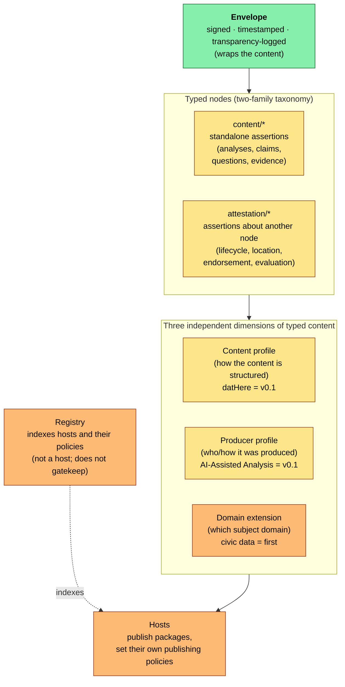

# Typed Standards

An open standard for **production-process attestation** of analytical artifacts: a cryptographically signed, content-addressed, capture-method-labeled record of *how* an artifact was produced, verifiable by a third party who does not trust the publisher.

*v0.1 Working Draft — open for external review (review window to be scheduled). Currently in pre-launch private circulation; public review follows when typedstandards.org launches with the new institutional home. Sections marked reserved are specified-but-not-built; see Status & where to engage below for the current breakdown.*

---

## The problem

Trust in analytical claims today is mediated by brand — investigative journalism, academic publishing, civic-data analysis, audit work product. AI-assisted analysis breaks the implicit-labor-attestation assumption: a chart that used to take an analyst a week can now be produced in minutes by anyone, and brand-mediated trust no longer tracks whether the analysis is sound. Typed Standards' response is to make the production process itself the unit of attestation — not *is this true*, but *here, in cryptographic detail, is how this was produced; judge for yourself*.

## What it is

### Opinionated about

- **Envelope.** Every package is cryptographically signed against its exact byte content: any change to the package is detectable, and the signature ties a known publisher to the bytes you can see. A publicly-verifiable timestamp proves the package existed by a particular time; an inclusion proof in a public transparency log makes the signing event itself auditable. The publisher's trust registry — at a well-known location on their own domain — names which keys are authorized to sign on their behalf. A verifier needs only the package, the publisher's domain, and public infrastructure (no central authority) to check everything.
- **Capture-method discipline.** Every package declares *how* its content was captured in a signature-covered field — for AI-assisted analyses today: verbatim capture from the model's wire stream, readback from the session log on disk, or paraphrased self-report; a sandbox-executed pipeline is a planned extension. The package tells you, in a way you can check against the signature, which mechanism produced the bytes you're reading. Each Producer Profile declares its own vocabulary of capture methods; future methods extend the per-profile vocabulary, the core discipline holds.
- **Typed-node ontology** *(two-family taxonomy).* Every conformant signed node belongs to one of two families: **`content/*`** (standalone assertions — analyses, typed claims, questions, evidence, host self-declarations, tool author declarations) or **`attestation/*`** (assertions about another node — lifecycle, location, corroboration, contradiction, endorsement, evaluation, certification). The taxonomy can grow as the standard matures: new typed-node categories arrive when a real publisher or domain needs them, not speculatively. The Typed Claims layer is specified at §8.11 of the consolidated spec but not yet built. Signatures from different parties — individuals, hosts, certifying bodies, third-party attesters — layer on these nodes rather than collapsing into a single trust authority.
- **Producer Profile + content profile axes.** Two independent mechanisms specify *who/how produced the package* and *what shape its content takes*. Content profiles are a generalizable mechanism (per §8.7 of the consolidated spec); `datHere` is the v0.1-specified instance, the first realized subtype of the AI-Assisted Analysis Producer Profile. Other Producer Profile types (Human, Hybrid, Sandbox-only) are reserved pending real adopters. Each subtype carries a guidance bundle of conventions outside the envelope's normative scope (visualization stack, citation format, capture-method vocabulary, entity normalization).

### Deliberately silent about

- **Truth.** The signature attests publication, not correctness. Editorial review, fact-checking, replication, and adversarial evaluation ride alongside as separately-signed attestations.
- **Editorial policy.** Publishers set their own filters, audiences, sign-off processes. The standard does not gate publication on topic or viewpoint.
- **Topology.** Publishers publish at their own domains. The standard is indifferent to any central host, federation substrate, or coordination protocol beyond an optional indexing registry that does not host or gatekeep.

## The normative preamble

Every implementation MUST carry this:

> **Corroboration ≠ truth.** Consensus can be wrong.
>
> **Contradiction ≠ falsity.** The heretic is sometimes right.
>
> **Identity strength ≠ topic authority.** A credentialed outsider can be wrong; a pseudonymous insider can be right.
>
> **The system surfaces signals; the consumer applies judgment.**

## Architecture

Color: green = built · yellow = partial · orange = reserved (designed or proposed; not implemented).

## Relationship to adjacent standards

| Standard / framework | Relationship to Typed Standards |
|---|---|
| Discourse Graphs | Source of the QEC pattern (claim-question-evidence), attributed to **Joel Chan** and the Discourse Graphs community; Typed Standards adopts it. |
| Nanopublications | Closest semantic match for atomic signed claims with provenance; consuming Typed Standards content as nanopubs is a plausible bridge. |
| W3C PROV-O | Used directly. Every package's provenance graph is PROV-O JSON-LD. |
| W3C Verifiable Credentials | Adjacent. VC-over-MCP-tool-call receipts are a candidate trace-capture layer for the envelope's trace slot. See spec §5.5 for the claim-granularity disambiguation. |
| Schema.org Claim / ClaimReview | Different problem (fact-check tagging vs. production-process attestation); ClaimReview-style attestations can coexist alongside packages. |
| C2PA | Same idea applied to a different domain — cryptographic provenance for image and video capture and editing history. See spec §5.5 for the claim/assertion/manifest disambiguation. |
| in-toto / DSSE | Direct alignment at the structural level. Typed Standards adopts in-toto's multihash DigestSet and predicate-type-URI pattern. Divergence: in-toto attestations are consumed by automated policy engines; Typed Standards envelopes are consumed by readers exercising judgment. |
| SLSA | Adjacent but disjoint — SLSA Provenance is a specific in-toto predicate type for software builds; Typed Standards is the production-process-attestation analogue for analytical artifacts. |
| Sigstore (Cosign / Fulcio / Rekor) | Foundational infrastructure, not a competitor. Typed Standards uses Rekor for transparency log inclusion; Sigstore Fulcio keyless OIDC is a candidate non-OAuth identity tier. |
| RO-Crate / WRROC | Candidate package container for the intended multi-file end-state; envelope mechanics are independent of the container choice. |
| DCAT / open-data catalogs | A package's data-source references can cite DCAT-described distributions; an early engagement hook for catalog-portal interop (Croissant outbound metadata is the complementary direction). |

## Status & where to engage

### Status (high level)

- **Built:** the envelope (signing, timestamping, public transparency log, publisher-hosted trust registry); the capture-method discipline; the `datHere` content profile and its executed-notebook architecture; the withdrawal lifecycle; provenance graphs; one identity tier (GitHub).
- **Specified, not built:** the typed-node ontology (two-family taxonomy + the v0.1 `attestation/*` sub-types); lifecycle and location attestation envelopes (currently the implementation tracks lifecycle in database columns rather than separately-signed envelopes); the Typed Claims layer at §8.11 of the consolidated spec — claim shapes (TrendClaim, ComparisonClaim, ObservationClaim, CompositionClaim, RelationshipClaim, QualitativeClaim), confidence-method discipline, AnalyticalDerivation, the civic-data geographic-scope taxonomy.
- **Reserved:** other typed-node sub-types (hosts as typeable subjects, tool author declarations); other Producer Profile types (Human, Hybrid, Sandbox-only); the publisher registry as an indexing-only coordination surface at typedstandards.org; richer identity tiers beyond GitHub (ORCID, did:web, notarized). Offline verification is the intended end-state, not yet a property.

### Where to engage

The specification is currently in **pre-launch private circulation** to a small set of named reviewers; public review will follow when typedstandards.org launches with the new institutional home. Substantive directions whenever review opens:

- **Feedback from adjacent-standards communities.** Implementers and editors of C2PA, in-toto, SLSA, Sigstore, W3C Verifiable Credentials, Discourse Graphs / nanopublications, and RO-Crate / WRROC — Typed Standards positions itself relative to these in §5.5 and Appendix C of the consolidated spec; targeted critique on where the positioning is wrong, the disambiguations unclear, or alignment opportunities missed lands directly in the next revision.
- **Open-data catalog interop.** DCAT-described data-source references; outbound Croissant metadata for discoverability via dataset crawlers.
- **Domain vocabularies.** Typed-claim extensions beyond civic data — health, transit, public finance, environmental monitoring.
- **Implementer tooling.** Reference verifiers, conformance test corpus, alternative producer profiles, non-OAuth identity bindings.
- **Federation substrate.** Selection among candidate transports (atproto, KOI, nanopub).

### Envisioned end users (illustrative)

A few sketches of who the standard's external surface is shaped for — illustrative rather than a fixed persona set; the question is whether you can locate yourself on it:

- **A journalist** verifying a chart shared on social media — does the package's signature check, and does the captured analysis support what the chart claims?
- **A citizen-data analyst** publishing a neighborhood trend — signing the work so a community board can verify the methodology three months later.
- **A cross-standards researcher** comparing C2PA-signed media (image / video provenance) with Typed-Standards-signed analytical artifacts in the same investigation.
- **A government open-data publisher** attaching attestations to portal outputs so consumers see the production process alongside the data.

---

Full specification, diagrams, and architecture notes: [`typed-standards-specification.md`](./typed-standards-specification.md). Contact: Nathan Storey (current; see reviewer-orientation document for stewardship and contact details).
