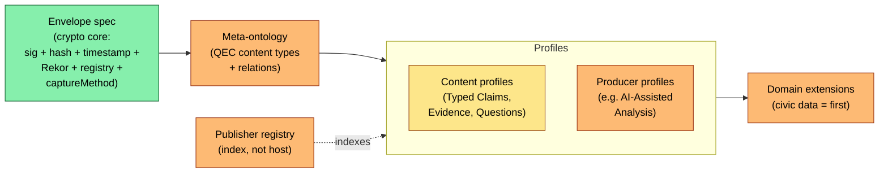

# Typed Standards

An open standard for **production-process attestation** of analytical artifacts: a cryptographically signed, content-addressed, capture-method-labeled record of *how* an artifact was produced, verifiable by a third party who does not trust the publisher.

*v0.1 Working Draft — open for external review (review window to be scheduled). Sections marked reserved are specified-but-not-built; see Status & where to engage below for the current breakdown.*

---

## The problem

Trust in analytical claims today is mediated by brand — investigative journalism, academic publishing, civic-data analysis, audit work product. AI-assisted analysis breaks the implicit-labor-attestation assumption: a chart that used to take an analyst a week can now be produced in minutes by anyone, and brand-mediated trust becomes increasingly orthogonal to whether the analysis is sound. Typed Standards' response is to make the production process itself the unit of attestation — not *is this true*, but *here, in cryptographic detail, is how this was produced; judge for yourself*.

## What it is

### Opinionated about

- **Envelope.** Ed25519ph signature over SHA-256-addressed canonical JSON, RFC 3161 timestamp from a public TSA, Sigstore Rekor inclusion proof, trust registry under the publisher's own well-known path.
- **Capture-method discipline.** Every package declares *how* its content was captured in a signature-covered field — verbatim wire vs. JSONL readback vs. paraphrased self-report. Future methods extend the vocabulary; the discipline holds.
- **Typed-node ontology** *(partly reserved).* Content (`claim` / `question` / `evidence` / `untyped`), hosts, tools/methods, and attestations are all typed nodes; each gets the envelope and its own sub-typing rules. QEC content is the most developed sub-ontology today; host, tool, and attestation typing are reserved. Signatures from different parties — individuals, hosts, certifications, other attesting nodes — layer on these nodes rather than collapsing into a single authority.

### Deliberately silent about

- **Truth.** The signature attests publication, not correctness. Editorial review, fact-checking, replication, and adversarial evaluation ride alongside as separately-signed attestations.
- **Editorial policy.** Publishers set their own filters, audiences, sign-off processes. The standard does not gate publication on topic or viewpoint.
- **Topology.** Publishers publish at their own domains. The standard is indifferent to any central host, federation substrate, or coordination protocol beyond an optional indexing registry that does not host or gatekeep.

## The normative preamble

Every implementation MUST carry this:

> **Corroboration ≠ truth.** Consensus can be wrong.
>
> **Contradiction ≠ falsity.** The heretic is sometimes right.
>
> **Identity strength ≠ topic authority.** A credentialed outsider can be wrong; a pseudonymous insider can be right.
>
> **The system surfaces signals; the consumer applies judgment.**

## Architecture

Color: green = built · yellow = partial · orange = reserved (designed or proposed; not implemented).

## Relationship to adjacent standards

| Standard / framework | Relationship to Typed Standards |
|---|---|
| Discourse Graphs | Source of the QEC pattern (claim-question-evidence), attributed to **Joel Chan** and the Discourse Graphs community; Typed Standards adopts it. |
| Nanopublications | Closest semantic match for atomic signed claims with provenance; consuming Typed Standards content as nanopubs is a plausible bridge. |
| W3C PROV-O | Used directly. Every package's provenance graph is PROV-O JSON-LD. |
| W3C Verifiable Credentials | Adjacent. VC-over-MCP-tool-call receipts are a candidate trace-capture layer for the envelope's trace slot. |
| Schema.org Claim / ClaimReview | Different problem (fact-check tagging vs. production-process attestation); ClaimReview-style attestations can coexist alongside packages. |
| C2PA | Same idea applied to a different domain — cryptographic provenance for image and video capture and editing history. |
| RO-Crate / WRROC | Candidate package container for the intended multi-file end-state; envelope mechanics are independent of the container choice. |
| DCAT / open-data catalogs | A package's data-source references can cite DCAT-described distributions; an early engagement hook for catalog-portal interop (Croissant outbound metadata is the complementary direction). |

## Status & where to engage

### Status (high level)

- **Built:** envelope (sig + hash + timestamp + Rekor), trust registry, captureMethod discipline, the `datHere` content profile, withdrawal lifecycle, PROV-O graphs, one OAuth-bound identity tier.
- **Specified, not built:** Typed Claims layer (formerly the Civic Claim Vocabulary draft; absorbed into the consolidated specification §8.11 with `ts:` namespace prefix per [ADR-0012](../adr/0012-typed-standards-consolidation.md)) — claim shapes (TrendClaim, ComparisonClaim, ObservationClaim, CompositionClaim, RelationshipClaim, QualitativeClaim), confidence-method discipline, AnalyticalDerivation, the first domain extension (civic data geographic-scope taxonomy).
- **Reserved:** typed-node ontology (QEC content + `untyped`; host / tool / attestation node families), producer profiles, publisher registry, full graded identity ladder. Offline verification is the intended end-state, not yet a property.

### Where to engage

- **Open-data catalog interop.** DCAT-described data-source references; outbound Croissant metadata for discoverability via dataset crawlers.
- **Domain vocabularies.** Typed-claim extensions beyond civic data — health, transit, public finance, environmental monitoring.
- **Implementer tooling.** Reference verifiers, conformance test corpus, alternative producer profiles, non-OAuth identity bindings.
- **Federation substrate.** Selection among candidate transports (atproto, KOI, nanopub).

---

Full specification, diagrams, and architecture notes: [`typed-standards-specification.md`](./typed-standards-specification.md). Contact: [TK].
