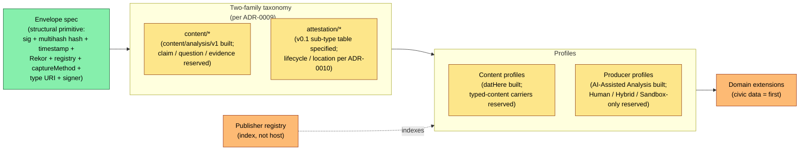

# Typed Standards

An open standard for **production-process attestation** of analytical artifacts: a cryptographically signed, content-addressed, capture-method-labeled record of *how* an artifact was produced, verifiable by a third party who does not trust the publisher.

*v0.1 Working Draft — open for external review (review window to be scheduled). Currently in pre-launch private circulation; public review follows when typedstandards.org launches with the new institutional home. Sections marked reserved are specified-but-not-built; see Status & where to engage below for the current breakdown.*

---

## The problem

Trust in analytical claims today is mediated by brand — investigative journalism, academic publishing, civic-data analysis, audit work product. AI-assisted analysis breaks the implicit-labor-attestation assumption: a chart that used to take an analyst a week can now be produced in minutes by anyone, and brand-mediated trust becomes increasingly orthogonal to whether the analysis is sound. Typed Standards' response is to make the production process itself the unit of attestation — not *is this true*, but *here, in cryptographic detail, is how this was produced; judge for yourself*.

## What it is

### Opinionated about

- **Envelope.** Ed25519ph signature over RFC 8785 JCS-canonicalized JSON with multihash content hash, RFC 3161 timestamp from a public TSA, Sigstore Rekor inclusion proof, trust registry under the publisher's own well-known path (`/.well-known/typed-publisher.json`).
- **Capture-method discipline.** Every package declares *how* its content was captured in a signature-covered field — verbatim wire vs. JSONL readback vs. paraphrased self-report. The vocabulary is open at the spec core and declared per Producer Profile per [ADR-0011](../adr/0011-capturemethod-generalization.md); future methods extend the per-profile vocabulary, the core discipline holds.
- **Typed-node ontology** *(two-family taxonomy per [ADR-0009](../adr/0009-unified-typed-attestation-primitive.md)).* Every conformant signed node belongs to one of two families: **`content/*`** (standalone assertions — analyses, typed claims, questions, evidence, host self-declarations, tool author declarations) or **`attestation/*`** (assertions about another node — lifecycle, location, corroboration, contradiction, endorsement, evaluation, certification). Sub-types are open enums extensible per the Xanadu doctrine. The QEC sub-ontology (claim / question / evidence / untyped) within `content/*` is the most developed today; the Typed Claims layer is specified at §8.11 of the consolidated spec. Signatures from different parties — individuals, hosts, certifying bodies, third-party attesters — layer on these nodes rather than collapsing into a single trust authority.
- **Producer Profile + content profile axes** *(per [ADR-0006](../adr/0006-producer-profile-architecture.md)).* Two orthogonal mechanisms specify *who/how produced the package* and *what shape its content takes*. Content profiles are a generalizable mechanism (per §8.7 of the consolidated spec); `datHere` is the v0.1-specified instance, the first realized subtype of the AI-Assisted Analysis Producer Profile. Other Producer Profile types (Human, Hybrid, Sandbox-only) are reserved pending real adopters. Each subtype carries a guidance bundle of conventions outside the envelope's normative scope (visualization stack, citation format, captureMethod vocabulary, entity normalization).

### Deliberately silent about

- **Truth.** The signature attests publication, not correctness. Editorial review, fact-checking, replication, and adversarial evaluation ride alongside as separately-signed attestations.
- **Editorial policy.** Publishers set their own filters, audiences, sign-off processes. The standard does not gate publication on topic or viewpoint.
- **Topology.** Publishers publish at their own domains. The standard is indifferent to any central host, federation substrate, or coordination protocol beyond an optional indexing registry that does not host or gatekeep.

## The normative preamble

Every implementation MUST carry this:

> **Corroboration ≠ truth.** Consensus can be wrong.
>
> **Contradiction ≠ falsity.** The heretic is sometimes right.
>
> **Identity strength ≠ topic authority.** A credentialed outsider can be wrong; a pseudonymous insider can be right.
>
> **The system surfaces signals; the consumer applies judgment.**

## Architecture

Color: green = built · yellow = partial · orange = reserved (designed or proposed; not implemented).

## Relationship to adjacent standards

| Standard / framework | Relationship to Typed Standards |
|---|---|
| Discourse Graphs | Source of the QEC pattern (claim-question-evidence), attributed to **Joel Chan** and the Discourse Graphs community; Typed Standards adopts it. |
| Nanopublications | Closest semantic match for atomic signed claims with provenance; consuming Typed Standards content as nanopubs is a plausible bridge. |
| W3C PROV-O | Used directly. Every package's provenance graph is PROV-O JSON-LD. |
| W3C Verifiable Credentials | Adjacent. VC-over-MCP-tool-call receipts are a candidate trace-capture layer for the envelope's trace slot. See spec §5.5 for the claim-granularity disambiguation. |
| Schema.org Claim / ClaimReview | Different problem (fact-check tagging vs. production-process attestation); ClaimReview-style attestations can coexist alongside packages. |
| C2PA | Same idea applied to a different domain — cryptographic provenance for image and video capture and editing history. See spec §5.5 for the claim/assertion/manifest disambiguation. |
| in-toto / DSSE | Direct alignment at the structural level. Typed Standards adopts in-toto's multihash DigestSet ([ADR-0008](../adr/0008-multihash-content-hash.md)) and predicate-type-URI pattern ([ADR-0009](../adr/0009-unified-typed-attestation-primitive.md)). Divergence: in-toto attestations are consumed by automated policy engines; Typed Standards envelopes are consumed by readers exercising judgment. |
| SLSA | Adjacent but disjoint — SLSA Provenance is a specific in-toto predicate type for software builds; Typed Standards is the production-process-attestation analogue for analytical artifacts. |
| Sigstore (Cosign / Fulcio / Rekor) | Foundational infrastructure, not a competitor. Typed Standards uses Rekor for transparency log inclusion; Sigstore Fulcio keyless OIDC is a candidate identity tier per [Q3](open-questions.md#q3--first-non-github-identity-provider). |
| RO-Crate / WRROC | Candidate package container for the intended multi-file end-state per [Q1](open-questions.md#q1--package-format); envelope mechanics are independent of the container choice. |
| DCAT / open-data catalogs | A package's data-source references can cite DCAT-described distributions; an early engagement hook for catalog-portal interop (Croissant outbound metadata is the complementary direction). |

## Status & where to engage

### Status (high level)

- **Built:** envelope (Ed25519ph signature + RFC 8785 JCS canonicalization + multihash content hash + RFC 3161 timestamp + Sigstore Rekor inclusion proof + publisher-hosted trust registry per [ADR-0008](../adr/0008-multihash-content-hash.md)), captureMethod discipline with per-profile vocabulary (open enum at core per [ADR-0011](../adr/0011-capturemethod-generalization.md)), the `datHere` content profile (first realized subtype of the AI-Assisted Analysis Producer Profile per [ADR-0006](../adr/0006-producer-profile-architecture.md)), executed-notebook architecture per [ADR-0005](../adr/0005-executed-notebook-architecture.md), withdrawal lifecycle (DB-column based today; attestation-envelope migration per [ADR-0010](../adr/0010-visibility-lifecycle-location-attestations.md) is Phase 3 IMPL), PROV-O graphs, GitHub OAuth identity tier.
- **Specified, not built:** the unified typed-attestation primitive + two-family taxonomy per [ADR-0009](../adr/0009-unified-typed-attestation-primitive.md) (`type` URI, `nodeId` ≡ envelope hash, `signer` object + verifier cross-check); the v0.1 `attestation/*` sub-type table; lifecycle / location attestation operationalization per [ADR-0010](../adr/0010-visibility-lifecycle-location-attestations.md) (reference-impl migration is Phase 3 IMPL); the Typed Claims layer at §8.11 of the consolidated spec — claim shapes (TrendClaim, ComparisonClaim, ObservationClaim, CompositionClaim, RelationshipClaim, QualitativeClaim), confidence-method discipline, AnalyticalDerivation, civic-data geographic-scope taxonomy — gated on a first typed-content producer.
- **Reserved:** other `content/*` sub-types (`content/host/v1`, `content/hostPolicy/v1`, `content/hostTermsOfUse/v1`, `content/tool/v1`); other Producer Profile types (Human, Hybrid, Sandbox-only per [ADR-0006](../adr/0006-producer-profile-architecture.md) §1); the `civicaitools-default` subtype of AI-Assisted Analysis; the publisher registry as indexing-only coordination surface at typedstandards.org; full graded identity ladder beyond GitHub (ORCID, did:web, notarized). Offline verification is the intended end-state, not yet a property.

### Where to engage

The specification is currently in **pre-launch private circulation** to a small set of named reviewers; public review will follow when typedstandards.org launches with the new institutional home (gated on institutional stewardship landing). The four substantive collaboration directions for whenever review opens:

- **Open-data catalog interop.** DCAT-described data-source references; outbound Croissant metadata for discoverability via dataset crawlers.
- **Domain vocabularies.** Typed-claim extensions beyond civic data — health, transit, public finance, environmental monitoring.
- **Implementer tooling.** Reference verifiers, conformance test corpus, alternative producer profiles, non-OAuth identity bindings.
- **Federation substrate.** Selection among candidate transports (atproto, KOI, nanopub).

---

Full specification, diagrams, and architecture notes: [`typed-standards-specification.md`](./typed-standards-specification.md). Contact: Nathan Storey (current; see reviewer-orientation document for stewardship and contact details).
