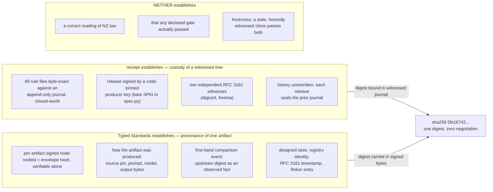
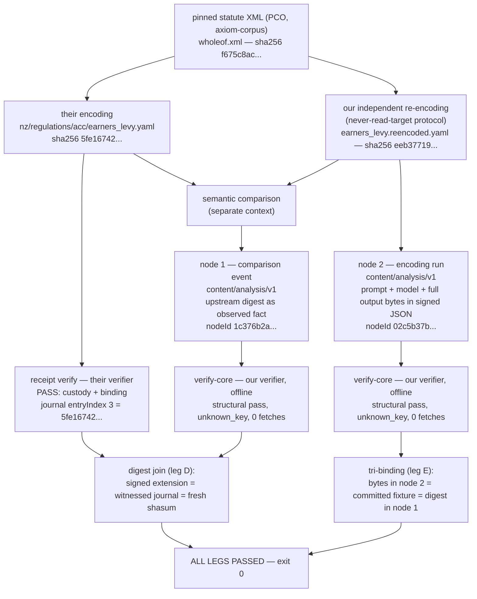

<!-- v2 — 2026-07-28 — restructured front-loads the interop case; adds the encoding-run node (apply-manifest form), two diagrams, and the complementary-gaps analysis. v1 (comparison + verdicts only) at git dbe1d2d. -->
# Rulespec Interop POC

A proof of concept composing two independently designed verification systems — The Axiom Foundation's [receipt](https://github.com/TheAxiomFoundation/receipt) witnessed-corpus verifier and this project's Typed Standards evidence envelope (`@typedstandards/verify-core`) — on a single SHA-256 digest that neither side had to negotiate with the other. [rulespec-nz](https://github.com/TheAxiomFoundation/rulespec-nz) publishes machine-readable encodings of NZ statutes and regulations (`rulespec/v1` YAML); its [PR #104](https://github.com/TheAxiomFoundation/rulespec-nz/pull/104) binds all 80 rule files into a witnessed, offline-verifiable corpus journal. The POC independently re-encoded one provision from the same pinned statute XML, recorded both the comparison and the encoding run itself as Typed Standards nodes, verified everything with both projects' verifiers offline, and joined the two systems on the digest. The comparison also surfaced a substantive encoding divergence — regulation 4's routing for self-employed persons under regulation 7 — laid out neutrally in [Comparison result](#comparison-result); neither reading is assumed correct. Everything here is reproducible from branch `poc/rulespec-interop` via `./scripts/verify-rulespec-interop.sh` ([Reproduction](#reproduction)).

*Last updated: 2026-07-28 (v2). v1 — the comparison + verdicts writeup this restructures — is in git history at `dbe1d2d`.*

**Read the [Limitations](#limitations) section before citing any result here.** In particular: their verifier was installed from an unreleased PR branch, our packages are signed with a local throwaway key that no trust registry lists, and both upstream PRs are still open, so all upstream artifacts are pre-merge.

## The two-layer picture

The two systems answer different questions about the same corpus, and neither answers the other's. receipt establishes **custody of a witnessed tree**: the bytes you hold are exactly what a code-pinned producer key signed and two independent RFC 3161 authorities witnessed, closed-world, history unrewritten. Typed Standards establishes **provenance and identity of one artifact**: a per-artifact signed node stating how a specific thing came to be — source pins, prompt, model, output bytes — portable on its own, with designed slots for publisher identity, timestamping, and transparency logging. The seam between them is one SHA-256 digest both sides already compute: their journal binds it, our signed bytes carry it as an observed fact. Neither project changed formats, keys, schemas, or endpoints.



## What the POC built

- **An independent re-encoding** of regulation 4 of the Accident Compensation (Earners' Levy) Regulations 2025 (NZ), from the same pinned PCO statute XML their encoding used, under a never-read-the-target protocol ([Independence protocol](#independence-protocol)).
- **Node 1 — the comparison event** (`content/analysis/v1`, nodeId `1c376b2a…`): a first-hand record of comparing the two encodings; *their* artifact's digest enters the signed bytes as an **observed fact**, not a co-signed claim.
- **Node 2 — the encoding run** (`content/analysis/v1`, nodeId `02c5b37b…`): the re-encoding itself, emitted as evidence. It carries the statute source path and digest as input, the complete re-encoded YAML verbatim as output (full bytes inside the signed canonical JSON), the output digest, the model, the full-text encoding prompt, and a signed `independence_protocol` record.
- **Both verifiers pass offline**: their corpus under `receipt verify` (exit 0), both our nodes under `@typedstandards/verify-core@0.7.0` with fetch stubbed to throw (zero network calls), plus the digest join (leg D) and the tri-binding of the re-encoding bytes across node 2, the committed fixture, and node 1 (leg E).



## What Typed Standards would give the corpus

Stated as a technical fit assessment against what the POC actually verified — not a roadmap for either project.

1. **The missing artifact-class: encoder apply manifests, demonstrated.** Node 2 *is* an encoder apply manifest in Typed Standards form — the artifact-class rulespec-nz has zero of for its 80 rule files. Their own witnessed VERIFY.md concedes it ("no machine check asserts that these rule files carry encoder apply manifests — `rulespec-nz` has none" — and VERIFY.md is itself one of the journal's seven attested files, so the concession is witnessed); the gate that would demand manifests, `guard/manual-rulespec-changes`, is disabled in the published lane (`run-generated-guard: false`, printed as DID-NOT-RUN in the receipt verdict); the backfill is tracked in their [axiom-encode#1192](https://github.com/TheAxiomFoundation/axiom-encode/issues/1192). Node 2 demonstrates the form for one file — source pin, prompt, model, complete output bytes, output digest, all inside signed canonical JSON — joined to their journal by digest. This is the single most concrete thing the POC shows.
2. **A public transparency log — worth testing, with the limit stated.** rulespec-nz's witness set is a self-hosted append-only journal plus two RFC 3161 timestamp authorities; there is no public append-only log anywhere in their stack (verified this session: every Python module of the pinned `receipt` install and the full rulespec-nz tree grep clean for any such mechanism — the witness machinery is `tsa.py` plus `release_chain.py`, both fully offline). Freshness is the gap their own verdict names — "a stale, honestly witnessed clone also passes" — and their prescribed check is out-of-band: compare against GitHub, or `--base-ref` against a git ref you trust (VERIFY.md). Both surfaces are producer-mutable. A TS production publish adds a Sigstore Rekor entry (§9.2 check #8): a public, append-only, producer-independent log. Would that close their freshness gap? **Partly, and only online.** A verifier could query Rekor at verification time for later entries by the same producer identity — replacing "ask a producer-mutable surface" with "ask a log the producer cannot rewrite." But an inclusion proof carried in a package proves only that the entry existed when logged, not that no later entry exists — offline verification still cannot establish freshness — and the later-entry check holds only under producer logging discipline: a producer who quietly stops logging releases defeats it. Rekor would strengthen the out-of-band freshness lane and add an independent witness; it would not eliminate the out-of-band step. Worth testing against a real release cadence; not claimable as a fix.
3. **Publisher identity and rotation via a trust registry.** Their producer key is a bare SPKI SHA-256 pinned in committed verification code (`verification/spec.py` — a deliberate design; its own comment notes replacing the key file alone changes nothing). Rotating it is a reviewed code change, and there is no kid concept or validity window. TS resolves a package's `kid` against a published trust registry (`/.well-known/typed-publisher.json`), so rotation is a registry entry, not a verifier change — the mechanism this POC exercised in the negative: our throwaway kid is deliberately absent from the registry snapshot, and verify-core honestly reports `unknown_key`.
4. **Per-artifact citability.** Their journal does record per-file digests (entryIndex 3 is exactly how leg D joins), but the unit of verification is the whole clone, closed-world — by design. A TS node verifies alone: leg C verifies a single ~12 KB commitment bundle offline, no clone required. Complementary, not competing: whole-tree custody vs a portable per-artifact record that can travel with a citation.
5. **A designed home for the correctness claims both verifiers disclaim.** Both verdicts state they do not prove the encodings correctly read NZ law. `attestation/evaluates/v1` — ratified in the TS v0.1 sub-type table (spec §8.12: `targetNodeId`, `methodology`, `scoringRubric`, `results`; authorization `specific-role-required`) — is the designed home for a separately-signed correctness evaluation by a named evaluator. Ratified, not yet operationalized; per-sub-type operationalization lands via downstream ADRs.

## What receipt has that Typed Standards lacks

The gaps run in both directions; the POC surfaced three where their design is concretely ahead (full reasoning: v1 findings 3–5 at `dbe1d2d`).

1. **Domain-separated signing.** Their `sign_payload(private_key_pem, payload, *, domain: bytes)` (receipt `sign.py` at the pinned SHA) *requires* a domain argument and signs `domain + payload`; the docstring's rationale: "``domain`` is required so every signing call names its role explicitly; a consumer that signs exact bytes with no domain states ``domain=b""`` deliberately rather than by omission." TS §8.3.1 signs the bare envelope-hash hex string — in receipt's terms, an implicit `domain=b""` by omission. Theoretical today (one key, one signing role); load-bearing the moment a TS key signs a second artifact class.
2. **The gate-tier taxonomy.** receipt classifies every declared gate as `public` (outsider re-runnable) or `ci-attested` (only the CI run's identity vouches) and prints DID-NOT-RUN gates with the reason inline. TS §9.2 checks are binary status plus calm-absence; there is no vocabulary for "declared but only reproducible by the publisher." Theirs is a genuinely better honesty surface for declared-but-not-re-run claims.
3. **Lifecycle completeness.** TS §8.10 asserts an append-only lifecycle, but §9.2 check #10 verifies only the chain the proof carrier supplies — this run's own verdicts show the consequence: `lifecycle.source: "none"`, empty chain, still `active`. Their `release_chain` recomputes every state and append digest from the append-only JSONL, so an omitted correction is a verification failure, not a silent absence — a working answer to a TS open problem, one repo away.

Two projects with complementary gaps: they built the custody layer TS defers; TS built the per-artifact provenance layer their own published lane says is missing.

## What adopting would cost them

Minimal, and stated honestly. No format change, no key change, no journal change — the POC changed nothing of theirs (leg A asserts both clones bit-identical to the pinned SHAs and clean on every run). Adoption is one TS node per encoding run, emitted at encode time in node 2's form (~12 KB as a commitment bundle). For the 80 existing files a backfill node is possible but bounded: no contemporaneous capture of the original encoding runs exists, so a backfill node can only attest what is observable now — present-day digests and source pins, not the original production event. That retro-attestation limit is the honest-label problem from v1 finding 1, and it is why the #1192 backfill is the harder half of the work in any format, theirs or ours.

## Findings (index)

Observations only; nothing was filed, and no spec, ADR, or open-questions edit was made from this POC. Full reasoning per finding is in v1 at `dbe1d2d`; each Xanadu gate is a real adopter need, not a POC.

1. **No `captureMethod` value describes an encoder pipeline** — §8.6's vocabulary is chat-capture only; an encoder run has no honest label (it also bounds backfill honesty, per [cost](#what-adopting-would-cost-them)). To act: Producer Profile guidance-bundle amendment (Q32 mechanics), gated on a named adopter.
2. **No Producer Profile for statute encoding** — the thing rulespec-nz *is* has no profile declaring capture vocabulary, proof-atom discipline, or gate expectations. To act: profile promotion per ADR-0006, gated on an adopter.
3. **No domain separation in §8.3.1** — expanded in [What receipt has](#what-receipt-has-that-typed-standards-lacks) item 1. To act: ADR; a domain tag changes signature bytes, a versioned envelope change.
4. **Gate-tier taxonomy has no TS equivalent** — expanded in [What receipt has](#what-receipt-has-that-typed-standards-lacks) item 2. Relevant if TS packages start carrying declared gate results.
5. **§8.10 asserts append-only; §9.2 never verifies completeness** — expanded in [What receipt has](#what-receipt-has-that-typed-standards-lacks) item 3. A completeness-carrying serialization is a spec/ADR question (interacts with Q2).
6. **ADR-0016 concepts map cleanly onto their model** — `revises`/`supersedes` ↔ their journal correction rows; `vcsRef` ↔ their `subjectCommit`/toolchain pins; §8.10 lineage ↔ their release chain ([ADR-0016](../adr/0016-vcs-native-lifecycle-mapping.md)). Nothing to act — the mapping is evidence the abstractions were pitched at the right level.
7. **Committed-mode friction, made concrete** — both nodes are `visibility: committed`; production-published, a third party could verify the commitment offline but the bytes are creator-distributed only (ADR-0010 §5, by design). To act: a distribution-pattern question for a real committed-mode adopter.

---

## Appendix — the evidence

### Pins and upstream state

All pins are enforced by `scripts/verify-rulespec-interop.sh` (leg A fails if a clone drifts from its SHA or has a dirty tree). Upstream state as of 2026-07-28:

| What | Pin |
|------|-----|
| rulespec-nz | `7dd2b1ad8f13ff934aa53af562a34ea7451502f6` ([PR #104](https://github.com/TheAxiomFoundation/rulespec-nz/pull/104) head, **OPEN**, fetched via `pull/104/head`) |
| axiom-corpus | `92ac9c1bedf62968eeea9a873361f49075364157` (the commit the pinned corpus release was cut from) |
| receipt | `c711adc0d0fb514b8806f83b36579e4cb4c621a7` ([PR #14](https://github.com/TheAxiomFoundation/receipt/pull/14) head, **OPEN**; `receipt 0.5.0`, unreleased — PyPI's latest is 0.4.0) |
| @typedstandards/verify-core | `0.7.0` (npm) |
| Corpus release | `nz-rulespec-2026-07-20`, content sha256 `58089115f520cb99a3b90e3be503be63041ebe4a72bec69f24a2f115ed1ba196` |
| Related upstream issues | receipt#13 (third-party verification lane), receipt#7 (producer-side chain machinery), axiom-encode#1192 (notary cutover / apply-manifest backfill) |

**Weaker-claim caveat, stated up front:** the `receipt` used throughout this POC was installed from the PR #14 head — an unreleased branch, not a published wheel. Every "their verifier passes" statement here is a statement about that branch state.

**Toolchain-pin note.** A later corpus release, `nz-rulespec-2026-07-25`, exists upstream, and an earlier draft of this POC's plan referenced it. The POC instead followed the pin in PR #104's own `.axiom/toolchain.toml`, which names `nz-rulespec-2026-07-20` with the content sha256 above — because that is the corpus tree PR #104's witnessed journal actually binds (the toolchain file is itself one of the journal's seven attested files). The release manifest for `nz-rulespec-2026-07-20` is present in the axiom-corpus checkout at the pinned commit.

**Statute source.** The provision was encoded from the official PCO XML ingested in the pinned corpus — not scraped HTML: `data/corpus/sources/nz/regulation/2026-06-16-rulespec-nz-pco/regulation/public/2025/0018/wholeof.xml`, sha256 `f675c8ac89dab2ed08c6e228b93c90c65f0d9aa29425a783790f08599ef0f574` (recomputed against the pinned clone); provision id `LMS1019194`; corpus citation path `nz/regulation/regulation/public/2025/0018/regulation/4`.

### Independence protocol

The re-encoding was produced by an orchestrated multi-agent run under a protocol stricter than originally planned: the encoding agent **never read** `earners_levy.yaml` or `earners_levy.test.yaml` at any point — not merely "drafted first, then looked." It learned the `rulespec/v1` schema from the repo's own documentation (`.axiom/repository-structure.yaml`, `README.md`, `CONTRIBUTING.md`, `AGENTS.md`, `docs/axiom-ecosystem-integration.md`) and four exemplar encodings of unrelated provisions (`nz/regulations/rma_district_plans/wellington_city/supermarket_zoning.yaml`, `nz/regulations/social_security/childcare_assistance/core.yaml`, `nz/regulations/student_allowances/core.yaml`, `nz/regulations/health_entitlement_cards/community_services_card/core.yaml`). Repo-wide greps during encoding were count-only, and the one recursive grep that could have surfaced the target file ran with a `grep -v earners_levy` filter and displayed nothing. The digest recomputation and semantic comparison were then done by a **separate context** that had not produced the encoding.

**Evidence basis, stated honestly:** the independence claim rests on the audited per-agent file-consultation record (the run's subagent transcripts), which is not a committed artifact on this branch. A reader who does not accept that record should treat the comparison as informative rather than adversarially independent. What *is* mechanically verifiable is byte-level non-derivation in the trivial sense: the two files differ (`eeb37719…` vs `5fe16742…`). Node 2 additionally carries the protocol as a signed `independence_protocol` record (never-read-target plus the nine schema-source files above), which makes the claim portable and tamper-evident — but see Limitations item 6.

### Package construction

Both nodes were built locally to the Typed Standards package schema and verified by the same verifier code path a production package must pass: JCS canonicalization under the `https://typedstandards.org/canonicalization/legacy-json/v1` content rule, multihash `contentHash`, envelope hash = `nodeId`, Ed25519ph over the envelope-hash hex string per spec §8.3.1. Neither node claims to reproduce, endorse, or co-sign the upstream encoding — node 1's extension block `org.civicaitools.rulespec-interop` carries the upstream facts *as observed* (repo, PR, commit, paths, digests, journal entry indices), inside the signed canonical bytes; the harness prints containment offsets as proof (node 1: upstream digest at byte 1209 of 9020 JCS bytes; node 2: output digest at byte 1318 of 12055, the complete re-encoded YAML at byte 1886). Both are signed with a **throwaway local key**, kid `local:rulespec-interop-poc-2026-07`, signer `local:rulespec-interop-poc` — deliberately *not* claiming the platform identity, and deliberately absent from the trust-registry snapshot carried in the commitment fixtures (which lists only `platform:evidence-2026-04`). No TSA token, no Rekor entry, `visibility: committed`. **No production publish was made** — the production publish (registry-listed key, real RFC 3161 timestamp, real Rekor inclusion) is a separately gated decision, and until it happens this POC does **not** demonstrate full-depth third-party verification of our leg.

### The two verdicts

Both blocks below are verbatim from a run of `./scripts/verify-rulespec-interop.sh` on 2026-07-28 (exit code 0).

#### Their verifier: `receipt verify` over the pinned rulespec-nz clone

```
receipt 0.5.0 — rulespec-nz published corpus
  root  /Users/npstorey/code/civic-ai-tools/.rulespec-clones/rulespec-nz
  spec  /Users/npstorey/code/civic-ai-tools/.rulespec-clones/rulespec-nz/verification/spec.py
        sha256 d29da2603a8d168df6596ad038fc22fe71e6a40c778c36c0611dbcff555b3fae

ESTABLISHED OFFLINE, FROM THIS CLONE ALONE
  [ok  ] custody
         1 release(s), HEAD 0000-363e52fb0f8bb41d.json; producer SPKI f703c8d871f444cd…; witnesses digicert 2026-07-26T16:38:02Z · freetsa 2026-07-26T16:38:02Z
  [ok  ] binding
         80 content file(s) and 7 attested file(s) match the witnessed journal exactly, closed-world
  [ok  ] declaration
         17 gate declaration(s) well formed and complete against the pinned spec (11 public, 6 ci-attested); none re-run here

DECLARED IN THE WITNESSED JOURNAL — NOT RE-RUN BY THIS COMMAND
  1 of 17 declared gate(s) did not pass cleanly; each is marked below.
  public: you can re-run these yourself from public inputs
    - repo/tracked-paths
    - repo/obsolete-generated-files
    - repo/layout
    - deps/commit-ancestry
    - corpus/release-object-fetch
    - corpus/provenance-commit-ancestry
    - rulespec/companion-tests
    - oracle/policyengine-coverage-classification
    - repo/pytest
    - repo/quality
    - repo/roadmap-coverage
  ci-attested: not reproducible; only the CI run's identity vouches
    - rulespec/proofs-and-claims
    - rulespec/money-proof-atoms
    - rulespec/validate-yaml
    - waivers/ratchet-audit
    - schema/retired-freeze
    - guard/manual-rulespec-changes  [DID NOT RUN — the caller sets run-generated-guard: false in .github/workflows/repository-checks.yml, so this guard was skipped on this commit]

VERDICT: PASS — custody and corpus binding
  This proves the published rule files are exactly the bytes a code-pinned
  producer key signed and the 2 pinned RFC 3161 authorities (digicert, freetsa)
  witnessed, and that nothing in the recorded history was rewritten. It does
  NOT prove that any declared gate passed, it does NOT prove the encodings
  are a correct reading of the law, and it does NOT prove this clone holds
  the producer's newest release — a stale, honestly witnessed clone also
  passes. Check freshness out of band or via --base-ref.
```

**What this does and does not establish.** The PASS covers **custody and binding only**: the 80 rule files and 7 attested files are byte-exact against an append-only journal a code-pinned Ed25519 key signed and two independent RFC 3161 authorities witnessed, closed-world (no unlisted file, no missing file), history unrewritten. The verdict's own text disclaims the rest, and their `VERIFY.md` expands it: it does **not** re-run any of the 17 declared gates (6 are `ci-attested` — not reproducible by outsiders), does **not** prove the encodings are a correct reading of NZ law, does **not** prove freshness (a stale, honestly witnessed clone passes), and one declared gate — `guard/manual-rulespec-changes`, the very gate that would demand encoder apply manifests — **did not run at all** (`run-generated-guard: false`), which the journal is required to declare precisely so its absence cannot read as a pass.

#### Our verifier, node 1: `@typedstandards/verify-core@0.7.0`, offline, fetch stubbed to throw

```
=== verify-core v0.7.0 verdict (verbatim, FULL) ===
{
  "hashMatch": true,
  "envelopeIntegrity": {
    "status": "verified"
  },
  "recomputedHash": "1c376b2a56f9e4167a7bb762c8984cf60a3a9624a8316ded00e863384f191b08",
  "nodeId": "1c376b2a56f9e4167a7bb762c8984cf60a3a9624a8316ded00e863384f191b08",
  "signatureValid": true,
  "kid": "local:rulespec-interop-poc-2026-07",
  "hasSigning": true,
  "rekorVerified": null,
  "rekorDetails": null,
  "rekorInclusion": null,
  "hasRekor": false,
  "hasTimestamp": false,
  "rfc3161": null,
  "keyTrust": {
    "status": "unknown_key",
    "verified": false,
    "kid": "local:rulespec-interop-poc-2026-07"
  },
  "blobRefsVerified": null,
  "blobRefs": [],
  "contentCanonicalization": {
    "status": "ok",
    "rule": "https://typedstandards.org/canonicalization/legacy-json/v1"
  },
  "contentHash": {
    "status": "ok",
    "algorithms": [
      "sha256"
    ],
    "matched": "sha256",
    "contentHash": {
      "sha256": "b48ea1e7eae8b8445a0ada2272ffa19953aaa7c1cc718e469437a38b6fc5a748"
    }
  },
  "typeResolution": {
    "status": "ok",
    "type": "content/analysis/v1"
  },
  "signerIdentity": {
    "status": "no_registry_identity",
    "claimed": "local:rulespec-interop-poc"
  },
  "captureMethodVocab": {
    "status": "ok",
    "captureMethod": "claude-code-jsonl-readback",
    "profileType": "ai-assisted-analysis"
  },
  "lifecycle": {
    "status": "active",
    "source": "none",
    "chain": []
  }
}
=== network calls attempted: 0 ===
```

**What this does and does not establish.** The structural checks pass with zero network access: envelope hash recomputes (spec §9.2 #1), the Ed25519ph signature verifies against the embedded key (#2), the content-canonicalization rule resolves and the multihash content hash matches (#3, #4), type resolves (#12), nodeId equals the envelope hash (#13), and the captureMethod value is in the declared vocabulary (#15). But the verdict is **deliberately and honestly not green**: key trust is `unknown_key` (#5 — the throwaway key is in no trust registry), signer identity degrades to `no_registry_identity` (#14), and checks **#7 (RFC 3161 timestamp) and #8 (Rekor transparency-log inclusion) are unverified** — there is no token and no entry to verify. The harness asserts this exact shape field by field; an unexpectedly *green* #5/#7/#8 would itself fail the harness. This pass proves the digest join and the package shape. It does **not** constitute full-depth third-party verification of our leg — that requires the production publish.

#### Our verifier, node 2: stated as a machine-checked diff against node 1

The verify-core verdict for the encoding-run node was diffed field-by-field against node 1's (34 leaf fields; flattened-JSON comparison, this session). Exactly **three fields differ**: `nodeId` and `recomputedHash` are `02c5b37bfaf67d50f2293febc760b1ed5bc0831c96364a1cea9fc2ea9df7d7b7`, and `contentHash.contentHash.sha256` is `2a1fa337b25f40ecdf3f3dc87667dd8e7de46dbbdb6c53dfa7bec8e4629aa91c`. The remaining **31 leaf fields are identical**, including every deliberately-not-green one: `keyTrust.status: "unknown_key"`, `signerIdentity.status: "no_registry_identity"`, `hasTimestamp: false`, `hasRekor: false`, `lifecycle: {status: "active", source: "none", chain: []}`, and zero network calls attempted. Everything the paragraph above establishes and declines to establish for node 1 applies to node 2 unchanged.

### The digest join and the tri-binding

The exact claims, no more. Leg D — the join between the two systems:

```
extension observed_upstream_artifact_sha256: 5fe16742f55876ab33a6560793295346f3bad34912f09b7b84311436be2effed
corpus-journal entryIndex 3 sha256:          5fe16742f55876ab33a6560793295346f3bad34912f09b7b84311436be2effed
fresh shasum -a 256 (pinned clone):          5fe16742f55876ab33a6560793295346f3bad34912f09b7b84311436be2effed
```

Three independently sourced values are identical: (1) the digest recorded inside our signed canonical bytes, (2) the digest their witnessed journal binds at entryIndex 3 for `nz/regulations/acc/earners_levy.yaml`, and (3) a fresh recompute over the file in the pinned clone. (The companion test file joins the same way: `nz/regulations/acc/earners_levy.test.yaml`, sha256 `43308ecb29fc26e30819d3657f89eb531d878f7e6ffa78e3712f709acf5906a4`, journal entryIndex 2, recomputed and matched.)

Leg E — the tri-binding of the re-encoding bytes:

```
sha256 of output bytes carried in node 2's signed package:    eeb3771924255c2f0c8b9cd393b22b8dc19667651b62322f42017e16e504e88b
fresh shasum -a 256 of committed earners_levy.reencoded.yaml: eeb3771924255c2f0c8b9cd393b22b8dc19667651b62322f42017e16e504e88b
node 2 extension output_sha256:                               eeb3771924255c2f0c8b9cd393b22b8dc19667651b62322f42017e16e504e88b
node 1 extension our_reencoding_sha256:                       eeb3771924255c2f0c8b9cd393b22b8dc19667651b62322f42017e16e504e88b
```

**What the join is:** our signed envelope contains an **observed fact about their published artifact**, and that fact is confirmed by their own verification structure; the tri-binding proves the bytes node 2 carries, the committed fixture, and the digest node 1 records are the same encoding. Anyone holding our packages and their clone can re-derive every leg offline.

**What the join is not:** it is *not* a claim that our re-encoding reproduced their bytes. It did not, and was never expected to: our file hashes `eeb3771924255c2f0c8b9cd393b22b8dc19667651b62322f42017e16e504e88b` — independent YAML serializations of independently made encoding judgments do not collide.

### Comparison result

**Classification: (c) semantically different at module level** — with the honest counterpoint that, restricted to regulation 4's rate schedule alone, the two encodings would classify as **(b) semantically equal with byte differences**: same three rates, same effective dates (2025-04-01 / 2026-04-01 / 2027-04-01, third band open-ended), numerically identical under unit conversion — our per-$100 Money values 1.45 / 1.52 / 1.59 are exactly their fractional Rate values 0.0145 / 0.0152 / 0.0159 × 100 — and the same corpus citation path.

The meaning-bearing differences, laid out neutrally (neither reading is assumed correct):

1. **Regulation-7 routing.** Regulation 4's paragraph structure gives self-employed persons under a weekly-compensation purchase agreement the regulation-7 amount, self-employed persons within regulation 6's hours/earnings gate the regulation-6 amount — with the express exclusion "regulation 6 applies (but regulation 7 does not apply)" — and everyone else the standard rate. Our module encodes this as a derived selector with regulation-7 priority. Their module has **no routing or selector rule**: its regulation-6 derived amount (`acc_low_self_employed_minimum_levy_excluding_gst`) is gated only on regulation 6's own hours/earnings conditions, with no regulation-7 exclusion, and no rule in the module selects which amount is the levy payable for a person to whom multiple pathways apply.
2. **Module scope.** Their module spans regulations 4–9 plus extra-statutory Inland Revenue administration values (GST-inclusive rates 0.0167 / 0.0175 / 0.0183; maximum-earnings caps 152790 / 156641 / 160244; a cents-rounding scale) across 12 rules (7 parameters, 5 derived), and applies the regulation-5 earnings cap inline in its standard-levy formulas. Our module encodes regulation 4 only, across 2 rules (1 parameter, 1 derived), deferring the regulation-5 cap and the regulation-6/-7 formulas as out of scope.
3. **(Representational, not meaning-bearing.)** dtype/unit choice (Money-per-$100 vs fractional Rate) and proof-atom style — our 8 atoms all carry verbatim statute excerpts; theirs are citation-path-only with no excerpts.

**Which reading each reflects:** ours reads regulation 4 as a rate schedule *plus an exclusive routing directive*, with the regulation-6/-7 formulas external. Theirs treats the regulations package as a **component library** — parameters and standalone amounts — leaving the (b)/(c) selection and the regulation-7-priority limb unencoded, presumably for downstream composition. Both are defensible engineering positions; the divergence is exactly the kind of encoding judgment that provenance records and comparison events exist to surface.

### What a passing pair establishes — and what it does not

Composing the two verdicts, a party holding this branch plus the pinned clones can establish, fully offline:

- Their published encoding is byte-exact against an append-only, dual-witnessed, closed-world journal signed by a code-pinned key (receipt's PASS).
- Our two records — the comparison event and the encoding run — are each byte-exact against their own envelope hashes, signed by the embedded key, with the upstream digest (node 1) and the complete re-encoding bytes (node 2) contained in the signed canonical JSON (the containment offsets in [Package construction](#package-construction)).
- The digest in our signed record, the digest in their witnessed journal, and the bytes on disk agree (the triple join) — and the re-encoding bytes node 2 carries, the committed fixture, and the digest node 1 records agree (the tri-binding).

It does **not** establish — and both verifiers say so in their own output:

- That any of their 17 declared gates passed (receipt reports declarations, re-runs nothing; 6 gates are `ci-attested` and not outsider-reproducible; `guard/manual-rulespec-changes` did not run at all).
- That either encoding is a correct reading of New Zealand law (receipt's verdict text; TS spec §9.3 item 2 — correctness is a separately-signed attestation, never an envelope property).
- That the clone is fresh (a stale, honestly witnessed clone passes receipt; check freshness out of band).
- That our packages are trustworthy to a third party: the key is `unknown_key`, there is no timestamp, no transparency-log entry, and no registry identity — for both nodes. Checks #7/#8 are unverified. Full-depth third-party verification of our leg requires the production publish, which has not happened.

### Reproduction

From a clean checkout of branch `poc/rulespec-interop`:

```bash
./scripts/verify-rulespec-interop.sh
```

Requirements: `git`, `uv`, `node`/`npm`. Network is used only to fetch the pinned sources when absent (github.com, registry.npmjs.org); the verification itself is offline, and leg C stubs `fetch` to throw and asserts zero network calls. Six legs: **A** pinned clones, **B** `receipt verify`, **C(1)** verify-core over node 1, **C(2)** verify-core over node 2, **D** the digest join, **E** the tri-binding. The script exits non-zero on any divergence — including an unexpectedly *green* key-trust/timestamp/Rekor result, which would mean the harness is no longer testing what it claims.

Committed artifacts on the branch:

| File | Role |
|------|------|
| `scripts/verify-rulespec-interop.sh` | Six-leg harness: pinned clones → `receipt verify` → verify-core offline ×2 → digest join → tri-binding |
| `scripts/fixtures/earners_levy.reencoded.yaml` | Our independent re-encoding of regulation 4 (sha256 `eeb37719…`) |
| `scripts/fixtures/rulespec-interop-payload.json` | Node 1 payload: the comparison event, incl. the `org.civicaitools.rulespec-interop` extension |
| `scripts/fixtures/rulespec-interop-package.local.json` | Node 1 built package (canonical JSON, pre-envelope) |
| `scripts/fixtures/rulespec-interop-commitment.local.json` | Node 1 commitment bundle: package + envelope hash + Ed25519ph signature + trust-registry snapshot |
| `scripts/fixtures/rulespec-interop-encoding-payload.json` | Node 2 payload: the encoding run — source pin, prompt, model, full output bytes, `independence_protocol` |
| `scripts/fixtures/rulespec-interop-encoding-package.local.json` | Node 2 built package (canonical JSON, pre-envelope) |
| `scripts/fixtures/rulespec-interop-encoding-commitment.local.json` | Node 2 commitment bundle (same throwaway key/kid as node 1) |
| `.gitignore` (three lines) | Keeps `.rulespec-clones/` (pinned upstream clones, venv, npm harness) out of the tree |

### Limitations

Stated plainly; these bound every claim above.

1. **Unreleased verifier.** `receipt` was installed from the open PR #14 head (`c711adc…`), not a published wheel; PyPI's latest is 0.4.0. Their verifier's behavior at this SHA may differ from whatever 0.5.0 finally ships.
2. **Pre-merge upstream artifacts.** rulespec-nz PR #104 is open. The corpus journal, `verification/spec.py`, `VERIFY.md`, and the gate declarations are all pre-merge and may change before landing. Every digest here is pinned to the PR head commit for that reason.
3. **Local throwaway key; no full-depth verification of our leg.** verify-core reports `unknown_key` and `no_registry_identity`; checks #7 (RFC 3161) and #8 (Rekor) are unverified because no token and no log entry exist. This pass proves the digest join and package shape — nothing more. Full-depth third-party verification requires the production publish, a separately gated decision not made here.
4. **Independence rests on audited transcripts.** The never-read-the-target protocol is evidenced by the orchestrated run's per-agent file-consultation records, which are not committed artifacts. The comparison's *content* is independently checkable against both encodings; the *independence* of the re-encoding is not mechanically provable from this branch.
5. **Single provision.** One rule file, one provision, one comparison. The (c)-with-(b)-core classification says nothing about the other 79 encodings in their corpus, and the POC's findings generalize as observations, not measurements.
6. **Node 2 shares the local-key limitation in full.** The encoding-run node is signed with the same throwaway key and carries no timestamp, no Rekor entry, and no registry identity. Its signed `independence_protocol` record makes the independence claim portable and tamper-evident, but it remains a self-declaration — signing it does not upgrade limitation 4 into a mechanical proof.
