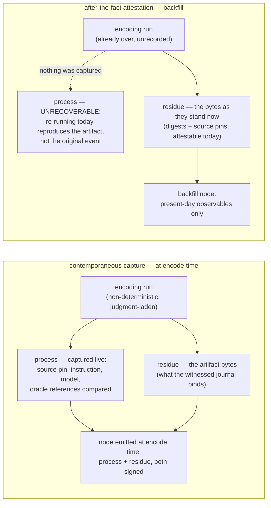
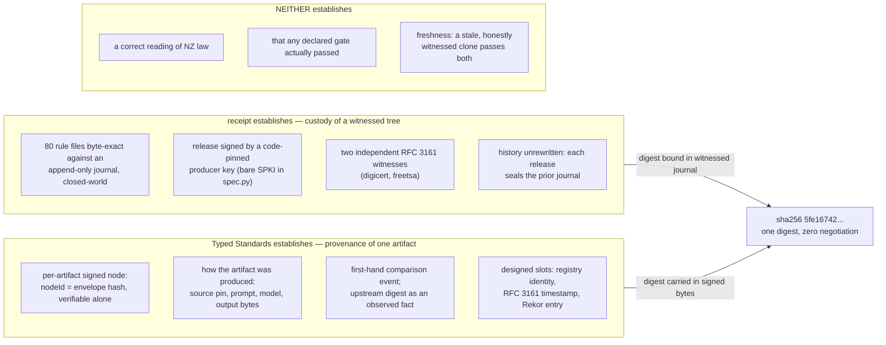
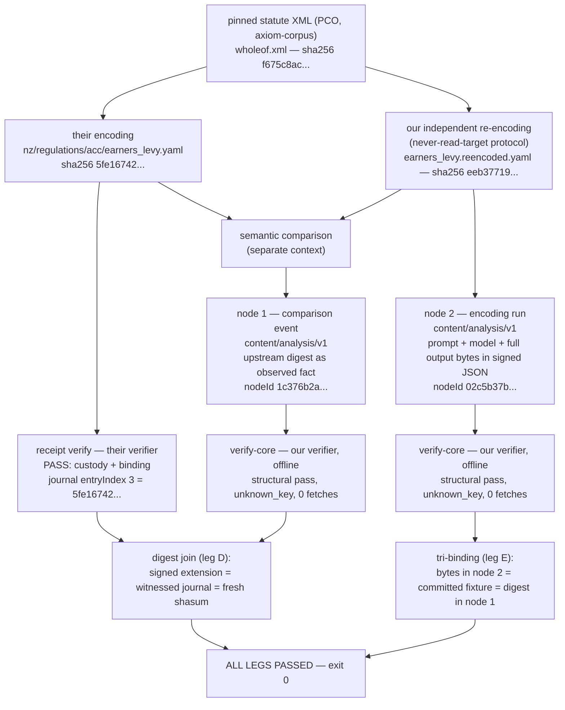

<!-- v13 — 2026-07-29 — intro tightened to elevator-pitch form: two-sentence pitch (tagline + gap), the TS/CAT sentences unchanged, attribution line now carries the experimental-proof-of-concept framing. -->
<!-- v12 — 2026-07-29 — intro expanded into a problem-statement + proposed-solution block above the Executive Summary: grounded recognition of the maintainers' stated mission (their org-profile phrasing — "The world's rules, encoded"; open, machine-readable encodings of statutes, regulations, and policy rules, compiled into executable programs), the provenance-layer observation (witnessed journal / gate tiers / DID-NOT-RUN-with-reason named as the genuinely good start; the production process itself unrecorded; custody-plus-attestation framing), then a solution paragraph keeping the Typed Standards definition sentence and the reference-implementation line verbatim with a fills-exactly-that-gap bridge (no format/key/journal changes). Attribution line unchanged. v11 b679e83; earlier chain below. -->
<!-- v11 — 2026-07-29 — four owner-directed edits: the callout's second clause now says the memo is reproducible from the branch it lives on (replacing "files nothing and asks for nothing"); "A conclusion" renamed "Next steps" (heading + TOC anchor, connective tissue lightly adjusted, no content cut); observations-not-facts terminology sweep across memo prose (signed fixtures and verbatim verdict blocks untouched; mermaid-fence diagram labels left to stay in sync with the committed sidecar SVGs); purpose block + attribution inserted above the Executive Summary (Typed Standards definition from the spec abstract, reference-implementation line, prepared-by line). v10 356550c; earlier chain below. -->
<!-- v10 — 2026-07-29 — side-by-side redesign: the Typed Standards column now defaults to a human-readable envelope summary written in the receipt report's own register (section headers, [ok  ]/[--  ] markers, indented detail), sectioned by verifiability — ESTABLISHED OFFLINE / CARRIED IN THE SIGNED BYTES, INSPECTED BY NO CHECK / NOT VERIFIABLE IN THIS LOCAL PASS — with an explicit presentation-ours label so the visual rhyme can't read as verifier output; the verbatim annotated verify-core JSON verdict moves behind an in-cell toggle (the annotations note moves with it); the node-3 profile toggle below the table is unchanged; render-script CSS for the ours-label + in-cell details. v9 8acc9f3; v8 a8b9472; v7 fce0c0a; v6 7435fee; v5.1 deb9b5c; v5 49bcc8d; v4 archived 3eeea0e; v3 f74ad55; v2 60b9345; v1 dbe1d2d. -->
# Rulespec Interop POC

> **This note is addressed to the rulespec corpus maintainers.** It is a build-side research memo; everything in it is reproducible from the branch it lives on.

*Last updated: 2026-07-29 (v13) — intro tightened to elevator-pitch form; attribution line carries the experimental-proof-of-concept framing. v12 `a5309f1`; v11 `b679e83`; v10 `356550c`; v9 `8acc9f3`; v8 `a8b9472`; v7 `fce0c0a`; v6 `7435fee`; v5.1 `deb9b5c`; v5 `49bcc8d`; v4 archived (`rulespec-interop-poc-v4-archive.md`, `3eeea0e`); v3 `f74ad55`; v2 `60b9345`; v1 `dbe1d2d`.*

1. [Executive summary](#executive-summary)
2. [The demonstration](#the-demonstration)
3. [What Typed Standards would give your corpus](#what-typed-standards-would-give-your-corpus)
4. [What receipt has that Typed Standards lacks](#what-receipt-has-that-typed-standards-lacks)
5. [What adopting would cost](#what-adopting-would-cost)
6. [Next steps](#next-steps)
7. [Appendix — the evidence](#appendix--the-evidence)

Your organization states its aim plainly — "The world's rules, encoded" — and this project shares it from the adjacent ground of machine-readable government information. One layer remains underdeveloped: the deterministic artifacts are published — in the NZ pilot, witnessed with unusual honesty — but how each encoding came to be goes unrecorded, and trust in machine-readable law needs both custody of the bytes and attestation of the production process.

[Typed Standards](https://typedstandards.org) is a content-agnostic open standard for production-process attestation of analytical artifacts: a signed, content-addressed, capture-method-labeled record of how an artifact was produced, verifiable by a third party who does not trust the publisher ([specification](https://github.com/npstorey/civic-ai-tools/blob/main/docs/architecture/typed-standards-specification.md)). The [Civic AI Tools](https://civicaitools.org) project carries its reference implementation.

*Prepared by Nathan Storey, creator of Civic AI Tools and Typed Standards, as an experimental proof of concept for Typed Standards filling that gap.*

## Executive Summary

Independent encodings of the same law will always diverge somewhere. What makes a divergence *explainable* rather than merely observable is a contemporaneous record of **how** each encoding came to be — sources read, instructions run, model, oracle references compared, judgment calls made — and, as far as we can find, no published corpus of machine-readable law carries that record. Your corpora show both halves at once: deterministic, well-bound artifacts — git everywhere, plus in the NZ pilot a witnessed, offline-verifiable corpus journal over all 80 rule files ([rulespec-nz](https://github.com/TheAxiomFoundation/rulespec-nz) [PR #104](https://github.com/TheAxiomFoundation/rulespec-nz/pull/104)) — authored by processes that are non-deterministic, judgment-laden, and unrecorded. A Typed Standards node per encoding run — a ~12 KB signed contemporaneous production record carrying source pin, instruction, model, and complete output bytes — adds exactly that record.

The POC demonstrated the composition end to end for one NZ regulation: two locally-signed nodes, both projects' verifiers — your [receipt](https://github.com/TheAxiomFoundation/receipt) witnessed-corpus verifier and our `@typedstandards/verify-core` — passing offline, joined to your witnessed journal on one SHA-256 digest neither side had to negotiate. The divergence it surfaced (regulation-7 routing for self-employed persons) is the use-case exhibit, not the finding: today that divergence is merely observable — two artifacts, two digests, no way to ask why; with a production record on both sides, the recorded sources, instructions, and judgment points of each run could be compared directly ([Comparison result](#comparison-result)). **Read the [Limitations](#limitations) section before citing any result here** — your verifier came from an unreleased PR branch, our packages are signed with a throwaway key no trust registry lists, and all upstream artifacts are pre-merge.

| Scope | POC artifacts | Status |
|-------|---------------|--------|
| **NZ — Earners' Levy regulation 4** | independent re-encode · node 1 (comparison event) · node 2 (encoding run) · both verifiers offline · digest join | **Complete** — [The demonstration](#the-demonstration) |
| **NZ — profile-bearing form (node 3)** | node 2's record re-expressed under the **speculative, unregistered** profile sketch `axiom/statute-encoding/v0-sketch`; verified offline; never publishable as-is | **Demo only** — [The worked example, executed](#the-worked-example-executed--a-speculative-profile-on-a-real-node) |
| **US — 26 USC § 32** | interface + repository observations only; **no encoding run, no nodes** | **Exhibit of the gap, not POC work** — [appendix exhibit](#the-gap-seen-in-your-us-interface--32--exhibit-only) |

## The demonstration

Everything here is reproducible from branch `poc/rulespec-interop` via `./scripts/verify-rulespec-interop.sh` ([Reproduction](#reproduction)). From the same pinned PCO statute XML your encoding used, the POC independently re-encoded regulation 4 of the Accident Compensation (Earners' Levy) Regulations 2025 (NZ) under a never-read-the-target protocol ([Independence protocol](#independence-protocol)), and recorded three Typed Standards nodes — two canonical records and one demo-only re-expression:

**Node 1 — the comparison event** (`content/analysis/v1`, nodeId `1c376b2a…`): the observation join to your witnessed journal — *your* artifact's digest enters our signed bytes as an **observation**, not a co-signed claim; that digest, the digest your journal binds at entryIndex 3, and a fresh recompute over the pinned clone are identical ([The digest join and the tri-binding](#the-digest-join-and-the-tri-binding)).

**Node 2 — the encoding run** (`content/analysis/v1`, nodeId `02c5b37b…`): the contemporaneous production record, cut from the live run's own records at run time — statute source path and digest in; the complete re-encoded YAML verbatim out; plus the output digest, the model, the full-text encoding prompt, and a signed `independence_protocol` record. This is an **encoder apply manifest** in Typed Standards form — the artifact-class your own witnessed VERIFY.md concedes the NZ corpus has zero of ("no machine check asserts that these rule files carry encoder apply manifests — `rulespec-nz` has none"); the gate that would demand them, `guard/manual-rulespec-changes`, is disabled in the published lane (`run-generated-guard: false`, printed as DID-NOT-RUN in the receipt verdict); backfill tracked in your [axiom-encode#1192](https://github.com/TheAxiomFoundation/axiom-encode/issues/1192).

**Node 3 — the profile-bearing form, demo only** (`content/analysis/v1`, nodeId `77fda183…`): node 2's encoding-run record re-expressed under the **speculative, unregistered** profile sketch `axiom/statute-encoding/v0-sketch` — same prompt, same complete output bytes, same model, same throwaway key — plus a `contentProfile` naming the sketch and a `profileDeclarations` block filling the sketch's required fields with the run's actual specifics. It was never published anywhere and could not be as-is; node 2 remains the canonical honest record. The toggle under the verdicts shows what the profile changes — and what it deliberately does not; the full sketch lives in the appendix ([The worked example, executed](#the-worked-example-executed--a-speculative-profile-on-a-real-node)).

Both verifiers pass offline: your corpus under `receipt verify` (exit 0), all three of our nodes under `@typedstandards/verify-core@0.7.0` with fetch stubbed to throw (zero network calls), plus the digest join (leg D) and the tri-binding (leg E, six readings of the re-encoding digest, one value). Throwaway key, dark #7/#8, no production publish — see [Limitations](#limitations). Full detail — pins, package construction, the [flow diagram](#the-end-to-end-flow) — is in the [appendix](#appendix--the-evidence).

### The two verdicts, side by side

Your verifier's block on the left is verbatim from a run of `./scripts/verify-rulespec-interop.sh` on 2026-07-29 (exit code 0), over the pinned rulespec-nz clone. On the right, the default view is **our summary** of what the Typed Standards envelope for node 1 establishes — written deliberately in your report's register and sectioned by what is verifiable today versus not. It is derived field-for-field from the same run's `@typedstandards/verify-core@0.7.0` verdict (offline, fetch stubbed to throw) and the committed node-1 fixtures; the verdict itself sits verbatim, with our `#` annotations, behind the first toggle inside the cell.

<table class="verdicts">
<tr>
<th>receipt (your verifier) — <code>receipt verify</code> over the pinned rulespec-nz clone</th>
<th>Typed Standards verifier (<code>verify-core</code> v0.7.0) — node 1, offline</th>
</tr>
<tr>
<td>
<pre>
receipt 0.5.0 — rulespec-nz published corpus
  root  /Users/npstorey/code/civic-ai-tools/.rulespec-clones/rulespec-nz
  spec  /Users/npstorey/code/civic-ai-tools/.rulespec-clones/rulespec-nz/verification/spec.py
        sha256 d29da2603a8d168df6596ad038fc22fe71e6a40c778c36c0611dbcff555b3fae
&nbsp;
ESTABLISHED OFFLINE, FROM THIS CLONE ALONE
  [ok  ] custody
         1 release(s), HEAD 0000-363e52fb0f8bb41d.json; producer SPKI f703c8d871f444cd…; witnesses digicert 2026-07-26T16:38:02Z · freetsa 2026-07-26T16:38:02Z
  [ok  ] binding
         80 content file(s) and 7 attested file(s) match the witnessed journal exactly, closed-world
  [ok  ] declaration
         17 gate declaration(s) well formed and complete against the pinned spec (11 public, 6 ci-attested); none re-run here
&nbsp;
DECLARED IN THE WITNESSED JOURNAL — NOT RE-RUN BY THIS COMMAND
  1 of 17 declared gate(s) did not pass cleanly; each is marked below.
  public: you can re-run these yourself from public inputs
    - repo/tracked-paths
    - repo/obsolete-generated-files
    - repo/layout
    - deps/commit-ancestry
    - corpus/release-object-fetch
    - corpus/provenance-commit-ancestry
    - rulespec/companion-tests
    - oracle/policyengine-coverage-classification
    - repo/pytest
    - repo/quality
    - repo/roadmap-coverage
  ci-attested: not reproducible; only the CI run's identity vouches
    - rulespec/proofs-and-claims
    - rulespec/money-proof-atoms
    - rulespec/validate-yaml
    - waivers/ratchet-audit
    - schema/retired-freeze
    - guard/manual-rulespec-changes  [DID NOT RUN — the caller sets run-generated-guard: false in .github/workflows/repository-checks.yml, so this guard was skipped on this commit]
&nbsp;
VERDICT: PASS — custody and corpus binding
  This proves the published rule files are exactly the bytes a code-pinned
  producer key signed and the 2 pinned RFC 3161 authorities (digicert, freetsa)
  witnessed, and that nothing in the recorded history was rewritten. It does
  NOT prove that any declared gate passed, it does NOT prove the encodings
  are a correct reading of the law, and it does NOT prove this clone holds
  the producer's newest release — a stale, honestly witnessed clone also
  passes. Check freshness out of band or via --base-ref.
</pre>
</td>
<td>
<p class="ours-label"><em>presentation ours — this summary is derived field-for-field from the verify-core verdict (toggle below for the verbatim JSON) and the committed node-1 fixtures; unlike the left column, it is not verifier output.</em></p>
<pre>
verify-core 0.7.0 — Typed Standards node 1 (comparison event), offline
  node  1c376b2a56f9e4167a7bb762c8984cf60a3a9624a8316ded00e863384f191b08
  type  content/analysis/v1 · kid local:rulespec-interop-poc-2026-07
  network calls attempted: 0
  markers  [ok  ] a §9.2 check reported this outcome · [--  ] no check vouches here
&nbsp;
ESTABLISHED OFFLINE, FROM THIS BUNDLE ALONE
  [ok  ] envelope integrity (#1)
         JCS canonical bytes re-hashed (SHA-256); recomputed hash equals the
         envelope hash — hashMatch true, envelopeIntegrity verified
  [ok  ] signature (#2)
         Ed25519ph verifies against the public key embedded in the bundle;
         kid local:rulespec-interop-poc-2026-07
  [ok  ] canonicalization rule (#3)
         resolves: legacy-json/v1 — the default content profile's rule
  [ok  ] content hash (#4)
         sha256 multihash matched —
         b48ea1e7eae8b8445a0ada2272ffa19953aaa7c1cc718e469437a38b6fc5a748
  [ok  ] type resolution (#12)
         content/analysis/v1
  [ok  ] nodeId binding (#13)
         nodeId = recomputed envelope hash (1c376b2a…)
  [ok  ] captureMethod vocabulary (#15)
         claude-code-jsonl-readback · profileType ai-assisted-analysis
         (nearest-fit chat label; an honest encoder label is #15-blocked — finding 1)
  (the verdict's remaining fields: lifecycle active, source "none", empty chain —
   #10 checks only the chain the carrier supplies, and none was; blobRefs [] —
   #9 had nothing to verify)
&nbsp;
CARRIED IN THE SIGNED BYTES — INSPECTED BY NO §9.2 CHECK
  [--  ] extension block org.civicaitools.rulespec-interop
         your artifact's digest as an observation — sha256 5fe16742… — equal to
         the digest your witnessed journal binds at entryIndex 3: the join key;
         plus release/toolchain pins, paths, and the comparison record
         (harness legs D/E read these; no verifier check interprets them)
  [--  ] prompt
         full text rides in the signed bytes (promptVisibility full_text)
  [--  ] provenance
         the package's W3C PROV-O graph (prov / dcterms / civic contexts)
  [--  ] contentProfile
         absent ⇒ default; the node-3 toggle below the table shows the same run
         re-expressed under the speculative profile sketch
&nbsp;
NOT VERIFIABLE IN THIS LOCAL PASS — DARK BY CHOICE
  [--  ] key trust (#5)
         unknown_key — throwaway POC key; no trust registry lists it
  [--  ] signer identity (#14)
         no_registry_identity — claimed: local:rulespec-interop-poc
  [--  ] RFC 3161 timestamp (#7)
         absent — no production publish, so no token exists to check
  [--  ] Rekor inclusion (#8)
         absent — no transparency-log entry exists to check
&nbsp;
SUMMARY (ours): structural pass — hash, signature, content binding, type, and
  vocabulary all recompute offline from this bundle alone. It does NOT establish
  key trust, signer identity, timestamp, or log inclusion: those anchors are
  dark by choice here, and the production publish that lights them is a
  separately gated step, not taken.
</pre>
<details>
<summary><strong>Toggle: the verbatim verify-core JSON verdict (annotated)</strong></summary>
<pre>
=== Typed Standards verifier (verify-core v0.7.0) — verdict (verbatim, FULL) ===
{
  "hashMatch": true,
  "envelopeIntegrity": {
    "status": "verified"
  },
  "recomputedHash": "1c376b2a56f9e4167a7bb762c8984cf60a3a9624a8316ded00e863384f191b08",
  "nodeId": "1c376b2a56f9e4167a7bb762c8984cf60a3a9624a8316ded00e863384f191b08",
  "signatureValid": true,
  "kid": "local:rulespec-interop-poc-2026-07",
  "hasSigning": true,
  "rekorVerified": null,
  "rekorDetails": null,
  "rekorInclusion": null,
  "hasRekor": false,          # dark by choice: no Rekor entry
  "hasTimestamp": false,      # dark by choice: no production publish,
  "rfc3161": null,            #   so no RFC 3161 token
  "keyTrust": {
    "status": "unknown_key",  # expected: signed with the POC's throwaway
    "verified": false,        #   key; no registry lists it
    "kid": "local:rulespec-interop-poc-2026-07"
  },
  "blobRefsVerified": null,
  "blobRefs": [],
  "contentCanonicalization": {
    "status": "ok",
    "rule": "https://typedstandards.org/canonicalization/legacy-json/v1"
      # the default content profile's rule — contentProfile was omitted ⇒ default;
      # no statute-encoding profile exists yet (see the sketch)
  },
  "contentHash": {
    "status": "ok",
    "algorithms": [
      "sha256"
    ],
    "matched": "sha256",
    "contentHash": {
      "sha256": "b48ea1e7eae8b8445a0ada2272ffa19953aaa7c1cc718e469437a38b6fc5a748"
    }
  },
  "typeResolution": {
    "status": "ok",
    "type": "content/analysis/v1"
  },
  "signerIdentity": {
    "status": "no_registry_identity",
      # verifier vocabulary; spec #14 leaves the unknown-kid branch unspecified
    "claimed": "local:rulespec-interop-poc"
  },
  "captureMethodVocab": {
    "status": "ok",
    "captureMethod": "claude-code-jsonl-readback",
    "profileType": "ai-assisted-analysis"
      # nearest-fit chat label; an honest encoder label is #15-blocked today
      # (finding 1)
  },
  "lifecycle": {
    "status": "active",
    "source": "none",
    "chain": []
  }
}
=== network calls attempted: 0 ===
</pre>
<p>Annotations (<code>#</code>) are ours; <code>./scripts/verify-rulespec-interop.sh</code> reproduces the un-annotated verdict.</p>
</details>
</td>
</tr>
</table>

<details>
<summary><strong>Toggle: the same run under the speculative contentProfile (node 3)</strong></summary>

Why doesn't `contentProfile` appear in the verdict at all? Because no §9.2 check reads `contentProfile`, the verdict *cannot* show it — the value rides signature-covered but un-inspected ([finding 9](#findings-index)).

What node 3 declares, verbatim from the committed `scripts/fixtures/rulespec-interop-encoding-profile-payload.json` (`contentProfile` is a top-level payload field; `profileDeclarations` sits inside the extension block `org.civicaitools.rulespec-interop`; long digests elided to eight hex characters — the committed fixture carries the full values):

```jsonc
"contentProfile": "axiom/statute-encoding/v0-sketch",   // SPECULATIVE — unregistered; no verifier recognizes it
"profileDeclarations": {
  "corpusSourcePin": {
    "release": "nz-rulespec-2026-07-20",
    "contentSha256": "58089115…",
    "cutCommit": "92ac9c1b…"
  },
  "corpusCitationPath": "nz/regulation/regulation/public/2025/0018/regulation/4",
  "proofAtomDiscipline": "verbatim-excerpt",
  "oracleComparisons": {
    "status": "not-run",
    "reason": "this encoding run compared against no oracle — no oracle harness exists in this POC; recorded not-run rather than omitted, per the DID-NOT-RUN-with-reason discipline the sketch borrows from the upstream gate-tier taxonomy"
  },
  "gateDeclarations": {
    "status": "none-declared",
    "reason": "no gates were declared or run for this encoding run; nothing here may read as a pass"
  },
  "modelIdentity": "anthropic/claude-fable-5",
  "outputDigest": "eeb37719…",
  "applyManifestRef": "self"
}
```

The verdict delta against node 2, machine-checked (34 leaf fields, flattened-JSON comparison): exactly **three fields differ** — `nodeId` and `recomputedHash` (`77fda183…`) and `contentHash.contentHash.sha256` (`b30b548f…`); the remaining **31 leaves are identical**, including every deliberately-not-green one, and the sketch id appears **nowhere in the verdict**. Harness leg C(3) is the tripwire: it asserts that ignored state field by field and fails if a verifier ever starts treating the sketch as registered.

The profile is **speculative and unregistered**: §9.2 check #15 would REJECT its `captureMethod` values today, and our own production publish API would 400 this `contentProfile` value (`default` and `datHere` are the only accepted values). Node 2 remains the canonical honest record; the full sketch and discussion are in the appendix — [The worked example, executed](#the-worked-example-executed--a-speculative-profile-on-a-real-node).

</details>

#### Your verifier: `receipt verify` over the pinned rulespec-nz clone

**What this does and does not establish.** The PASS covers **custody and binding only**: the 80 rule files and 7 attested files are byte-exact against an append-only journal a code-pinned Ed25519 key signed and two independent RFC 3161 authorities witnessed, closed-world (no unlisted file, no missing file), history unrewritten. The verdict's own text disclaims the rest, and your `VERIFY.md` expands it: it does **not** re-run any of the 17 declared gates (6 are `ci-attested` — not reproducible by outsiders), does **not** prove the encodings are a correct reading of NZ law, does **not** prove freshness (a stale, honestly witnessed clone passes), and one declared gate — `guard/manual-rulespec-changes`, the very gate that would demand encoder apply manifests — **did not run at all** (`run-generated-guard: false`), which the journal is required to declare precisely so its absence cannot read as a pass.

#### Our verifier, node 1: `@typedstandards/verify-core@0.7.0`, offline, fetch stubbed to throw

**What this does and does not establish.** The structural checks pass with zero network access: envelope hash recomputes (spec §9.2 #1), the Ed25519ph signature verifies against the embedded key (#2), the content-canonicalization rule resolves and the multihash content hash matches (#3, #4), type resolves (#12), nodeId equals the envelope hash (#13), and the captureMethod value is in the declared vocabulary (#15). But the verdict is **deliberately and honestly not green**: key trust is `unknown_key` (#5 — the throwaway key is in no trust registry), signer identity degrades to `no_registry_identity` (#14), and checks **#7 (RFC 3161 timestamp) and #8 (Rekor transparency-log inclusion) are unverified** — there is no token and no entry to verify. The harness asserts this exact shape field by field; an unexpectedly *green* #5/#7/#8 would itself fail the harness. This pass proves the digest join and the package shape. It does **not** constitute full-depth third-party verification of our leg — that requires the production publish. One vocabulary note: `unknown_key` is spec vocabulary — one of the seven §9.2 #5 registry-verdict `keyTrust` values (§8.3.3) — while `no_registry_identity` is the reference verifier's own status, since spec #14 defines only the mismatch outcome `signer_identity_mismatch` and leaves the unknown-kid branch unspecified — a small spec-silence observation in its own right.

#### Our verifier, node 2: stated as a machine-checked diff against node 1

The verify-core verdict for the encoding-run node was diffed field-by-field against node 1's (34 leaf fields; flattened-JSON comparison, this session). Exactly **three fields differ**: `nodeId` and `recomputedHash` are `02c5b37bfaf67d50f2293febc760b1ed5bc0831c96364a1cea9fc2ea9df7d7b7`, and `contentHash.contentHash.sha256` is `2a1fa337b25f40ecdf3f3dc87667dd8e7de46dbbdb6c53dfa7bec8e4629aa91c`. The remaining **31 leaf fields are identical**, including every deliberately-not-green one: `keyTrust.status: "unknown_key"`, `signerIdentity.status: "no_registry_identity"`, `hasTimestamp: false`, `hasRekor: false`, `lifecycle: {status: "active", source: "none", chain: []}`, and zero network calls attempted. Everything the paragraph above establishes and declines to establish for node 1 applies to node 2 unchanged.

## What Typed Standards would give your corpus

A technical fit assessment, not a roadmap for either project. (Full expansions: v5.1 at `deb9b5c`.)

1. **The missing artifact-class, demonstrated.** Node 2 *is* an encoder apply manifest in Typed Standards form, produced contemporaneously and joined to your journal by digest. The single most concrete thing the POC shows.
2. **A public transparency log — worth testing, limit stated.** No public append-only log exists anywhere in your stack (verified: the pinned `receipt` install and the full rulespec-nz tree grep clean); freshness is the gap your own verdict names, checked out-of-band against producer-mutable surfaces. A TS production publish adds a Rekor entry (§9.2 #8) — public, append-only, producer-independent — but it closes the gap only **partly, and only online**: inclusion proves existence-when-logged, not absence-of-later-entries, and the later-entry check needs producer logging discipline. It also trades against finding 7's commit-now-publish-later mode (a Rekor commitment is public in both visibility states — §8.3.2; ADR-0016's honesty note).
3. **Publisher identity and rotation via a trust registry.** Your producer key is a bare SPKI pinned in committed verification code (`verification/spec.py`, deliberate) — rotation is a reviewed code change, no kid, no validity window. TS resolves `kid` against `/.well-known/typed-publisher.json`: rotation is a registry entry, exercised here in the negative (`unknown_key`).
4. **Per-artifact citability.** Your unit of verification is the whole clone, closed-world — by design. A TS node verifies alone, offline, no clone required. Complementary, not competing.
5. **A designed home for correctness claims both verifiers disclaim.** `attestation/evaluates/v1` (spec §8.12 — ratified, not yet operationalized): a separately-signed evaluation by a named evaluator.

## What receipt has that Typed Standards lacks

Three places your design is concretely ahead (full reasoning: v1 findings 3–5 at `dbe1d2d`):

1. **Domain-separated signing.** Your `sign_payload(…, *, domain: bytes)` *requires* every signing call to name its role; TS §8.3.1 signs the bare envelope-hash hex string — an implicit `domain=b""` by omission. Within-TS cross-class replay is excluded by construction (the `type` URI sits inside the hashed envelope); the load-bearing case is **cross-protocol reuse of the same key**, exactly what a required domain argument anticipates.
2. **The gate-tier taxonomy.** receipt classifies every declared gate as `public` (outsider re-runnable) or `ci-attested` (only the CI run's identity vouches) and prints DID-NOT-RUN gates with the reason inline. TS has no vocabulary for *declared-but-only-publisher-reproducible* claims — a genuinely better honesty surface on your side.
3. **Lifecycle completeness.** TS §8.10 asserts an append-only lifecycle, but §9.2 #10 verifies only the chain the proof carrier supplies — this run's verdicts show `lifecycle.source: "none"`, empty chain, still `active`. Your `release_chain` recomputes every state from the append-only JSONL, so an omitted correction is a verification failure, not a silent absence.

Complementary gaps: you built the custody layer TS defers; TS built the per-artifact provenance layer your own published lane says is missing.

## What adopting would cost

No format change, no key change, no journal change — the POC changed nothing of yours (leg A asserts both clones bit-identical to the pinned SHAs and clean). Adoption is one TS node per encoding run, emitted at encode time in node 2's form. Nor is it blocked by the [finding 1/2](#findings-index) vocabulary gap: an upstream-shipped encoder Producer Profile would degrade gracefully on our verifier today — an unresolvable bundle reports `producerProfile_bundle_unresolved` with the declared value preserved verbatim (§9.2 #15) — until the Q32 bundle-distribution mechanism lands.

For the 80 existing files, a backfill node is possible but bounded, and the bound is structural:



The determinism attaches to the residue — the bytes your witnessed journal binds — not to the generative process. For those 80 files no process record exists, so a backfill node can only attest present-day observables, and no after-the-fact act can become a witness of a historical event: even re-running today's toolchain to byte-identical output would demonstrate reproduction of the artifact, not provenance of your encoding event. Contemporaneous capture at encode time is the half only you can do; the backfill half — the #1192 arc — is bounded in any format, yours or ours.

## Next steps

What stands demonstrated: three locally-signed Typed Standards nodes over one NZ regulation; both verifiers passing offline — your corpus under `receipt verify` (exit 0), our three nodes under `verify-core` with zero network calls; one digest join to your witnessed journal that neither side had to negotiate; and a six-way byte binding of the re-encoding bytes (six independent readings, one value). What that composition establishes — and what it deliberately does not — is one appendix section, [What a passing pair establishes — and what it does not](#what-a-passing-pair-establishes--and-what-it-does-not), bounded by [Limitations](#limitations). Three things point forward from here. The speculative profile run (node 3) added one more demonstration: the envelope can say what its content *is* — one of your statute encodings, produced under your declared disciplines — but nothing inspects that statement yet; giving it teeth is an ADR-gated path that starts with a named adopter, not with this memo. The findings index — nine observations, nothing filed — is in the [appendix](#findings-index), awaiting triage on our side. And the standing boundary is unchanged: every node here is signed with a local throwaway key, so full-depth third-party verification of our leg requires a production publish, and that publish has not happened. Everything lives on this branch: `./scripts/verify-rulespec-interop.sh` reproduces every claim above from a clean checkout.

---

## Appendix — the evidence

*Each block below is collapsible; [Limitations](#limitations) at the end stays visible.*

<details>
<summary><strong>The gap, seen in your US interface (§ 32 — exhibit only)</strong></summary>

### The gap, seen in your US interface (§ 32 — exhibit only)

**No POC artifact exists for US law: the encoding run, both nodes, both verifier legs, and the digest join are all NZ ([The demonstration](#the-demonstration)). This section only documents what the interface and repository show.** All observations recorded 2026-07-29 — interface observations in the app's provision view, repository observations via the GitHub API.

Your public app renders US federal statutes per-provision. For 26 USC § 32(a)(1), the provision view shows the breadcrumb `AXIOM / US FEDERAL / STATUTES / TITLE 26 / § 32 / (A) / (1)`; one derived encoding (`eitc_phased_in`) sourced from `statutes/26/32.yaml`; the sentence **"This encoding covers the parent provision us/statute/26/32; no dedicated encoding exists for this exact provision yet."**; a "View on GitHub" link; and a RULES code panel. § 32(k) lists three derived encodings; its RULES panel displays the rulespec source itself, proof atoms included (`kind: parameter_table`, `corpus_citation_path: us/statute/26/32`) — even the proof atoms, the artifact's own citations into the corpus, bind *what* a value claims to derive from, not *how* the derivation was performed.

<!-- SCREENSHOT 1 (captured; staged at .rulespec-clones/ui-screenshots/us32a1-provision-view-eitc-phased-in.png): §32(a)(1) provision view -->
<!-- SCREENSHOT 2: eitc_phased_in RULES panel for §32(a)(1) — pending -->
<!-- SCREENSHOT 3 (captured; staged at .rulespec-clones/ui-screenshots/us32k-provision-view-three-encodings.png): §32(k) view, three derived encodings -->
<!-- SCREENSHOT 3b (captured; staged at .rulespec-clones/ui-screenshots/us32k-rules-panel-eitc-phase-in-rates.png): §32(k) RULES panel showing eitc_phase_in_rates -->

The app's front door renders EITC as an executable rule graph — `EITC Allowed` (42 rules) and `EITC Before Eligibility` (45 rules) wiring into `RESULT · EITC`, with a "Run a scenario" affordance. The EITC detail panel answers nearly every question a reader could ask of the artifact, and none about the event that produced it:

| What the interface answers (the artifact's present state) | What nothing records (the production event) |
|-----------------------------------------------------------|---------------------------------------------|
| `SOURCE 26 USC 32(a), 32(c)(1)(E), 32(i), 32(k)` | when the encoding happened |
| `STATUS Encoded` — the one status word | by what process |
| `ENTITY TaxUnit` · `PERIOD Year` · `UNIT USD` | from which source snapshot |
| `BUILT FROM · 2` · `USED BY · 0` ("nothing — a final result") | under what instructions |
| the formula: `if EITC Allowed: EITC Before Eligibility else: 0` | against which oracle references |
| "Read the law →" · "View on GitHub" | — |

<!-- SCREENSHOT 5 (captured; staged at .rulespec-clones/ui-screenshots/app-scenario-graph-eitc-detail-panel.png): scenario-graph view with the EITC detail panel (STATUS: Encoded) -->

Repository side, same day: [rulespec-us](https://github.com/TheAxiomFoundation/rulespec-us) is public; `us/statutes/26/32.yaml` is a 706-line `rulespec/v1` module citing `corpus_citation_path: us/statute/26/32` — a whole-section citation; and the repo has **no `verification/` directory and no corpus journal** (code search: zero hits) — the witnessed-corpus lane exists only in the NZ pilot. The pinned axiom-corpus snapshot this POC holds (`92ac9c1b…`) includes `us` statute sources.

<!-- SCREENSHOT 4: GitHub blob/history for us/statutes/26/32.yaml — pending -->

The git history behind "View on GitHub" is, today, the only production record there is — invisible as an absence until two encodings disagree, and then the whole problem. The status vocabulary is the tell: an artifact can be `Encoded`; nothing anywhere says how it came to be encoded.

</details>

<details>
<summary><strong>The two-layer picture</strong></summary>

### The two-layer picture

receipt establishes **custody of a witnessed tree**: the bytes you hold are exactly what a code-pinned producer key signed and two independent RFC 3161 authorities witnessed, closed-world, history unrewritten. Typed Standards establishes **provenance and identity of one artifact**: a per-artifact signed node stating how a specific thing came to be, portable on its own. The seam is one SHA-256 digest both sides already compute: your witnessed journal binds it, our signed bytes carry it as an observation.



*The NEITHER lane is load-bearing: both verifiers disclaim those properties in their own output ([the two verdicts](#the-two-verdicts-side-by-side)), and the freshness cell is symmetric by both systems' own normative text.*

</details>

<details>
<summary><strong>The end-to-end flow</strong></summary>

### The end-to-end flow

[The demonstration](#the-demonstration), as one picture:



*The join (leg D) and the tri-binding (leg E) are separate claims; they meet only at the final exit-0.*

</details>

<details>
<summary><strong>Pins and upstream state</strong></summary>

### Pins and upstream state

All pins are enforced by `scripts/verify-rulespec-interop.sh` (leg A fails if a clone drifts from its SHA or has a dirty tree). Upstream state as of 2026-07-28:

| What | Pin |
|------|-----|
| rulespec-nz | `7dd2b1ad8f13ff934aa53af562a34ea7451502f6` ([PR #104](https://github.com/TheAxiomFoundation/rulespec-nz/pull/104) head, **OPEN**, via `pull/104/head`) |
| axiom-corpus | `92ac9c1bedf62968eeea9a873361f49075364157` (the commit the pinned corpus release was cut from) |
| receipt | `c711adc0d0fb514b8806f83b36579e4cb4c621a7` ([PR #14](https://github.com/TheAxiomFoundation/receipt/pull/14) head, **OPEN**; `receipt 0.5.0`, unreleased — PyPI's latest is 0.4.0) |
| @typedstandards/verify-core | `0.7.0` (npm) |
| Corpus release | `nz-rulespec-2026-07-20`, content sha256 `58089115f520cb99a3b90e3be503be63041ebe4a72bec69f24a2f115ed1ba196` |
| Related upstream issues | receipt#13, receipt#7, axiom-encode#1192 (notary cutover / apply-manifest backfill) |

**Weaker-claim caveat:** the `receipt` used throughout was installed from the PR #14 head — an unreleased branch, not a published wheel; every "your verifier passes" statement is about that branch state. **Toolchain pin:** the POC follows PR #104's own `.axiom/toolchain.toml`, which names release `nz-rulespec-2026-07-20` (content sha256 above) — the corpus tree the witnessed journal actually binds (the toolchain file is itself one of the journal's seven attested files); a later release `nz-rulespec-2026-07-25` exists upstream and was deliberately not used. **Statute source:** the official PCO XML ingested in the pinned corpus, `data/corpus/sources/nz/regulation/2026-06-16-rulespec-nz-pco/regulation/public/2025/0018/wholeof.xml`, sha256 `f675c8ac89dab2ed08c6e228b93c90c65f0d9aa29425a783790f08599ef0f574`; provision id `LMS1019194`; corpus citation path `nz/regulation/regulation/public/2025/0018/regulation/4`.

</details>

<details>
<summary><strong>Independence protocol</strong></summary>

### Independence protocol

The re-encoding was produced by an orchestrated multi-agent run under a protocol stricter than originally planned: the encoding agent **never read** `earners_levy.yaml` or `earners_levy.test.yaml` at any point — not merely "drafted first, then looked." It learned the `rulespec/v1` schema from the repo's own documentation (`.axiom/repository-structure.yaml`, `README.md`, `CONTRIBUTING.md`, `AGENTS.md`, `docs/axiom-ecosystem-integration.md`) and four exemplar encodings of unrelated provisions (`nz/regulations/rma_district_plans/wellington_city/supermarket_zoning.yaml`, `nz/regulations/social_security/childcare_assistance/core.yaml`, `nz/regulations/student_allowances/core.yaml`, `nz/regulations/health_entitlement_cards/community_services_card/core.yaml`). Repo-wide greps during encoding were count-only, and the one recursive grep that could have surfaced the target file ran with a `grep -v earners_levy` filter and displayed nothing. The digest recomputation and semantic comparison were then done by a **separate context** that had not produced the encoding.

**Evidence basis, stated honestly:** the independence claim rests on the audited per-agent file-consultation record (the run's subagent transcripts), which is not a committed artifact on this branch. A reader who does not accept that record should treat the comparison as informative rather than adversarially independent. What *is* mechanically verifiable is byte-level non-derivation in the trivial sense: the two files differ (`eeb37719…` vs `5fe16742…`). Node 2 additionally carries the protocol as a signed `independence_protocol` record (never-read-target plus the nine schema-source files above), which makes the claim portable and tamper-evident — but see Limitations item 6.

</details>

<details>
<summary><strong>Package construction</strong></summary>

### Package construction

Both nodes were built locally to the Typed Standards package schema: JCS canonicalization under the `legacy-json/v1` content rule, multihash `contentHash`, envelope hash = `nodeId`, Ed25519ph per spec §8.3.1. Neither node claims to reproduce, endorse, or co-sign the upstream encoding — node 1's extension block `org.civicaitools.rulespec-interop` carries the upstream observations, inside the signed canonical bytes; the harness prints containment offsets as proof (node 1: upstream digest at byte 1209 of 9020 JCS bytes; node 2: output digest at byte 1318 of 12055, the complete re-encoded YAML at byte 1886). Both are signed with a **throwaway local key**, kid `local:rulespec-interop-poc-2026-07`, signer `local:rulespec-interop-poc` — deliberately absent from the trust-registry snapshot in the commitment fixtures. No TSA token, no Rekor entry, `visibility: committed`, **no production publish**. The checks left dark are exactly the spec's **external anchors** (trust registry, RFC 3161 TSA, Rekor log — spec §7.3); a production publish is what lights them.

</details>

<details>
<summary><strong>The digest join and the tri-binding</strong></summary>

### The digest join and the tri-binding

The exact claims, no more. Leg D — the join between the two systems:

```
extension observed_upstream_artifact_sha256: 5fe16742f55876ab33a6560793295346f3bad34912f09b7b84311436be2effed
corpus-journal entryIndex 3 sha256:          5fe16742f55876ab33a6560793295346f3bad34912f09b7b84311436be2effed
fresh shasum -a 256 (pinned clone):          5fe16742f55876ab33a6560793295346f3bad34912f09b7b84311436be2effed
```

Three independently sourced values — inside our signed canonical bytes, in your witnessed journal at entryIndex 3 for `nz/regulations/acc/earners_levy.yaml`, and freshly recomputed over the pinned clone — are identical. (The companion test file joins the same way at entryIndex 2.) Leg E — the tri-binding of the re-encoding bytes:

```
sha256 of output bytes carried in node 2's signed package:    eeb3771924255c2f0c8b9cd393b22b8dc19667651b62322f42017e16e504e88b
fresh shasum -a 256 of committed earners_levy.reencoded.yaml: eeb3771924255c2f0c8b9cd393b22b8dc19667651b62322f42017e16e504e88b
node 2 extension output_sha256:                               eeb3771924255c2f0c8b9cd393b22b8dc19667651b62322f42017e16e504e88b
node 1 extension our_reencoding_sha256:                       eeb3771924255c2f0c8b9cd393b22b8dc19667651b62322f42017e16e504e88b
```

**What the join is, and is not:** our signed envelope contains an **observation about your published artifact**, confirmed by your own verification structure — anyone holding our packages and your clone can re-derive every leg offline. It is a harness leg rather than a verifier check, deliberately: extension content is signature-covered but semantically advisory (spec §8.1.6; no §9.2 check interprets extension contents), so legs D and E live above what any conformant verifier checks. And it is *not* a claim that our re-encoding reproduced your bytes — it did not, and was never expected to (`eeb37719…` vs `5fe16742…`): independent YAML serializations of independently made encoding judgments do not collide.

</details>

<details>
<summary><strong>Comparison result</strong></summary>

### Comparison result

**Classification: (c) semantically different at module level** — with the honest counterpoint that, restricted to regulation 4's rate schedule alone, the two encodings would classify as **(b) semantically equal with byte differences**: same three rates, same effective dates (2025-04-01 / 2026-04-01 / 2027-04-01, third band open-ended), numerically identical under unit conversion — our per-$100 Money values 1.45 / 1.52 / 1.59 are exactly your fractional Rate values 0.0145 / 0.0152 / 0.0159 × 100 — and the same corpus citation path.

The meaning-bearing differences, laid out neutrally (neither reading is assumed correct):

1. **Regulation-7 routing.** Regulation 4's paragraph structure gives self-employed persons under a weekly-compensation purchase agreement the regulation-7 amount, self-employed persons within regulation 6's hours/earnings gate the regulation-6 amount — with the express exclusion "regulation 6 applies (but regulation 7 does not apply)" — and everyone else the standard rate. Our module encodes this as a derived selector with regulation-7 priority. Your module has **no routing or selector rule**: its regulation-6 derived amount (`acc_low_self_employed_minimum_levy_excluding_gst`) is gated only on regulation 6's own hours/earnings conditions, with no regulation-7 exclusion, and no rule in the module selects which amount is the levy payable for a person to whom multiple pathways apply.
2. **Module scope.** Your module spans regulations 4–9 plus extra-statutory Inland Revenue administration values (GST-inclusive rates 0.0167 / 0.0175 / 0.0183; maximum-earnings caps 152790 / 156641 / 160244; a cents-rounding scale) across 12 rules (7 parameters, 5 derived), and applies the regulation-5 earnings cap inline in its standard-levy formulas. Our module encodes regulation 4 only, across 2 rules (1 parameter, 1 derived), deferring the regulation-5 cap and the regulation-6/-7 formulas as out of scope.
3. **(Representational, not meaning-bearing.)** dtype/unit choice (Money-per-$100 vs fractional Rate) and proof-atom style — our 8 atoms all carry verbatim statute excerpts; yours are citation-path-only with no excerpts.

**Which reading each reflects:** ours reads regulation 4 as a rate schedule *plus an exclusive routing directive*, with the regulation-6/-7 formulas external. Yours treats the regulations package as a **component library** — parameters and standalone amounts — leaving the (b)/(c) selection and the regulation-7-priority limb unencoded, presumably for downstream composition. That "presumably" is an inference of ours — your repo does not state the intent. Both are defensible engineering positions; the divergence is exactly the kind of encoding judgment that provenance records and comparison events exist to surface.

</details>

<details>
<summary><strong>What a passing pair establishes — and what it does not</strong></summary>

### What a passing pair establishes — and what it does not

Composing the two verdicts, a party holding this branch plus the pinned clones can establish, fully offline:

- Your published encoding is byte-exact against an append-only, dual-witnessed, closed-world journal signed by a code-pinned key (receipt's PASS).
- Our two records — the comparison event and the encoding run — are each byte-exact against their own envelope hashes, signed by the embedded key, with the upstream digest (node 1) and the complete re-encoding bytes (node 2) contained in the signed canonical JSON (the containment offsets in [Package construction](#package-construction)).
- The digest in our signed record, the digest in your witnessed journal, and the bytes on disk agree (the triple join) — and the re-encoding bytes node 2 carries, the committed fixture, and the digest node 1 records agree (the tri-binding).

It does **not** establish — and both verifiers say so in their own output:

- That any of your 17 declared gates passed (receipt reports declarations, re-runs nothing; 6 gates are `ci-attested` and not outsider-reproducible; `guard/manual-rulespec-changes` did not run at all).
- That either encoding is a correct reading of New Zealand law (receipt's verdict text; TS spec §9.3 item 2 — correctness is a separately-signed attestation, never an envelope property).
- That the clone is fresh (a stale, honestly witnessed clone passes receipt; check freshness out of band). TS discloses the symmetric property in its own text: an offline self-contained bundle verifies against the trust registry as of the bundle's `generatedAt` snapshot, post-snapshot revocations invisible — framed by spec §9.4 as offline physics, not a gap to fix (§10.2 states the same boundary) — the exact analog of receipt's stale-clone disclaimer.
- That our packages are trustworthy to a third party: the key is `unknown_key`, there is no timestamp, no transparency-log entry, and no registry identity — for both nodes. Checks #7/#8 are unverified. Full-depth third-party verification of our leg requires the production publish, which has not happened.

</details>

<details>
<summary><strong>The worked example, executed — a speculative profile on a real node</strong></summary>

### The worked example, executed — a speculative profile on a real node

*Speculative and non-normative — research-doc form per the Xanadu doctrine. Nothing below is registered; §9.2 check #15 would REJECT these `captureMethod` values today, by design; our own production publish API would 400 the `contentProfile` value below (`default` and `datHere` are the only accepted values). Promotion runs through an ADR with a named adopter (Q32 mechanics for bundle distribution).* Every element is discipline the corpus already practices, traceable to an artifact of yours the POC holds:

```yaml
# HYPOTHETICAL — not a registered profile; #15 rejects these values today
profileId: statute-encoding/v0-sketch
captureMethodVocabulary:
  - encoder-pipeline-run       # agentic/deterministic encoder over a pinned corpus source (your axiom-encode lane)
  - chat-session-encoding      # hand-authored / AI-chat encoding runs (node 2's case)
requiredDeclarationsPerRun:
  corpusSourcePin:             # your .axiom/toolchain.toml discipline
    { release: nz-rulespec-2026-07-20, contentSha256: "58089115…", cutCommit: "92ac9c1b…" }
  corpusCitationPaths: required  # e.g. nz/regulation/regulation/public/2025/0018/regulation/4
  proofAtomDiscipline: verbatim-excerpt | citation-only
  oracleComparisons:           # which oracle, and the outcome
    - { oracle: policyengine-coverage-classification, outcome: declared }
  gateDeclarations:            # your tier taxonomy, flowing back toward TS per finding 4
    tiers: [public, ci-attested, not-run-with-reason]
  modelIdentity: required      # model/tool that produced the bytes
  outputDigest: required       # sha256 of the produced rule file
  applyManifestRef: required   # linkage to the encoder apply manifest
```

This sketch is now more than a sketch: **node 3** (`content/analysis/v1`, nodeId `77fda183d8cb978c95bc761fb821d0e31c2a54c496dbd6182f4f6b6e0c3d11a8`, contentHash sha256 `b30b548f1901f88bd0520a5ada62fa48cedf0e8862946556830f18b5647f64d4`) is node 2's encoding-run record re-expressed in the profile-bearing form — same prompt, same complete output bytes, same model, same capture label, same throwaway key — plus a `contentProfile` naming the sketch (namespaced on the node as `axiom/statute-encoding/v0-sketch`) and a `profileDeclarations` block filling the sketch's required fields with the run's actual specifics. From the signed payload:

```jsonc
"contentProfile": "axiom/statute-encoding/v0-sketch",   // SPECULATIVE — unregistered; no verifier recognizes it
"profileDeclarations": {
  "corpusSourcePin": { "release": "nz-rulespec-2026-07-20", "contentSha256": "58089115…", "cutCommit": "92ac9c1b…" },
  "corpusCitationPath": "nz/regulation/regulation/public/2025/0018/regulation/4",
  "proofAtomDiscipline": "verbatim-excerpt",
  "oracleComparisons": { "status": "not-run", "reason": "this encoding run compared against no oracle — no oracle harness exists in this POC…" },
  "gateDeclarations": { "status": "none-declared", "reason": "no gates were declared or run for this encoding run; nothing here may read as a pass" },
  "modelIdentity": "anthropic/claude-fable-5", "outputDigest": "eeb37719…", "applyManifestRef": "self" }
```

The `not-run` and `none-declared` entries are the point, not a gap: declarations the run did not actually perform are recorded with a reason — your own DID-NOT-RUN-with-reason gate discipline, applied to ourselves.

**The verdict delta, stated as a machine-checked diff against node 2** (34 leaf fields, flattened-JSON comparison, this session): exactly **three fields differ** — `nodeId` and `recomputedHash` are `77fda183…`, and `contentHash.contentHash.sha256` is `b30b548f…`. The remaining **31 leaves are identical**, including every deliberately-not-green one — and the speculative profile id appears **nowhere in the verdict**. That is the annotation that matters: verify-core 0.7.0 *signs over* the unknown `contentProfile` (it sits at byte offset 2675 of node 3's 13075 signed canonical bytes, the `profileDeclarations` block at 1384, the full YAML output at 2904) but no §9.2 check reads, resolves, or warns about it — the unregistered profile is tamper-evident yet semantically invisible. Harness leg C(3) asserts exactly this ignored state, field by field, and fails if a verifier ever starts treating the sketch as registered.

To answer the design question directly: `contentProfile` is where the envelope says what its content *is*. Today our nodes could only say `default`; node 3 is what it looks like when the envelope can say "one of your statute encodings, produced under your own disciplines" — source pin, citation path, proof-atom discipline, oracle and gate declarations, model, output digest — with the declarations filled from a real run and the ones we didn't perform honestly marked not-run. **Node 2 remains the canonical honest record of the encoding run; node 3 demonstrates the profile-bearing *form* of the same run, nothing more** — it was never published anywhere, and could not be as-is.

On `type`: `content/analysis/v1` sufficed for node 2, and a dedicated sub-type (e.g. a `content/encodingRun/v1`) is not obviously needed — the missing axis is the profile, not the type. A sub-type would be minted via ADR only if an adopter needs machine-discrimination between encoding runs and other analyses.

</details>

<details>
<summary><strong>Findings (index)</strong></summary>

### Findings (index)

Observations only; nothing was filed. Full reasoning: v1 at `dbe1d2d` (finding 8 new in v4; finding 9 new in v9); each Xanadu gate is a real adopter need, not a POC.

| # | Finding | To act |
|---|---------|--------|
| 1 | No `captureMethod` value describes an encoder pipeline — §9.2 #15 *REJECTs* out-of-vocabulary values (`captureMethod_unknown`), so an honest label is structurally blocked, not merely absent; node 2 carries the nearest-fit chat label. Per the spec's axis separation this lands on the producer-profile axis — one gap with finding 2 | Producer Profile guidance-bundle amendment (Q32 mechanics), gated on a named adopter |
| 2 | No Producer Profile for statute encoding — the other half of finding 1's gap ([sketch, now executed as node 3](#the-worked-example-executed--a-speculative-profile-on-a-real-node)) | Profile promotion per ADR-0006, gated on an adopter |
| 3 | No domain separation in §8.3.1 ([detail](#what-receipt-has-that-typed-standards-lacks)) | ADR — a domain tag changes signature bytes |
| 4 | Gate-tier taxonomy (`public` / `ci-attested` / DID-NOT-RUN-with-reason) has no TS equivalent ([detail](#what-receipt-has-that-typed-standards-lacks)) | Relevant if TS packages carry declared gate results |
| 5 | §8.10 asserts append-only; §9.2 never verifies completeness ([detail](#what-receipt-has-that-typed-standards-lacks)) | Spec/ADR question (interacts with Q2) |
| 6 | [ADR-0016](../adr/0016-vcs-native-lifecycle-mapping.md) concepts map cleanly onto your model (`revises`/`supersedes` ↔ journal corrections; `vcsRef` ↔ `subjectCommit`/toolchain pins; §8.10 lineage ↔ release chain) | Nothing — the abstractions were pitched right |
| 7 | Committed-mode friction, concrete: both nodes `visibility: committed` — commitment verifiable offline, bytes creator-distributed (ADR-0010 §5, by design; trades against the Rekor freshness lane, public in both visibility states) | Distribution-pattern question for a real committed-mode adopter |
| 8 | [Q16](../architecture/open-questions.md#q16--formal-conformance-criteria) seed material: the two commitment fixtures with exact expected-verdict assertions, incl. the deliberately-not-green negative case | Observation only; Xanadu-gated on Q16's real consumer |
| 9 | `contentProfile` is signature-covered but semantically un-inspected — no §9.2 check reads, resolves, or warns about it, so node 3's unregistered sketch id is tamper-evident yet appears nowhere in the verdict ([the toggle](#the-two-verdicts-side-by-side); [worked example](#the-worked-example-executed--a-speculative-profile-on-a-real-node)) | Spec/verifier question — whether §9.2 should gain a contentProfile-resolution check (the #15 analog for the profile axis); Xanadu-gated on a registered profile an adopter actually needs |

</details>

<details>
<summary><strong>Reproduction</strong></summary>

### Reproduction

From a clean checkout of branch `poc/rulespec-interop`:

```bash
./scripts/verify-rulespec-interop.sh
```

Requirements: `git`, `uv`, `node`/`npm`. Network is used only to fetch the pinned sources when absent; verification itself is offline — leg C stubs `fetch` to throw and asserts zero network calls (the [Q15](../architecture/open-questions.md#q15--external-verification-testing) offline-bundle harness pattern, graduated into spec §9.4). Seven legs: **A** pinned clones · **B** `receipt verify` · **C(1)/C(2)/C(3)** verify-core over nodes 1/2/3 (C(3) additionally asserts the verifier keeps *ignoring* node 3's unregistered profile sketch — it fails if a verifier starts treating it as registered) · **D** the digest join · **E** the tri-binding, extended to node 3's carried bytes and `profileDeclarations.outputDigest` (six readings, one value). The script exits non-zero on any divergence — including an unexpectedly *green* key-trust/timestamp/Rekor result.

Committed artifacts: `scripts/verify-rulespec-interop.sh`; `scripts/fixtures/earners_levy.reencoded.yaml` (our re-encoding, sha256 `eeb37719…`); the payload / built package / commitment bundle for each node under `scripts/fixtures/rulespec-interop-*` — node 1 (`-payload.json` / `-package.local.json` / `-commitment.local.json`), node 2 (`-encoding-…`), node 3 (`-encoding-profile-…` — neutral file names; the speculative profile id appears only inside file contents) — payloads carry the extension blocks; commitment bundles carry package + envelope hash + Ed25519ph signature + trust-registry snapshot; and three `.gitignore` lines keeping `.rulespec-clones/` out of the tree.

</details>

### Limitations

Stated plainly; these bound every claim above.

1. **Unreleased verifier.** `receipt` was installed from the open PR #14 head (`c711adc…`), not a published wheel; PyPI's latest is 0.4.0. Your verifier's behavior at this SHA may differ from whatever 0.5.0 finally ships.
2. **Pre-merge upstream artifacts.** rulespec-nz PR #104 is open. The corpus journal, `verification/spec.py`, `VERIFY.md`, and the gate declarations are all pre-merge and may change before landing. Every digest here is pinned to the PR head commit for that reason.
3. **Local throwaway key; no full-depth verification of our leg.** verify-core reports `unknown_key` and `no_registry_identity`; checks #7 (RFC 3161) and #8 (Rekor) are unverified because no token and no log entry exist. This pass proves the digest join and package shape — nothing more. Full-depth third-party verification requires the production publish, a separately gated decision not made here. Equivalently: everything inside the spec-content boundary was verified, and none of the spec's external anchors (the published trust registry, the RFC 3161 TSA, the Rekor log — spec §7.3) were.
4. **Independence rests on audited transcripts.** The never-read-the-target protocol is evidenced by the orchestrated run's per-agent file-consultation records, which are not committed artifacts. The comparison's *content* is independently checkable against both encodings; the *independence* of the re-encoding is not mechanically provable from this branch.
5. **Single provision.** One rule file, one provision, one comparison. The (c)-with-(b)-core classification says nothing about the other 79 encodings in your corpus, and the POC's findings generalize as observations, not measurements.
6. **Node 2 shares the local-key limitation in full.** The encoding-run node is signed with the same throwaway key and carries no timestamp, no Rekor entry, and no registry identity. Its signed `independence_protocol` record makes the independence claim portable and tamper-evident, but it remains a self-declaration — signing it does not upgrade limitation 4 into a mechanical proof.
