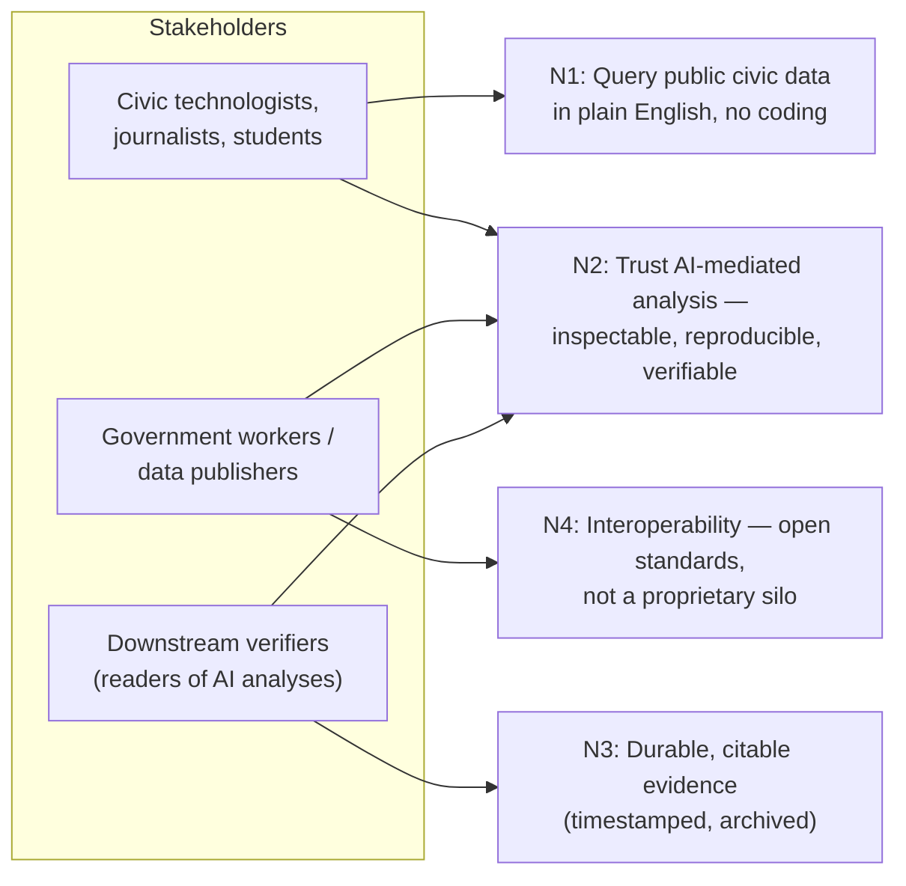
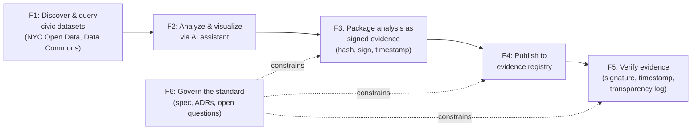
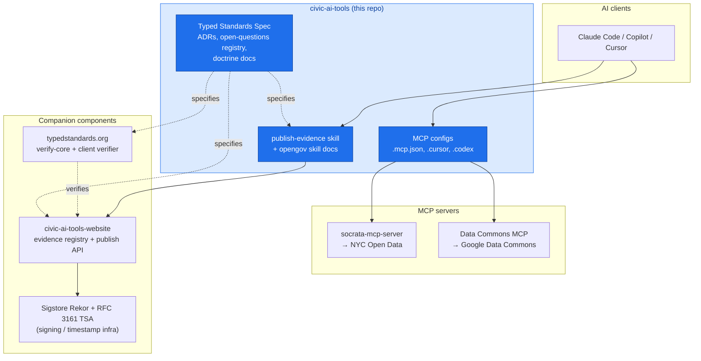
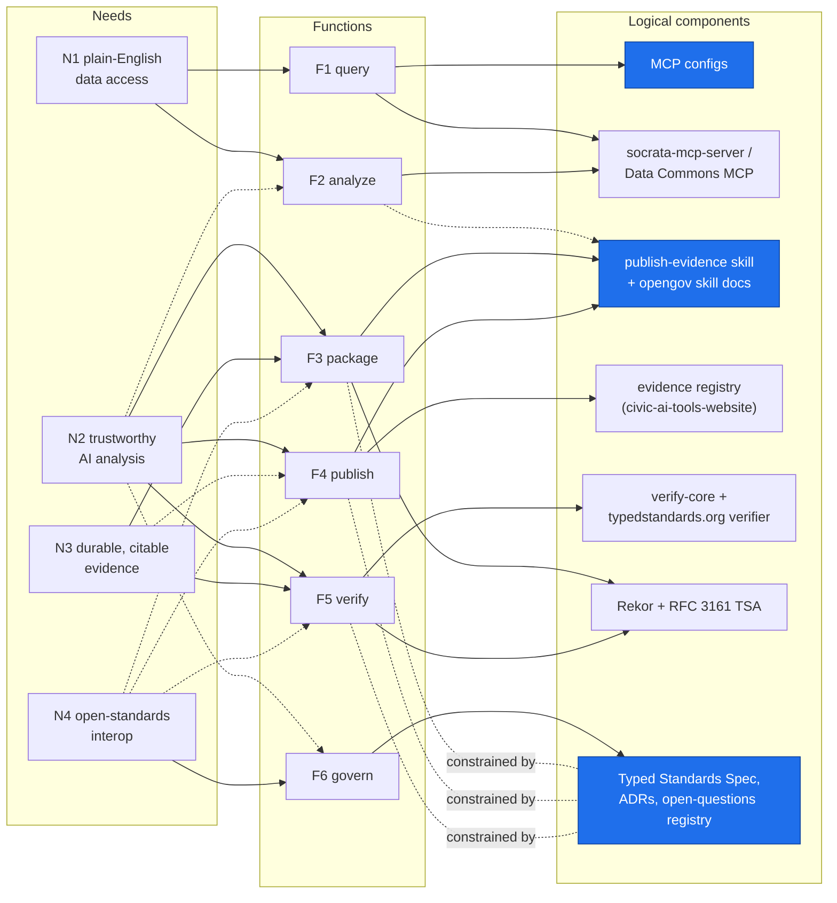

# Architecture views — Needs, Functional, Logical

Status: exploratory sketch (research surface, not a decided spec). Three arch-framework-style
views of the repository and its immediate ecosystem, grounded in the README,
`docs/architecture/end-state-vision.md`, and the ADR corpus.

## 1. Needs architecture — who needs what, and why

## 2. Functional architecture — what the system does

## 3. Logical architecture — what components realize it (this repo highlighted)

## Cross-layer traceability

Hierarchical trace from needs through functions to the logical components that realize
them. Solid edge = primary realization, dotted edge = supporting. Blue nodes live in
this repo.

Reading notes: F2's dotted edge to the skill docs reflects that reproducibility starts in
the analysis itself (queries recorded, no hallucinated data — the opengov skill's rules);
N3's dotted edge to F4 reflects that the registry makes evidence citable while durability
comes from F3/F5's timestamp and transparency-log steps; N4's dotted edges mark F3–F5 as
the functions the open standard disciplines. The dotted `constrained by` edges between
F3–F5 and the spec are arrowless and declared function-to-spec so the layout keeps its
three stacked bands (an edge running the other way, spec-to-function, would fight the
Functions→Components edges above it and break the vertical stacking); semantically the
constraint flows from the spec to the functions (it specifies F3's package shape and F5's
§9.2 verification sequence, and constrains F4's publish API contract).

### Needs × Logical components

| Need | Function(s) | Logical component(s) |
| --- | --- | --- |
| N1 plain-English data access | F1, F2 | MCP configs, socrata-mcp-server, Data Commons MCP |
| N2 trustworthy AI analysis | F3, F4, F5 | publish-evidence skill, evidence registry, verifier, Rekor/TSA |
| N3 durable citable evidence | F3, F5 | Rekor transparency log, RFC 3161 timestamps (Zenodo DOI designed) |
| N4 open-standards interop | F6 | Typed Standards Spec, ADRs, open-questions registry |

Note: the runnable artifacts in this repo are the MCP configs and the publish-evidence
skill; the spec/ADR corpus is the repo's main payload, with the registry and verifier
implemented in the companion repos.
