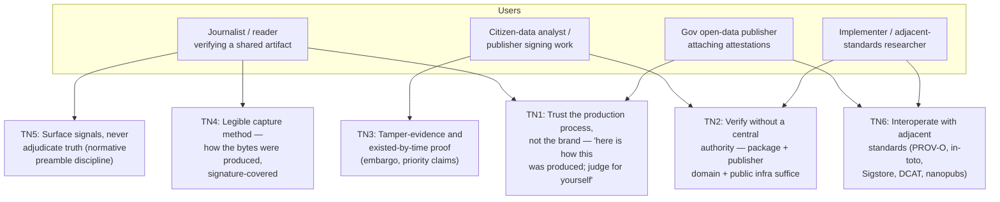
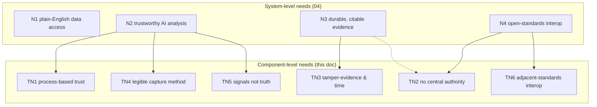
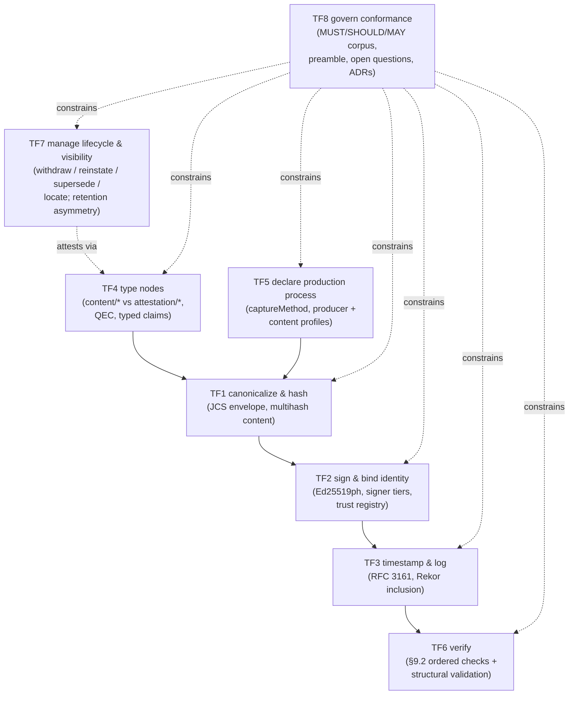
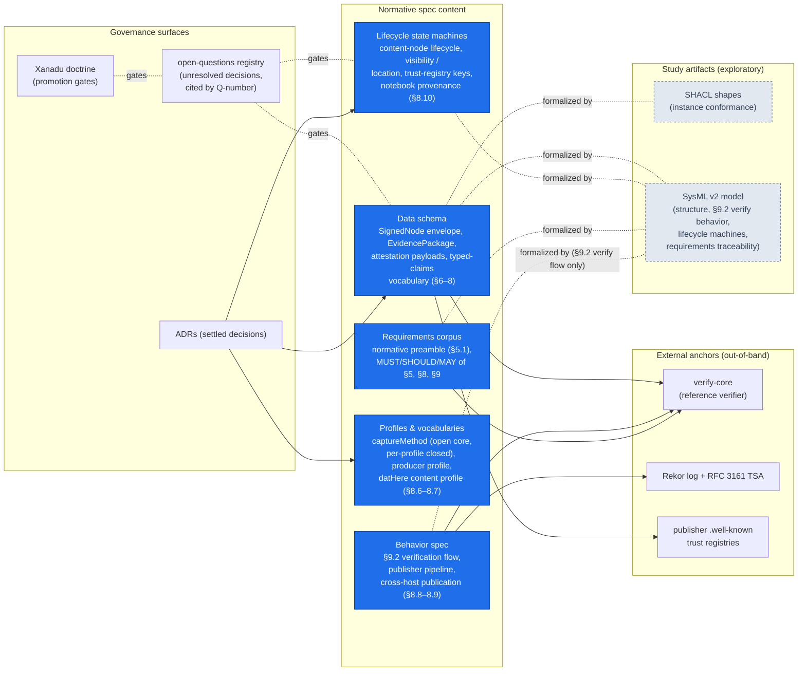
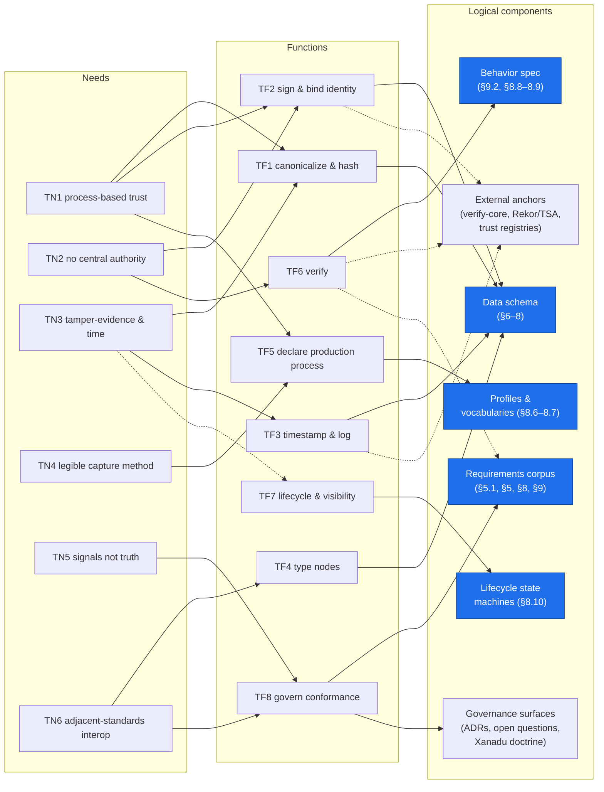

# Typed Standards Spec — Needs, Functional, Logical views

Status: exploratory sketch (research surface, not normative). Zooms into the **Typed
Standards Spec** logical component from [`04-architecture-views.md`](./04-architecture-views.md)
and decomposes it recursively into its own needs, functions, and logical components.
Derived from the consolidated formal model ([`00`](./00-formal-model.md)), the SHACL and
SysML framings ([`01`](./01-typed-standards-as-shacl.md), [`02`](./02-typed-standards-as-sysml-v2.md)),
their comparison ([`03`](./03-formalism-comparison.md)), and validated against
[`docs/architecture/typed-standards-summary.md`](../docs/architecture/typed-standards-summary.md).
Where this sketch and the spec disagree, the spec governs. This document and the
formalization artifacts ([`00`](./00-formal-model.md), [`02`](./02-typed-standards-as-sysml-v2.md),
[`shapes/`](./shapes/), [`sysml/`](./sysml/)) are parallel **views over the same
normative spec** — each view answers to the spec, not to the other views; where the
views render the same content differently, §5 calls it out.

## 1. Needs — what the standard exists to satisfy

From the summary's problem statement, envisioned end users, and normative preamble.
These are **component-level** needs and users: [`04`](./04-architecture-views.md)'s
N1–N4 are the needs of the system as a whole (and its system-level users — civic
technologists, government workers, verifiers at large); TN1–TN6 below are their
refinement onto this one component, held by the spec's own users (the people who
verify, sign, and implement against packages).

### 1.1 Trace to system-level needs (04)

Solid edge = primary refinement, dotted = supporting. Every component-level need has a
system-level parent (no orphans); every system-level need except N1 refines downward.

Reading notes: N2 is the need the spec primarily exists to serve — it decomposes into
process-based trust (TN1), the capture-method declaration (TN4), and the
signals-not-truth discipline (TN5). N3's dotted edge to TN2 reflects that durability
without a central authority is part of what makes evidence citable long-term. **N1 has
no trace** — data access is upstream of the standard, which only sees an analysis once
it is being packaged (consistent with the spec×functions "no trace" note in `04`).

## 2. Functional — what the standard specifies how to do

The spec is a document, so its "functions" are the behaviors it normatively defines for
publishers, verifiers, and hosts. Grouped by the four aspects identified in
[`03 §1`](./03-formalism-comparison.md): data schema, behavior, lifecycle state machines,
requirements corpus.

## 3. Logical — the components that carry those functions

Blue = normative spec content; grey subgraph = external infrastructure the spec anchors
to but does not define (the hard boundary of [`03 §3`](./03-formalism-comparison.md));
dashed = exploratory study artifacts in this `research/` bundle.

## 4. Traceability

Hierarchical trace from needs through functions to the logical components that carry
them. Solid edge = primary realization, dotted edge = supporting. Component nodes are
condensed from the §3 diagram.

Reading notes: TN3's dotted edge to TF7 covers the retention asymmetry (withdrawn content
stays evidenced); TF2/TF3/TF6's dotted edges to the external anchors mark the hard
boundary — trust registries, the TSA, and Rekor supply the properties the spec can only
reference, and the §9.2 checks (TF6) delegate their cryptographic steps there; TF6's
dotted edge to the requirements corpus reflects that the conformant-verifier requirement
tree governs how the checks report.

## 5. Verification & validation notes

Checked against the source documents; discrepancies would flow back into this sketch,
never the other way (`00 §status`: the spec is the single source of truth).

- **Four-aspect functional grouping** (`03 §1`): data schema / behavior / lifecycle state
  machines / requirements corpus — TF1–TF5 land in schema, TF6 in behavior, TF7 in
  lifecycle, TF8 in requirements. Consistent.
- **Hard boundary** (`03 §3`): crypto math, hash recomputation, TSA cert chains, and
  Rekor inclusion are out-of-band for any formalization — hence the external-anchors
  subgraph is *outside* the spec-content subgraph. The SysML model does represent the
  anchors *structurally* (trust registry, TSA, Rekor as context parts with ports and
  pinned-anchor constants), but only as opaque context whose checks are delegated,
  never executed — so the formalized-by edges above attach to spec content, not to the
  anchor properties themselves. A green SHACL report plus a traced SysML model still
  do not constitute verification.
- **Study-artifact placement** (`README`, `03 §5`): SHACL formalizes instance conformance
  of schema; SysML formalizes structure, the §9.2 verification flow (plus its
  SHACL-targetable structural validations), the four lifecycle machines, and
  requirements traceability. The other behaviors the spec defines — the publisher
  pipeline (§9.1) and cross-host publication (§8.8–§8.9) — remain prose-only; the
  model marks the §8.8 self-contained bundle as deliberately unmodeled. Both artifacts
  are exploratory, Xanadu-gated on named promotion triggers (Q16/Q5 for SHACL; an MBSE
  adopter or second verifier for SysML). Rendered dashed accordingly.
- **Against `typed-standards-summary.md`**: TN1 ≙ "The problem" (production process as
  the unit of attestation); TN2 ≙ "no central authority" (Envelope bullet) and
  "Deliberately silent about: Topology"; TN3 ≙ "What it enables" (commit-now-publish-
  later, share-without-hosting); TN4 ≙ "Capture-method discipline"; TN5 ≙ "The normative
  preamble" and "Deliberately silent about: Truth"; TN6 ≙ "Relationship to adjacent
  standards". The four user sketches map onto the summary's "Envisioned end users".
  Build states honored: envelope/captureMethod/datHere built; typed-node ontology and
  typed claims specified-not-built (Q5); registry and non-GitHub identity tiers reserved.
- **Not shown** (deliberate, per Xanadu): reserved surfaces — hosts as typeable subjects,
  Human/Hybrid/Sandbox producer profiles, the typedstandards.org indexing registry,
  federation substrates — appear in neither the functional nor the logical view because
  no adopter needs them yet; they enter via the open-questions registry when they do.
  (The SysML model renders the same discipline differently: it carries the reserved
  `content/*` name stubs — host / hostPolicy / hostTermsOfUse / tool — tagged
  `#BuildState::reserved`, mirroring the spec's §7.4 name reservations. The model
  records the reserved names; these views omit them. Neither promotes them.)
